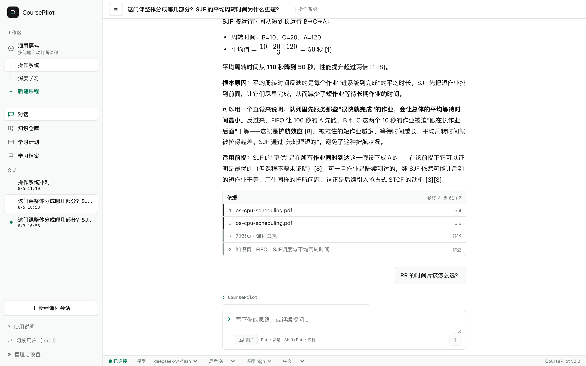
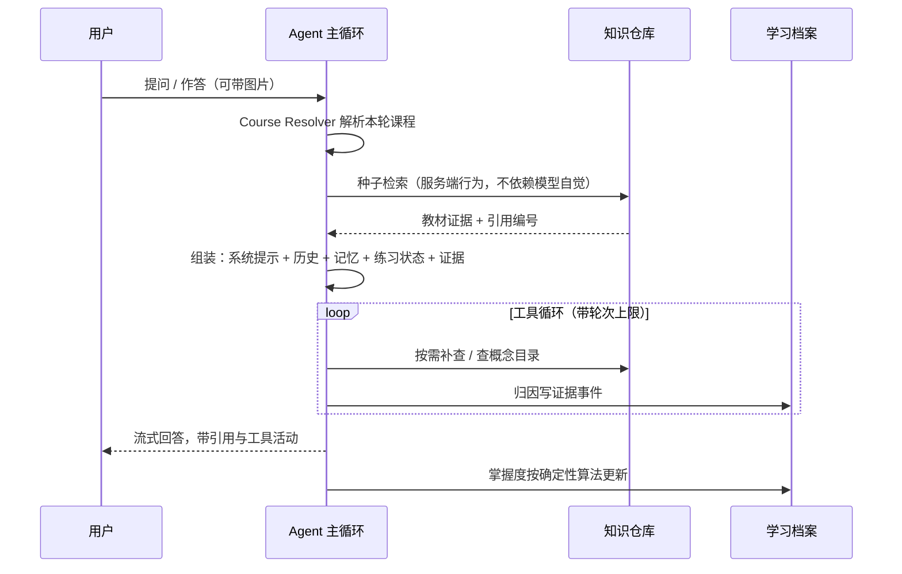
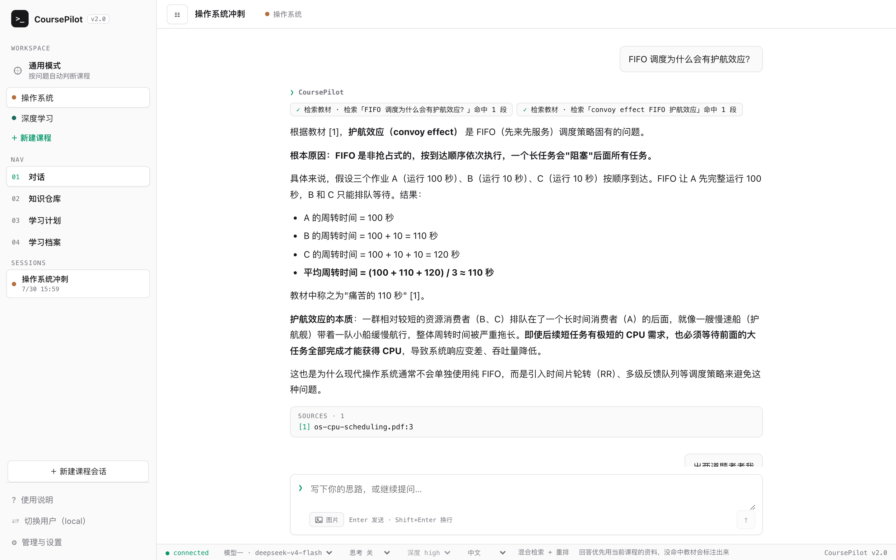
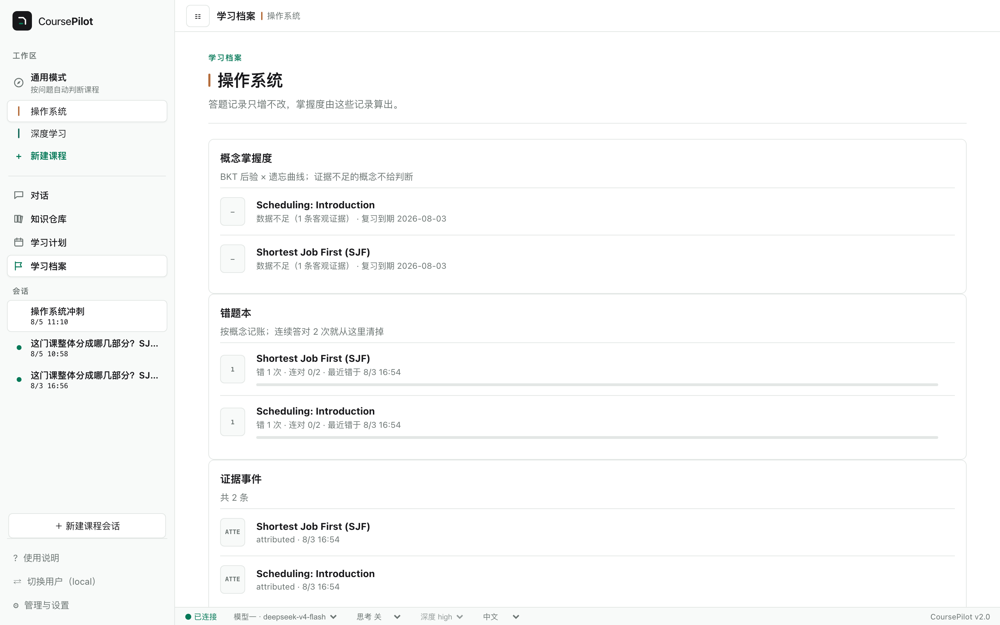
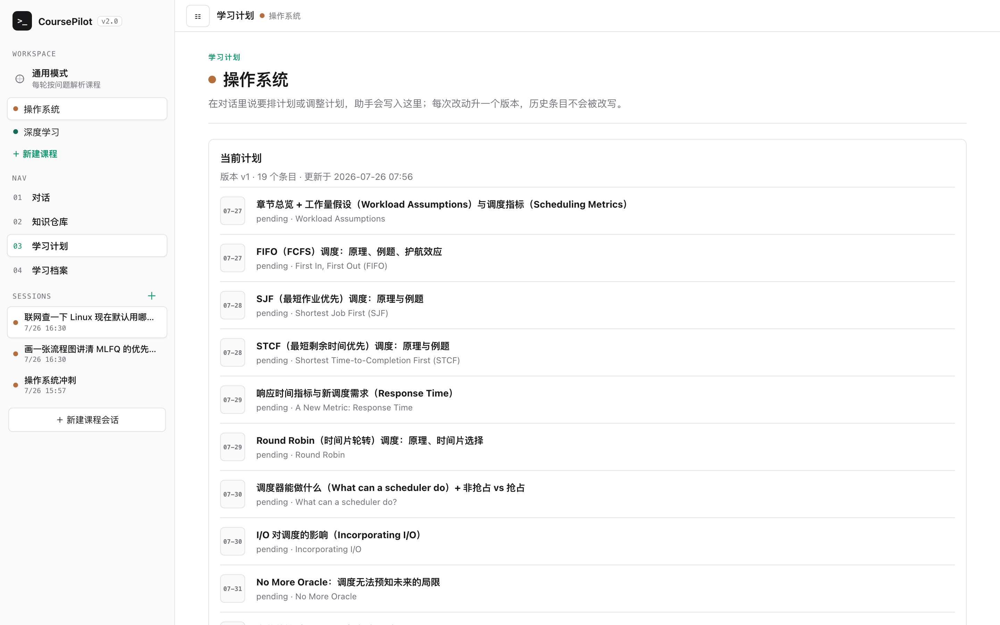
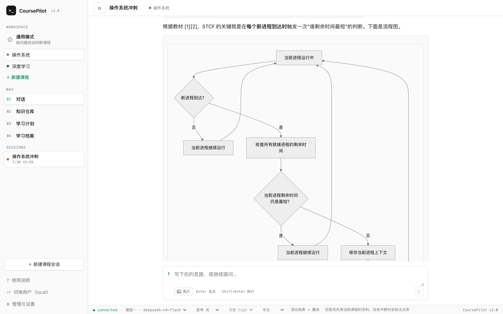
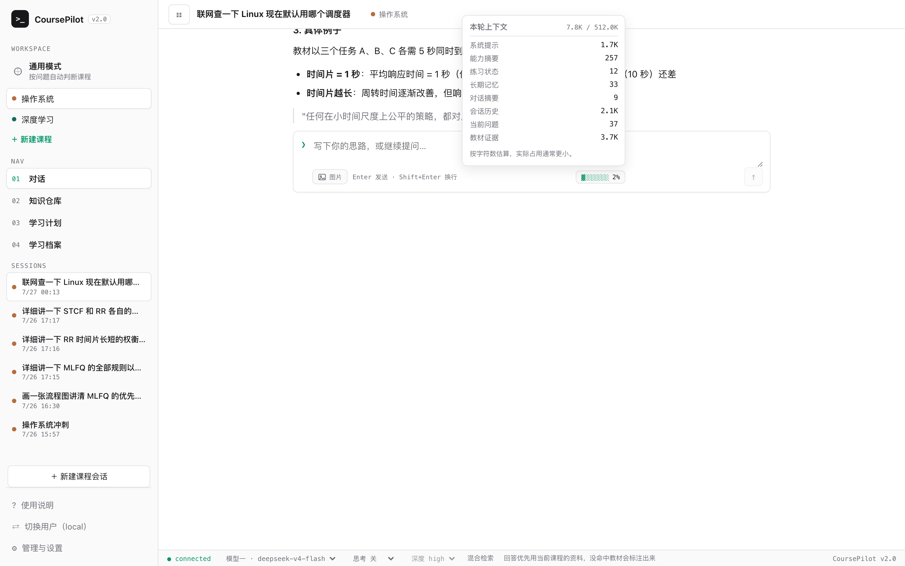
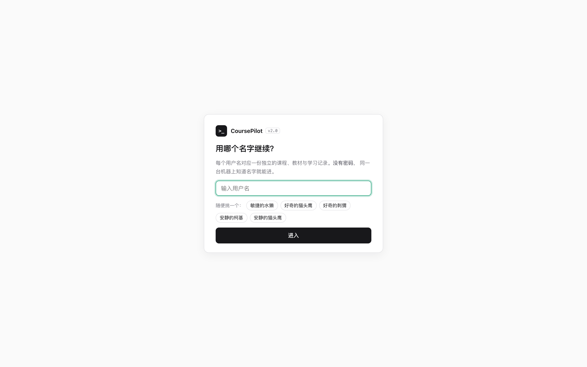
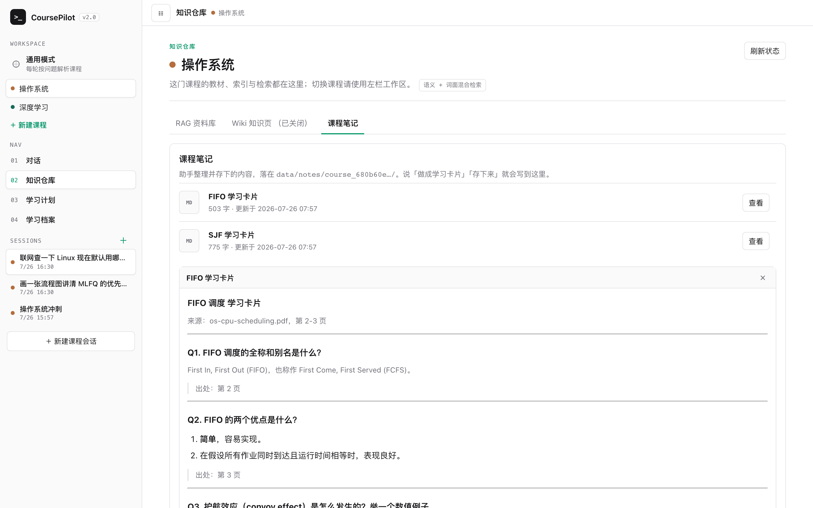

# CoursePilot 2.0

> 有状态的学习 agent。上传教材，它就成为这门课的私教——回答带页码引用、出题并批改、
> 按概念记住你哪里会哪里不会。它自己决定查什么、加载哪份规程、要不要写计划写笔记写记忆，
> 该做没做的步骤由服务端补上。

## 为什么做

市面上单点能力都有成熟产品，缺的是闭环：

| 产品 | 会什么 | 缺什么 |
| --- | --- | --- |
| NotebookLM | 从资料生成 study guide、quiz | 不知道你学得怎么样 |
| Gauth / Photomath | 拍照解题 | 每次解题都是孤立事件，没有课程上下文 |
| 通用 Chat | 什么都能聊 | 没有教材边界，答案无从核对 |

CoursePilot 的护城河是**每个输入都更新系统对你的理解，每个输出都基于这份理解**：

```
提问 / 拍照 / 做题 ──→ 证据事件 ──→ 掌握度更新 ──→ 出题与计划按弱项调整
                                        │
                              下一轮对话读取这份状态
```

一句话：**学习档案是大脑，计划是心跳，教材是唯一事实来源。**

工程上缺的是另一件事。这类工具大多停在「一段提示词 + 一次检索」，而真正难的是让**必须发生的
副作用真的发生**——出题要存题目、批改要写证据、证据要归到概念上。提示词能表达这些要求，
保证不了执行：实测只靠 `SKILL.md` 约束时，练题闭环的通过率约 2/3。所以这套东西的重量不在
提示词，在 harness：工具循环与权限分层、skill 的两段式注入、跨轮产物、上下文预算与压缩、
服务端规程校验与补救、每轮 trace 与分层评测。这些和「学习」这个场景无关，
换个领域照样成立——[README 里有清单](../README.zh-CN.md#harness-里有什么)，
实现细节见[技术架构](coursepilot-2.0-architecture.md)。

## 现在能做什么

```
┌─────────────┬────────────────────────────────────────────────────┐
│ 对话        │ 通用模式自动解析课程 / 课程工作区固定课程            │
│             │ 回答先取教材证据，引用带文件名与页码，可点开看原文    │
│             │ 教材里没有的内容明确标注「以下不是当前教材结论」      │
│             │ 生成中能看到正在用哪个工具、这一步已经跑了多久        │
├─────────────┼────────────────────────────────────────────────────┤
│ 知识仓库    │ PDF / TXT / MD 上传 → 解析 → 切块 → 向量 → 索引     │
│             │ 语义（BGE）+ 词面混合检索，中文问题能命中英文教材     │
│             │ 索引后另跑一条流水线出概念目录，作为归因的 ID 真源   │
├─────────────┼────────────────────────────────────────────────────┤
│ 五个专项    │ practice        出题 → 作答 → 逐题批改 → 概念归因    │
│ 能力        │ flashcards      教材内容拆成可自测的一问一答卡片      │
│ (skill)     │ diagram         mermaid 流程图 / 思维导图 / 时序图   │
│             │ mistake_review  按概念定位错因，区分概念错与算错      │
│             │ research        联网查证，强制区分教材与网络来源      │
│             │ 说出对应的话就自动加载，不需要手动选                 │
├─────────────┼────────────────────────────────────────────────────┤
│ 学习档案    │ 按概念的掌握度（BKT × 遗忘曲线）与复习到期日         │
│             │ 证据不足时显示「数据不足」而不是编一个百分比          │
│             │ append-only 证据事件流，掌握度可从事件重放重建        │
├─────────────┼────────────────────────────────────────────────────┤
│ 学习计划    │ 说出考试日期与范围，助手一次排完整个周期的每日条目     │
│             │ 弱项与到期复习优先排入，条目挂概念 id                │
│             │ 每次改动升一版留 diff，历史与已开始的条目不被改写      │
├─────────────┼────────────────────────────────────────────────────┤
│ 课程笔记    │ 助手整理的学习卡片与概念梳理落成 markdown，可在界面查看 │
│ 长期记忆    │ 跨课程画像 + 课程情景记忆，文件可直接编辑              │
├─────────────┼────────────────────────────────────────────────────┤
│ 上下文      │ 输入框旁显示本轮上下文构成与占比                     │
│             │ 超过预算自动压缩成结构化摘要，而不是丢掉最旧的消息     │
├─────────────┼────────────────────────────────────────────────────┤
│ 能力扩展    │ 导入自己的 SKILL.md，权限按白名单收窄，默认不启用      │
├─────────────┼────────────────────────────────────────────────────┤
│ 多用户      │ 输入用户名进入各自独立的工作区（数据库与文件都分开）    │
│             │ 没有密码——用途是分开存资料，不是访问控制              │
├─────────────┼────────────────────────────────────────────────────┤
│ 可观测      │ 每轮一条 JSONL trace（含工具决策与拒绝原因）          │
│             │ 冒烟 benchmark、judge 抽样、掌握度回放、端到端旅程     │
└─────────────┴────────────────────────────────────────────────────┘
```

技术栈：Python 3.11+ / FastAPI / SQLite（标准库）+ React / TypeScript / Vite。
本地运行，前后端同机，不依赖任何托管服务；同一台机器上可以有多个用户，各自数据完全分开。



*回答先取教材证据，引用带文件名与页码，点 SOURCES 能看原文；公式用 KaTeX 渲染。*

## 模块设计思路

### 一次对话怎么走完



关键取舍：**先检索再回答是系统行为，不是模型的自选项**。每轮开始服务端就用用户原话查一次教材，结果以工具调用的形态注入——模型要补查时自然复用同一工具，不需要它"想起来"该查资料。



*每一步用了哪个工具、查了什么、花了多久都在界面上；失败的那一步（这里是一个抓不到的网页）也不隐藏。
教材外的内容自动标注「以下不是当前教材结论」并给出来源。*

### 课程边界

```
通用会话 ──每轮解析──→ 一门课          课程会话 ──固定──→ 一门课
              │                                    │
              └──── 工具只接受服务端解析出的 scope ────┘
                    模型无法自己指定 course_id
```

无法唯一确定课程时先问用户，绝不跨课程取证。课程名互相包含时（"深度学习" / "深度学习进阶"）取更具体的那个，两个不相关课程同时出现才算真歧义并列出候选。

### 掌握度：LLM 只归因，数值不由模型给

这是与 1.0 最大的区别。1.0 让模型直接输出分数写进记忆，模型的幻觉会直接污染学习状态。2.0 把职责切开：

```
              模型能做的                        模型不能做的
  ┌──────────────────────────────┐   ┌────────────────────────────────┐
  │ 这道题考的是哪个概念（从目录选）│   │ 掌握度是多少                    │
  │ 用户答对了还是答错了            │   │ 什么时候该复习                  │
  └──────────────┬───────────────┘   └────────────────────────────────┘
                 │                              ▲
                 ▼                              │
         evidence_events (append-only)   BKT + FSRS 确定性计算
```

- 概念必须来自教材索引后生成的概念目录，目录外的一律记 `unattributed` 进人工补录队列——这道闸挡住幻觉概念污染档案。
- 追问、用户自述这类主观信号只入事件流，不参与数值。
- 少于 3 个可归因客观证据时对外显示「数据不足」，不给强弱判断。
- 掌握度是投影而非真源，算法改版后可从事件流全量重建，并用回放脚本对比新旧曲线。



### 计划：模型排内容，代码守规则

和掌握度同一套思路——模型负责"排什么"，代码负责"能不能这么改"：

```
模型给出完整条目 ──→ plan_update ──→ ┌ 版本对不上就拒绝（先重读再重算）
                                    ├ 日期早于今天就拒绝（历史不可改写）
                                    ├ 概念不在目录里就拒绝（整批拒，不留半个计划）
                                    └ 已开始的条目不重写（否则状态回退、id 变化）
                                              │
                                       升一版 + 留一条 diff
```

写入还要过一道闸门：只有用户在对话里说过要排计划才放行，模型自己觉得该调整时先说建议。
排计划读到的弱项与到期复习来自掌握度投影的真实数值，不是模型的印象。



### 为什么是 skill 而不是多个 Agent

出题、批改、讲评、变式题共享同一套上下文（题目、答案要点、用户原文都要留在对话里被追问），所以是一个 skill 而不是四个 Agent，也不是独立 subagent。

```
系统提示只带一行摘要 ──use_skill──→ SKILL.md 正文注入 ──→ 工具集收窄到规程声明的范围
```

但**提示词能表达要求，不能保证执行**。实测只靠 SKILL.md 约束时，冒烟用例通过率约 2/3——模型会跳过归因、漏写题目、批改完不闭合状态，每一处漏掉都让闭环断链。因此加了三层服务端保障：

| 保障 | 解决的失效 |
| --- | --- |
| 规则预路由 | 模型不主动加载 skill，导致作答无题可批 |
| 规程校验补救 | 只归因第一道题就收尾，多题练习丢数据 |
| 状态闭合 | 漏写批改记录，同一道题被反复计入掌握度 |

补齐后 8/9。剩余一项（变式题落盘）在不同运行间摆动，作为已知上限记录，不做侵入式兜底。



*`diagram` 规程先判断该画流程图、思维导图还是时序图，再输出 mermaid；界面渲染成 SVG 并可下载。*

### 工具与权限：按副作用分层，而不是一份白名单

17 个工具按能力分组，profile 声明它允许哪些能力，**不允许的工具连 schema 都不下发给模型**：

```
只读课程数据    检索教材、资料清单、概念目录、计划、档案、笔记
会改学习状态    写证据事件、改计划、更新记忆、存练习产物
会新建笔记      note_write
会访问网络      web_search、web_fetch（每轮各 5 次；同一查询重复调用不占额度）
无副作用        计算、加载能力、读产物、反问
```

三条准入规则值得单独说：

- **激活 skill 不是绕开预算的口子**。skill 拿到的工具就是它声明的那些，一件不多；
  花钱工具的次数上限沿用主 profile，不会因为进了某个 skill 就变成无限。
- **能力与名单的一致性在注册期校验**，不在运行期取交集——配置写错要报错，不要变成难查的行为异常。
- **导入的第三方 skill 拿不到笔记与联网，也不能改计划**。权限是「声明 ∩ 白名单」再并上基座工具，
  越权申请导入为 `permission_denied` 并列出被拒项，不静默降权成一个看起来能用的 skill。
  基座工具（`memory_patch`、`ask_user`）不分来源，任何 skill 都有——记忆是跨 skill 的记事本，
  profile 整体替换的话它一激活就消失。

不做的边界同样明确：**没有 shell 执行**。学习助手没有任何理由执行命令，这是最重要的一条。

### 上下文：先压缩，不丢弃

历史超过预算时，此前是从最旧的消息开始硬丢——丢掉的恰好是「我要考什么」「哪里不懂」这类最该留的。
现在换成压缩：

```
超过预算 → 保留最近一段原文 + 更早的压成结构化摘要 → 摘要进系统提示
                                    ↓
                        水位只前进，摘要 append-only 可审计
```

提示词结构照搬了 Claude Code 的 compact prompt（两阶段 analysis/summary、九段结构、
逐字引用要求），只把「文件与代码」换成「教材与错题」。三个关键取舍：

- 压缩跑在**本轮回答落库之后**，为下一轮准备。放在组装之前会在 turn 锁内做一次几十秒的模型调用，
  而心跳只在流式增量分支续约，长会话每轮都可能被判失活、整轮回答被丢弃。
- 只有拿到终态且解析出非空 `<summary>` 才落库。水位一旦生效那批原文就再也不进上下文，
  所以宁可这轮不压，也不用未校验的整段回复兜底。
- 压缩失败整段吞掉——回答已经成功，不能让用户看到「本次回答未能完成」。

界面上输入框旁有一个上下文条，展开能看到每一段占多少字符。**实测里「工具结果」通常是最大的一段**，
所以统计必须包含工具循环追加的内容，只算首轮组装会漏掉真正的大头。



### 知识仓库：证据层与理解层分开

```
教材 PDF ──解析──→ 切块 ──┬──→ BGE 向量 ──┐
                          └──→ FTS 词面 ──┴─RRF 融合─→ 带页码的引用
                                    │
                                    └──→ 概念目录（纯规则抽取，可重放）
```

概念目录不调模型：从标题层级与正文强调取候选，剔除跨页页眉、公式碎片与 PDF 乱码，`concept_id` 由课程加名称哈希得出，因此重放和增量索引都不会改动已有 id。

Course Wiki 是可选的理解层，默认关闭，只有用户显式触发才生成，失败不影响 RAG。
它按教材目录自底向上写：叶子页读那一节页码范围内的全部原文，章节页读它的子页，
构建路径上没有检索——一个概念在十处讲了，十处都会被读到。

### 多用户：按目录隔离，不按查询条件

```
data/users/user_<hash>/     一个用户的全部数据
├─ coursepilot.db           会话、证据、掌握度、计划、摘要
├─ user.md / courses/…      长期记忆
├─ materials/ notes/ wiki/  教材、笔记、知识页
└─ traces/                  每轮对话的 trace
```

`user_id = sha1(归一化后的用户名)[:16]`。选目录隔离而不是给每张表加 `owner_id`：
**隔离是结构性的，不依赖每条查询都记得加过滤条件**——现有二十多张表、上百处查询，
漏一处就串数据，而目录方式漏不了。哈希还顺带保证用户名永远不参与路径，再怪的名字也穿越不了目录。

跨用户共享的只有贵且无状态的部分：LLM 适配器、OCR、联网、以及 **BGE 向量模型**
（按用户各加载一份不可接受）。

**这不是身份认证**：没有密码，知道用户名就能进那个工作区，`user_id` 由用户名哈希得出因此可推算。
本地单机上分开几个人的资料够用，不能拿它当访问控制。



### 记忆：定性与定量分工

```
data/users/<user_id>/
├─ coursepilot.db          定量：证据事件、掌握度投影、会话、计划、摘要
├─ user.md                 定性：跨课程画像（讲解偏好、长期目标）
├─ courses/<id>/memory.md  定性：学到哪、遗留问题、与用户的约定
├─ notes/<id>/             产物：助手整理的学习卡片与概念梳理
├─ materials/<id>/         上传的教材原件
└─ traces/                 每轮对话的 JSONL + payloads/
```

`data/` 只放真实使用产生的数据；测试与验证产物一律在 `testdata/`，两者都在 `.gitignore` 里。



*助手用 `note_write` 存下的学习卡片，在知识仓库的「课程笔记」tab 里可以直接翻。*

markdown 里只写叙述，掌握度数值、错题记录与复习排期永远只在事件流里。Agent 通过 `memory_patch`
只改 marker 之间的受管区块，用户手写的段落不会被覆盖；管理页可以直接读写这两份文件。

### 可观测与评测

```
每轮对话 ──→ trace JSONL（含工具决策与拒绝原因）+ payloads/（原文，可单独删除）
                 │
     ┌───────────┼───────────────┬───────────────┐
     ▼           ▼               ▼               ▼
  benchmark   judge 抽样    掌握度回放      端到端旅程
  单点冒烟     三维打分      曲线对比        有状态的连贯流程
  不看文本     按提示词版本   区分数据/算法    30 项断言，从空库开始
```

benchmark 断言的是 SSE 事件与档案增量而不是回答文本，所以模型换措辞不会造成假失败。
judge 的评分按 `prompt_version` 聚合，改提示词后新旧版本分别可比。
端到端旅程与 benchmark 的区别是它**有状态**：作答依赖出题、复盘依赖错题、计划依赖掌握度，
一次跑完建课、索引、取证、练习闭环、排计划、画图存笔记、复盘、联网、课程边界、会话管理与 trace 核对。

## 边界：不做什么

播客音频、通用闪卡产品、泛化每日简报、整卷模拟考试、社交对战、多租户商业化。
通用会话也不会在同一轮里跨多门课读写——无法解析唯一课程时必须先问。

## 想深入看

| 文档 | 内容 |
| --- | --- |
| [产品设计](coursepilot-2.0.md) | 定位、功能模块、分期规划、非目标 |
| [技术架构](coursepilot-2.0-architecture.md) | 模块边界、LLM 接入层、Skill 体系、存储、掌握度实现、评测分层 |
| [前端设计](coursepilot-2.0-frontend-design.md) | 视觉方案、信息架构、核心页面、组件与状态 |
| [开发中](development.md) | 当前进度、任务清单与优先级、开发工作流与踩过的坑 |
| [端到端测试](coursepilot-2.0-e2e-browser-test.md) | 浏览器回归清单，20 个步骤覆盖全部验收项 |
