# Agent 循环

用户按下发送，到界面上出现一段带引用的回答，中间是一个叫 **turn（轮）** 的东西在跑。

一轮就是一个 Python 生成器：从头 `yield` 到尾，每个 `yield` 是一个 SSE 事件。它同时承担四件事：状态机、并发边界、计费边界、排查边界——**这一轮花了多少 token、调了几次工具、被谁抢占了，都以 turn 为单位记账**。

这份文档讲这个引擎怎么转。

覆盖的代码：

| 文件 | 职责 |
| --- | --- |
| `backend/modules/agent/service.py` | `TurnService.run()`，整个循环 |
| `backend/modules/agent/context.py` | 上下文组装与总闸 |
| `backend/modules/agent/compact.py` | 历史压缩 |
| `backend/modules/agent/trace.py` | ReAct 记录 |

相关：[工具系统](工具系统.md) 讲循环里那些工具怎么组织。

---

## 一、一轮的三个阶段

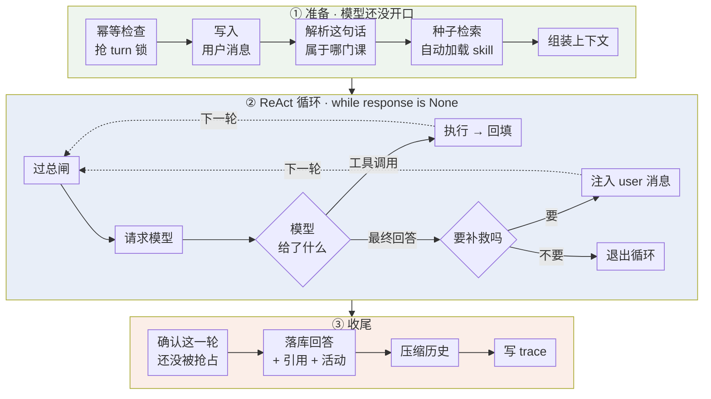

---

## 二、准备阶段：模型开口前已经做了不少事

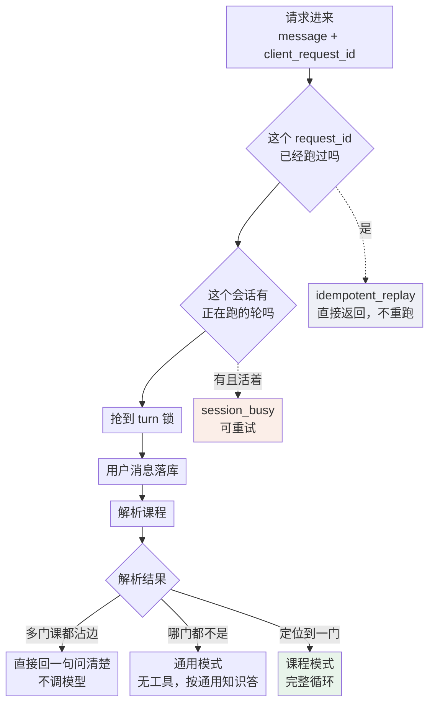

### 三条分支，只有一条进循环

| 分支 | 触发 | 行为 |
| --- | --- | --- |
| 歧义 | 问题同时提到几门课 | 本地兜底一句话，**一次模型调用都不发** |
| 通用 | 跟任何课程都不相关（打招呼、通用问题） | 调模型但**不给工具**，没有教材可引就按通用知识答 |
| 课程 | 定位到一门课 | 完整的工具循环 |

通用分支没有教材可引时按通用知识直接答。返回"请说明课程名称"那种做法会**把闸门当成回答**，用户得到的是一句拒绝而不是回复。

### 历史的取用时机

历史在**写入本轮用户消息之前**取，天然不含当前问题。已压缩的部分由摘要代表，只把水位之后的消息按原文送进上下文。

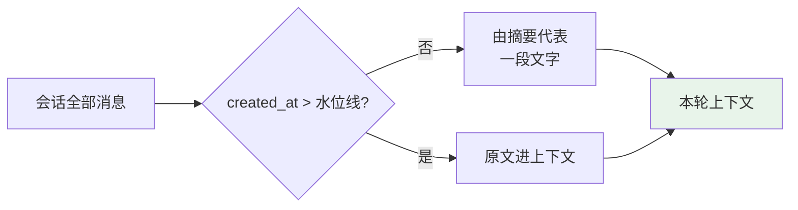

`role='tool'` 的行不进历史投影——工具正文靠 `history_read` 按需取回，不占每轮的历史预算。

---

## 三、ReAct 循环：`while response is None`

循环的退出条件只有一个：拿到了 `ChatFinal` 并且不需要补救。

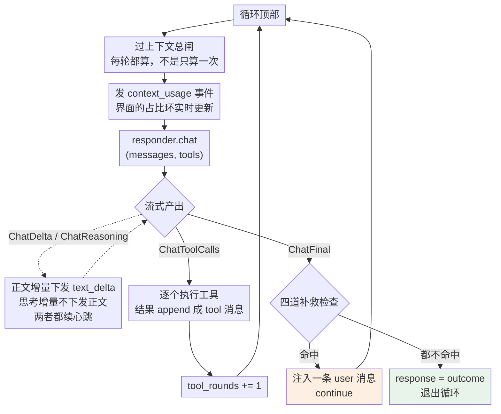

### 终止有三重保险

一个 `while` 循环最怕转不出来。这里叠了三层：

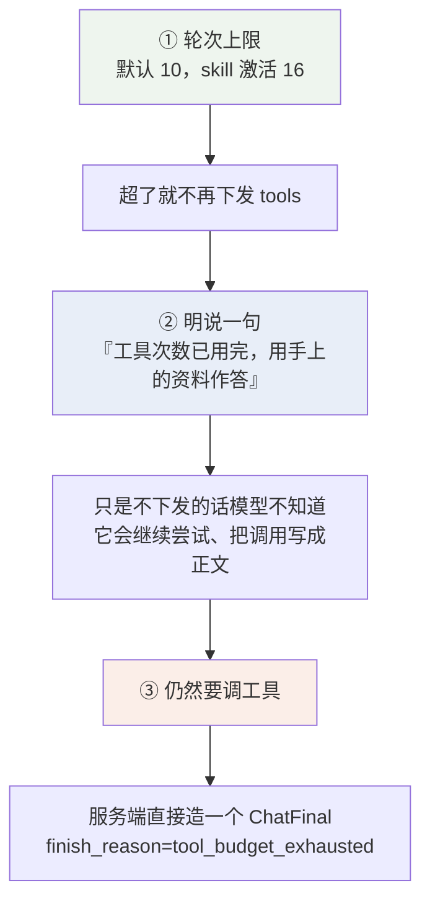

第二层是实测加的：只把 `tools` 置空，模型并不知道发生了什么，会把工具调用**写进正文**（就是 `_PROVIDER_MARKUP` 要清理的那些 `<｜tool_calls｜>` 标记）。明确说一句，它才会收尾。

### 一个容易看错的地方：补救轮不算工具轮

`tool_rounds` 只在**真的执行了工具**时 +1。补救轮是 `ChatFinal` 之后多发一次模型请求，不增加 `tool_rounds`——但每一处补救都带着 `tool_rounds < max_rounds` 的条件，所以它们借的是同一份轮次预算，不会在预算耗尽后还继续插队。

---

## 四、补救轮：服务端的四道纠偏

**问题**：模型会说"我已经把它加进你的计划了"，而库里一个字没动。提示词压不住——两版都试过。

**解法**：`ChatFinal` 之后服务端自己检查一遍，发现"说了没做"就注入一条 user 消息让它补做。

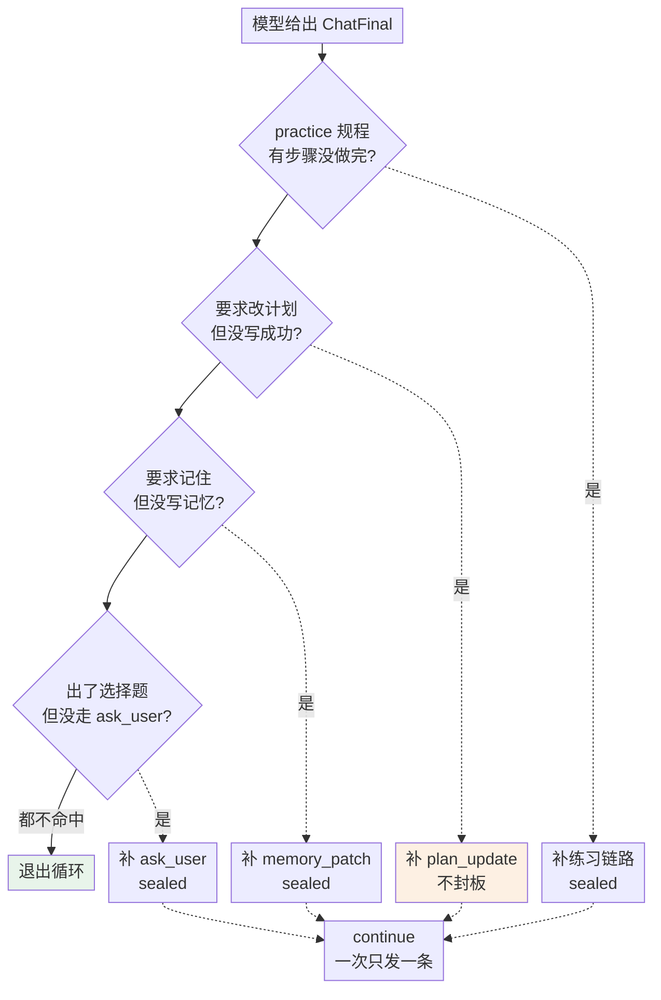

### 优先级为什么是这个顺序

1. **practice** —— 整条练习链路，最完整，命中它就会挡住后面三个。
2. **计划** —— 触发条件最窄，命中几乎不会是误判，先给它用轮次。
3. **记忆**
4. **选项** —— 按钮没出来用户还能打字，代价最小，垫底。

**一次只发一条**，其余的等下一次 `ChatFinal`。

### 封板：`answer_sealed`

补救轮注入的都是"只调工具、不要重复输出正文"，但模型常常无视这句、把整段答案重写一遍。不封板的话用户会看到两份。

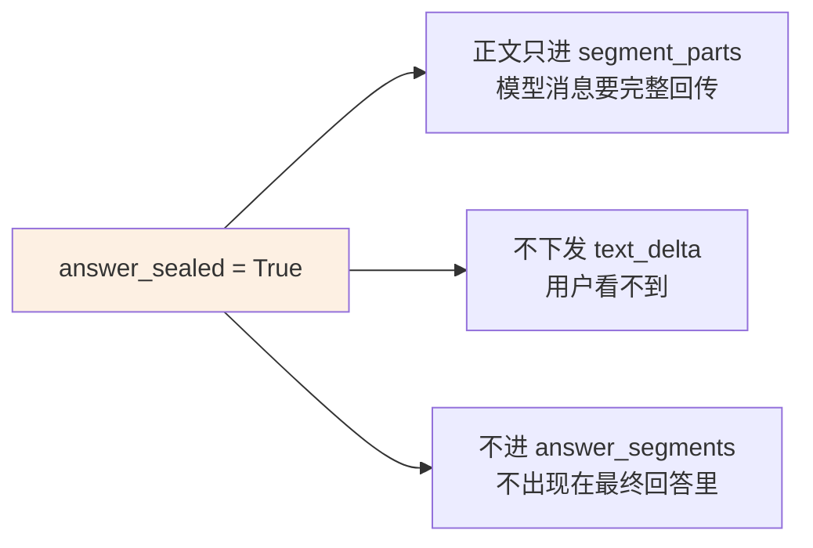

**计划补救刻意不封板**——它之后模型要说的那句"计划已更新"要给用户看。这是四处里唯一的例外。

---

## 五、上下文总闸：每轮都要过一次

工具循环每轮都在往 `messages` 里追加内容。只在组装时算一次挡不住——第 6 轮的时候上下文可能已经翻倍了。

所以总闸放在循环体的最前面，**每一轮进模型之前都重算一次**：算出这一轮实际要发出去的量（含本轮的工具定义），超了就按优先级就地裁剪 `messages`。

裁剪顺序、每一档裁什么、什么永不裁，见 [上下文工程 §8](上下文工程.md)。

裁剪结果每轮随 `context_usage` 事件报给界面，用户点开占比环能看到"这轮裁了什么"。

---

## 六、心跳：让长思考不被误判为死掉

一个会话同时只能有一个 running turn（数据库 UNIQUE 索引）。超过失活阈值的轮可以被下一轮抢占——这是为了让崩溃或断连不会把会话永久锁死。

代价是：**跑得慢的正常轮也可能被误判**。所以心跳撒在每一个可能耗时的地方。

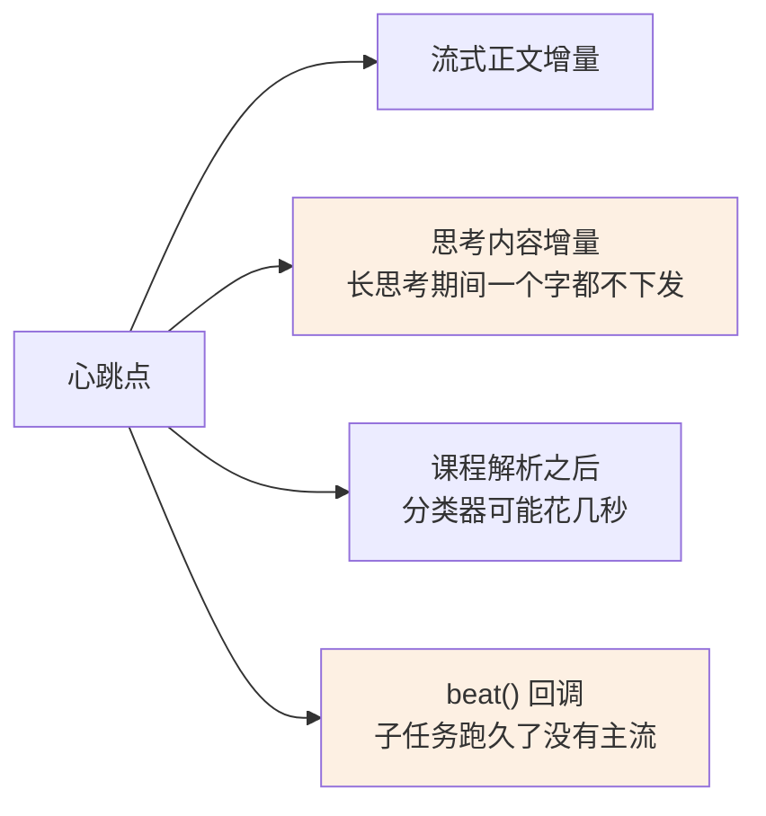

后两个是补上的洞：**思考期间没有正文增量**，长思考会让这一轮被判失活；**子任务在另一个循环里跑**，主循环挂在那儿没有任何流。

写库有节流（最小间隔 10 秒），续约失败不打断对话——最坏是本轮被后来者接管。

收尾前还要再确认一次：

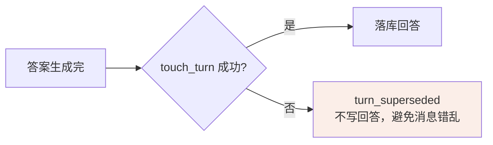

---

## 七、出错时怎么办：三条不同的路

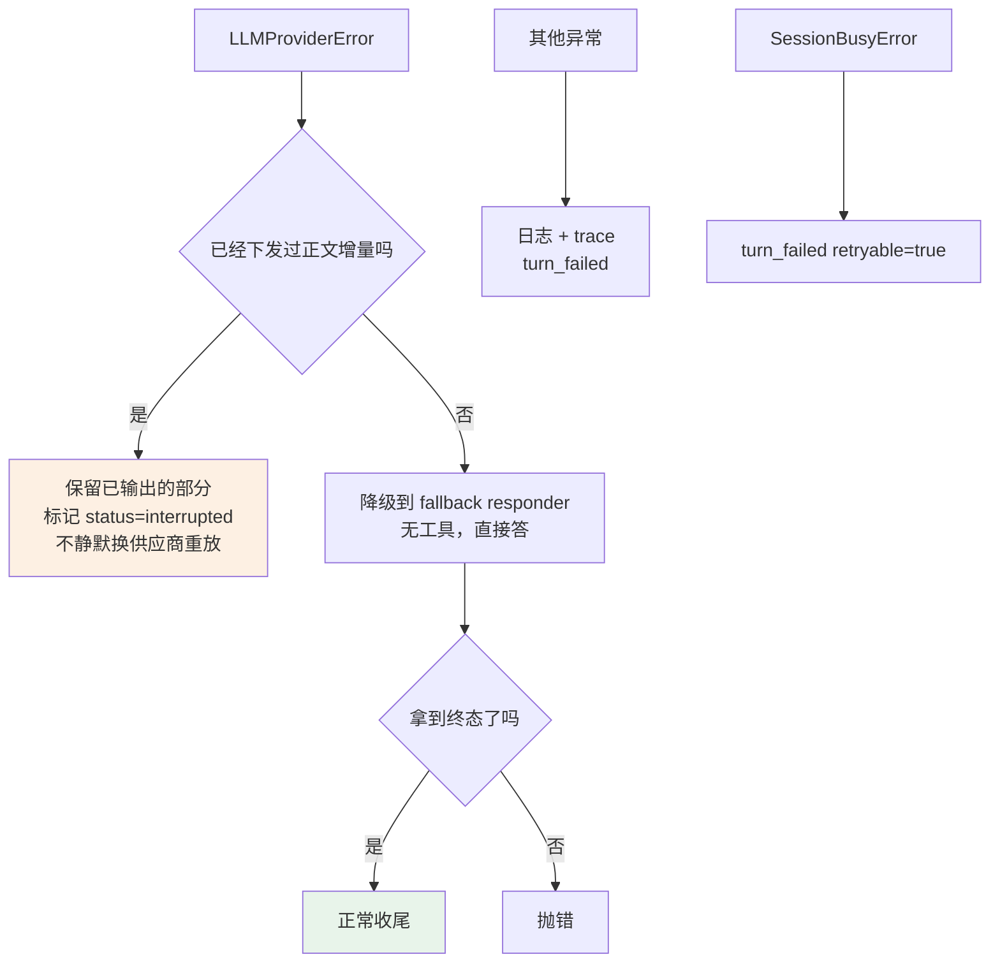

**已经下发过增量就不重放**，这条是为了不让用户看见回答被凭空换掉。界面会把那段标成"中断"，内容留着。

`finally` 里还有一道：生成器没走到终态就收尾标记失败。**客户端断连时生成器可能一直挂在 `yield` 上不进 `finally`**——那种情况靠心跳超时让下一轮接管。

---

## 八、最终回答是从哪儿拼出来的

三个来源，各覆盖一条路径，都不是冗余：

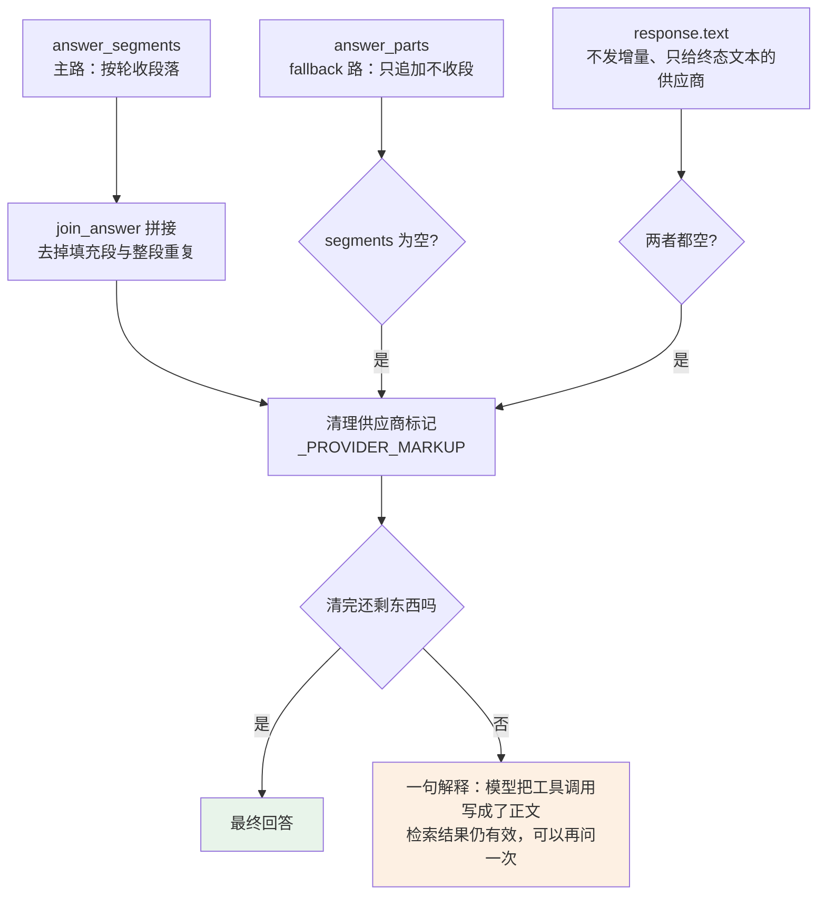

`join_answer` 做两件事：滤掉没有实质内容的短段（"好的，我来查一下"），以及**整段查重**——模型会在工具轮之间把同一道题重写一遍，归一化后原样出现过就不收。

引用面板只显示**正文里真的引用了的那几条**（`cited_only`）。检索到但没被引用的不上屏。

---

## 九、压缩放在收尾之后

回答落库、turn 锁释放之后，才去看这个会话要不要压缩历史。

放在这个位置有两个好处：**压缩慢或失败都不影响这一轮**；长会话也不会每轮都多等一次 LLM 调用。整段吞异常——这一轮的回答已经成功落库，压缩失败只该退回截断行为。

切点怎么找、摘要怎么存，见 [上下文工程 §7](上下文工程.md)。

---

## 十、全程可观测

一轮结束会落一份 trace，即使这轮失败了也落。

| 分组 | 记什么 |
| --- | --- |
| turn 级 | 解析结果 · 用量 · 时长 · 供应商错误 |
| `react` | 每一轮的思考 · 正文 · 调了哪几个工具 · 注入了什么 |
| `tools` | 每次调用的 `call_id` · `round` · `origin` · `decision` · `duration_ms` |
| 补救标记 | `plan_reminder` / `memory_reminder` / `choices_reminder` / `practice_reminder` |

`origin` 四个值，能区分出这次调用是谁发起的：

| origin | 含义 |
| --- | --- |
| `seed` | 服务端每轮自动跑的种子检索 |
| `auto` | 自动加载 skill |
| `model` | 模型自己调的 |
| `provider` | 厂商在它那边跑的（如 server-side 检索），本地没有执行回环 |

被拒的调用同样在册，带着 `decision=denied` 和拒绝原因。

界面上点 Agent 回复开头的名字就能调出这一轮的完整 trace。

---

## 十一、设计取向

- **不信任"我做了"。** 四处补救轮全部在检查同一类事情：模型声称完成、库里没动。判据落在**落库结果**上，不落在模型说的话上。
- **每轮重算。** 上下文总闸、用量统计、工具定义都在循环里重算。组装时的数字在第 6 轮已经不代表上下文里真有的东西，照着报等于骗用户。
- **降级保留已发出的。** 已经流给用户的正文不会被静默替换，中断就如实标成中断。
- **终止冗余。** 轮次上限、明确告知、强制造终态，三层里任何一层单独都够用，叠着是因为模型的行为不确定。

---

## 附：一轮里可能出现的 SSE 事件

| 事件 | 什么时候 |
| --- | --- |
| `turn_started` | 抢到锁 |
| `course_resolution` | 课程解析完 |
| `context_usage` | 每个循环轮次开头 |
| `tool_call` / `tool_result` | 每次工具调用 |
| `citation` | 检索到新来源 |
| `reasoning_started` | 首个思考增量 |
| `text_delta` | 正文增量 |
| `choices` | `ask_user` 给出选项时立刻发，让按钮先出现 |
| `stream_interrupted` | 中途供应商出错且已发过正文 |
| `provider_fallback` | 降级到备用模型 |
| `turn_completed` / `turn_failed` | 收尾 |
