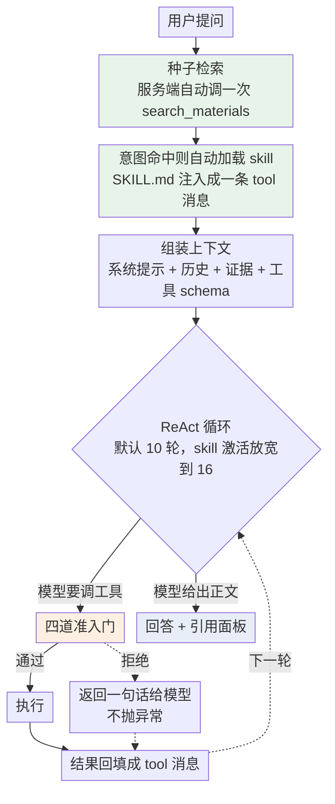
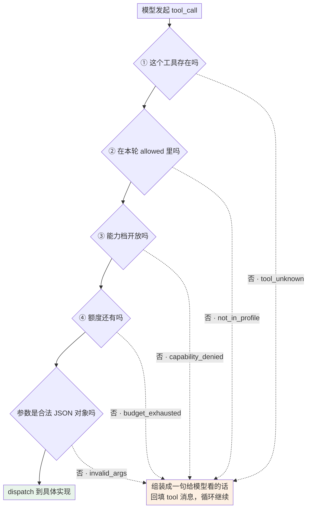
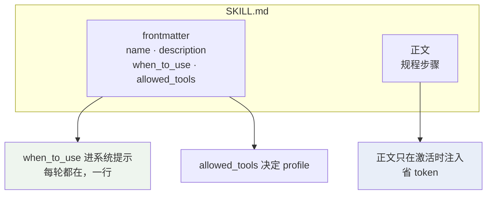
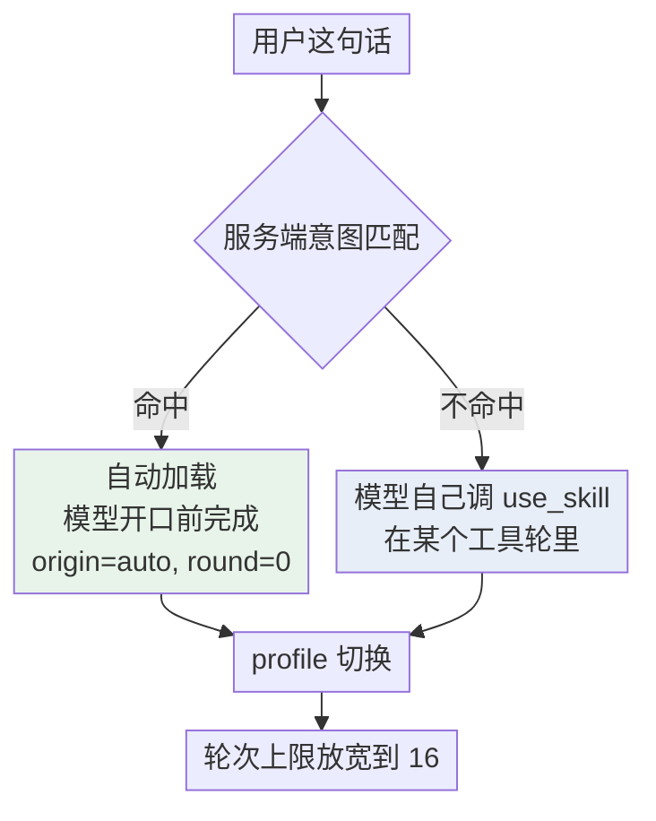
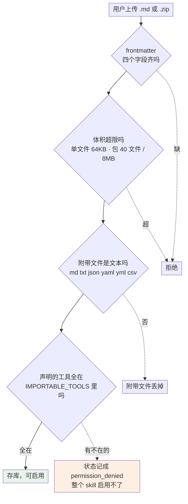
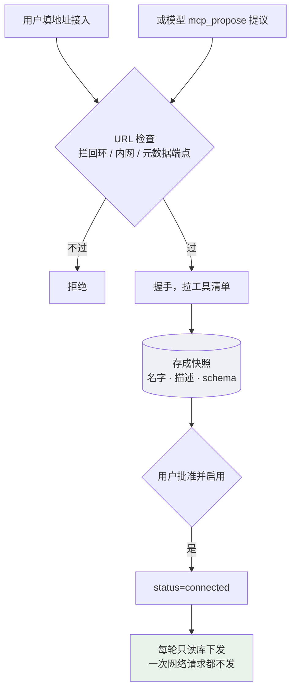
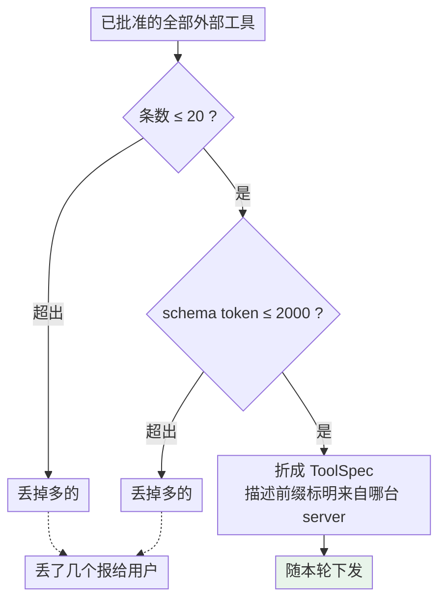
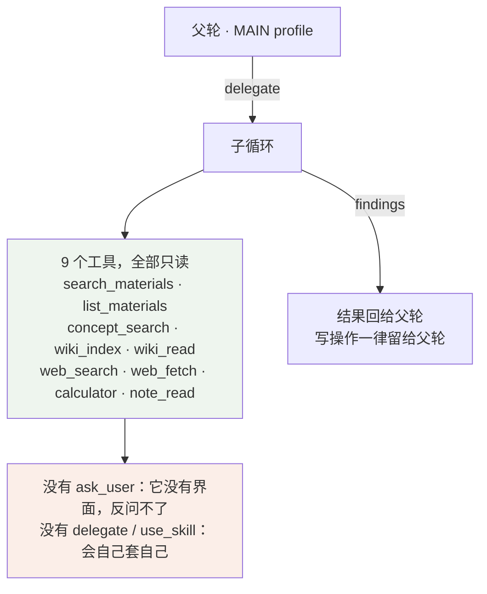
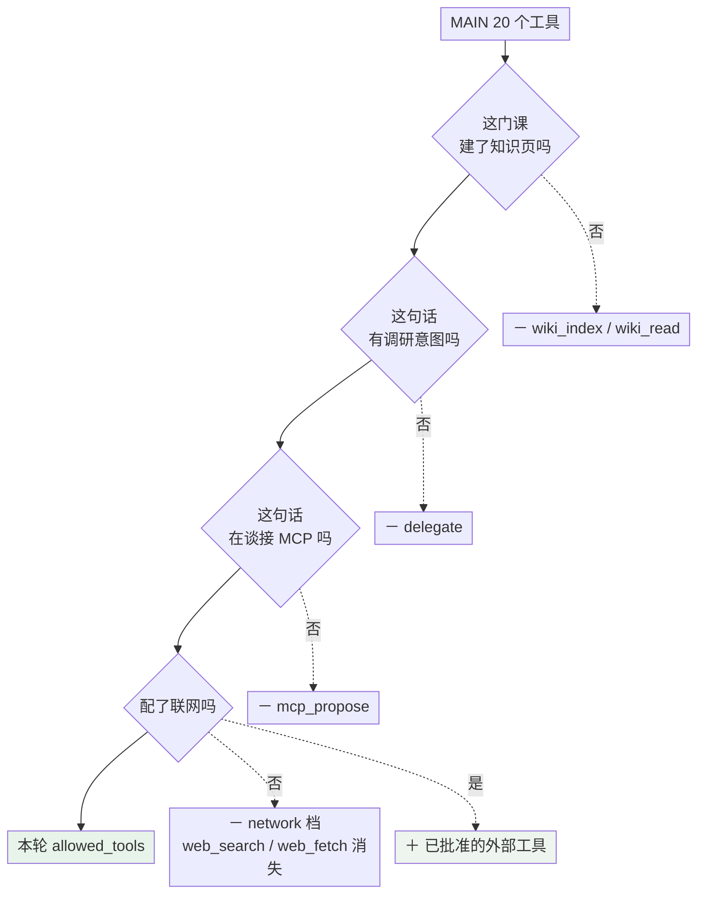
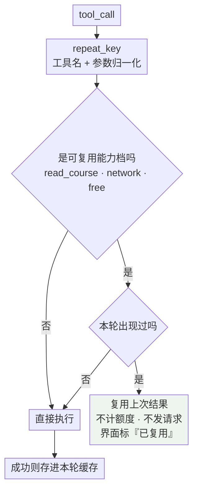

# 工具系统

CoursePilot 的 Agent 每一轮都在做同一件事：把用户这句话，变成若干次工具调用，再变成一段带引用的回答。

"工具"在这个系统里是个广义概念，有**四个来源**：

| 来源 | 是什么 | 谁提供 |
| --- | --- | --- |
| 内置工具 | 22 个写死在代码里的能力 | 开发者 |
| Skill | 一套工具 + 一份规程，激活后整体替换 | 内置 5 个，用户可导入 |
| MCP | 外部 server 提供的工具 | 用户接入 |
| 子 agent | 派出去的一个受限工具循环 | `delegate` 派生 |

它们**共用同一套准入、预算、可观测机制**。这份文档讲的就是这套机制。

厂商在自己那边跑的工具（Responses 协议的联网搜索）不在这四类里：本地没有执行回环，它不过这套门、不占预算、也进不了引用体系，只在活动与 trace 里以 `origin=provider` 留一条记录。见[模型接入层](模型接入层.md) §三。

覆盖的代码：

| 文件 | 职责 |
| --- | --- |
| `backend/modules/agent/tools.py` | 工具定义、权限模型、执行器 |
| `backend/modules/agent/service.py` | ReAct 主循环、profile 切换、预算记账 |
| `backend/modules/agent/skills.py` | Skill 解析、注册表、用户导入 |
| `backend/modules/mcp/service.py` | MCP server 接入、快照、调用 |

相关：[Agent 循环](Agent%20循环.md) 讲这些工具在一轮里怎么被调起来，[安全系统](安全系统.md) 讲权限模型防的是什么。

---

## 一、全景



两个**不由模型决定**的动作发生在模型开口之前：

- **种子检索**——每轮开头服务端用用户原话调一次 `search_materials`，结果以工具调用的形态注入（`call_id=SEED_CALL_ID`、`origin=seed`、`round=0`）。先查课程证据是系统行为，不指望模型自觉。
- **自动加载 skill**——命中意图时服务端直接把 SKILL.md 塞成一条 `tool` 消息，profile 当场切换。

---

## 二、内置工具：22 个，按能力档分组

工具定义写死在 `TOOL_SPECS`——名字、描述、JSON Schema。描述文字本身承担提示词职责，比如 `plan_update` 的描述里带着"点名清空的日期不许残留"这种行为约束。

22 个里有 2 个（`artifact_read` / `artifact_append`）只在 practice skill 里出现，所以 MAIN profile 是 20 个。下文提到 MAIN 时都指这 20 个。

| 能力档 | 工具 | 数 |
| --- | --- | --- |
| `read_course` 读课程 | `search_materials` 检索知识库（教材原文 + 知识页两路） · `list_materials` 资料清单 · `concept_search` 概念目录 · `get_plan` 读计划 · `get_archive` 学习档案 · `note_read` 读笔记 · `history_read` 回看历史 · `wiki_index` / `wiki_read` 知识页 | 9 |
| `write_state` 写状态 | `plan_update` 写计划 · `emit_evidence` 记学习证据 · `memory_patch` 更新记忆 · `artifact_append` 存练习 · `mcp_propose` 提议接 MCP | 5 |
| `write_note` 写笔记 | `note_write` | 1 |
| `network` 出网 | `web_search` · `web_fetch` | 2 |
| `free` 无代价 | `calculator` · `use_skill` · `artifact_read` · `ask_user` | 4 |
| `delegate` 派子任务 | `delegate` | 1 |
| `mcp_external` 外部 | 外部 server 提供的工具，运行期才知道名字（见第五节） | 动态 |

`delegate` 单开一档而不是归进 `free`：它会自己跑一个工具循环，一次调用就是好几次模型调用，归到"不花钱的工具"会让预算判断失效。

**能力档的价值在于整块开关。** 没配联网时做一次 `capabilities - {network}`，`web_search` 和 `web_fetch` 一起消失，不用逐个工具去摘。

`ToolProfile.capabilities` 只做校验，不参与运行期过滤：`tools` 是人写的意图，声明了不被允许的能力就在**注册期**报错。

---

## 三、一次调用要过四道权限门



**内置、Skill 授予、MCP 外部工具走的是同一条链**——`allowed` 里有什么就能调什么，来源不影响判定顺序。

三个要点：

1. **schema 下发和运行期准入读同一份 `allowed_tools`。** 模型看不见的工具，硬调也会在 ② 被拒。
2. **拒绝以一句话的形式回给模型，不抛异常。** 额度用满返回："web_search 本轮已用满 5 次，请基于已有信息继续。"模型读到这句会转向已有证据，读到异常只会重试。
3. **工具只吃服务端解析出的 `scope`。** 模型无法指定 `course_id`，跨课程越权在参数层面就不存在。

---

## 四、Skill：工具的编排层

一个 skill 是**一套工具 + 一份规程**。`SKILL.md` 的 frontmatter 声明工具，正文写怎么做事。



### 两条激活路径



自动加载还带一条兜底：有练习待批改时强制加载 `practice`，不看关键词。

### Profile 是整体替换

激活后切换到 skill 声明的**完整**工具集，不在 MAIN 上做并集。所以有一条兜底：

```
BASELINE_TOOLS = ("memory_patch", "ask_user")
```

这两个每套 profile 都无条件带上。`memory_patch` 是跨 skill 的记事本，任何规程执行期间都可能出现值得长期记住的事；`ask_user` 不碰任何数据，普遍下发没有代价。不兜住的话，skill 一激活它俩就消失了。

花钱工具的次数上限沿用主 profile，skill 绕不开预算。

### 五个内置 skill

| skill | 工具数 |
| --- | --- |
| `practice` 出题批改 | 10 |
| `research` 调研 | 9 |
| `mistake_review` 错题复盘 | 6 |
| `flashcards` 卡片 | 5 |
| `diagram` 图示 | 5 |

两处独占：`artifact_read` / `artifact_append` 只在 practice 里，`delegate` 只在 research 里，其余三个 skill 没有独占工具。

注意 `artifact_read` / `artifact_append` **不在 MAIN 里**——读写练习产物这件事只在 practice 规程期间存在。

### 用户导入的 skill 受更严的限制



`IMPORTABLE_TOOLS` 只有 8 个，全是读工具与练习相关的写工具。**改计划、写笔记、联网、加载别的 skill 都不在可授予范围内**——导入的规程是外来内容，不给它碰用户长期数据和出网的能力。

权限不足**不静默降权**：只要有一个工具不在白名单，导入状态就是 `permission_denied`，被拒的工具记进 `denied_tools`，启用时直接报错要求改声明后重新导入。用户看到的是"这个 skill 用不了"，不是"它悄悄少了两个工具"。

基座工具走另一条路（`profile_for_skill` 无条件补），不受这份白名单约束。

---

## 五、MCP：工具的外部来源

用户接进来的 MCP server，它的工具全部归到 `mcp_external` **一档**，不给每个工具单开档位——那会让权限模型爆炸，而且外部工具的语义我们无从判断（server 自报的 annotations 按协议就是不可信提示）。

### 接入到调用的全链



模型提议的 server 进来时是 `proposed` 状态，**要用户在管理页批准才会变成 connected**。模型自己接不上任何东西。

### 下发时的两道限流



两道都要：token 预算挡住描述冗长的，条数上限挡住"几十个短描述工具把内置工具淹了"。

### 五条明确的取舍

| 取舍 | 理由 |
| --- | --- |
| 运行期不向 server 发现工具 | 只按已批准的快照下发，server 事后偷换定义也换不掉批准过的那份 |
| 全部外部工具**共用一个额度键** `mcp__*`（8 次） | 按工具名各算各的等于没有上限——接一台声明 30 个工具的 server，模型一轮就能出网 30 次 |
| 不进引用体系 | 引用编号的含义是"点开能看到出处"：教材有页码、知识页有概念、网页有链接，而外部工具的返回是某次调用在某一刻的输出，没有可以再打开一次的位置 |
| 不落库 | 它返回什么由 server 决定，可能是行情、队列、时刻表。存下来几轮后回放，模型会把过期读数当成现在的事实 |
| 不参与同轮去重 | server 自称"只读"不可信，把一次可能有副作用的调用当成可复用的读，代价比多跑一次大得多 |

返回正文带不可信前缀，与网页内容同等对待。

---

## 六、子 agent：工具的递归使用

`delegate` 派出一个独立的工具循环，用父轮的模型、引用编号和额度。



`delegate` 和 `use_skill` 被显式列进 `_SUBAGENT_FORBIDDEN`，**注册期就校验**，不等运行期才发现。

子任务花掉的额度记在父轮头上，共用同一个 `used` 计数字典——这样"一轮的账单"始终是一个数。

---

## 七、本轮动态摘除

四类工具会按当轮情况整体不下发。摘在**工具集这一层**，schema 下发与运行期准入因此读的是同一份名单。



理由是同一条：**摆在那儿模型迟早会误用，而且每轮都占 schema 配额**。

`delegate` 尤其明显——一次子任务就是好几次模型调用，不摘的话模型会拿它当普通检索用。

知识页那两个工具的判据落在**课程**上，跟配置无关，所以不能像 `network` 那样按能力档摘——它们和 `search_materials` 同属 `read_course`。

---

## 八、预算与去重

只给花钱的工具设次数上限，本地读工具靠轮次上限管。

| 工具 | 上限 | 理由 |
| --- | --- | --- |
| `web_search` / `web_fetch` | 5 | 真出网 |
| `wiki_read` | 10 | 一页只有几百字，看全貌就要连读好几页。这个上限用来防跑飞，正常用量到不了 |
| `history_read` | 3 | 不花钱，但翻历史翻上瘾会把省下的上下文填回去 |
| `delegate` | 2 | 最贵的一条，够"派一件、看完再补派一件" |
| `plan_update` / `mcp_propose` | 1 | 写操作，重复提交只会堆垃圾 |
| 全部外部 MCP 工具 | 8（共用） | 见第五节 |

### 同轮去重



该挡的是原地打转；查得多但每次角度不同是正常的。

写工具刻意不在可复用之列：连答三道同概念的题，`emit_evidence` 的参数逐字相同，却是三次不同的事件。

---

## 九、什么会被记下来

一次工具调用产生几份记录，去向不同：

| 去向 | 落在哪 | 用户在哪看到 |
| --- | --- | --- |
| SSE `tool_call` / `tool_result` | 实时事件流 | 界面实时的工具条 |
| activity | 落库 | 历史消息里的工具痕迹 |
| `trace_tools` | trace | 开发者模式 trace 侧栏 |
| tool 正文 | **仅白名单内**进 `messages` 表，上限 8000 字符 | 后续轮次 `history_read` 读得回来 |

trace 记录每次调用的 `call_id` / `round` / `origin` / `decision` / `reason` / `duration_ms`，**被拒的调用同样在册**。

正文落库的白名单只有六个：`search_materials`、`concept_search`、`wiki_index`、`wiki_read`、`web_search`、`web_fetch`。判据四条，缺一条就不落：

1. 正文是取回的资料，不是"已保存"这类回执；
2. 同样的内容用户在界面上本来就看得到（`artifact_read` 会带出标准答案，出局）；
3. 不读消息表自己（`history_read` 出局，否则历史会自我复制）；
4. 内容不随时间变（`get_plan` / `get_archive` / `note_read` 每轮重读才是最新的，存下来只会让模型抄到过期版本）。

---

## 十、注册期校验

`validate_profiles()` 在启动时跑，把能静态发现的问题挡在运行期之前：

| 检查 | 防的是什么 |
| --- | --- |
| 每个工具都有能力归类 | 新增工具忘了归档，权限模型出现盲区 |
| profile 里的工具都存在 | 改名后留下一个永远调不到的死名字 |
| profile 声明了所用工具的全部能力 | 运行期才在第 ③ 道门被静默拒绝 |
| 静态名单里不许出现外部工具 | 绕过"用户批准过才下发"；slug 一改还会变成死名字 |
| MAIN 必须声明 `mcp_external` | 否则已批准的外部工具在运行期被拒 |
| 子 agent 名单不含 `delegate` / `use_skill` | 循环自己套自己 |
| 子 agent 能力不含 `delegate` / `mcp_external` | 没人看着的子任务去碰用户接进来的外部服务 |

---

## 十一、设计取向

- **静态期校验优先**——注册期跑一遍比线上出错便宜得多。
- **整块摘除优先**——能力档存在的全部意义就是让"关掉联网"变成一次集合减法。
- **拒绝要可继续**——模型读到"用满了"会转向已有证据。
- **权限只从服务端来**——`scope` 由服务端解析、外部工具按批准快照下发、写计划要用户原话触发、导入的 skill 只能拿到白名单里的工具。模型能影响的只有"调不调"，影响不了"能不能"。

---

## 附：术语速查

| 词 | 指什么 |
| --- | --- |
| ToolSpec | 一个工具的定义：名字 + 描述 + JSON Schema |
| Profile | 一轮里可用的工具集合 + 允许的能力档 + 各自的次数上限 |
| 能力档 | 工具的权限分类，七档，用于整块开关 |
| 种子检索 | 每轮开头服务端自动跑的那次 `search_materials` |
| BASELINE_TOOLS | 每套 profile 都自动带上的两个工具 |
| 快照 | MCP server 接入时存下的工具清单，之后按它下发 |
| origin | 这次调用是谁发起的，四个取值见 [Agent 循环](Agent%20循环.md) §10 |
