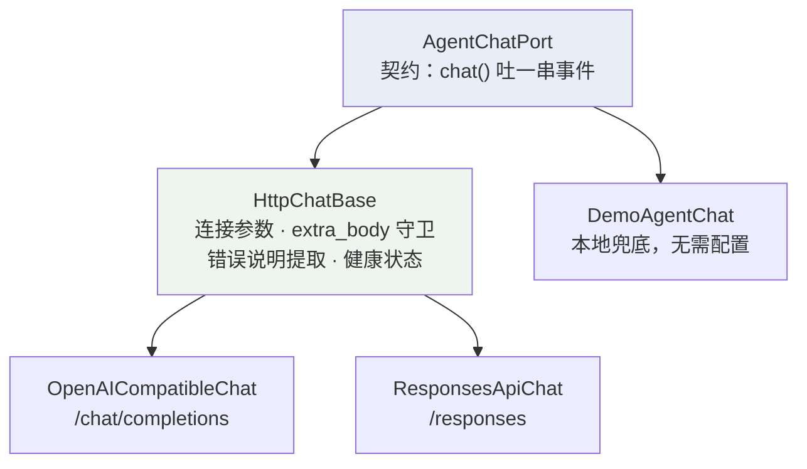
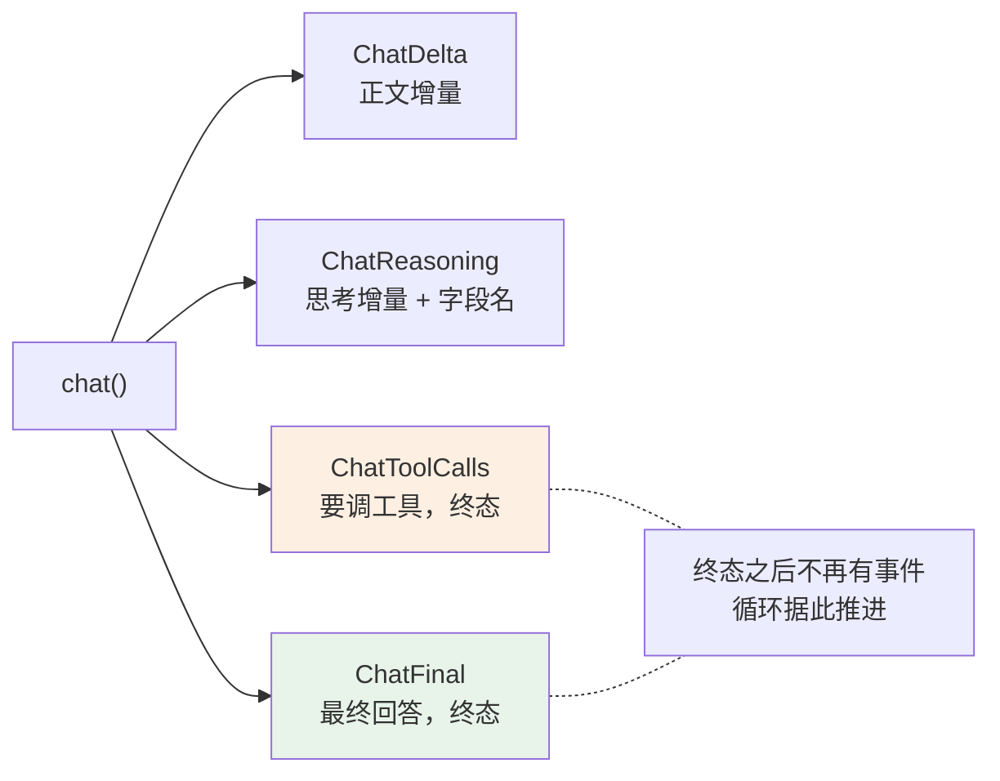
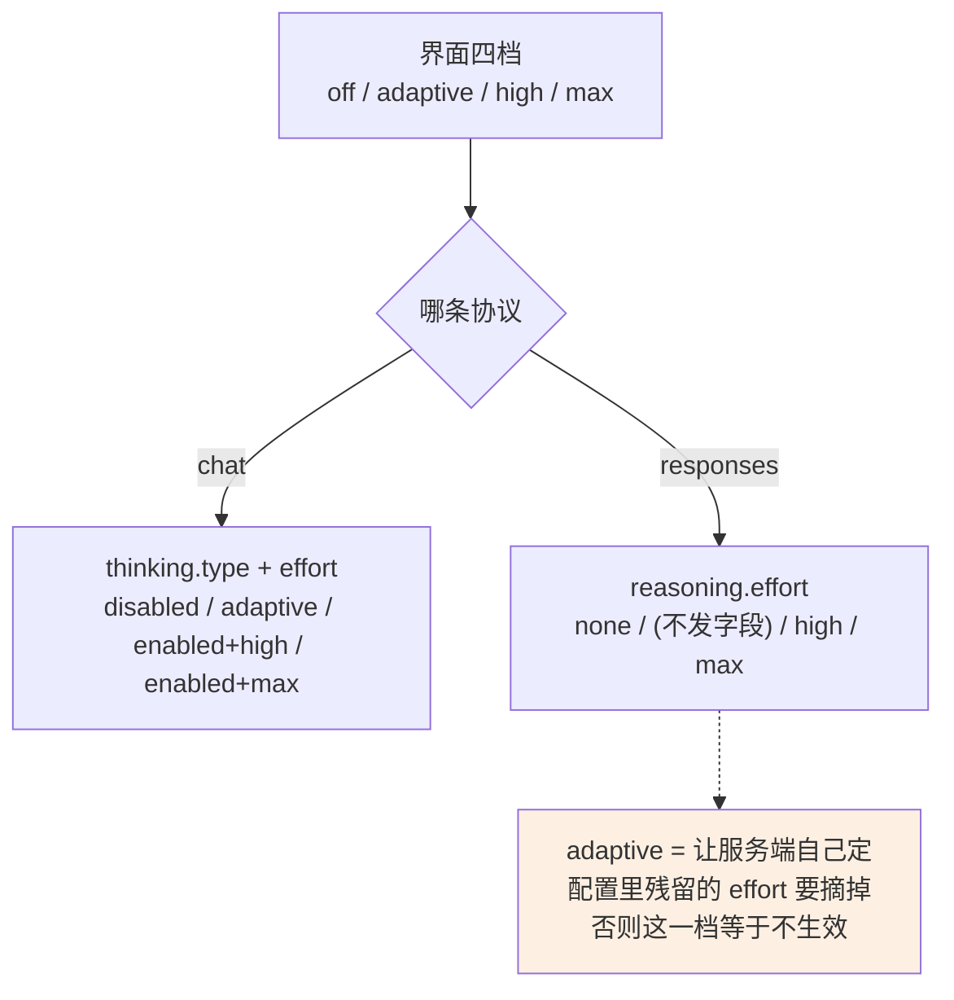
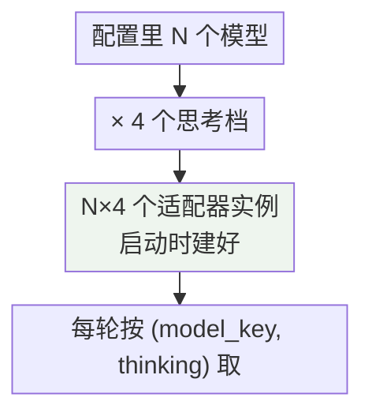
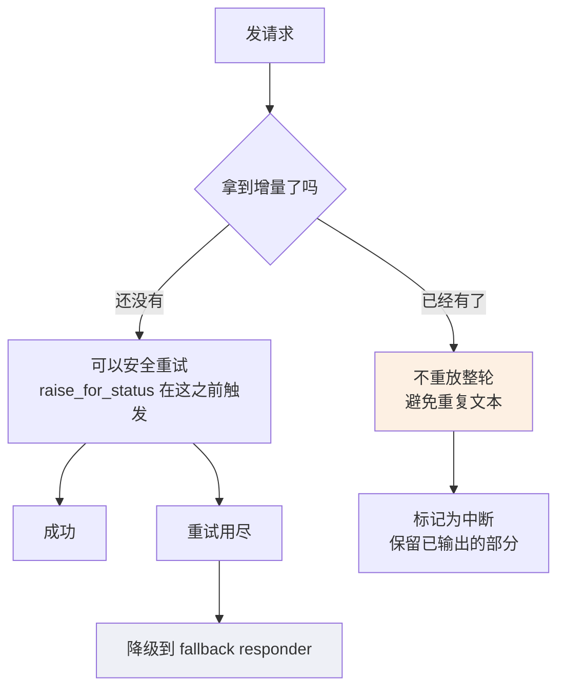

# 模型接入层

这个项目对接**任意 OpenAI 兼容服务**，不绑定某一家模型。听起来只要照着文档发请求就行，实际上"兼容"这个词非常松：同一个字段名，两家服务的行为可能完全不同；同一份规范，两家实现可能给出互斥的要求。

这份文档讲这层怎么把这些差异吸收掉，以及具体撞过哪些坑。

覆盖的代码：

| 文件 | 职责 |
| --- | --- |
| `backend/contracts/llm.py` | 端口契约与统一事件类型 |
| `backend/adapters/llm/http_chat.py` | 两条协议共用的基座 |
| `backend/adapters/llm/openai_compatible.py` | Chat Completions 协议 |
| `backend/adapters/llm/responses_api.py` | Responses 协议 |
| `backend/app/bootstrap.py` | 模型槽位、思考档位、降级链 |

相关：[Agent 循环](Agent%20循环.md) 讲这些事件在循环里怎么被消费。

---

## 一、分层



上层（`TurnService`）只认 `AgentChatPort`，不知道底下走的是哪条协议。协议选择在配置里：`TEXT_PROTOCOL=chat|responses`，默认 `chat`。

---

## 二、统一的事件模型

不管底下是什么协议，吐出来的都是这四种：



`ChatReasoning` 带 `field` —— 思考内容的字段名不统一（`reasoning_content` / `reasoning` / Responses 的两路事件），实际用的是哪个随增量带出去，开发者模式要显示它。

`ChatFinal` 同时带两个收尾原因：

| 字段 | 含义 |
| --- | --- |
| `finish_reason` | 归一化后的，界面与统计用 |
| `provider_finish_reason` | 厂商原话 |

**混成一个就分不出"厂商说 stop"和"厂商一个字没说"。**

---

## 三、两条协议的差异

| | Chat Completions | Responses |
| --- | --- | --- |
| 请求体 | `messages` 数组 | `input` 条目数组 |
| 正文增量 | `delta.content` | 具名事件流 |
| 工具调用归位 | 按 `index` 分片 | 按 `output_index` / `item_id` |
| 结束信号 | `data: [DONE]` | `response.completed` / `incomplete` / `failed` |
| 输出上限字段 | `max_tokens` / `max_completion_tokens` | `max_output_tokens` |
| 思考档位字段 | `thinking.type` + `effort` | `reasoning.effort` |
| 厂商端工具 | — | 额外支持 `web_search` |
| 过场叙述标记 | — | 条目上带 `phase`：`commentary` / `final_answer` |

Responses 协议多一样东西：**厂商在它那边跑的工具调用**（如联网搜索）。本地没有执行回环，拿到的只是"它做了什么"，归一成 `ServerToolCall` 一次报完，让用户和 trace 看得见这一步。

它**默认关闭**——结果不经过本地的不可信内容前缀，也产不出可点开的引用。

还多一个标记：厂商给每个 `message` 条目标 `phase`，`commentary` 是调工具前的过场叙述（「我来帮您查一下」），`final_answer` 才是回答。`TEXT_COMMENTARY_TO_REASONING`（默认开）把 commentary 那几段改发成 `ChatReasoning`（field 记 `output_text.commentary`），正文里不留它，trace 与开发者侧栏照常看得到。**准确的 phase 只在条目收尾事件上给**（起始条目一律写着 `final_answer`），所以正文增量先攒着等定性，攒到 200 字还没收尾就按回答发——长答案的首屏不被这条规则拖住。不标 `phase` 的服务一个字都不攒，行为与没有这一项时完全一致。

---

## 四、撞过的坑

每一条都是真出过问题才加的。

### 请求体

- `max_tokens` 与 `max_completion_tokens` **互斥**：推理系模型要后者，且拒绝两者同时出现。
- 不带 `stream_options.include_usage`，部分服务的流式 usage 恒为 null，**token 统计静默丢失**。
- `extra_body` 里置 `null` 表示移除该字段，给不认识某个字段的服务留一个出口。
- `extra_body` 守卫：协议关键字段从 `extra_body` 进来会改坏行为，**启动就报错**。

第二条是"静默"的——不会报错，只是统计永远是 0。这类问题最难发现。

### 流式解析

| 坑 | 应对 |
| --- | --- |
| `tool_calls` 分片可能没有 `index` | 带 `id` 的分片当新调用开槽，不带的拼到最近一个。否则两个并行调用会落进同一槽，`arguments` 拼成非法 JSON |
| 事件类型在 SSE `event` 行和负载里各有一份 | 只发 `event` 行的服务靠负载兜底 |
| 收尾事件之后不再读 | 服务端不关流的话，读超时会把已收全的答案整个丢掉 |
| 先来的 `error` 事件说的才是原因 | 别被收尾那份空的 `error` 抹掉 |

### 思考内容

| 坑 | 解法 |
| --- | --- |
| 字段名不统一（`reasoning_content` / `reasoning`） | 随增量把字段名一起带出去 |
| 思考模式要求 assistant 消息回传思考内容 | 只校验字段在不在，空串就行 |
| 这个字段是厂商扩展，对不认识它的服务发过去可能被拒 | 不预先发，撞上一次就记住，这个实例之后一直带上 |

**"撞上一次就记住"是这层的一个通用模式**：不预设厂商要什么，撞到明确的错误再打开对应的兼容开关，然后这个适配器实例后续一直带着。

Responses 侧还多一条：OpenAI 还要求带上它自己那条 reasoning 条目的 id，而我们只留了纯文本——所以只在"补一条空思考真能改变请求体"时才重试，否则原样再打一遍是白花一次调用。

### 错误响应

服务端的说明藏在三个位置之一：`error.message`、顶层 `message`、顶层 `detail`（vLLM / FastAPI 系）。三处都认，取到之后压成一行、截 200 字、抹掉密钥，只进本地 trace，不随事件发给前端。

**只有状态码根本没法查**——模型名错了、参数不被接受、还是缺了某个必传字段，全靠服务端这句话。

必须在 `with` 块内读完 body：离开之后流已关闭，说明就再也拿不到了。

### 空回答

推理模型思考吃完输出预算是常见态。一律报"空回答"会让人查错方向，所以**按 `finish_reason` 归类**：`length` 就说是被长度截断，`content_filter` 就说是被过滤。

---

## 五、思考档位：四档，两套字段

用户在界面上看到的是四个档，底下映射到两条协议各自的表达。



`adaptive` 是"让模型自己决定这轮要不要想"。没配思考参数时默认就是它——**不替用户拍一个深度**。

档位表在 `bootstrap.py`，注释里记了别家的形态供换厂商时对照：

```
OpenAI o 系列：顶层 {"reasoning_effort": "low" | "medium" | "high"}
Anthropic：    {"thinking": {"type": "enabled", "budget_tokens": 8000}}
```

### 槽位是预先建好的



用户在状态栏切模型或切思考深度，就是换一个已经建好的实例，不重新构造连接。

---

## 六、重试与降级



分界线是**有没有向用户发出过内容**。发过就不能重来——用户会看见回答被凭空换掉。

思考增量刻意不算"已输出"：它不进答案，网络抖动时整轮重试仍然安全。

`fallback` 是 `DemoAgentChat`，本地实现、无需配置。它让没配远端模型的人也能把界面跑起来，也让远端全挂时用户看到一句能读的话，不是白屏。

---

## 七、健康状态

每次调用之后记一笔：成了就把 `last_call_ok` 置 True 并清空错误码，失败就置 False 并记下错误码。`health()` 报的就是这两个值。

刻意**不主动探活**——把"工作区能不能建起来"挂在一个端口方法上太脆。健康状态是被动记录的：最近一次调用成没成、失败码是什么。

同理，"配没配联网"的判据是"有没有建出 web 适配器"，不是调 `health()`。

---

## 八、还有三个适配器

| 适配器 | 用途 | 特点 |
| --- | --- | --- |
| `VisionOcrTranscriber` | 图片转录 | 两个实例：`VISION_MODEL` 走 OCR 提示词做扫描版转录，`VISION_CHAT_MODEL` 走 `understand=True` 处理拍照提问；后者没配就复用前者 |
| 分类器 | 课程解析 | 用主模型但强制 `thinking=off`——它只需要判一个标签 |
| 压缩 | 会话摘要 | 用主模型，两阶段提示词 |

分类器强制关思考这条值得单说：它每轮都跑，判的是"这句话属于哪门课"，开思考纯粹是浪费时间和钱。

---

## 九、设计取向

- **不预设。** 思考字段、`stream_options`、`max_completion_tokens` 都是撞到明确错误才打开，之后这个实例一直带着。预先发一堆厂商扩展，对不认识的服务就是直接被拒。
- **归一但留原话。** `finish_reason` 归一给界面用，`provider_finish_reason` 留厂商说的那个。混成一个就分不出"它说 stop"和"它什么都没说"。
- **发出过就不重来。** 用户看见的东西不能被凭空替换，宁可标成中断。
- **守卫放启动期。** `extra_body` 里带了协议关键字段就直接启动失败——宁可启动就报错，也不要留一个难查的运行时故障。
- **不主动探活。** 健康状态是调用的副产品，不是一个额外的请求。

---

## 附：配置项

| 环境变量 | 说明 |
| --- | --- |
| `TEXT_API_KEY` / `TEXT_BASE_URL` / `TEXT_MODEL` | 主模型 |
| `TEXT_PROTOCOL` | `chat`（默认）或 `responses` |
| `TEXT_SERVER_SEARCH` | Responses 协议下的厂商端联网，默认关 |
| `TEXT_COMMENTARY_TO_REASONING` | Responses 协议下把厂商标为过场叙述的文本改走思考流，默认开 |
| `TEXT_EXTRA_BODY` | 透传给服务的额外字段，置 `null` 表示移除 |
| `VISION_*` | 图片转录的独立槽位 |
| `TEXT_MODEL_2` · `TEXT_MODEL_3` … | 备选模型，状态栏可切。后缀式命名，扫到断号为止；只填 `TEXT_MODEL_n` 一行时其余字段继承第一个 |
