# 知识库系统

用户传进来一本 PDF，系统要做两件性质不同的事：

- **建索引** —— 切成片段、算向量，让提问时能捞出相关的几段原文。这是 RAG。
- **写知识页** —— 照着教材目录，为每个小节写一页整理稿，合起来是这门课的完整结构。这是 LLM-Wiki。

两者不是替代关系。RAG 擅长"这个公式在第几页"，知识页擅长"这门课分成哪几部分"。它们在检索时汇合成同一套引用体系。

覆盖的代码：

| 文件 | 职责 |
| --- | --- |
| `backend/modules/knowledge/extract.py` | 从 PDF/docx/pptx/md 提取文本与目录 |
| `backend/modules/knowledge/service.py` | 索引流水线、检索链、Wiki 构建编排 |
| `backend/modules/knowledge/repository.py` | 分片存储、FTS、向量读写 |
| `backend/modules/knowledge/wiki.py` | Section 树、页生成、lint、跨教材配对 |
| `backend/adapters/embedding.py` · `reranker.py` | BGE 向量与重排 |

相关：[工具系统](工具系统.md) 讲 `search_materials` / `wiki_read` 这些工具的准入，[上下文工程](上下文工程.md) 讲检索回来的证据占多少配额。

---

## 一、全景：两条链路，一个引用体系

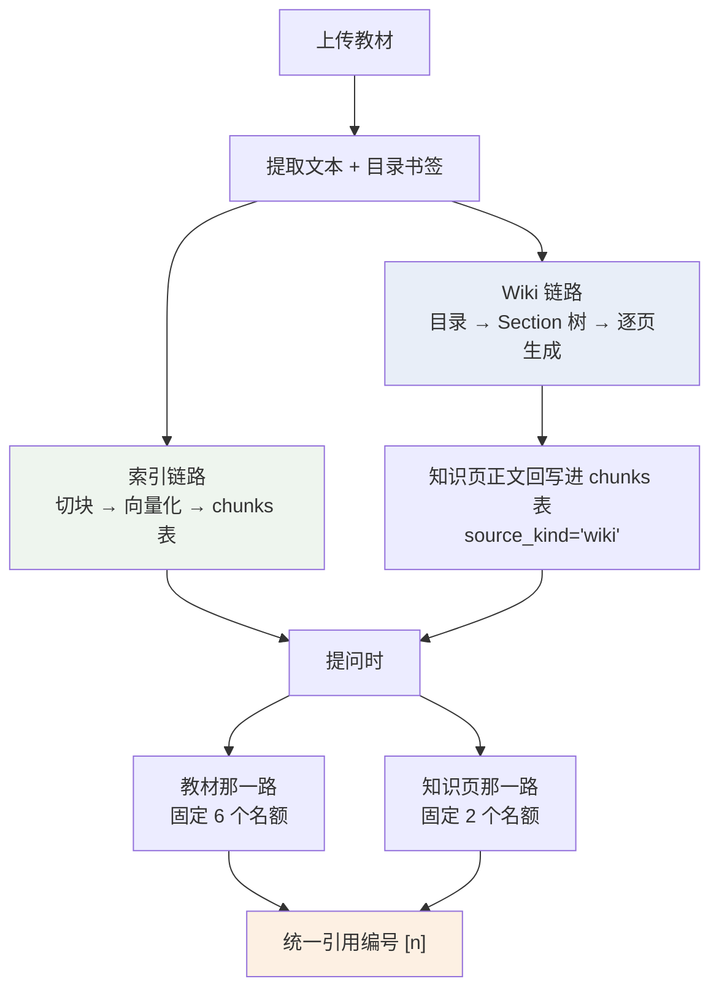

**Wiki 链路要等索引链路先跑完**——它的正文证据取自 `chunks` 表里的分片。目录是例外：`_wiki_outline` 会重新打开磁盘上的 PDF 取书签，文件丢了才退回 concepts 表，并在覆盖率里报 `outline=concepts`。

---

## 第一部分 · RAG

## 二、索引流水线

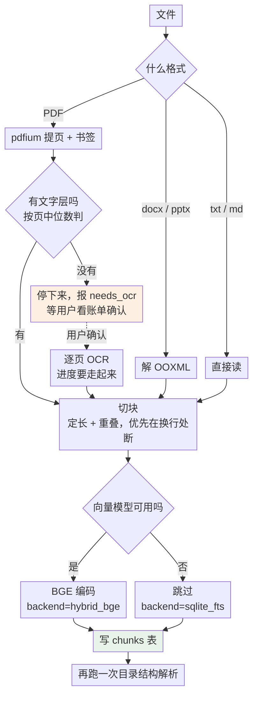

几个判断点：

- **扫描版判定看页中位数**，不看"有没有提取出任意文字"——后者会漏掉带页码或文字封面的扫描件。
- **OCR 不擅自花钱**：判定为扫描版就停在 `needs_ocr`，前端给出估算，用户确认才跑。
- **向量模型不可用不阻断索引**，教材仍以纯词面方式可检索，只是 `retrieval_backend` 记成 `sqlite_fts`。

### 概念目录：书签优先，刮正文兜底

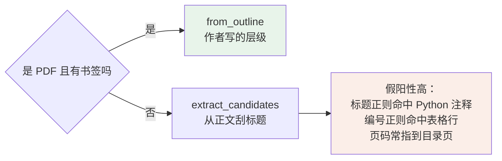

刮正文是主路径。用户上传的讲义、扫描件、没有书签的教材都走这条，两条路要同等对待，质量差距在覆盖率提示里体现给用户。

---

## 三、检索链：双路召回 → 重排 → 阈值

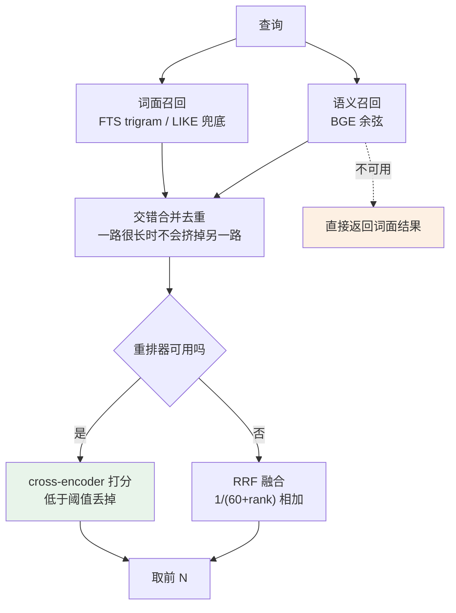

**召回池比最终条数宽**（`rag_rerank_candidates`），让重排有得挑。

### 三级降级，每一级都能单独工作

| 情况 | 行为 |
| --- | --- |
| 全部可用 | 双路召回 + cross-encoder 精排 |
| 重排器挂了 | RRF 融合两路排名 |
| 向量模型挂了/维度不一致 | 词面结果照原样返回 |

维度不一致这条是真会发生的——换过 embedding 模型而没重建索引。它不该打断检索，捕获后退回词面。

### 中文 FTS 的坑：trigram

SQLite 的 `unicode61` 分词器把**一整串中文当成一个 token**。"高等数学 II 的链式法则怎么用？"整串下去，命中不了任何东西。

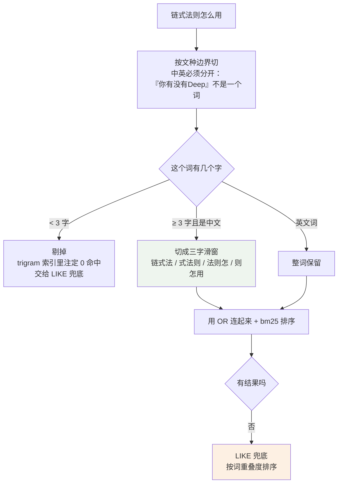

两个细节：

- **索引侧存三字滑窗，查询侧也要同样切开。** 整串当短语匹配，命中不了只写着"链式法则"的段落。
- **用 OR 不用 AND。** 混合语言查询里注定缺席的词（中文串之于英文教材）不该否决整次检索。

FTS 是优化，LIKE 兜底才是确定性的那条路。

### 向量侧的一个细节

BGE 中文模型对查询要加前缀（`为这个句子生成表示以用于检索相关文章：`），文档侧不加。这个非对称是模型训练时定的，漏掉会让相似度整体偏低。

同一个 embedder 还提供 `pairwise`——算两两相似度矩阵，给知识页配对用。**那条路不能用 `rank`**，因为 `rank` 会给查询加前缀。

---

## 第二部分 · LLM-Wiki

## 四、为什么需要它

RAG 的天花板是**它只能捞回片段**。问"这门课整体分成哪几部分"，检索能给你 6 段原文，拼不出结构。

实测数据：加了知识页之后，跨章节事实锚点从 30/36 涨到 34/36（有一道题从 0/6 变成 6/6）。

代价也实测到了：教材召回从 0.847 降到 0.611。推测是知识页占掉了一部分席位与注意力，这条没有单独验证过。

作为补偿，知识页引用会带上它转述时依据的教材页，"无教材出处的轮次" 9/84 → 1/84。

---

## 五、构建：目录 → 树 → 自底向上

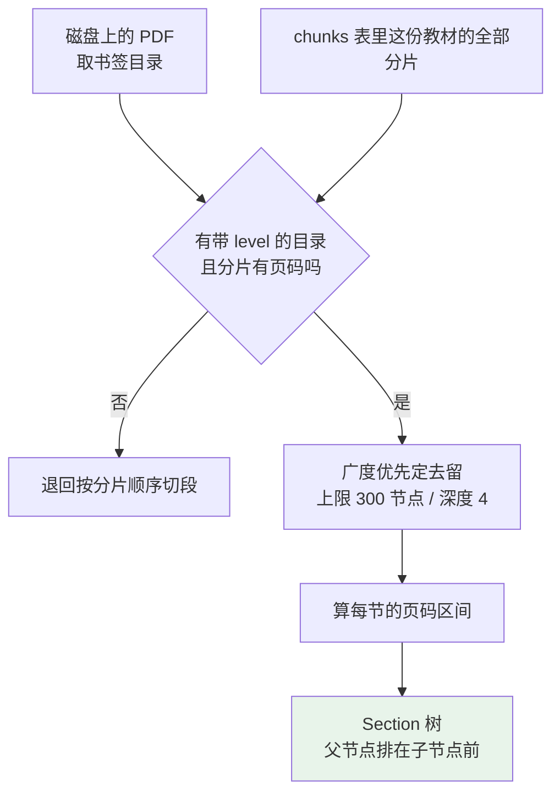

### 页码区间是这里最容易错的地方

书签给的是**标题所在页**，不是小节的范围。要自己推：

| 边界情况 | 处理 |
| --- | --- |
| 书签指不到页 | 贴着上一节，不留缝 |
| 第一个节点之前的封面页 | 归给第一个节点 |
| 章节导语在第一个子节点之前 | 首个子节点从父节点起算，那几页才有人读 |
| 跨页标题指到了上一页 | 结尾多带一页，宁可相邻两节重叠 |
| 最后一个节点没有下界 | 用总页数兜底 |

判据定成 **"所有叶子区间并起来覆盖每一页"**，比逐个区间对不对更要紧——覆盖不漏是这个判据的全部意义。

上限砍的是**最深的那批**（广度优先），章节级的页不会整段消失，它们的页码区间会被上级页接过去，覆盖不因为上限出现空洞。

### 自底向上写

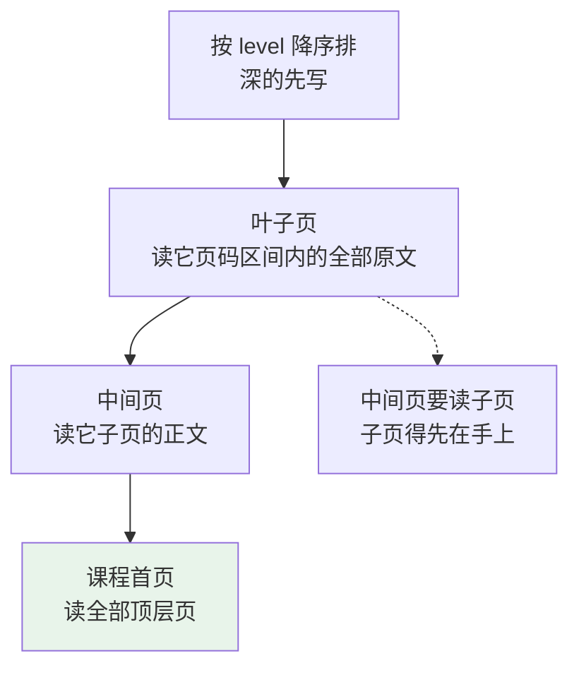

**全程不走检索。** 叶子页直接按页码区间取原文，这是它和 RAG 最根本的区别——不存在"没检索到"这回事。

### source_hash：幂等与增量

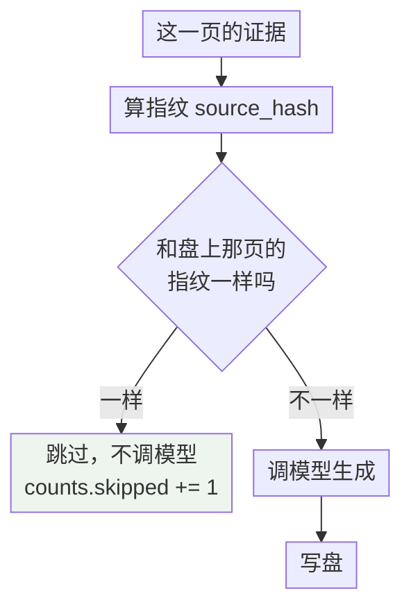

中断后重跑不会重复花钱——实测断网杀实例后续建，零重复调用。

**已知边界**：`source_hash` 不含 chunk id，重建索引后再跑构建是 `written=0 skipped=7`，引用里的 chunk 引用一字不变（会指向已经不存在的 chunk）。所以死链要靠检索时的降级处理，不靠自愈。

---

## 六、落盘格式

知识页存成磁盘上的 markdown 文件，路径可读：

```
wiki/<课程>/<教材名>/08-循环神经网络/08.5-从零实现RNN.md
```

编号是**树内位次**，不是教材自己的章节号：子页继承父页的完整前缀，同级数量决定零填充宽度。所以第 8 个顶层节点下的第 5 个子节点是 `08.5`，与书上印的"8.5"对不上是正常的。

一份文件的结构：

```markdown
---
concept_id · concept_name · source_hash · source_refs   ← frontmatter
material_id · parent_id · level · order
prompt_version · updated_at
---

正文：模型生成，重建会覆盖

<!-- 以下是手写区，重新生成不会覆盖 -->

用户手写内容：重建时原样保留
```

几条约束：

- 单页 128KiB 上限，重建时留 8KiB 余量（`REBUILD_HEADROOM`）——手写区顶满不该让后续重建卡死。
- 一页落不了盘不拖垮整次构建：记进 `oversized` 计数继续写下一页，那一页保持旧版本。
- `prune` 清理孤儿页时有护栏：**用户写过东西的页不删**。

---

## 七、体检：lint

构建完跑一遍，只报不改。10 条规则，纯函数实现（不碰 IO，每条都能用手造的页数据钉住）。

| 级别 | 规则 | 报什么 |
| --- | --- | --- |
| `error` | `page_out_of_range` | 标了没读过的页 |
| `error` | `overview_cites_pages` | 中间页标了页码——它读的是子页，标了就是编的 |
| `error` | `leaf_without_sources` | 叶子页一条出处都没有 |
| `error` | `dangling_page_refs` | 引用指向不存在的页 |
| `error` / `warn` | `fabricated_document` | 标了这门课没有的教材。带页码算 `error`，否则 `warn` |
| `warn` | `cross_document_mark` | 标了这门课有、但这页没读过的教材 |
| `warn` | `unread_pages` | 教材有几页没被任何知识页读到 |
| `warn` | `empty_body` | 正文是空的 |
| `warn` | `orphan_page` | 没有任何页指向它 |
| `warn` | `no_source_hash` | 缺来源哈希，改动检测不到

一条标注**只落一条规则**——同一处写法报两遍会让报告没人看。

区间标注（`[p.12-14]`、`[文档 pp.12-14]`）按交集判：只要区间和这页读过的页有一页重合就算对上。区间比读过的范围宽不是幻觉，逐页要求会让它整批变成误报；报出来的页码取区间首页，和界面上「点开第一页」是同一个语义。

三份真实教材构建下来零误报；真模型 e2e 跑完最终 `issues=[]`。

---

## 八、跨教材配对：「其他来源也讲了这个」

一门课传了几本书时，把讲同一件事的页连起来。

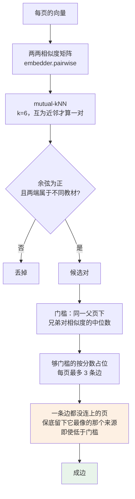

**跨教材过滤发生在最前面**，所以 3 条边的名额不会被同教材的边占掉。

最后那道保底是这件功能能兑现的关键：门槛按同章兄弟标定，而另一本书讲同一节时用的是另一套措辞，未必够得着那条线——"几本书都讲了这一节"正好会被它挡掉。余弦为正是保底之下唯一的绝对线。

**门槛每门课自己标定**，因为余弦的绝对值不跨库可比（`rag_min_similarity` 默认关掉正是这个原因）。取同一父页下兄弟对的中位数当"讲的是同一件事"的下限——同章的兄弟天生在讲相近的东西，这是一个天然的标尺。

**只连跨教材的边**是拍板的取舍：同教材不连是"同章不连"的严格超集，单教材课静默不出边是正确行为。真数据负对照——两本无关的书并成一门课，0 条边。

真实数据上（4 份教材 197 页）出了 52 条边，全部跨教材：注意力 0.917、Dropout↔暂退法 0.821。

---

## 第三部分 · 两者如何汇合

## 九、三类引用，一套编号

三类来源进同一个 `CitationRegistry`，共用一套编号，各按各的口径去重：

| 来源 | 去重口径 | 界面样子 |
| --- | --- | --- |
| 教材片段 | 按 chunk | 深色，带页码 |
| 知识页 | 按概念 | 灰色，标"知识页 · 概念名" |
| 网页 | 按 URL | 蓝色，带链接 |

知识页引用还会带上**它转述时依据的教材页**，让点开仍能追到原文。这条让"无教材出处的轮次"从 9/84 降到 1/84。

## 十、固定名额，不做统一排序

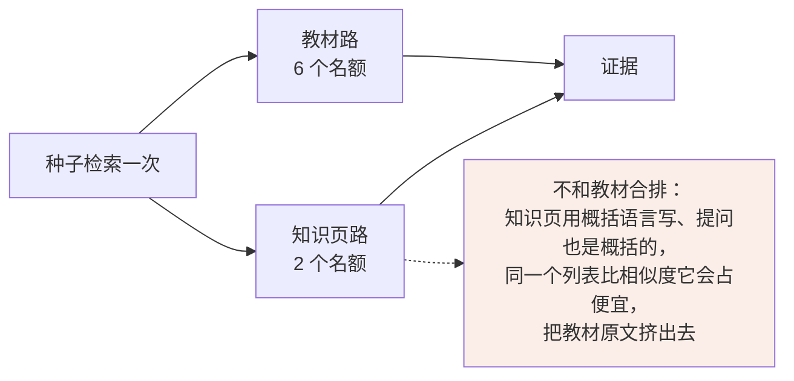

固定名额还有个好处：调低知识页的相关度阈值不会挤占教材席位，代价只是多一页不相关的。

知识页那一路额外做了**席位多样性**——同一份教材不能垄断两个席位。真数据验证：两席无单本垄断。

## 十一、知识页回写 chunks 表带来的自污染

**约束：知识页构建期间的检索必须按 `source_kind` 过滤。** 不过滤的话，构建下一份教材时检索会把**自己上一轮的输出**当成教材证据读回来。

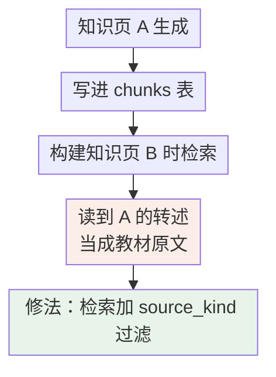

依据是分片覆盖从 38/38 掉到 24/38。

**这条约束还抓到过一个假测试**：撤掉修复后测试仍然全绿——那条查询走了 FTS，而知识页从不进 FTS，泄漏路径根本没被走到。改成 2 字查询逼它走 LIKE 兜底才立住。

---

## 十二、设计取向

- **每一级都能单独工作。** 重排挂了有 RRF，向量挂了有词面，FTS 没命中有 LIKE。没有哪一环是"挂了就全废"。
- **不擅自花钱。** OCR 和知识页构建都要用户看过估算再确认。
- **覆盖率要说出来。** 构建完报"写了几页、跳过几页、几页没内容、多少页没被读到"。静默的高覆盖率和静默的低覆盖率长得一样。
- **阈值每库标定。** 余弦绝对值不跨库可比，所以跨教材配对的门槛是从这门课自己的数据里算出来的，不是配置里写死的。

---

## 附：关键参数

| 参数 | 值 | 说明 |
| --- | --- | --- |
| 教材检索名额 | 6 | `SEARCH_LIMIT` |
| 知识页检索名额 | 2 | `WIKI_SEARCH_LIMIT` |
| RRF 常数 k | 60 | |
| FTS 滑窗 | 3 字 | trigram |
| Wiki 节点上限 | 300 | 跑飞兜底，不是配给 |
| Wiki 树深上限 | 4 | index.md 占一层 |
| 单页证据上限 | 6000 字符 | |
| 单页文件上限 | 128 KiB | 重建留 8 KiB 余量 |
| 配对 k / 每页边数 | 6 / 3 | mutual-kNN |
