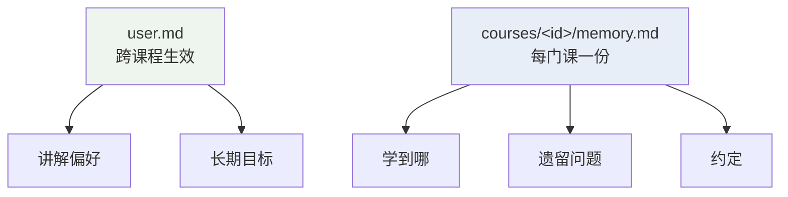
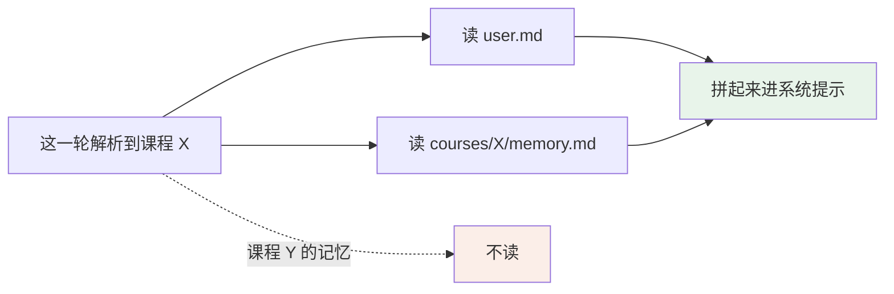
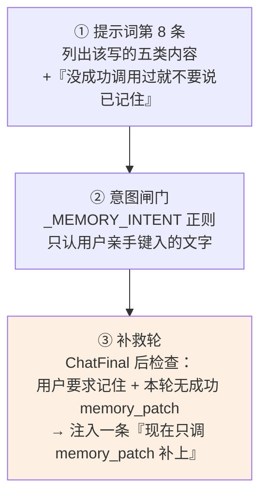
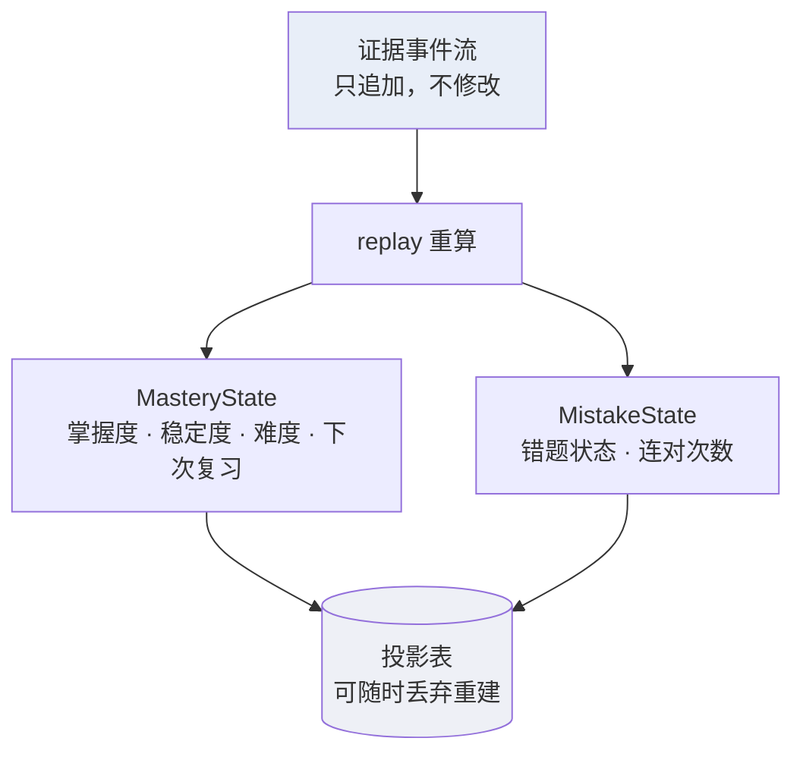
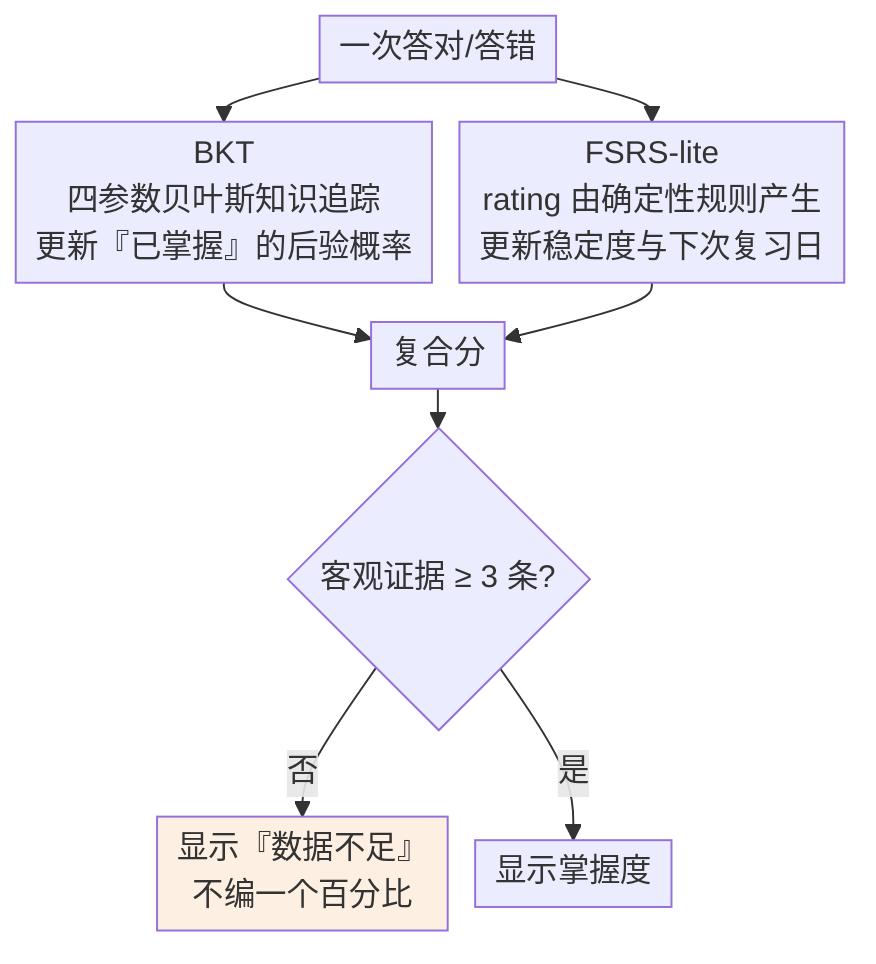
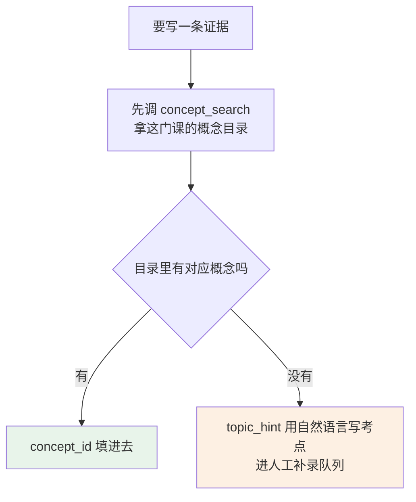

# 记忆系统

一个学习助手最该记住的，恰恰是两类完全不同的东西：

- **"他喜欢先看例子再看定义"** —— 一句话，会变，人能读能改。
- **"他在「条件概率」上答对 3 次、答错 1 次，下次该在 8 月 12 日复习"** —— 一串数字，由算法算出来，人改了反而错。

这个系统把两者**严格分开存**。这份文档讲这条分界线画在哪、为什么。

覆盖的代码：

| 文件 | 职责 |
| --- | --- |
| `backend/modules/memory/store.py` | 长期记忆的 markdown 存储 |
| `backend/modules/agent/compact.py` | 会话摘要 |
| `backend/modules/learning/mastery.py` | 掌握度：BKT + FSRS |
| `backend/modules/learning/mistakes.py` | 错题状态机 |

相关：[上下文工程](上下文工程.md) 讲前两层（历史预算与压缩），[Agent 循环](Agent%20循环.md) 讲记忆补救轮怎么触发。

---

## 一、四层记忆，按时间尺度排

| 层 | 存在哪 | 活多久 |
| --- | --- | --- |
| ① 本轮 | `messages` 数组 | 活到这一轮结束 |
| ② 本会话 | 消息表 + 摘要 | 活到会话结束，超长则压成摘要 |
| ③ 跨会话 | 长期记忆 markdown | 永久，用户可编辑 |
| ④ 跨会话 · 结构化 | 证据事件流 | 永久，只追加不修改 |

前两层在 [上下文工程](上下文工程.md) 里讲过（历史预算、水位线、压缩）。这份文档讲后两层。

---

## 二、分界线：叙述性 vs 数值性

| | 叙述性 | 数值性 |
| --- | --- | --- |
| 存到哪 | 长期记忆 markdown | 证据事件流 |
| 装什么 | 讲解偏好 · 长期目标 · 学到哪一章 · 遗留问题 · 与用户的约定 | 掌握度数值 · 错题状态与连对次数 · 复习排期 |
| 谁写 | 模型判断该不该记 | 确定性算法算 |
| 走哪个工具 | `memory_patch` | `emit_evidence`，模型只报"这次答对了" |

这条线在三个地方被反复强调：`memory_patch` 的工具描述、系统提示第 8 条、两个记忆文件的开头。

**为什么必须分开**：让模型写数值，它会写"掌握度大概 70%"——这个数没有依据，也没法和别的概念比较。数值必须来自同一套确定性算法。

反过来，"他喜欢先看例子"这种事没有任何算法算得出来。

---

## 三、长期记忆：一份用户能读能改的 markdown



存成磁盘文件，**用户能直接打开看和改**。系统提示里对模型明说了这一点：

> 记忆存成 markdown 文件，用户可以在界面上直接看和改，不要另编一套存储说法。

### 受管区块：模型改模型的，用户改用户的

```markdown
# 课程记忆
（说明文字）

<!-- agent:managed:progress -->
学到第 8 章                          ← 模型整块替换
<!-- /agent:managed:progress -->

用户自己写的段落，模型不动

<!-- agent:managed:preferences -->
...                                  ← 模型整块替换
<!-- /agent:managed:preferences -->
```

`memory_patch` 只替换 marker 之间的内容，**整块替换**，区块不存在就追加。用户手写的段落不受影响。

用户整份重写时 marker 由他自己负责——这是他的文件。删掉了 marker，下次 `memory_patch` 会重新追加一个区块。

### 三条约束

| 约束 | 值 | 理由 |
| --- | --- | --- |
| 单区块 | 2000 字 | 一个话题写不了那么长，超了多半是模型把整段对话贴进来了 |
| 整份文件 | 20000 字 | 它每轮都进上下文 |
| 区块名 | `^[a-z][a-z0-9_]{0,30}$` | 名字要能当正则用，也要能当文件里的标识 |

### 两个实现细节

**正则替换要用 lambda 给替换文本。** 内容里的 `\d`、`\1` 会被当成分组引用，而记忆里写 LaTeX 是常态。

**写入用原子写**（同目录临时文件 + `os.replace`）。这是"先读后写"的整份覆盖——崩在 truncate 之后丢的是整份，而记忆没有第二份副本。

---

## 四、注入：全局 + 当前课程，不跨课



只注入解析到的那一门课。通用模式（没解析到课程）只注入 `user.md`。

注入位置在系统提示的**靠后段**，和练习状态、对话摘要一起——静态规则在前，让供应商的前缀缓存能覆盖住整段规则。

提示词里还有一句关键的话：

> 下面「长期记忆」一段就是已存的全部内容——那里没有的就是还没记住。

没有这句，模型会以为自己"记得"但只是没显示出来。

---

## 五、写入路径：三道保险

模型经常说"已经记住了"而实际没调工具。这里有三层应对。



### 闸门只认用户亲手键入的

一张写着"记住"的教材照片不该触发——`_typed_text()` 会把图片转录那部分摘掉再匹配。

匹配的是"记住 / 记一下 / 别忘 / 以后都 / 我的习惯"这类**指向明确**的说法，中英都有。

### 补救轮是封板的

注入的那句是"只调用 memory_patch 补上，不要重复输出正文"。模型常常无视后半句，所以这一轮的正文被封板——只回传给模型，不下发给用户。详见 [Agent 循环](Agent%20循环.md)。

`memory_patch` 是 `BASELINE_TOOLS` 之一，任何 skill 激活期间都在册——规程执行中也可能出现值得记住的事。

---

## 六、结构化那一侧：事件溯源

掌握度、错题、复习排期都不直接存，**存事件，随时可重算**。



事件由 `emit_evidence` 写入，四种 kind：

| kind | 含义 | 算不算客观证据 |
| --- | --- | --- |
| `attempt_correct` | 答对了 | ✅ |
| `attempt_incorrect` | 答错了 | ✅ |
| `follow_up` | 追问 | 辅助 |
| `user_override` | 用户自己说"我会了" | 辅助 |

**模型只报发生了什么，不报分数。** 工具描述里明写："掌握度数值由服务端的确定性算法更新，不要在参数里给分数或掌握程度。"

### 两个算法



`rating` 由规则算（答对+提示过 = hard，答错 = again……），**不由 LLM 输出**。

错题的毕业条件是**连对 2 次**，同样是状态机，不是模型判断。

### 为什么用事件溯源

投影表（当前掌握度）可以随时删掉重建。算法改版（`ALGORITHM_VERSION = "bkt1_fsrs_lite1"`）之后，拿历史事件重跑一遍就是新版本的结果，不用做数据迁移。

`scripts/replay_mastery.py` 就是干这个的。

---

## 七、归因：concept_id 从哪来

事件要挂在某个概念上，否则没法聚合。



`concept_id` **只能取自 `concept_search` 的返回**，工具描述里写死了这条。让模型自由编 id，聚合出来的就是一堆孤儿。

拿不准时留空并给 `topic_hint`，比强行挂一个错的概念好——错的归因会污染掌握度。

---

## 八、已知边界

| 边界 | 说明 |
| --- | --- |
| 否定句触发闸门 | "不要记住这个"仍会触发写记忆的判定。负向断言挡不住，修它要理解句法 |
| 记忆不参与检索 | 它只在系统提示里，不进向量库。问"我以前说过什么偏好"靠模型读上下文，不靠检索 |
| 掌握度与知识页不通 | 归因概念与 wiki 页 id 实测 0 命中，要打通得先设计页码区间聚合 |
| 并发写无版本令牌 | 两处同时 `patch` 同一区块，后写覆盖先写 |

---

## 九、设计取向

- **能算的不让模型写。** 掌握度、复习排期、错题状态全部由确定性算法产生。模型只负责报告"发生了什么"。
- **记忆是用户的文件。** markdown、可编辑、受管区块之外模型不碰。用户改了什么，模型下一轮就读到什么。
- **证据不足就说不足。** 少于 3 条客观证据显示"数据不足"，不编一个百分比。这条比多一个数字更有用。
- **只追加，可重算。** 事件流不修改，投影可丢弃。算法改版靠重放，不靠迁移。
