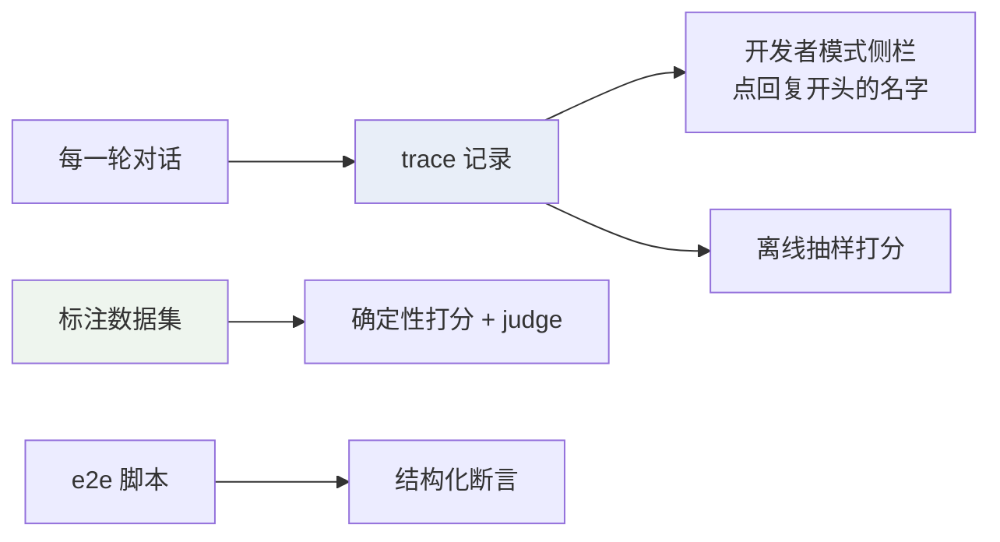
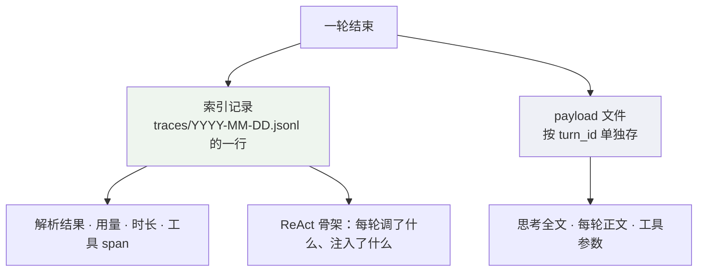
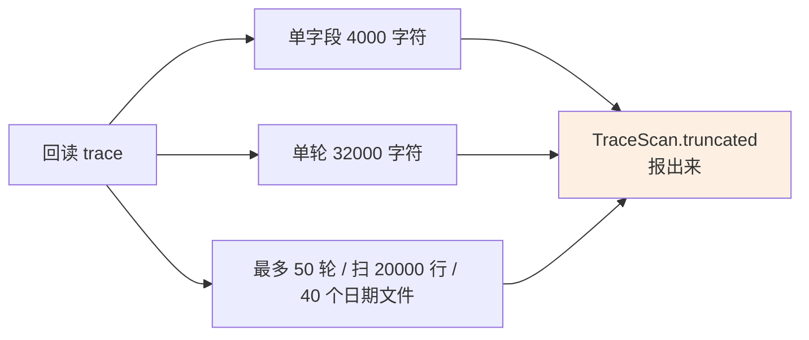
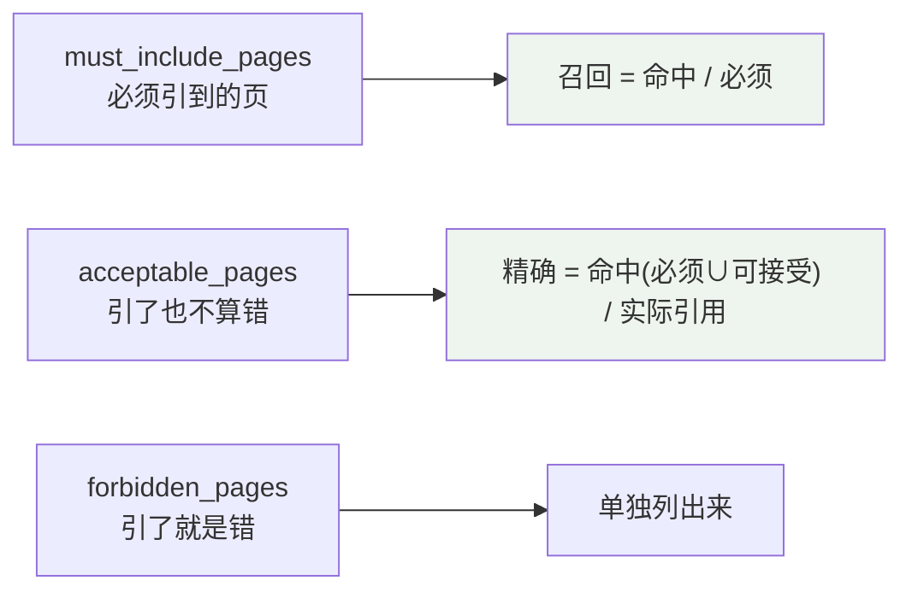
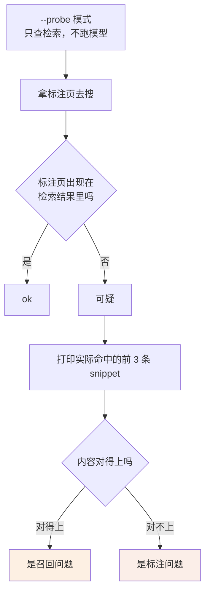
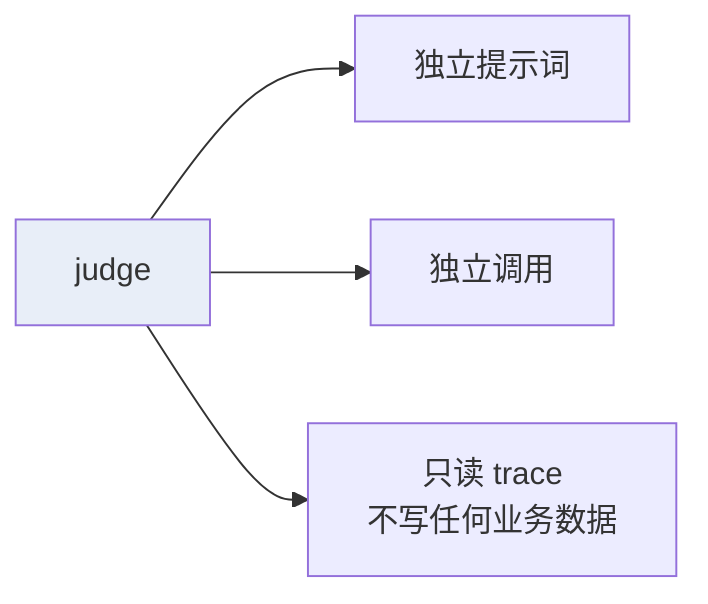
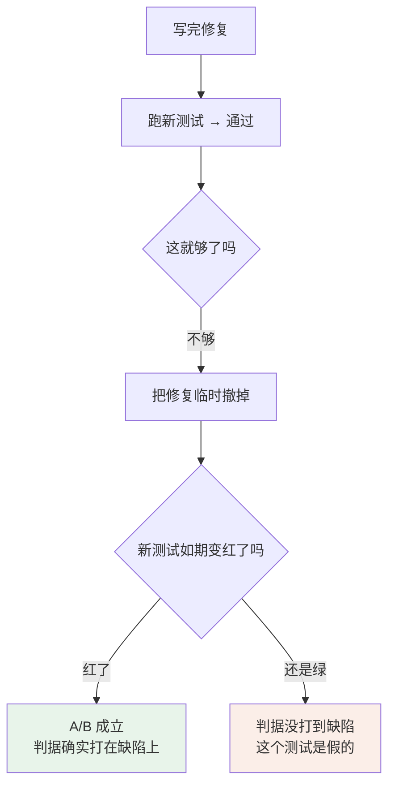

# 评测系统

Agent 跑起来不难，难的是**知道它有没有变好**。

改一句提示词，回答"看着更顺了"——这不算证据。这份文档讲这个项目怎么把"变好了"变成可以核对的东西：先让每一轮都留下痕迹（可观测），再让"好"有可判定的标准（评测）。

覆盖的代码：

| 文件 | 职责 |
| --- | --- |
| `backend/modules/agent/trace.py` | 每轮的完整记录 |
| `backend/app/http/devtools.py` | trace 回读接口 |
| `evals/dataset.yaml` · `scripts/eval_dataset.py` | 标注数据集与打分 |
| `scripts/evaluate.py` | 从 trace 抽样、judge 打分 |
| `scripts/e2e_*.py` · `benchmark.py` | 真实链路的结构化断言 |
| `scripts/e2e_wiki/` · `verify_wiki_browser.py` | 知识页的三臂对照评测与界面验证 |

相关：[Agent 循环](Agent%20循环.md) 讲 trace 里记的那些字段是怎么产生的。

---

## 一、先有痕迹，才谈评测



---

## 二、trace：一轮一条 JSONL



**长字段搬出索引**是关键设计：思考与每轮的话都是整段文本，留在索引里会让一行 JSONL 涨到几十 KB，而回读要逐行 `json.loads`。

实测效果：正文内联 303,610 B → 按需拉 2,021 B。

### 记什么

| 层 | 内容 |
| --- | --- |
| turn | 课程解析、供应商与模型、token 用量、工具轮次、时长、失败码 |
| ReAct | 每次模型调用的思考、正文、发起的调用、注入了什么、`finish_reason` |
| 工具 span | `call_id` · `round` · `origin` · `decision` · `reason` · `duration_ms` |
| 补救标记 | `plan_reminder` / `memory_reminder` / `choices_reminder` / `practice_reminder` |

**失败的轮也落 trace**。走不到回答（中断、抢占、异常）时已经跑过的几步仍然是排查线索。未走到终态默认记成 `client_disconnected`，避免只留一个 `failed`。

### 上限撞到了必须说出来



存不下就整段不存，**长度照报**——界面据此说得出"这里少了多少"。静默截断会让人以为看到的就是全部。

同样的原则用在 payload 上：坏 JSON 归成 `invalid` 并在界面标出来，不假装它不存在。

---

## 三、评测的三层

| 层 | 手段 | 覆盖 | 盲区 |
| --- | --- | --- | --- |
| ① 结构化断言 | `e2e` / `benchmark` | 真实链路跑通；断言工具调用、SSE 事件、落库数据 | 答得对不对看不出来 |
| ② trace 抽样 | `evaluate.py` | 从真实 trace 抽样，judge 打三个维度的分 | 没有标注可比，分数没有基线 |
| ③ 标注数据集 | `eval_dataset.py` | 36 个样本，有参考答案：标准回答要点 · 正确页码 · 工作流程约束 | — |

三层各有各的盲区，**只有第三层能回答"答得对不对"**。

### 断言只看结构化行为

e2e 脚本的断言不碰回答措辞——模型换个说法不该让测试假失败。

这条踩过七次坑，都是"把模型的一种合法做法当成唯一正确做法"：

| 写错过的断言 | 为什么错 |
| --- | --- |
| "周末条目要清空" | 留一条"出差跳过"占位也对 |
| "原标题要还在" | `plan_update` 的契约就是整段重写 |
| "条目数不能变少" | 合并天数并提高每日时长也对 |
| "第三轮必须写计划" | 第二轮信息够了当然可以早写 |

判据要落在**用户能感知的性质**上：计划里有没有这门课的全部内容、周末有没有学习任务。不要落在条目数、标题文本、发生在第几轮这些实现细节上。

---

## 四、标注数据集：四个判定点，两个不用模型

| 维度 | 判据 | 要花额度吗 |
| --- | --- | --- |
| 检索来源是否合理 | 实际引用页 vs 标注页码 | 确定性，不花 |
| 工作流程约束 | `must_call` / `must_not_call` / 次数上限 / 依赖顺序 | 确定性，不花 |
| 答案是否正确 | judge 逐条判要点覆盖 | 要 judge 模型 |
| 路径绕不绕 | judge 打 1-5 分 | 要 judge 模型 |

开 judge 时每个样本发**两次**模型调用：一次判答案要点覆盖，一次判工具路径绕不绕。`--no-judge` 只跑上面两个确定性维度，不花额度，适合进常规检查。

要留意的是"工作流程"被拆在了两边：`must_call` / `must_not_call` / `max_tool_calls` / `required_order` 这些硬约束是确定性判定，"这条路径是不是绕了"由 judge 打分。

### 召回与精确怎么算



几个刻意的处理：

- **只数教材引用**。知识页是转述稿、没有页码，混进来会把按标注页码算的精确度拉低，改造前后的数字就不可比了。它单独一列。
- **越界不靠标注**。固定课程的会话引到别门课的切片就是越界，直接判定，不需要人工标 `forbidden`。
- **没有 must 的样本**（教材里本来就没有）按"引了不该引的才算错"判。
- **按 `(文档, 页)` 比**，不只比页号——一门课有多份切片，页码各自从 1 开始。

### 工具调用按 `tool_result` 数，不按 `tool_call`

种子检索只发 result 不发 call。只看 call 会把"靠种子检索拿到证据"误判成一次都没查。

### 数据集自身的完整性

`materials` 记了每份切片教材的 sha256。内容一变，标注的页码就失效——脚本直接报错退出，不带着过期标注跑出一份看着正常的分数。

---

## 五、probe：区分"标注错了"和"检索没召回"



这一步花的是零模型额度，却能挡住"数据集本身有问题"这类最浪费时间的排查。

---

## 六、judge 的隔离与局限



三个维度：`faithfulness`（标了引用的结论真能由证据支持吗）、`attribution`（概念归因对不对）、`usefulness`。

**judge 看不出的东西要心里有数。** 一个实测例子：知识页第一次评测显示"没有收益"，逐条核对后发现——唯一读了知识页的那一轮，回答内容确实更准（基线两遍都写错"章末还剩两条假设没解决"，读页那次写对了），**judge 看不出这个差别**。

所以关键结论要有**可确定性判定的事实锚点**：判"那个远处的事实有没有出现在回答里"，不用 judge。

知识页最后就是这么测的：`scripts/e2e_wiki/` 在一门课上并四份重叠教材，跑三臂——开知识页、不开、不开但把证据量补齐——同一批题各跑几轮，`judge.py` 离线按要点覆盖与引用出处判，一次 judge 调用都不发。`probe.py` 是它的前置检查（页数对账、知识页有没有到场、证据段是不是零），三条全绿才值得把整批题跑完。

---

## 七、A/B：这个项目最硬的一条规矩

> A/B 不能只跑一遍看没报错。要构造出原来的故障态，证明修复前失败、修复后通过。



### 假绿的几种形态，都真实发生过

| 形态 | 案例 |
| --- | --- |
| **判据比缺陷粗** | 同一故障态下页码判据 66/66 全过、分片判据 66/140 才红。"知识页超上限丢内容"一直测不出来就是这个原因 |
| **注入没生效** | `replace(..., 1)` 打在了同名的另一个方法上，A/B 两侧跑的是同一份代码 |
| **测到函数没测到接线** | 给 span 加了 `call_id` 也写了测试，但 `_SPAN_FIELDS` 没带上它、HTTP 路径整条是死代码——测试手搓了一个带 `call_id` 的视图喂给辅助函数 |
| **走了别的路径** | 撤掉修复仍全绿，因为那条查询走了 FTS，而知识页从不进 FTS，泄漏路径根本没被走到。改成 2 字查询逼它走 LIKE 兜底才立住 |
| **对照组恰好挡住了 bug** | A/B 时选的对照课程恰好 0 个会话，"列表为空时不清理"那道防线把 bug 挡住了，两版结果一样 |
| **模式永不出现** | 判据写 `snap.count("- button:")`，而无名按钮在快照里是 `- button`（无冒号），这个模式永远不出现、判据恒绿 |

### 门自己也要 A/B

`check.sh` 里的检查脚本本身也是代码，也会假绿：

- CSS 变量检查第一版正则只匹配行首定义，而 `:root` 里变量是几个挤一行的，误报 6 个"未定义"；
- 扩展成也扫 JSX 之后，前缀规则 `[\w-]*` 允许捕获空串，任何 `var(--${name})` 都会捕到 `"--"`，而每个 token 都以 `--` 开头 → "定义了但没人用"永久变绿。

**写完门，要把它该防的那件事真做一遍，看门是否如期红。**

### 条数闸

`EXPECTED` 条数断言值得抄：跳过分支会缩小分母，让"42/42 通过"看着像成功。一轮验证里它拦下过三次条数写错。

### 别人的报告也要 A/B

有一次 subagent 报告称覆盖了某个 key，把 key 改成错名跑全量测试——329 个全过。

**验收结论要用 A/B，不是读报告。**

---

## 八、常规检查

```bash
./scripts/check.sh
```

它按顺序跑：后端全量 pytest → `compileall` → 源码不许出现中文（文案必须走 i18n）→ i18n key 对账 → CSS 变量双向检查 → 前端 `typecheck` / 中文加粗渲染门 / `build`。

有一条要知道：**`check.sh` 不扫文档**。文档写错门不会红——这就是架构文档能长期停在"描述一套不存在的实现"的原因。

真模型的端到端另起一套实例跑，不用开发库：

```bash
CP_PORT_OFFSET=1 STORAGE_DATA_DIR=testdata/e2e ./scripts/dev.sh
```

---

## 九、设计取向

- **先有痕迹。** 没有 trace 就没有抽样，没有抽样就只能靠感觉。失败的轮同样要留痕。
- **能确定性判的不用模型。** 三个维度里两个不花额度，事实锚点比 judge 打分可靠。
- **判据要打在缺陷上。** 判据比缺陷粗，等于这个测试不存在。撤掉修复看它红不红是唯一的验证方式。
- **上限撞到了要说出来。** trace 截断、数据集哈希失配、覆盖率不足，全部显式报出来。静默的完整和静默的残缺长得一样。
