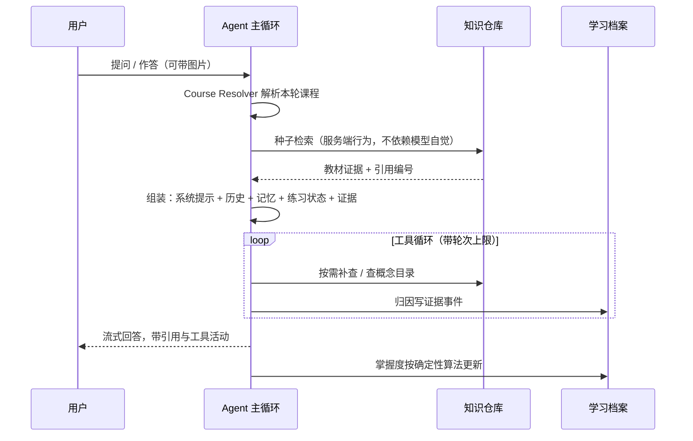

# CoursePilot 2.0

> 有状态的 AI 课程私教。上传教材，它就成为这门课的助教——回答带页码引用、出题并批改、
> 按概念记住你哪里会哪里不会。

## 为什么做

市面上单点能力都有成熟产品，缺的是闭环：

| 产品 | 会什么 | 缺什么 |
| --- | --- | --- |
| NotebookLM | 从资料生成 study guide、quiz | 不知道你学得怎么样 |
| Gauth / Photomath | 拍照解题 | 每次解题都是孤立事件，没有课程上下文 |
| 通用 Chat | 什么都能聊 | 没有教材边界，答案无从核对 |

CoursePilot 的护城河是**每个输入都更新系统对你的理解，每个输出都基于这份理解**：

```
提问 / 拍照 / 做题 ──→ 证据事件 ──→ 掌握度更新 ──→ 出题与计划按弱项调整
                                        │
                              下一轮对话读取这份状态
```

一句话：**学习档案是大脑，计划是心跳，教材是唯一事实来源。**

## 现在能做什么

```
┌─────────────┬────────────────────────────────────────────────────┐
│ 对话        │ 通用模式自动解析课程 / 课程工作区固定课程            │
│             │ 回答先取教材证据，引用带文件名与页码，可点开看原文    │
│             │ 教材里没有的内容明确标注「以下不是当前教材结论」      │
├─────────────┼────────────────────────────────────────────────────┤
│ 知识仓库    │ PDF / TXT / MD 上传 → 解析 → 切块 → 向量 → 索引     │
│             │ 语义（BGE）+ 词面混合检索，中文问题能命中英文教材     │
│             │ 索引后自动生成概念目录，作为归因的 ID 真源           │
├─────────────┼────────────────────────────────────────────────────┤
│ 练习        │ 出题 → 作答 → 逐题批改 → 概念归因 → 变式题          │
│             │ 题目基于教材证据，答案要点对用户不可见               │
│             │ 拍照上传手写解答走同一条批改路径                     │
├─────────────┼────────────────────────────────────────────────────┤
│ 学习档案    │ 按概念的掌握度（BKT × 遗忘曲线）与复习到期日         │
│             │ 证据不足时显示「数据不足」而不是编一个百分比          │
│             │ append-only 证据事件流，掌握度可从事件重放重建        │
├─────────────┼────────────────────────────────────────────────────┤
│ 长期记忆    │ 跨课程画像 + 课程情景记忆，markdown 可读可编辑        │
├─────────────┼────────────────────────────────────────────────────┤
│ 可观测      │ 每轮一条 JSONL trace；冒烟 benchmark、judge 抽样、   │
│             │ 掌握度曲线回放三层评测                              │
└─────────────┴────────────────────────────────────────────────────┘
```

技术栈：Python 3.11+ / FastAPI / SQLite（标准库）+ React / TypeScript / Vite。
本地单用户形态，前后端同机运行，不依赖任何托管服务。

## 模块设计思路

### 一次对话怎么走完



关键取舍：**先检索再回答是系统行为，不是模型的自选项**。每轮开始服务端就用用户原话查一次教材，结果以工具调用的形态注入——模型要补查时自然复用同一工具，不需要它"想起来"该查资料。

### 课程边界

```
通用会话 ──每轮解析──→ 一门课          课程会话 ──固定──→ 一门课
              │                                    │
              └──── 工具只接受服务端解析出的 scope ────┘
                    模型无法自己指定 course_id
```

无法唯一确定课程时先问用户，绝不跨课程取证。课程名互相包含时（"深度学习" / "深度学习进阶"）取更具体的那个，两个不相关课程同时出现才算真歧义并列出候选。

### 掌握度：LLM 只归因，数值不由模型给

这是与 1.0 最大的区别。1.0 让模型直接输出分数写进记忆，模型的幻觉会直接污染学习状态。2.0 把职责切开：

```
              模型能做的                        模型不能做的
  ┌──────────────────────────────┐   ┌────────────────────────────────┐
  │ 这道题考的是哪个概念（从目录选）│   │ 掌握度是多少                    │
  │ 用户答对了还是答错了            │   │ 什么时候该复习                  │
  └──────────────┬───────────────┘   └────────────────────────────────┘
                 │                              ▲
                 ▼                              │
         evidence_events (append-only)   BKT + FSRS 确定性计算
```

- 概念必须来自教材索引后生成的概念目录，目录外的一律记 `unattributed` 进人工补录队列——这道闸挡住幻觉概念污染档案。
- 追问、用户自述这类主观信号只入事件流，不参与数值。
- 少于 3 个可归因客观证据时对外显示「数据不足」，不给强弱判断。
- 掌握度是投影而非真源，算法改版后可从事件流全量重建，并用回放脚本对比新旧曲线。

### 练习为什么做成 skill

出题、批改、讲评、变式题共享同一套上下文（题目、答案要点、用户原文都要留在对话里被追问），所以是一个 skill 而不是四个 Agent，也不是独立 subagent。

```
系统提示只带一行摘要 ──use_skill──→ SKILL.md 正文注入 ──→ 工具集收窄到规程声明的范围
```

但**提示词能表达要求，不能保证执行**。实测只靠 SKILL.md 约束时，冒烟用例通过率约 2/3——模型会跳过归因、漏写题目、批改完不闭合状态，每一处漏掉都让闭环断链。因此加了三层服务端保障：

| 保障 | 解决的失效 |
| --- | --- |
| 规则预路由 | 模型不主动加载 skill，导致作答无题可批 |
| 规程校验补救 | 只归因第一道题就收尾，多题练习丢数据 |
| 状态闭合 | 漏写批改记录，同一道题被反复计入掌握度 |

补齐后 8/9。剩余一项（变式题落盘）在不同运行间摆动，作为已知上限记录，不做侵入式兜底。

### 知识仓库：证据层与理解层分开

```
教材 PDF ──解析──→ 切块 ──┬──→ BGE 向量 ──┐
                          └──→ FTS 词面 ──┴─RRF 融合─→ 带页码的引用
                                    │
                                    └──→ 概念目录（纯规则抽取，可重放）
```

概念目录不调模型：从标题层级与正文强调取候选，剔除跨页页眉、公式碎片与 PDF 乱码，`concept_id` 由课程加名称哈希得出，因此重放和增量索引都不会改动已有 id。

Course Wiki 是可选的理解层，默认关闭，只有用户显式触发才生成，失败不影响 RAG。

### 记忆：定性与定量分工

```
data/
├─ coursepilot.db          定量：证据事件、掌握度投影、会话、计划
├─ user.md                 定性：跨课程画像（讲解偏好、长期目标）
└─ courses/<id>/memory.md  定性：学到哪、遗留问题、与用户的约定
```

markdown 里只写叙述，掌握度数值、错题记录与复习排期永远只在事件流里。Agent 通过 `memory_patch` 只改 marker 之间的受管区块，用户手写的段落不会被覆盖。

### 可观测与评测

```
每轮对话 ──→ trace JSONL（索引）+ payloads/（原文，可单独删除）
                 │
     ┌───────────┼───────────────┐
     ▼           ▼               ▼
  benchmark   judge 抽样    掌握度回放
  结构化断言   三维打分      曲线对比
  不看文本     按提示词版本   区分数据变化与算法变化
```

benchmark 断言的是 SSE 事件与档案增量而不是回答文本，所以模型换措辞不会造成假失败。judge 的评分按 `prompt_version` 聚合，改提示词后新旧版本分别可比。

## 边界：不做什么

播客音频、通用闪卡产品、泛化每日简报、整卷模拟考试、社交对战、多租户商业化。
通用会话也不会在同一轮里跨多门课读写——无法解析唯一课程时必须先问。

## 想深入看

| 文档 | 内容 |
| --- | --- |
| [产品设计](coursepilot-2.0.md) | 定位、功能模块、分期规划、非目标 |
| [技术架构](coursepilot-2.0-architecture.md) | 模块边界、LLM 接入层、Skill 体系、存储、掌握度实现、评测分层 |
| [前端设计](coursepilot-2.0-frontend-design.md) | 视觉方案、信息架构、核心页面、组件与状态 |
| [开发中](开发中.md) | 当前进度、任务清单与优先级、开发工作流与踩过的坑 |
| [端到端测试](coursepilot-2.0-e2e-browser-test.md) | 浏览器回归清单，20 个步骤覆盖全部验收项 |
