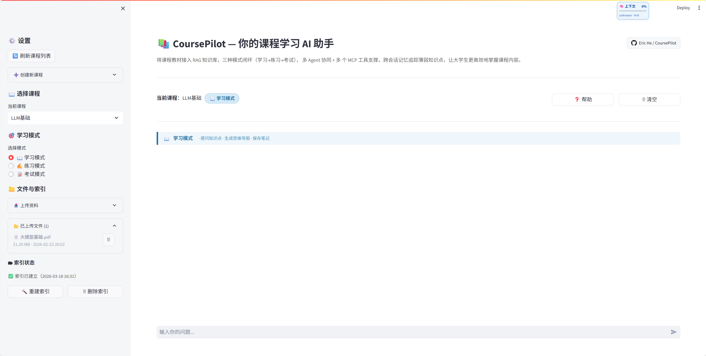

# CoursePilot-面向大学课程学习场景的智能体学习平台

      

CoursePilot 是一个面向大学课程学习场景的智能体学习平台，目标是把“教材接入 -> 概念讲解 -> 练习生成 -> 考试评卷 -> 错题记忆”做成一条可追踪、可评测的学习闭环。

通用 Chat 应用通常擅长回答单个问题，但很难稳定处理课程材料引用、多轮学习状态、练习/考试、工具权限和质量回归。CoursePilot 将多 Agent 编排、教材级 RAG、长短期记忆、MCP 工具治理组合在一起，让系统既能围绕教材回答问题，也能持续跟踪学习过程，并用可追溯证据约束回答质量。



## Core Capabilities

- 多 Agent 协作：Router 理解意图并制定计划，Tutor 负责讲解，QuizMaster 负责出题，Grader 负责评分与反馈。
- 教材 RAG：支持课程材料解析、切块、向量索引、BM25 + dense 混合检索，并在回答中展示来源页码和证据片段。
- 学习闭环：覆盖 `learn / practice / exam` 三种模式，从讲解到练习、考试、评分、记录沉淀在同一系统内完成。
- 记忆系统：服务端维护会话状态、用户画像和情景记忆，用于多轮学习连续性和个性化反馈。
- 工具系统：通过 MCP 与 ToolHub 管理搜索、计算、文件写入等工具，统一做权限、预算、去重和失败处理。
- 评测系统：内置 benchmark、LLM-as-a-Judge 和 review 队列，用客观指标与主观评分跟踪系统质量。

## Quick Start

### 1. 安装依赖

推荐使用 Python `3.11`。

```bash
py -3.11 -m pip install -r requirements.txt
```

### 2. 配置 `.env`

在项目根目录创建 `.env`，最少需要：

```bash
OPENAI_API_KEY=...
OPENAI_BASE_URL=https://api.openai.com/v1
DEFAULT_MODEL=gpt-4o-mini
```

如果需要 judge 模型、运行治理参数或完整环境变量说明，请看 [配置总览](docs/guides/config-overview.md)。

### 3. 启动系统

```bash
# 终端 1：后端
py -3.11 -m backend.api

# 终端 2：前端
streamlit run frontend/streamlit_app.py
```

默认后端端口 `8000`，前端端口 `8501`。

### 4. 上传教材并构建索引

推荐直接通过前端完成：

1. 创建或选择课程
2. 上传教材文件
3. 点击“构建索引”
4. 开始学习 / 练习 / 考试

如果你需要批量重建所有课程索引：

```bash
py -3.11 scripts/rebuild_indexes.py
```

## How It Works

对外，CoursePilot 提供三种学习模式：

- `learn`：解释概念、回答问题、引用教材
- `practice`：生成练习题并评分讲评
- `exam`：生成试卷并完成一次性评卷

对内，系统不会直接把模式映射到单一函数，而是先由 `Router` 生成计划，再进入受控模板执行。当前核心执行思路是：

- `workflow_template`：决定本轮是“只讲解”、“只出题”还是“出题后评分”等路径
- `ExecutionRuntime + TaskGraph`：把计划编译成可观测、可回退的执行步骤
- `RAGService + MemoryService`：负责教材证据和历史记忆预取
- `ToolHub`：统一工具门控与审计

更详细的执行链路见 [架构文档](docs/guides/architecture.md)。

## Repository Layout

```text
course-pilot/
├─ backend/                  API 与 SSE
├─ frontend/                 Streamlit UI
├─ core/                     Agent 编排与运行时
│  ├─ agents/                Router / Tutor / QuizMaster / Grader
│  ├─ orchestration/         Runner、Plan、SessionState
│  ├─ runtime/               ExecutionRuntime、TaskGraph
│  ├─ services/              RAG、Memory、ToolHub
│  ├─ llm/                   LLM client 与工具轮
│  └─ metrics/               运行指标
├─ rag/                      解析、切块、索引、检索
├─ memory/                   长期记忆与用户画像
├─ mcp_tools/                MCP 与工具实现
├─ scripts/                  索引、评测、worker 脚本
│  ├─ eval/                  bench / judge / review
│  ├─ perf/                  性能脚本
│  └─ workers/               后台 worker
├─ benchmarks/               benchmark 与 gold 数据
│  └─ archive/               历史数据集
├─ tests/                    回归测试
├─ docs/                     项目文档
│  ├─ guides/                指南文档
│  ├─ examples/              示例
│  ├─ reviews/               审阅报告
│  ├─ internal/              内部资料
│  └─ archive/               历史归档
├─ data/                     本地运行产物
└─ artifacts/                本地实验材料
```

## Read More

README 文档只是一个快速启动和项目概览，更多细节和设计思路请看这些文档：

- [架构说明](docs/guides/architecture.md)
- [配置总览](docs/guides/config-overview.md)
- [Prompt 设计](docs/guides/prompt-design.md)
- [使用手册](docs/guides/usage.md)
- [贡献说明](docs/guides/contributing.md)

## FAQ

### 它和普通 RAG 问答项目有什么不同？

重点不只是“把文档喂给模型”，而是把教材证据、练习/考试链路、状态管理、工具治理和动态评测放进同一个工程体系里。

### 可以只把它当教材问答系统来用吗？

可以。你完全可以只用 `learn` 模式；练习、考试和评测链路是增量能力，不强制依赖。

## License

MIT
