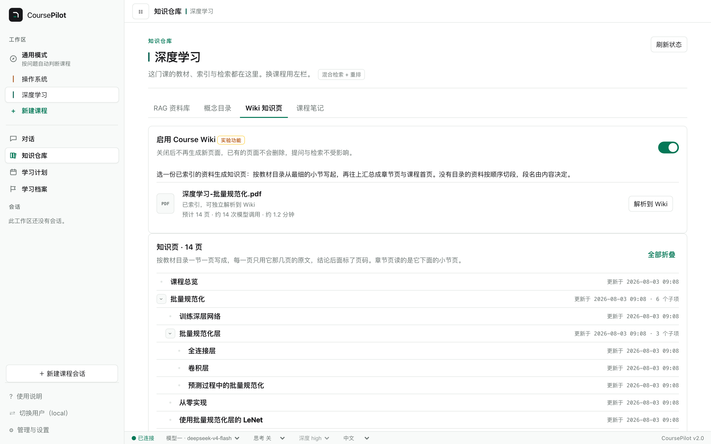
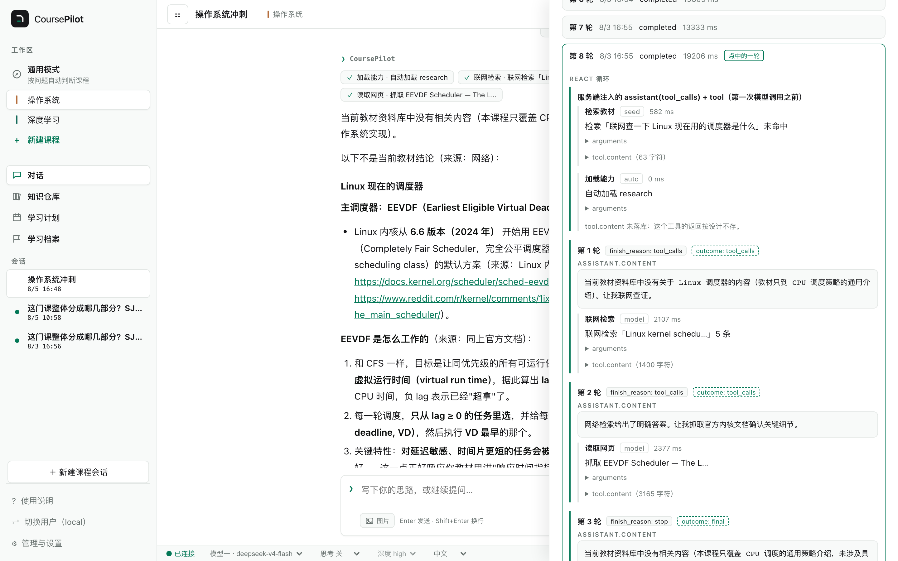
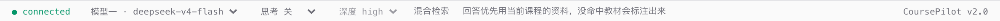
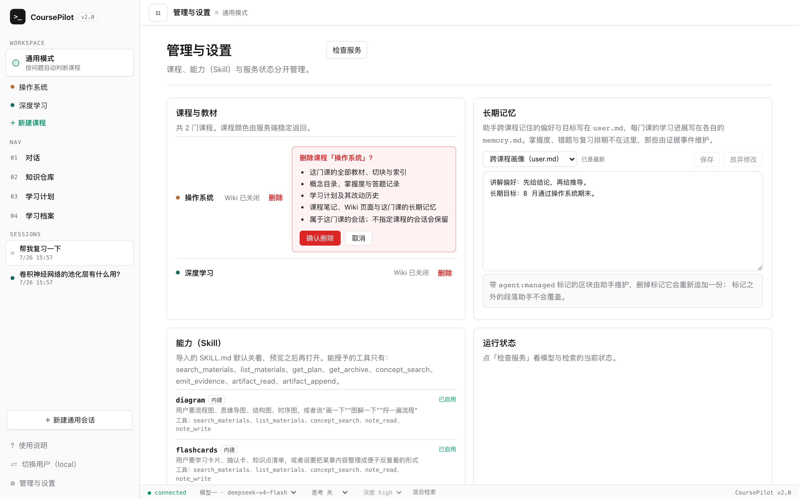

# CoursePilot

**English** · [简体中文](README.zh-CN.md)

**Upload your course's textbooks and get a learning agent that remembers how far along you are**,
now at version 2.0. Every conclusion traces back to a textbook page, the problems you work through
accumulate into per-concept mastery, and the plan adjusts to that mastery.

It decides on its own what to look up this turn, which procedure to load, whether to write to the
plan, the notes or its memory, and asks a clarifying question when it does not have enough to go
on; steps that should have happened but did not are caught by the server and filled in afterwards.
Underneath is a complete agent harness — [the list is here](#whats-in-the-harness).

A personal open-source project. Runs locally. Works with any model service that speaks OpenAI Chat
Completions.


## How this differs from "feeding a textbook to a chat tool"

Three things make it an agent rather than a Q&A box:

**1. Answers have sources, and the sources can be checked.** Every conclusion is tagged with the
textbook filename and page number; click it and you see the original excerpt. Content that is not
in the textbook is explicitly marked "the following is not a conclusion from the current textbook",
and material fetched from the web carries a separate marker. Three kinds of source share one
numbering scheme and are listed in one panel at the bottom — one row each, a colored stripe on the
left for the kind and the location in its own column: a textbook passage with its page, a course
wiki page (a paraphrase, labeled as one, carrying the textbook pages it was written from), and a
web link — so you always know where a sentence came from.

**2. Mastery is computed, not stated by the model.** The problems you have done accumulate as
evidence events attached to concepts, and the numbers come from a deterministic algorithm (BKT
posterior × FSRS forgetting curve); the model only judges which concept a problem tests. A concept
without enough evidence shows "not enough data" instead of an invented percentage. The answer log
is append-only, so mastery can be recomputed from it at any time.

**3. Procedures are backed by the server, not by the prompt alone.** A prompt can express a
requirement; it cannot guarantee execution — with `SKILL.md` as the only constraint, the practice
loop closed on 6 of the 9 smoke cases: the model would skip concept attribution, fail to
save the problem, or leave the state open after grading. So the side effects that have to happen —
creating the problem, scoring it, attributing it — are verified by the server, and a missing one is
repaired.

## Install

Open this project link in Claude Code or Codex and say:

```
Install this project for me
```

[AGENTS.md](AGENTS.md) in this repo spells out the steps, the dependencies and the key
configuration points, and the agent can just follow it.

Requirements: Python 3.11+, Node 18+ and pnpm:

```bash
python3 -m venv .venv
.venv/bin/python -m pip install -r backend/requirements.txt
cd frontend && pnpm install && cd ..
cp .env.example .env        # fill in your model service details
./scripts/dev.sh
```

Open `http://127.0.0.1:5173` and enter any username. Each username gets its own separate data.


### Configuring a model

These five entries in `.env` decide whether the model is really called:

```
TEXT_PROVIDER=            # just a display name, put anything
TEXT_BASE_URL=            # everything up to, but not including, /chat/completions
TEXT_API_KEY=             # your own key
TEXT_MODEL=               # model id
COURSEPILOT_ENABLE_REMOTE_LLM=1
```

Any service speaking OpenAI Chat Completions or the Responses API works — set
`TEXT_PROTOCOL=responses` for the latter, and point `TEXT_BASE_URL` at everything before
`/responses`. Either way the service has to support streaming and function calling,
otherwise the tool loop cannot run. Vendor-specific parameters go through `TEXT_EXTRA_BODY`:

```
TEXT_EXTRA_BODY={"thinking":{"type":"disabled"}}
```

When the entries are incomplete or the switch is 0 the service still starts, and answers are
produced by a local fallback and labeled as such — which avoids burning your quota by accident.

`VISION_*` has to be set before you can ask questions with a photo or turn a scanned PDF into text;
`RESEARCH_SERPAPI_API_KEY` has to be set before the web tools are handed to the model. Both are
optional. `VISION_CHAT_MODEL` is only for photo questions and falls back to `VISION_MODEL` when
left empty — a dedicated OCR model copies text page by page, while handwriting, figures and page
layout need a general multimodal model.

### If you want to see it working first

```bash
.venv/bin/python scripts/example_setup.py
```

Downloads one public textbook (about 120 KB), creates a course and builds the index, all under the
username `example`. Log in as that user and there is something to ask about. The textbooks are not
in the repo; the script downloads them from their own official sites.

## What it can do

**Cited answers.** Each turn starts by working out which course the question belongs to, then
searches within that course's material. When it cannot narrow it down to a single course it asks
you first, and never guesses across courses. Retrieval is a hybrid of semantic vectors and
keywords, so a Chinese question can hit an English textbook, and it runs over two bodies of text at
once — the textbook passages and the course's own wiki pages — on fixed seats, so neither can crowd
the other out.

**A wiki the model writes for itself.** Turn it on for a course and the textbook's own table of
contents gets walked bottom-up: each leaf page reads the passages in its own page range, each
intermediate page reads its children, and the root writes the index. There is no retrieval anywhere
on that path, so nothing is left out because a similarity score came in low. The pages then become
the third kind of citable source, and the course's structure sits in the context of every turn — so
"how does this course break down" is answerable without looking anything up. You are told how many
model calls a build will take before it starts.



**You can see what it is doing.** Which tool it used, what it searched for, how many passages it
hit, how long it took — all shown. A step that failed is shown too, not skipped quietly.


**Developer mode.** Flip the switch in settings and the agent's name at the top of a reply becomes
clickable; confirm and a panel slides out from the right carrying that turn's whole trace. It leads
with the ReAct loop — round by round, the `reasoning_content`, the `assistant.content`, the
`tool_calls` it emitted and the `finish_reason` the provider actually returned — and folds the
statistics (course resolution, usage, raw fields) in below. A tool's `content` is fetched only when
you open that step, which keeps the listing at about two kilobytes instead of three hundred. With
the switch off the name is plain text and there is no button on the page at all.



**Five built-in skills.** They load automatically when you say the corresponding thing,
with no need to pick one by hand:

| Capability | When to use it |
| --- | --- |
| `practice` | Practicing problems, submitting answers, asking for a walkthrough or a variant |
| `flashcards` | Study cards, flashcards, a checklist of key points |
| `diagram` | Flowcharts, mind maps, sequence diagrams |
| `mistake_review` | Reviewing wrong answers, finding weak spots |
| `research` | Looking up material outside the textbook, in-depth research |

You can also import skills you wrote yourself: a single `SKILL.md`, a zip containing one, or a
directory picked directly. Reference files that come with it are merged into the procedure; an
imported skill is off by default, and its permissions are narrowed by an allowlist.

Diagrams are rendered straight to SVG and can be downloaded:


**Study plans.** Ask for a plan in the conversation and the assistant writes it in. Every change
bumps a version, and past entries are left alone. A Gantt chart at the top shows the rhythm of the
whole cycle; below it the plan is split by day, with today highlighted.


**Learning record.** See mastery by concept, along with every piece of evidence behind it, and a
mistake book that keeps the tally per concept — a concept leaves it after two correct answers in a
row.


**Course notes.** Finished cards and write-ups are stored as markdown and can be read in the UI.


**Visible context.** Next to the input box you see how much of the window this turn takes up; expand
it for the token estimate of each section. Six partitions each hold their own cap, so one long
section cannot eat another's room. History that gets too long is compressed into a summary
automatically.


**A help page.** Its lists and capabilities are read from the actual state of the running instance.


**Switch model and thinking level whenever you want.** Four dropdowns in the bottom status bar:
model, thinking (off / auto / on), thinking depth, and interface language. Configure as many models
as you like by continuing the numbering in `.env`; a second model from the same provider only needs
one line with its model id. The language dropdown moves the interface only — an answer follows the
language you typed the question in.



**Data can be deleted completely.** Hover a conversation in the sidebar to rename or delete it;
textbooks are deleted in the knowledge base, courses on the management page. Note that the
knock-on effects are listed before the deletion — deleting a course takes its textbooks, concepts,
mastery, plan, notes and conversations with it.



## What's in the harness

Learning is only the scenario. What follows is the part that makes an agent reliable on real tasks,
and any other domain needs it just the same.

**Tool loop.** 22 tools registered, graded by side effect into six capability tiers — read course,
write state, write notes, network, delegate, no side effect — plus a seventh that every tool from a
connected MCP server lands in. The ones that cost money and the ones that
change user data get their own call limits. Within one turn, read tools with identical arguments
reuse the result and write tools do not — answer three problems on the same concept in a row and
the arguments for writing evidence are word-for-word identical. When the turn budget runs out the
model has to be told explicitly to "stop calling tools and wrap up with what you have", otherwise
it emits tool calls as body text.

**Permissions are replaced wholesale, not unioned.** Once a skill activates, the complete tool set
it declares is what applies; declaring is granting. Two baseline tools (write memory, ask the user)
are added back to every profile — they are useful across procedures and touch no data. Imported
third-party skills are narrowed by an allowlist, and asking for more than allowed fails at
registration time instead of being silently downgraded at run time.

**Outside tools arrive under the same rules.** Connect a Streamable HTTP MCP server and its tools
join the model's tool set under an `mcp__<slug>__<tool>` namespace, in a capability tier of their
own. The tool list is snapshotted at connect time, so a server cannot swap in something different
later; its descriptions and annotations are treated as untrusted text, and the URL is checked
against private address ranges and cloud metadata endpoints before anything is sent.

**Server-side procedure backstop.** What point 3 above describes uses the same pattern in four
places: the practice procedure has steps left undone, the user asked for the plan to change but the
plan-write tool was never called, the user said "remember this" but the memory-write tool was never
called, a multiple-choice question was asked but the options were not laid out as buttons — the
server detects each of these and adds one repair turn. Each one repairs only once, to avoid ending
up in a standoff with the model.

**State across turns.** Artifacts come in two tiers, public and model-private (reference answers go
in the private tier and are never shown in the UI); long-term memory is a managed block of
markdown, in which the model can only change its own part.

**Context budget.** The window is split into six partitions — system, current question, history,
knowledge, evidence, skill — each with its own token cap, all derived from one setting, so moving to
a model with a smaller window is a one-line change. Tool definitions and the model's own reasoning
count towards the total; on one measured turn the provider reported 4,726 prompt tokens against the
3,424 we were reporting before they were included, and the tool definitions on their own come to
2.2× the system prompt. Every section is reported to the UI, history over the
threshold is compressed into a summary rather than discarded, and the whole-turn total is re-checked
on every round of the tool loop, since each round appends more.

**Clarifying questions take a new turn.** Options are rendered as buttons, and clicking one is the
same as sending a new user message. "Pause this turn and wait for the human" cannot be done — a
conversation allows only one active turn at a time, and once the 60-second heartbeat expires it can
be preempted.

**Observability and evaluation.** One JSONL trace per turn, carrying `prompt_version`, the decision
behind every tool and each ReAct round as the provider returned it, with large payloads stored
separately; a tool's own output lives in the message table and is read back on demand. Evaluation
has several layers: a smoke benchmark, judge sampling, mastery replay, a dataset of fixed samples
with hard constraints, and three end-to-end scripts — one walks the full journey from an empty
database, one splits a single task across several turns to check multi-turn behavior, and one drives
the library chain from upload to wiki build. Assertions look only at structured behavior, never at
the wording of an answer; a model phrasing something differently should not make a test fail. Where
a feature's payoff has to be measured, the judge is a fact anchor that can be decided
deterministically — "did this specific distant fact make it into the answer" — rather than a model
scoring prose.

**Boundaries are guarded by tests.** The layering is `app → modules/adapters → contracts/core`,
modules see each other only through the Ports in `modules.X.api`, and a cross-layer reference makes
`test_module_boundaries.py` fail. Assembly happens in exactly one place,
`backend/app/bootstrap.py` — changing the model, the retrieval or the storage all mean editing that
one file.

## Boundaries

- **No shell execution.** A study assistant has no reason to run commands, so scripts inside
  imported skills are never accepted, and MCP servers are reached over Streamable HTTP only — the
  stdio transport would mean spawning a process.
- Tool access is graded by side effect. Imported third-party skills cannot get at the notes or the
  network, and can read the plan but not change it; the memory tool is baseline infrastructure that
  every skill gets, imported ones included
- Looking back through the session history only replays turns from the current course, so switching
  courses puts the previous one's textbook excerpts out of reach
- No full mock exams, no social competition, no multi-tenant commercialization
- No release or deployment path of any kind

## Development

```bash
./scripts/check.sh
```

Runs the whole backend test suite, the Python compile check, frontend type checking and the
production build. It needs no API key and makes no network requests.

Backend is FastAPI + SQLite (standard library, explicit migrations), frontend is React 19 +
TypeScript + Vite. Database changes always add a migration and never touch an existing entry.

| Document | Contents |
| --- | --- |
| [Project overview](Docs/overview.md) | The design thinking and trade-offs behind each module |
| [Product design](Docs/coursepilot-2.0.md) | Positioning, feature modules, phased plan |
| [Architecture](Docs/coursepilot-2.0-architecture.md) | Module boundaries, the skill system, storage, evaluation layers |
| [Frontend design](Docs/coursepilot-2.0-frontend-design.md) | Visual design, information architecture, components and state |
| [In development](Docs/development.md) | Current status, priorities, pitfalls already hit |
| [End-to-end tests](Docs/coursepilot-2.0-e2e-browser-test.md) | Browser regression checklist |

Screenshots are generated by `scripts/screenshots.py`; rerun it after a UI change. Evaluation and
end-to-end scripts are covered in [In development](Docs/development.md).

## License

[MIT](LICENSE)
