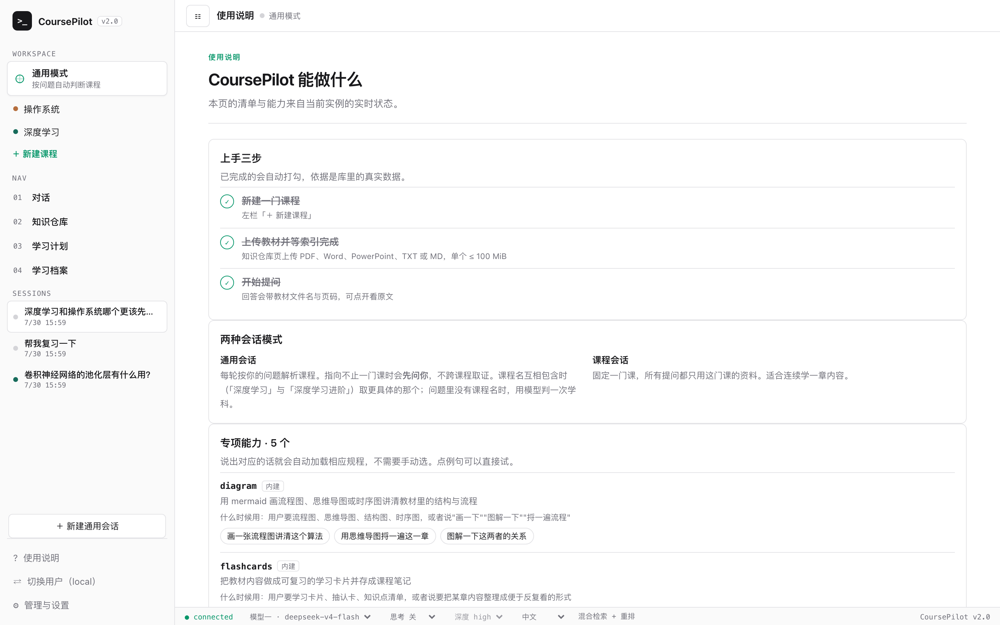

# CoursePilot

上传自己的教材，然后就这门课提问。回答带教材文件名和页码，点开能看原文。

个人开源项目，本地跑，数据不出机器。接任何兼容 OpenAI Chat Completions 的模型服务。


## 为什么不直接问通用聊天工具

问通用模型，它按训练里见过的说法答，你没法确认这句话在你的教材里是哪一页、
也没法确认它有没有编。这个项目把回答约束在你上传的资料上：

- 每一句结论都能落回教材页码，点开看原文
- 教材里没有的内容会明确标出「以下不是当前教材结论」
- 联网查来的资料带独立标记，不混进教材结论

再往上一层，它记得你学到哪：做过的题按概念沉淀成掌握度，计划按进度调整。

## 安装

最省事的办法是让编码 Agent 装。在 Claude Code 或 Codex 里打开这个目录，说：

```
帮我安装这个项目
```

仓库里的 [AGENTS.md](AGENTS.md) 写清了步骤、依赖和配置要点，Agent 照着做即可。

手动装也不复杂，需要 Python 3.11+、Node 18+、pnpm：

```bash
python3 -m venv .venv
.venv/bin/python -m pip install -r backend/requirements.txt
cd frontend && pnpm install && cd ..
cp .env.example .env        # 填入你的模型服务信息
./scripts/dev.sh
```

打开 `http://127.0.0.1:5173`，输任意用户名进入。每个用户名一份独立的数据。


### 配置模型

`.env` 里这五项决定能不能真的调模型：

```
TEXT_PROVIDER=            # 显示用的名字，随便填
TEXT_BASE_URL=            # 填到 /chat/completions 之前那一段
TEXT_API_KEY=             # 你自己的 key
TEXT_MODEL=               # 模型 id
COURSEPILOT_ENABLE_REMOTE_LLM=1
```

任何兼容 OpenAI Chat Completions 的服务都能接，包括自建的。要求支持流式和
function calling，否则工具循环跑不起来。厂商私有参数走 `TEXT_EXTRA_BODY`：

```
TEXT_EXTRA_BODY={"thinking":{"type":"disabled"}}
```

没配齐或开关是 0 时服务照样启动，回答由本地兜底生成并明确标注——避免误耗你的额度。

`VISION_*` 四项配好才支持拍照提问；`RESEARCH_SERPAPI_API_KEY` 配好才会把联网工具
下发给模型。两者都可选。

### 想先看看效果

```bash
.venv/bin/python scripts/example_setup.py
```

下载一份公开教材（约 120 KB）、建课、建索引，落在 `example` 这个用户名下。
用它登录就有东西可问。教材不在仓库里，脚本从各自官网下载。

## 能做什么

**取证问答。** 每轮先解析这个问题属于哪门课，再在那门课的资料里检索。
解析不出唯一课程时会先问你，不跨课程猜。检索是语义向量 + 关键词混合，
中文问题能命中英文教材。

**看得见它在做什么。** 用了哪个工具、查了什么、命中几段、耗时多久，都显示出来。
联网查的也会说明。


**五个专项能力。** 说出对应的话会自动加载，不用手动选：

| 能力 | 什么时候用 |
| --- | --- |
| `practice` | 要练题、提交作答、要讲评或变式题 |
| `flashcards` | 要学习卡片、抽认卡、知识点清单 |
| `diagram` | 要流程图、思维导图、时序图 |
| `mistake_review` | 要复盘错题、找薄弱环节 |
| `research` | 要查教材外的资料 |

图示直接渲染成 SVG，可以下载：


**学习计划。** 在对话里说要排计划，助手写进来。每次改动升一版，过去的条目不动。


**学习档案。** 做过的题按概念沉淀成掌握度。数值走确定性算法（BKT 后验 × FSRS
遗忘曲线），模型只负责判断这道题考的是哪个概念。证据不够的概念显示「数据不足」，
不编一个百分比。


**课程笔记。** 整理好的卡片和梳理稿存成 markdown，界面里能直接看。


**上下文透明。** 输入框旁边显示这一轮上下文占了多少，展开能看到每一段的字符数。
历史太长会自动压缩成摘要。


**使用说明页。** 清单和能力都读自当前实例的实际状态。



## 边界

- **没有 shell 执行。** 学习助手没有理由执行命令。
- 工具按副作用分级准入，导入的第三方 skill 拿不到计划、记忆、笔记与联网
- 不做整卷模拟考试、社交对战、多租户商业化
- 不含任何发布或部署链路

## 开发

```bash
./scripts/check.sh
```

跑后端全部测试（187 个）、Python 编译检查、前端类型检查与生产构建。不需要 API key，
不发网络请求。

后端 FastAPI + SQLite（标准库，显式 migration），前端 React 19 + TypeScript + Vite。
组装只在 `backend/app/bootstrap.py` 一处发生。数据库改动一律新增 migration，
不改已有条目。

| 文档 | 内容 |
| --- | --- |
| [项目介绍](Docs/项目介绍.md) | 各模块的设计思路与取舍 |
| [产品设计](Docs/coursepilot-2.0.md) | 定位、功能模块、分期规划 |
| [技术架构](Docs/coursepilot-2.0-architecture.md) | 模块边界、Skill 体系、存储、评测分层 |
| [前端设计](Docs/coursepilot-2.0-frontend-design.md) | 视觉方案、信息架构、组件与状态 |
| [开发中](Docs/开发中.md) | 当前进度、优先级、踩过的坑 |
| [端到端测试](Docs/coursepilot-2.0-e2e-browser-test.md) | 浏览器回归清单 |

截图由 `scripts/screenshots.py` 生成，UI 改了重跑即可。评测与端到端脚本见
[开发中](Docs/开发中.md)。

## License

[MIT](LICENSE)
