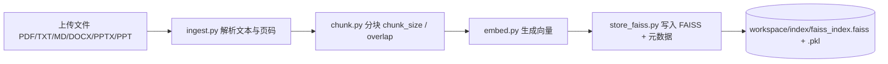
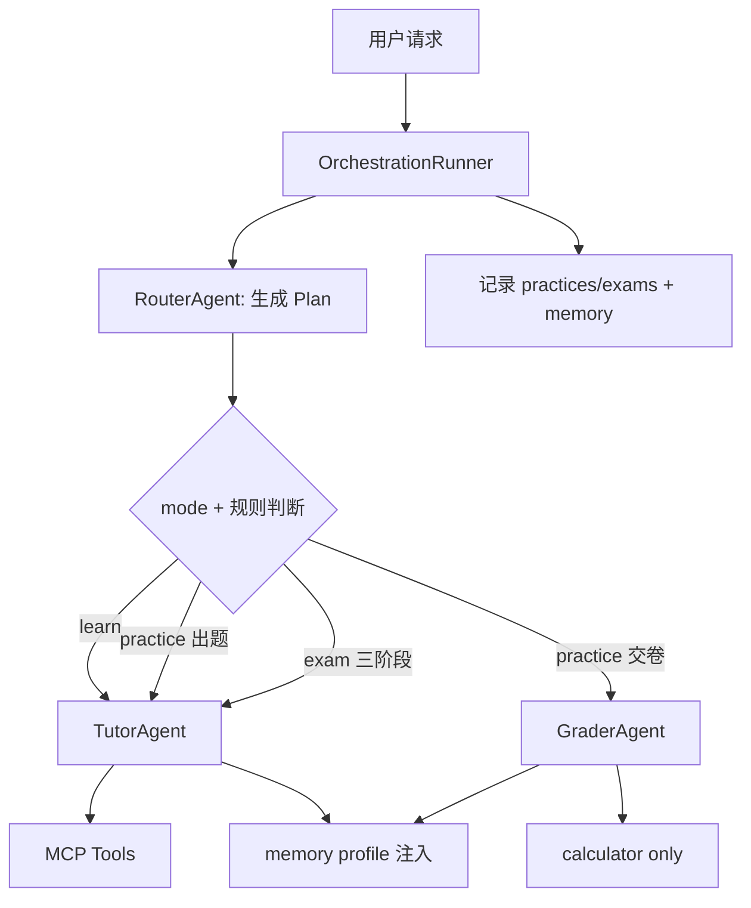
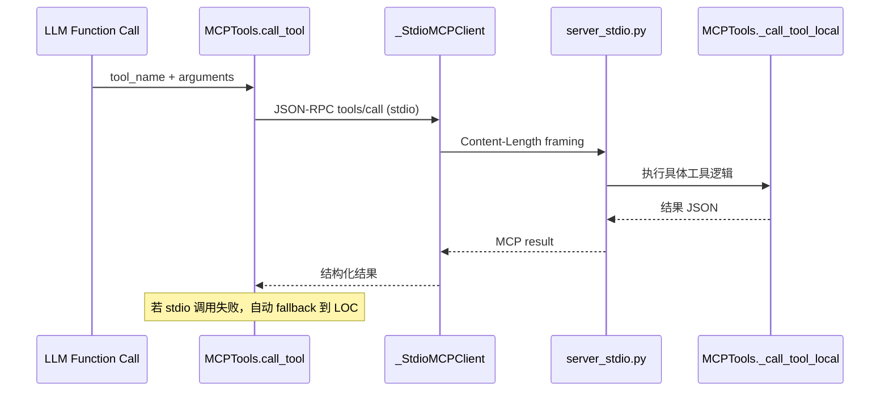
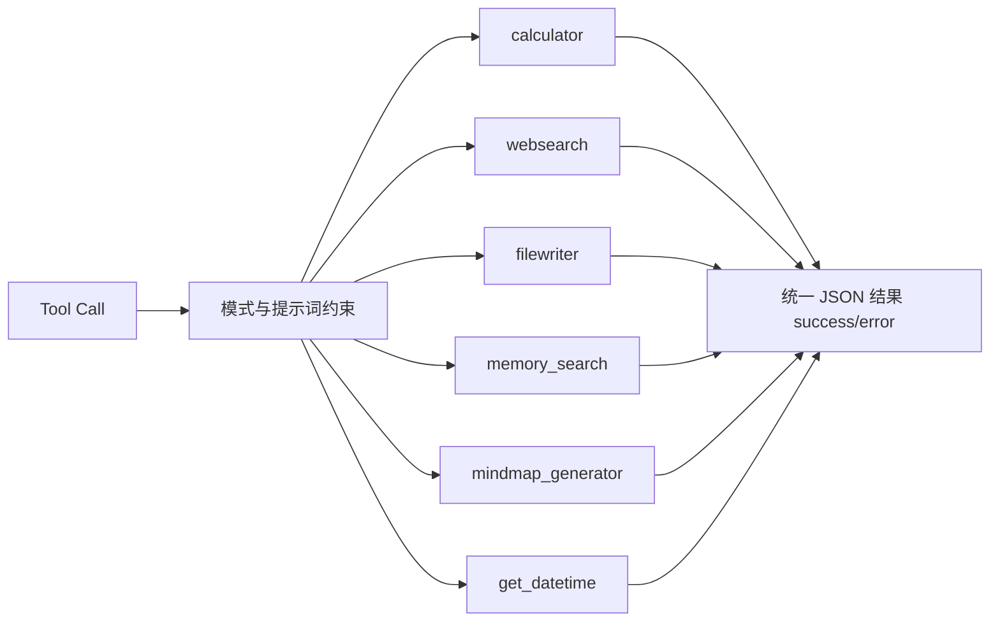

# Course Learning Agent - 项目说明

## 🎯 项目概述

这是一个完整的 **AI 课程学习助手** 项目，专门为大学生课程学习设计。与通用 AI 助手不同，本系统提供：

1. **基于教材的 RAG 系统** - 所有回答都有教材引用
2. **三种学习模式** - 学习、练习、考试
3. **多 Agent 协作** - Router（规划）、Tutor（教学/出题/考试）、Grader（练习评卷）
4. **工具可控集成** - 不同模式限制不同工具
5. **持久化记忆系统** - SQLite 存储学习历史与薄弱知识点
6. **完整学习闭环** - 从理解到练习到考试

## 📐 系统架构设计

### 1. 整体架构

```
┌─────────────────────────────────────────────────────┐
│                   Streamlit Frontend                 │
│    (课程选择 | 模式切换 | 对话界面 | 文件管理)         │
└────────────────────┬────────────────────────────────┘
                     │ HTTP / SSE
┌────────────────────▼────────────────────────────────┐
│                  FastAPI Backend                     │
│      (Workspace管理 | 文件上传 | 索引管理 | 对话)     │
└────────────────────┬────────────────────────────────┘
                     │
┌────────────────────▼────────────────────────────────┐
│       OrchestrationRunner                           │
│  ────────────────────────────────────────────────── │
│  [LLM] Router Agent → Plan（need_rag / style）      │
│  [工具] RAG Retriever → FAISS 检索 + 引用            │
│  [工具] memory_search → 历史错题预取                 │
│  ────────────────────────────────────────────────── │
│  路由判断（Python 关键词检测）                        │
│       ┌──────────────────────┐                      │
│       │  学习 / 考试 / 练习出题│                      │
│       ▼                      ▼                      │
│  ┌──────────┐       ┌──────────────┐               │
│  │  Tutor   │       │练习答案提交时 │               │
│  │  Agent   │       │   Grader     │               │
│  │ (ReAct)  │       │   Agent      │               │
│  └────┬─────┘       │  (ReAct)     │               │
│       │             └──────┬───────┘               │
└───────┼────────────────────┼────────────────────────┘
        │                    │
   ┌────▼────┐          ┌───▼────┐
   │  RAG   │          │ MCP    │  ← 工具：calculator /
   │ System │          │ Tools  │    websearch / filewriter /
   └────────┘          └────────┘    memory_search / mindmap / datetime
```

### 2. 核心模块说明

#### A. RAG 系统 (rag/)

RAG 在本项目里不是“可选增强”，而是回答可信度的核心基础设施。它承担两个职责：
1. 把课程资料转为可检索知识索引。
2. 在对话时返回带出处的上下文，供 LLM 进行有依据生成。

**A1. 离线建库链路（上传资料后触发）**



**A2. 在线检索链路（每次问答按需触发）**


**A3. 关键实现细节**
- 文档解析层：`ingest.py` 负责多格式统一抽取，保留页码/来源信息，供引用回传使用。
- 分块层：`chunk.py` 使用滑窗重叠，避免知识点跨块断裂；`overlap` 主要用于提升召回完整性。
- 嵌入层：`embed.py` 使用 `BAAI/bge-base-zh-v1.5`，并支持 `cuda/cpu/auto`。
- 索引层：`store_faiss.py` 将向量与元数据落盘；检索时读取 `.faiss + .pkl` 形成可回溯上下文。
- 检索层：`retrieve.py` 输出不仅是文本片段，还包含 `doc_id/page/score`，为“证据式回答”提供基础。

**A4. 性能与正确性权衡**
- `Top-K` 越大，召回更全但 prompt 更长，延迟和费用上升。
- `chunk_size` 越大，上下文语义更完整但定位更粗；越小则相反。
- 当前是“向量召回 + LLM 综合”模式，不是固定模板拼接，因此引用与解释能兼顾可读性。

#### B. Multi-Agent 系统 (core/agents/)

本项目的 Multi-Agent 本质是“中心编排 + 专职 Agent”：
- 编排者是 `OrchestrationRunner`（Python 决策与路由）。
- Router/Tutor/Grader 分别负责规划、教学/出题/考试、评卷。
- Agent 不是并行自治群体，而是受 Runner 控制的可替换执行单元。

**B1. 控制流总图**



**B2. 各 Agent 的职责边界**
- Router (`router.py`)：把自然语言请求映射为 `Plan`（是否需要 RAG、回答风格等）；是每轮第一个 LLM 调用。
- Tutor (`tutor.py`)：统一承载学习讲解、练习出题、考试流程；通过 `system_prompt_override/user_content_override` 适配不同模式。
- Grader (`grader.py`)：仅用于练习评卷；提示词和工具权限更严格，输出确定性优先。

**B3. Runner 的“强约束”机制**
- 工具权限最终由 `policies.py` 与 Runner 决定，不完全信任 Router 产出的 `allowed_tools`。
- 练习模式通过 `_is_answer_submission()` 进行分支，避免“用户提交答案却继续出题”。
- 评卷链路将题目原文与学生答案原文一起输入，降低幻觉评分概率。

**B4. 为什么这样设计**
- 保持“LLM 做语言推理，Python 做流程控制”的可控性。
- 降低提示词漂移导致的流程失控风险。
- 便于做日志追踪和故障定位（router/rag/tools/stream 各阶段可观测）。

#### C. MCP 接口与工具系统 (mcp_tools/)

这一层建议分成两部分理解：接口层（MCP 协议）与能力层（具体工具实现）。

**C1. MCP 接口层：如何调用工具**

当前项目采用“本地单 MCP Server + stdio”的形态，并保留本地直调 fallback：



**接口实现要点**
- `mcp_tools/server_stdio.py`：实现 `initialize / tools/list / tools/call` 最小 MCP 子集。
- `mcp_tools/client.py`：`_StdioMCPClient` 负责子进程、请求 ID、帧协议与响应解析。
- 失败降级：`call_tool()` 在 stdio 异常时回退 `_call_tool_local()`，保证主流程可用性。

**C2. MCP 工具层：具体能力与约束**



**工具执行语义**
- `calculator`：确定性计算工具，评卷链路必须调用，避免心算误差。
- `websearch`：远程信息补充，主要用于学习/出题，不进入考试评卷。
- `filewriter`：写入课程 `notes/`，路径由 Runner 注入上下文控制。
- `memory_search`：检索历史问答/错题，强化个性化教学与复习建议。
- `mindmap_generator`：生成 Mermaid 代码，前端渲染并支持导出。
- `get_datetime`：时效信息由工具提供，避免模型“记忆型时间错误”。

**C3. 工具权限模型**
- “能不能调工具”由两层共同决定：
1. `policies.py` 的允许集合。
2. 各 Agent system prompt 的行为规则（尤其是考试与评卷阶段）。
- 练习评卷阶段额外收紧：由 GraderAgent 专线处理，工具仅 `calculator`。

#### D. 记忆系统 (memory/)

**存储**: SQLite，路径 `data/memory/memory.db`

**表结构**:
- `episodes`: 每次练习/考试/错题的详细记录（timestamp、course、type、content、score）
- `user_profiles`: 每门课程的薄弱知识点聚合（weak_points、practice_count、avg_score）

**写入时机**:
- 练习评分完成 → `_save_grading_to_memory()` → 写 `practice`/`mistake` episode
- 考试批改完成 → `_save_exam_to_memory()` → 写 `exam` episode
- 每次写入自动调用 `update_weak_points()` + `record_practice_result()` 更新用户画像

**用户画像注入**: Tutor/QuizMaster 在 system prompt 中自动附加弱点列表，优先针对薄弱知识点讲解和出题。

### 3. 数据流详解

#### 学习模式流程

```
用户: "什么是矩阵的秩?"
  ↓
FastAPI (/chat/stream) → SSE 流式响应
  ↓
Runner.run_learn_mode_stream()
  ↓
[LLM #1] RouterAgent.plan() → Plan(need_rag=True, style="step_by_step")
  ↓
[工具] Retriever.retrieve("矩阵的秩") → [教材片段1, 片段2, ...]（含页码）
  ↓
[LLM #2~N] TutorAgent.teach_stream()  ← ReAct 循环
  system: TUTOR_PROMPT + 用户学习档案（薄弱知识点）
  tools:  全部 6 个工具
  │
  ├─ 可能 call websearch / mindmap_generator / calculator
  └─ 流式输出：核心答案 + 详细解释 + [来源N] 引用
```

#### 练习模式流程

```
【出题阶段】
用户: "给我出一道矩阵秩的题"
  ↓
Runner.run_practice_mode_stream()
  ↓
[LLM #1] RouterAgent.plan()
  ↓
[工具] Retriever.retrieve() → RAG 上下文
[工具] memory_search()      → 历史错题片段（追加到 system prompt）
  ↓
_is_answer_submission() → False（用户在请求出题）
  ↓
[LLM #2~N] TutorAgent.teach_stream()  ← ReAct 循环
  system: PRACTICE_SYSTEM + 历史错题上下文
  user:   PRACTICE_PROMPT（对话式练习规则）
  tools:  全部 6 个工具
  │
  └─ 可能 call websearch 查找补充题材 → 流式输出题目

【评卷阶段】
用户: "1.A  2.正确  3.B..."（提交答案）
  ↓
Runner.run_practice_mode_stream()
  ↓
[LLM #1] RouterAgent.plan()
[工具] memory_search() → 历史错题上下文
  ↓
_is_answer_submission() → True（检测到答案格式）
_extract_quiz_from_history() → 从对话历史中提取题目原文（纯 Python，无 LLM）
  ↓
[LLM #2~N] GraderAgent.grade_practice_stream()  ← ReAct 循环
  system: GRADER_SYSTEM（强制逐字引用原文规则）
  user:   GRADER_PRACTICE_PROMPT（题目 + 学生答案）
  tools:  仅 calculator，temperature=0.1
  │
  ├─ 轮1：逐题对照表（原文引用标准答案 vs 学生答案，判断对错）
  ├─ 轮2：call calculator('sum([20, 15, 0, 15, 10])')
  └─ 轮3：流式输出得分 + 各题讲评 + 易错提醒
  ↓
_save_practice_record()   → 写 practices/ Markdown 文件
_save_grading_to_memory() → 写 SQLite（episodes + user_profiles）
```

#### 考试模式流程

```
用户: "来一套线性代数综合测试"
  ↓
Runner.run_exam_mode_stream()
  ↓
[LLM #1] RouterAgent.plan()
  ↓
[工具] Retriever.retrieve(top_k=12) → 大范围 RAG 上下文
  ↓
[LLM #2~N] TutorAgent.teach_stream()  ← ReAct 循环（三阶段对话）
  system: EXAM_SYSTEM（三阶段规则）
  user:   EXAM_PROMPT
  tools:  calculator · memory_search · get_datetime
  │
  ├─ 阶段一：对话收集配置（题型/题数/难度）
  ├─ 阶段二：生成完整试卷（不透露答案）
  └─ 阶段三：学生提交后，逐题批改 + call calculator + 输出总分
  ↓
_is_exam_grading() → True → _save_exam_record() + _save_exam_to_memory()
```

## 🎨 前端界面设计

### 布局结构

```
┌────────────────────────────────────────────────────┐
│  课程学习助手 📚                                      │
├─────────────┬──────────────────────────────────────┤
│  侧边栏      │  [课程名] [模式徽章]  [❓帮助] [🗑历史] │
│             │  ────────────────────────────────    │
│ [课程选择]   │  ┌ 模式指示条 ──────────────────── ┐  │
│  线性代数    │  │ 📖 学习模式  基于教材精准讲解…   │  │
│  通信原理    │  └───────────────────────────────── ┘  │
│  + 新建      │                                        │
│             │  💬 对话区                              │
│ [模式选择]   │  User: 什么是矩阵的秩？               │
│  ○ 学习     │  Assistant: [回答内容]                │
│  ○ 练习     │    📑 查看引用 ▼                      │
│  ○ 考试     │    🔧 工具调用 ▼                      │
│             │    🗺 [Mermaid 思维导图交互图]         │
│ [📁文件与索引]│    [⬇ SVG] [⬇ PNG] [⬇ .mmd]        │
│  file1.pdf  │                                        │
│  file2.pptx │  [输入框: 输入你的问题...]              │
│  🔨 构建索引  │                                        │
│  🗑 删除文件  │                                        │
│  🗑 删除索引  │                                        │
└─────────────┴──────────────────────────────────────┘
```

### 交互特性

1. **模式主题色**: 学习=蓝色、练习=绿色、考试=琥珀色（模式徽章 + 左侧指示条）
2. **Mermaid 思维导图**: 内嵌交互渲染（前端 HTML 组件），支持缩放；3× 超采样 PNG 导出
3. **帮助面板**: ❓ 按钮切换，内嵌快速开始指南
4. **文件管理**: 侧边栏显示文件大小/日期，支持单独删除文件、删除索引
5. **清空历史**: 主区域一键清空对话历史
6. **实时流式**: SSE 逐 token 推送，前端 Streamlit 实时拼接渲染

## 📊 数据存储结构

```
data/
├── memory/
│   └── memory.db              # SQLite 记忆库（episodes + user_profiles）
└── workspaces/
    └── 线性代数/
        ├── uploads/           # 原始文档
        │   ├── 教材第一章.pdf
        │   ├── 课堂讲义.txt
        │   └── 思维导图.pptx
        ├── index/             # 向量索引（平铺文件，非目录）
        │   ├── faiss_index.faiss
        │   └── faiss_index.pkl
        ├── notes/             # AI 保存的 Markdown 笔记
        ├── mistakes/          # 错题本
        │   └── mistakes.jsonl
        ├── practices/         # 练习记录
        │   └── practice_20260222_143000.json
        └── exams/             # 考试记录
            └── exam_20260222_160000.json
```

### mistakes.jsonl 格式

```json
{"timestamp": "2026-02-22T10:30:00", "question": "...", "student_answer": "...", "score": 75, "feedback": "...", "mistake_tags": ["步骤缺失"]}
```

## 🔧 技术实现要点

### 1. RAG 实现

**分块策略**:
```python
chunk_size = 600      # 字符数（中文密度高）
overlap = 120         # 重叠字符数（≈20%，防止术语跨块截断）
```

**嵌入策略**:
```python
model = "BAAI/bge-base-zh-v1.5"   # 中文专用，768 维
device = "cuda"  # 或 "cpu"（auto-detect via torch.cuda.is_available()）
batch_size = 256  # GPU；CPU 时降为 32
```

**检索策略**:
```python
top_k = 6            # 返回前6个最相关片段
similarity = L2      # normalize_embeddings=True 等价余弦
```

### 2. Prompt Engineering

- **system/user override**：TutorAgent 的 `teach_stream()` 接受 `system_prompt_override` 和 `user_content_override`，让同一 Agent 适配学习/练习/考试三种角色，无需多份执行代码
- **PRACTICE_SYSTEM / EXAM_SYSTEM / GRADER_SYSTEM**：模式专用 system prompt 常量，在 `prompts.py` 集中管理
- **CoT 强制评分**：GraderAgent 的 `GRADER_PRACTICE_PROMPT` 三步走：先逐字引用 → 判断对错 → calculator 汇总，禁止跳步
- **证据优先**：学习模式 Tutor 强制引用教材 `[来源N]` 内联标注
- **结构化输出**：Router 输出 JSON Plan；考试批改输出固定 Markdown 表格格式

### 3. 错误处理

- LLM 调用失败 → 返回错误消息
- JSON 解析失败 → 使用默认值
- 文件上传失败 → 前端提示
- 索引不存在 → 提示用户先建索引
- 记忆库写入失败 → 静默跳过，不影响主流程

### 4. 可扩展性设计

**新增 Agent**:
```python
# 1. 在 core/agents/ 创建新 agent 文件
# 2. 在 prompts.py 添加 prompt 模板
# 3. 在 runner.py 添加调用逻辑
```

**新增工具**:
```python
# 在 mcp_tools/client.py 添加 schema + 实现 + call_tool 路由
# 在 policies.py 按模式配置允许列表
# 在 tutor.py system prompt 添加使用规则
@staticmethod
def new_tool(param):
    return {"tool": "new_tool", "result": ..., "success": True}
```

**新增模式**:
```python
# 1. 在 schemas.py 添加到 Literal 类型
# 2. 在 policies.py 配置工具策略
# 3. 在 runner.py 添加模式处理逻辑
```

## 🎯 核心创新点

### 1. 证据优先架构
- 强制要求引用教材来源，显示页码和文档名

### 2. 学习闭环设计
```
理解 (Learn) → 练习 (Practice) → 检测 (Exam) → 复习 (错题本+记忆库)
     ↑                                                    │
     └────────────── memory_search 弱点反馈 ───────────────┘
```

### 3. 工具策略控制
- 不同模式不同策略，考试模式防作弊，所有调用可观测

### 4. Agent 职责分离
- Router：规划（need_rag / style）
- Tutor：学习讲解 · 练习出题 · 考试三阶段（ReAct，全工具集）
- Grader：练习评卷专用（ReAct，仅 calculator，逐字引用原文对比，temperature=0.1）
- OrchestrationRunner：硬编码 Python 调度器，串联 RAG + 记忆 + Agent + 持久化，本身不是 LLM

### 5. 持久化记忆
- SQLite 跨会话追踪薄弱点，AI 自动在薄弱知识点上加强

## 🚀 部署建议

### 开发环境
```bash
conda activate study_agent
python -m backend.api                        # 后端: localhost:8000
streamlit run frontend/streamlit_app.py      # 前端: localhost:8501
```

### 生产环境
```bash
gunicorn backend.api:app -w 4 -k uvicorn.workers.UvicornWorker
# nginx 反代 → 8000
```

## 🔒 安全考虑

1. **API Key 保护**: 使用环境变量，不提交到代码库
2. **文件上传限制**: 白名单类型（PDF/TXT/MD/DOCX/PPTX/PPT），`basename()` 防路径穿越
3. **表达式执行**: Calculator 使用限定命名空间的 `eval`，无内建函数
4. **数据隔离**: 每个课程独立工作空间，课程名经 `basename()` 清洗
5. **FAISS 线程安全**: 模块级 `threading.Lock` 保护 `os.chdir()` 区域
6. **历史截断**: 对话历史仅取最近 20 条，防止 token 爆炸与数据泄漏

## 📚 调试技巧

1. 查看后端日志了解 API 调用和工具调用链
2. 查看 LLM 返回的原始文本（Runner 日志）
3. 检查 `data/workspaces/<course>/index/faiss_index.faiss` 是否存在
4. 检查 `data/memory/memory.db` 的 `episodes` 表确认记忆是否写入
5. 验证 `.env` 配置是否正确

---

## 💡 核心价值总结

✅ **产品化的学习系统** - 完整的学习闭环  
✅ **可控的 Agent 应用** - 工具策略 + 模式设计  
✅ **可追溯的知识系统** - 证据优先 + 引用标注  
✅ **持久化记忆增强** - 跨会话弱点追踪与强化  
✅ **可扩展的架构** - 模块化 + Agent 编排  
