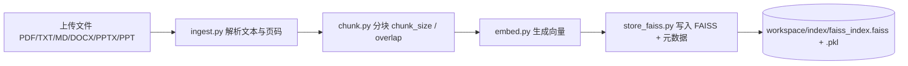
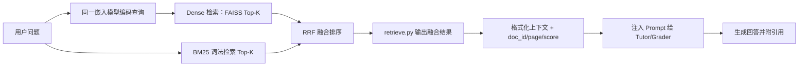
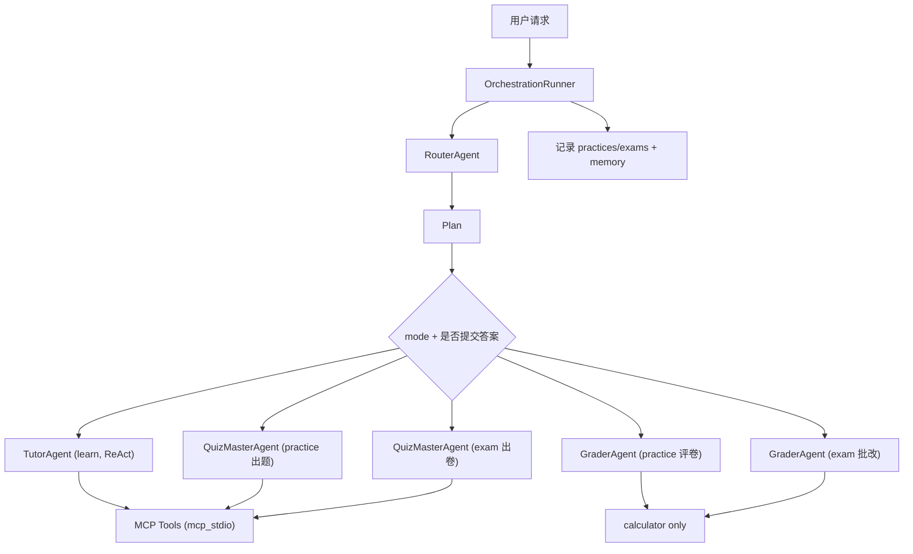
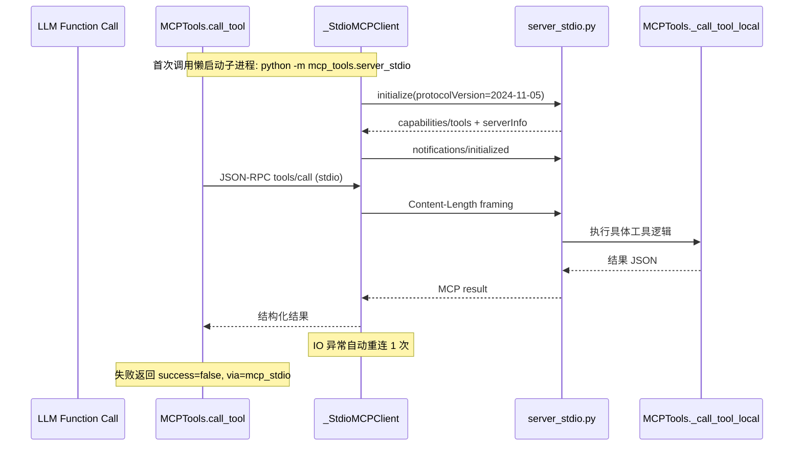
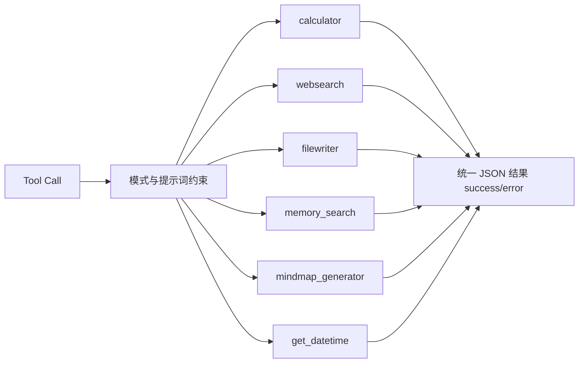

# Course Learning Agent - 项目说明

## 🎯 项目概述

这是一个完整的 **AI 课程学习助手** 项目，专门为大学生课程学习设计。与通用 AI 助手不同，本系统提供：

1. **基于教材的 RAG 系统** - 所有回答都有教材引用
2. **三种学习模式** - 学习、练习、考试
3. **多 Agent 协作** - Router（Plan+Replan）、Tutor（学习 ReAct）、QuizMaster（出题/出卷 Plan-Solve）、Grader（评卷讲解）
4. **工具标准化集成** - 全部工具统一走 MCP `mcp_stdio`，无本地 fallback
5. **持久化记忆系统** - SQLite 存储学习历史与薄弱知识点
6. **完整学习闭环** - 从理解到练习到考试

## 📐 系统架构设计

### 1. 整体架构

```
┌─────────────────────────────────────────────────────┐
│                   Streamlit Frontend                 │
│    (课程选择 | 模式切换 | 对话界面 | 文件管理)         │
└────────────────────┬────────────────────────────────┘
                     │ HTTP / SSE
┌────────────────────▼────────────────────────────────┐
│                  FastAPI Backend                     │
│      (Workspace管理 | 文件上传 | 索引管理 | 对话)     │
└────────────────────┬────────────────────────────────┘
                     │
┌────────────────────▼────────────────────────────────┐
│       OrchestrationRunner                           │
│  ────────────────────────────────────────────────── │
│  [LLM] Router Agent → Plan（need_rag / style）      │
│                  └→ 失败触发 Replan（单次重试）       │
│  [工具] RAG Retriever → Hybrid 检索 + 引用           │
│  [工具] memory_search → 历史错题预取                 │
│  ────────────────────────────────────────────────── │
│  路由判断（Runner 硬编码）                           │
│       ┌──────────────────────────────┐              │
│       │ learn -> Tutor（ReAct）      │              │
│       │ practice/exam 出题 -> QuizMaster│           │
│       │ answer 提交 -> Grader         │              │
│       └──────────────────────────────┘              │
└─────────────────────────────────────────────────────┘
```

### 2. 核心模块说明

#### A. RAG 系统 (rag/)

RAG 在本项目里不是“可选增强”，而是回答可信度的核心基础设施。它承担两个职责：
1. 把课程资料转为可检索知识索引。
2. 在对话时返回带出处的上下文，供 LLM 进行有依据生成。

**A1. 离线建库链路（上传资料后触发）**



**A2. 在线检索链路（每次问答按需触发）**



**A3. 关键实现细节**
- 文档解析层：`ingest.py` 负责多格式统一抽取，保留页码/来源信息，供引用回传使用。
- 分块层：`chunk.py` 使用滑窗重叠，避免知识点跨块断裂；`overlap` 主要用于提升召回完整性。
- 嵌入层：`embed.py` 使用 `BAAI/bge-base-zh-v1.5`，并支持 `cuda/cpu/auto`。
- 索引层：`store_faiss.py` 将向量与元数据落盘；检索时读取 `.faiss + .pkl` 形成可回溯上下文。
- 检索层：`retrieve.py` 支持 `dense / bm25 / hybrid` 三种模式（默认 `hybrid`），输出包含 `doc_id/page/score` 的可引用片段。
- 融合层：Hybrid 使用 RRF（Reciprocal Rank Fusion）合并 dense 与 bm25 候选，兼顾语义召回与术语精确匹配。

**A4. 性能与正确性权衡**
- `Top-K` 越大，召回更全但 prompt 更长，延迟和费用上升；当前主干默认分模式配置：学习/练习 `top_k=4`，考试 `top_k=8`。
- `chunk_size` 越大，上下文语义更完整但定位更粗；越小则相反。
- `hybrid` 模式通常比纯向量召回更稳健，尤其在课程术语/缩写/公式关键词场景。

#### B. Multi-Agent 系统 (core/agents/)

本项目的 Multi-Agent 本质是“中心编排 + 专职 Agent”：
- 编排者是 `OrchestrationRunner`（Python 决策与路由）。
- Router/Tutor/QuizMaster/Grader 分别负责规划、学习讲解、出题出卷、评卷讲解。
- Agent 不是并行自治群体，而是受 Runner 控制的可替换执行单元。

**B1. 控制流总图**



**B2. 各 Agent 的职责边界**
- Router (`router.py`)：把自然语言请求映射为 `Plan`（need_rag/style/output_format）；当执行失败时支持一次 `replan()`。
- Tutor (`tutor.py`)：学习模式主执行，采用 ReAct 工具循环输出教学回答。
- QuizMaster (`quizmaster.py`)：练习出题与考试出卷主执行，采用 Plan-Solve；默认不做工具循环，仅在必要时直调 MCP（主要 `websearch/get_datetime`）。
- Grader (`grader.py`)：练习/考试评卷主执行，采用“先内部计划、再 ReAct-Solve”两阶段；工具仅 `calculator`。

**B3. Runner 的“强约束”机制**
- 练习模式通过 `_is_answer_submission()` 进行分支，避免“用户提交答案却继续出题”。
- 考试模式通过 `_is_exam_answer_submission()` 进行分支，出卷与批改职责分离。
- 练习与考试均使用内部元数据通道（`quiz_meta/exam_meta`）传递标准答案与评分信息，走 `tool_calls` 内部字段，不向用户展示。
- Replan 触发条件为检索为空 / 工具失败 / 回答质量偏低，且仅重跑一次以控制副作用。

**B4. 为什么这样设计**
- 保持“LLM 做语言推理，Python 做流程控制”的可控性。
- 降低提示词漂移导致的流程失控风险。
- 便于做日志追踪和故障定位（router/rag/tools/stream 各阶段可观测）。

#### C. MCP 接口与工具系统 (mcp_tools/)

这一层建议分成两部分理解：接口层（MCP 协议）与能力层（具体工具实现）。

**C1. MCP 接口层：如何调用工具**

当前项目采用“本地单 MCP Server + stdio”的形态，工具调用严格走 MCP，不做本地直调 fallback。



**接口实现要点**
- `mcp_tools/client.py::_StdioMCPClient`
  - 负责子进程生命周期（懒启动、复用、关闭）；
  - 负责 `Content-Length` 帧读写、JSON-RPC id 匹配、超时控制；
  - 首次握手执行 `initialize -> notifications/initialized`；
  - 通道异常时自动重连 1 次。
- `mcp_tools/server_stdio.py`
  - 实现 `initialize / notifications/initialized / tools/list / tools/call`；
  - `stdout` 仅输出协议帧，`print` 重定向到 `stderr`；
  - 参数类型异常返回 `-32602`，未知方法返回 `-32601`，服务异常返回 `-32000`。
- `mcp_tools/client.py::_to_mcp_tools`
  - 将 OpenAI function schema 转为 MCP `tools/list` 结构：
  - 字段：`name` / `description` / `inputSchema`。
- `MCPTools.call_tool()`
  - 强制通过 MCP 调用；
  - 返回体统一补充 `via: "mcp_stdio"`；
  - 失败时只返回错误结构，不会执行本地 fallback。

**C1.1 上下文透传（filewriter）**
- 主进程 Runner 注入 `MCPTools._context["notes_dir"]`；
- 调用 `filewriter` 时将 `notes_dir` 作为 arguments 透传给 MCP server；
- 子进程中的本地工具实现据此写入当前课程目录，避免写到默认路径。

**C1.2 为什么这样设计**
- 统一工具执行通道：便于审计、观测与故障定位（日志可统一追踪 `via=mcp_stdio`）；
- 协议边界清晰：工具能力在 server 侧，本地业务可逐步替换为远程 MCP 服务；
- 失败行为可预期：严格仅 MCP，避免“有时走协议、有时本地直调”的不一致。

**C2. MCP 工具层：具体能力与约束**



**工具执行语义**
- `calculator`：确定性计算工具，评卷链路必须调用，避免心算误差。
- `websearch`：远程信息补充，主要用于学习/出题，不进入考试评卷。
- `filewriter`：写入课程 `notes/`，路径由 Runner 注入上下文控制。
- `memory_search`：检索历史问答/错题，强化个性化教学与复习建议。
- `mindmap_generator`：生成 Mermaid 代码，前端渲染并支持导出。
- `get_datetime`：时效信息由工具提供，避免模型“记忆型时间错误”。

**C3. 工具权限模型**
- 当前实现中 `ToolPolicy` 对三模式均放行 `ALL_TOOLS`。
- 实际“能不能调工具”由两层共同决定：
1. Runner 的分支路由（learn/practice/exam + 是否提交答案）。
2. 各 Agent 的内部实现与提示词规则（尤其是 QuizMaster 的最小外部调用、Grader 的 `calculator` 专线）。
- 练习/考试评卷阶段额外收紧：由 GraderAgent 专线处理，工具仅 `calculator`。

#### D. 记忆系统 (memory/)

**存储**: SQLite，路径 `data/memory/memory.db`

**表结构**:
- `episodes`: 每次练习/考试/错题的详细记录（timestamp、course、type、content、score）
- `user_profiles`: 每门课程的薄弱知识点聚合（weak_points、practice_count、avg_score）

**写入时机**:
- 练习评分完成 → `_save_grading_to_memory()` → 写 `practice`/`mistake` episode
- 考试批改完成 → `_save_exam_to_memory()` → 写 `exam` episode
- 每次写入自动调用 `update_weak_points()` + `record_practice_result()` 更新用户画像

**用户画像注入**: Tutor/QuizMaster 在 system prompt 中自动附加弱点列表，优先针对薄弱知识点讲解和出题。

### 3. 数据流详解

#### 学习模式流程

```
用户: "什么是矩阵的秩?"
  ↓
FastAPI (/chat/stream) → SSE 流式响应
  ↓
Runner.run_learn_mode_stream()
  ↓
[LLM #1] RouterAgent.plan() → Plan(need_rag=True, style="step_by_step")
  ↓
[工具] Retriever.retrieve("矩阵的秩") → [教材片段1, 片段2, ...]（含页码）
  ↓
[LLM #2~N] TutorAgent.teach_stream()  ← ReAct 循环
  system: TUTOR_PROMPT + 用户学习档案（薄弱知识点）
  tools:  全部 6 个工具
  │
  ├─ 可能 call websearch / mindmap_generator / calculator
  ├─ 流式元事件：`__status__`（模型分析/工具调用/整理答案）
  ├─ 流式元事件：`__citations__`（当前轮引用）
  └─ 流式输出：核心答案 + 详细解释 + [来源N] 引用（仅当前轮）
```

#### 练习模式流程

```
【出题阶段】
用户: "给我出一道矩阵秩的题" 或 "出 10 道 Attention 选择题"
  ↓
Runner.run_practice_mode_stream()
  ↓
[LLM #1] RouterAgent.plan()
  ↓
[工具] Retriever.retrieve() → RAG 上下文
[工具] memory_search()      → 历史错题片段（Runner 预取，request 级去重）
  ↓
_is_answer_submission() → False（用户在请求出题）
  ↓
if num_questions > 1:
  [LLM #2] QuizMaster.generate_exam_paper() ← Plan-Solve
    ├─ 生成练习多题正文（内部仍走试卷 schema）
    └─ 生成 `exam_meta`（answer_sheet/total_score，内部 tool_calls）
else:
  [LLM #2] QuizMaster.generate_quiz() ← Plan-Solve
    ├─ 生成单题正文
    └─ 生成 `quiz_meta`（内部 tool_calls）
  ↓
流式返回题目 + 元数据事件（`__tool_calls__`）

【评卷阶段】
用户: "1.A  2.正确  3.B..."（提交答案）
  ↓
Runner.run_practice_mode_stream()
  ↓
[LLM #1] RouterAgent.plan()
[工具] memory_search() → 历史错题上下文（Runner 预取）
  ↓
_is_answer_submission() → True（检测到答案格式）
if history has exam_meta:
  [LLM #2~N] GraderAgent.grade_exam_stream() ← 考试评卷链路（按 answer_sheet）
else:
  _extract_quiz_from_history() → 从历史提取题目原文
  [LLM #2~N] GraderAgent.grade_practice_stream() ← 练习评卷链路
  ↓
两条链路都仅调用 calculator 汇总，最后流式输出评分+讲评
  ↓
_save_practice_record()   → 写 practices/ Markdown 文件
_save_grading_to_memory() → 写 SQLite（episodes + user_profiles）
```

#### 考试模式流程

```
用户: "来一套线性代数综合测试"
  ↓
Runner.run_exam_mode_stream()
  ↓
[LLM #1] RouterAgent.plan()
  ↓
[工具] Retriever.retrieve(top_k=8) → 大范围 RAG 上下文
  ↓
[LLM #2] QuizMaster.generate_exam_paper()  ← Plan-Solve
  plan:  _plan_exam()（scope/num_questions/difficulty_ratio）
  solve: 基于 EXAM_GENERATOR_PROMPT 生成结构化试卷 JSON
  tools: 默认不循环；必要时直调 MCP（websearch/get_datetime）
  │
  ├─ 输出试卷正文（可见）
  ├─ 输出 `exam_meta`（answer_sheet/total_score，内部 tool_calls）
  └─ 等待学生一次性提交答案
  ↓
_is_exam_answer_submission() → True
  ↓
[LLM #3] GraderAgent._generate_exam_plan()（内部计划）
[LLM #4~N] GraderAgent.grade_exam_stream()（ReAct-Solve + calculator）
  ↓
_save_exam_record() + _save_exam_to_memory()
```

## 🎨 前端界面设计

### 布局结构

```
┌────────────────────────────────────────────────────┐
│  课程学习助手 📚                                      │
├─────────────┬──────────────────────────────────────┤
│  侧边栏      │  [课程名] [模式徽章]  [❓帮助] [🗑历史] │
│             │  ────────────────────────────────    │
│ [课程选择]   │  ┌ 模式指示条 ──────────────────── ┐  │
│  线性代数    │  │ 📖 学习模式  基于教材精准讲解…   │  │
│  通信原理    │  └───────────────────────────────── ┘  │
│  + 新建      │                                        │
│             │  💬 对话区                              │
│ [模式选择]   │  User: 什么是矩阵的秩？               │
│  ○ 学习     │  Assistant: [回答内容]                │
│  ○ 练习     │    📑 查看引用 ▼                      │
│  ○ 考试     │    🔧 工具调用 ▼                      │
│             │    🗺 [Mermaid 思维导图交互图]         │
│ [📁文件与索引]│    [⬇ SVG] [⬇ PNG] [⬇ .mmd]        │
│  file1.pdf  │                                        │
│  file2.pptx │  [输入框: 输入你的问题...]              │
│  🔨 构建索引  │                                        │
│  🗑 删除文件  │                                        │
│  🗑 删除索引  │                                        │
└─────────────┴──────────────────────────────────────┘
```

### 交互特性

1. **模式主题色**: 学习=蓝色、练习=绿色、考试=琥珀色（模式徽章 + 左侧指示条）
2. **Mermaid 思维导图**: 内嵌交互渲染（前端 HTML 组件），支持缩放；3× 超采样 PNG 导出
3. **帮助面板**: ❓ 按钮切换，内嵌快速开始指南
4. **文件管理**: 侧边栏显示文件大小/日期，支持单独删除文件、删除索引
5. **清空历史**: 主区域一键清空对话历史
6. **实时流式**: SSE 逐 token 推送，前端 Streamlit 实时拼接渲染
7. **执行状态提示**: 前端接收 `__status__` 元事件，展示“检索中/调用工具中/整理答案中”
8. **当前轮引用隔离**: 前端仅显示当前轮 `__citations__`，不把历史引用混入当前回答
9. **低刷新策略**: 课程创建使用 `st.form` 批量提交 + API 缓存 TTL 提升，减少无效整页重跑

## 📊 数据存储结构

```
data/
├── memory/
│   └── memory.db              # SQLite 记忆库（episodes + user_profiles）
└── workspaces/
    └── 线性代数/
        ├── uploads/           # 原始文档
        │   ├── 教材第一章.pdf
        │   ├── 课堂讲义.txt
        │   └── 思维导图.pptx
        ├── index/             # 向量索引（平铺文件，非目录）
        │   ├── faiss_index.faiss
        │   └── faiss_index.pkl
        ├── notes/             # AI 保存的 Markdown 笔记
        ├── mistakes/          # 错题本
        │   └── mistakes.jsonl
        ├── practices/         # 练习记录
        │   └── 练习记录_20260222_143000.md
        └── exams/             # 考试记录
            └── 考试记录_20260222_160000.md
```

### mistakes.jsonl 格式

```json
{"timestamp": "2026-02-22T10:30:00", "question": "...", "student_answer": "...", "score": 75, "feedback": "...", "mistake_tags": ["步骤缺失"]}
```

## 🔧 技术实现要点

### 1. RAG 实现

**分块策略**:
```python
chunk_size = 600      # 字符数（中文密度高）
overlap = 120         # 重叠字符数（≈20%，防止术语跨块截断）
```

**嵌入策略**:
```python
model = "BAAI/bge-base-zh-v1.5"   # 中文专用，768 维
device = "cuda"  # 或 "cpu"（auto-detect via torch.cuda.is_available()）
batch_size = 256  # GPU；CPU 时降为 32
```

**检索策略**:
```python
retrieval_mode = "hybrid"   # dense / bm25 / hybrid
top_k = 4                   # 学习/练习默认；考试模式在 Runner 中覆盖为 8
hybrid_rrf_k = 60
hybrid_dense_weight = 1.0
hybrid_bm25_weight = 1.0
```

### 2. Prompt Engineering

- **Router 重规划**：Router 先输出 Plan，执行失败信号触发一次 Replan（原因入参显式传入）。
- **QuizMaster Plan-Solve**：先抽取出题/出卷计划，再生成结构化 JSON；降低直接长文本生成漂移。
- **Grader 两阶段**：先生成内部评卷计划，再 ReAct 执行评分讲解，且仅允许 `calculator`。
- **证据优先**：学习模式 Tutor 强制引用教材 `[来源N]` 内联标注。
- **元数据内通道**：练习/考试标准答案通过 `quiz_meta/exam_meta` 进入历史 `tool_calls`，不污染可见正文。

### 3. 错误处理

- LLM 调用失败 → 返回错误消息
- JSON 解析失败 → 使用默认值
- 文件上传失败 → 前端提示
- 索引不存在 → 提示用户先建索引
- 记忆库写入失败 → 静默跳过，不影响主流程

### 4. 可扩展性设计

**新增 Agent**:
```python
# 1. 在 core/agents/ 创建新 agent 文件
# 2. 在 prompts.py 添加 prompt 模板
# 3. 在 runner.py 添加调用逻辑
```

**新增工具**:
```python
# 在 mcp_tools/client.py 添加 schema + 实现 + call_tool 路由
# 在 policies.py 按模式配置允许列表
# 在 tutor.py system prompt 添加使用规则
@staticmethod
def new_tool(param):
    return {"tool": "new_tool", "result": ..., "success": True}
```

**新增模式**:
```python
# 1. 在 schemas.py 添加到 Literal 类型
# 2. 在 policies.py 配置工具策略
# 3. 在 runner.py 添加模式处理逻辑
```

## 🎯 核心创新点

### 1. 证据优先架构
- 强制要求引用教材来源，显示页码和文档名

### 2. 学习闭环设计
```
理解 (Learn) → 练习 (Practice) → 检测 (Exam) → 复习 (错题本+记忆库)
     ↑                                                    │
     └────────────── memory_search 弱点反馈 ───────────────┘
```

### 3. 工具策略控制
- `ToolPolicy` 目前对三模式均放行 6 工具；实际差异由 Runner 路由和 Agent 内部实现约束。
- 全部工具统一走 `mcp_stdio`，日志可通过 `via=mcp_stdio` 观测。

### 4. Agent 职责分离
- Router：规划（need_rag / style）
- Tutor：学习讲解（ReAct）
- QuizMaster：练习出题 + 考试出卷（Plan-Solve，按需最小外部工具）
- Grader：练习/考试评卷讲解（Plan + ReAct-Solve，仅 calculator）
- OrchestrationRunner：硬编码 Python 调度器，串联 RAG + 记忆 + Agent + 持久化，本身不是 LLM

### 5. 持久化记忆
- SQLite 跨会话追踪薄弱点，AI 自动在薄弱知识点上加强

## 🚀 部署建议

### 开发环境
```bash
conda activate study_agent
python -m backend.api                        # 后端: localhost:8000
streamlit run frontend/streamlit_app.py      # 前端: localhost:8501
```

### 生产环境
```bash
gunicorn backend.api:app -w 4 -k uvicorn.workers.UvicornWorker
# nginx 反代 → 8000
```

## 🔒 安全考虑

1. **API Key 保护**: 使用环境变量，不提交到代码库
2. **文件上传限制**: 白名单类型（PDF/TXT/MD/DOCX/PPTX/PPT），`basename()` 防路径穿越
3. **表达式执行**: Calculator 使用限定命名空间的 `eval`，无内建函数
4. **数据隔离**: 每个课程独立工作空间，课程名经 `basename()` 清洗
5. **FAISS 线程安全**: 模块级 `threading.Lock` 保护 `os.chdir()` 区域
6. **历史截断**: 对话历史仅取最近 20 条，防止 token 爆炸与数据泄漏

## 📚 调试技巧

1. 查看后端日志了解 API 调用和工具调用链
2. 查看 LLM 返回的原始文本（Runner 日志）
3. 检查 `data/workspaces/<course>/index/faiss_index.faiss` 是否存在
4. 检查 `data/memory/memory.db` 的 `episodes` 表确认记忆是否写入
5. 验证 `.env` 配置是否正确

---

## 💡 核心价值总结

✅ **产品化的学习系统** - 完整的学习闭环  
✅ **可控的 Agent 应用** - 工具策略 + 模式设计  
✅ **可追溯的知识系统** - 证据优先 + 引用标注  
✅ **持久化记忆增强** - 跨会话弱点追踪与强化  
✅ **可扩展的架构** - 模块化 + Agent 编排  

---

## V2 架构增量（2026-03）

### 1. 统一上下文预算器（ContextBudgeter）

- 接入点：`OrchestrationRunner` 在进入 Agent 前统一裁剪。
- 顺序固定：`历史（最近轮+摘要） -> RAG（句级压缩） -> Memory（短片段） -> 硬截断`。
- 目标：在不改外部 API 的前提下，降低中间轮 prompt 膨胀，稳定延迟。

### 2. RAG V2（分层切分 + 句级压缩）

- 分块策略：`fixed | chapter_hybrid`（默认 `chapter_hybrid`，失败回退 `fixed`）。
- 章节识别：`第X章 / Chapter X / Markdown 标题`。
- 元数据新增：`chapter`、`section`，引用仍绑定原 chunk。
- 检索后压缩：每个 chunk 只保留 top-N 相关句（关键词重叠评分）。

### 3. 可观测性增强

- API 层新增请求级日志（`request_id`、history 长度、首包耗时、总耗时、异常）。
- metrics trace 贯通 API/Runner/LLM/tool 事件，支持 `request_id + trace_id` 关联。
- 流式链路增加心跳状态，避免前端长期停在单一状态。

### 4. 性能评测体系

- 基准脚本：`scripts/perf/bench_runner.py`。
- 数据集：`benchmarks/cases_v1.jsonl` + `benchmarks/rag_gold_v1.jsonl`。
- 产物：`raw/summary/checkpoint`，支持断点续跑和 baseline/after 对比。

### 5. 2026-03 Full Fix（任务 1-9）增量

- 同步链路修复：`/chat` 的 practice/exam 非流式路径已移除生成器副作用，返回类型统一为 `ChatMessage`。
- 上下文分区：Runner 传递 `history_context / rag_context / memory_context / context`，Agent 按分区消费，降低“混合上下文”污染风险。
- 工具契约化：`ToolPolicy` 新增 `ToolCapability`（required_args / phase_allow / dedup_scope / retry_policy），统一 preflight 门控。
- 结构化输出灰度：Quiz/Exam/Grader 支持 `ENABLE_STRUCTURED_OUTPUTS_*` 开关，失败自动回退旧解析链。
- 记忆检索后端：`memory/store.py` 增加 `FTS5 -> LIKE` 双路径，`MEMORY_SEARCH_BACKEND` 控制优先级。
- 可观测性补齐：MCP 工具侧增加 `tool_progress`（start/end）事件；流式状态链路更完整（检索/工具/继续推理/最终回答）。
- 上下文预算可视化：流式链路增加 `__context_budget__` 事件，前端右上角角标可展示 pressure 与分段 token。

### 6. 2026-03-26 增量修复（练习/评卷链路）

- practice 多题请求（`num_questions > 1`）统一走 `QuizMaster.generate_exam_paper()`，并写入 `exam_meta`，避免“多题仍按单题 schema 解析”。
- practice 提交答案时新增分流：历史含 `exam_meta` 走 `Grader.grade_exam_stream()`；否则走 `Grader.grade_practice_stream()`。
- QuizMaster 新增题型锁定：用户显式指定题型（且非“综合题”）时，计划阶段不得覆盖题型。
- QuizMaster 新增选择题形态校验与单次重试：题面缺少 A/B/C/D 或标准答案不合法时触发一次严格重试。
- 试卷答题卡分值口径统一：渲染阶段将 `answer_sheet` 总分归一到 100，避免跨链路总分不一致。
- 流式上下文预算事件补齐：learn/practice/exam 三模式统一发 `__context_budget__`；前端增加“未收到预算事件”超时提示。
