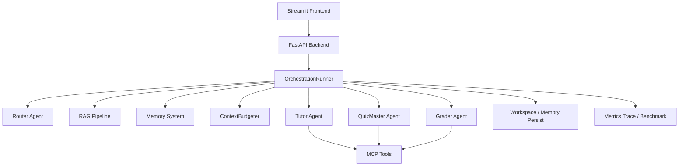
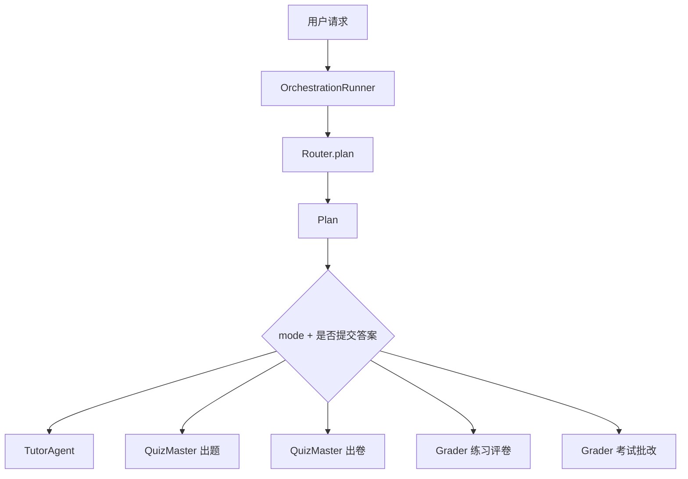
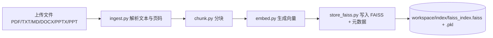
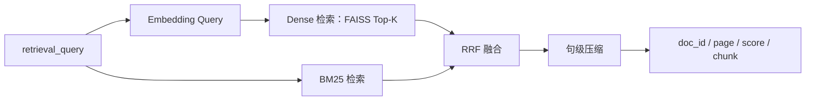
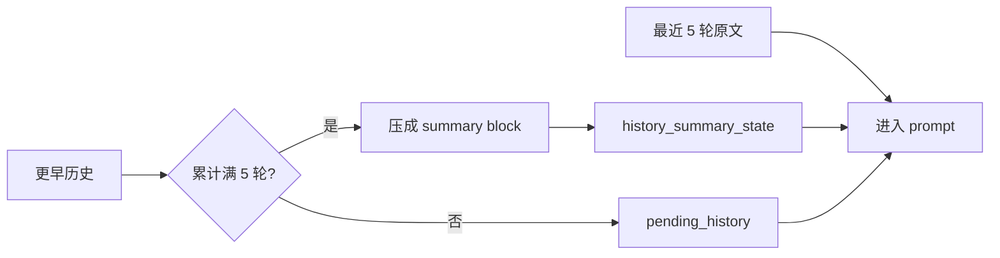
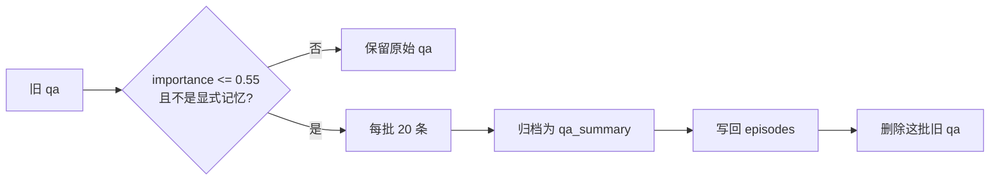
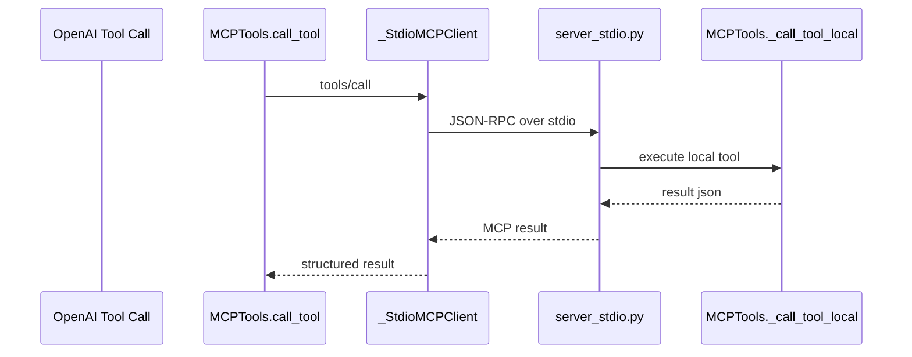
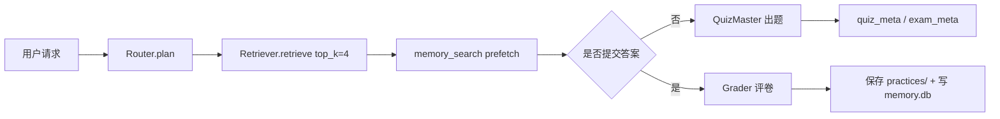
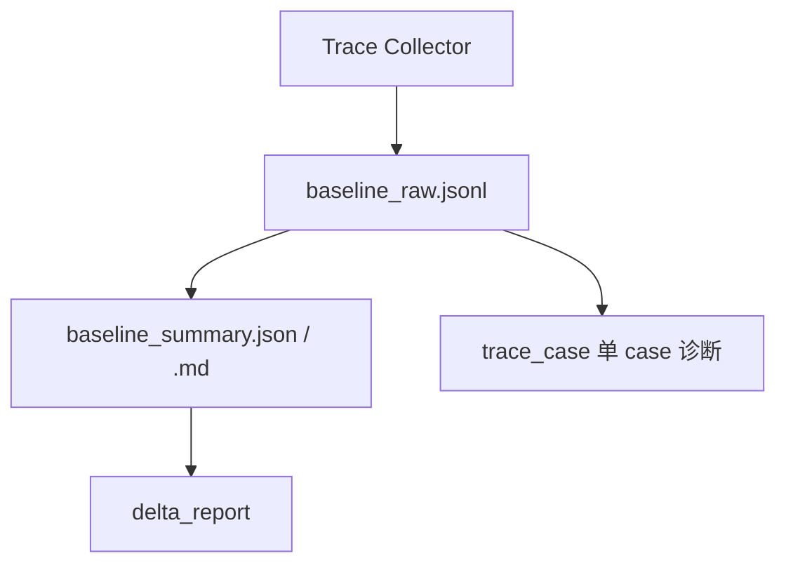
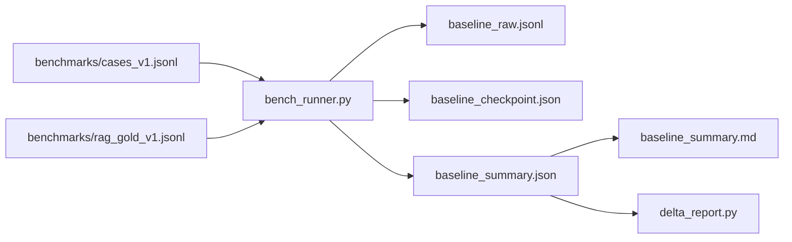

# CoursePilot 架构说明

## 1 项目概述

CoursePilot 是一个面向大学课程学习场景的多 Agent 学习系统。它围绕“教材接入 -> 讲解学习 -> 练习/考试 -> 记忆沉淀”的闭环设计，核心目标不是做一个通用聊天机器人，而是做一个**可引用、可追踪、可评测、可逐步优化**的课程学习平台。

与通用 Chat 工具相比，当前系统的关键特征是：

1. **RAG 是主链路而不是可选增强**：回答优先建立在教材证据之上，并保留引用来源。
2. **中心编排而不是自由自治**：`OrchestrationRunner` 负责路由、检索、记忆预取、上下文构建和结果落盘。
3. **MCP 统一承载工具调用**：全部工具统一走 `mcp_stdio`，避免本地直调和协议调用混用。
4. **上下文工程与长期记忆协同工作**：短期上下文负责当前请求的 prompt 质量，长期记忆负责跨会话学习轨迹与个性化强化。
5. **评测系统内建到主链路**：trace、benchmark、delta、单 case 诊断共享同一套事件源，便于形成持续优化闭环。

## 目录

- [1 项目概述](#1-项目概述)
- [2 整体架构总览](#2-整体架构总览)
  - [2.1 模块地图](#21-模块地图)
- [3 多 Agent 编排](#3-多-agent-编排)
  - [3.1 设计目标](#31-设计目标)
  - [3.2 Agent 职责矩阵](#32-agent-职责矩阵)
  - [3.3 组件组成](#33-组件组成)
  - [3.4 执行关系与状态传递](#34-执行关系与状态传递)
  - [3.5 关键参数与取舍](#35-关键参数与取舍)
- [4 RAG 系统](#4-rag-系统)
  - [4.1 设计目标](#41-设计目标)
  - [4.2 组件组成](#42-组件组成)
  - [4.3 离线建库链路](#43-离线建库链路)
    - [4.3.1 文档解析能力表](#431-文档解析能力表)
    - [4.3.2 文本切块](#432-文本切块)
  - [4.4 在线检索链路](#44-在线检索链路)
    - [4.4.1 检索阶段对照表](#441-检索阶段对照表)
    - [4.4.2 嵌入模型](#442-嵌入模型)
    - [4.4.3 向量索引](#443-向量索引)
    - [4.4.4 检索模式](#444-检索模式)
    - [4.4.5 句级压缩](#445-句级压缩)
  - [4.5 关键参数与取舍](#45-关键参数与取舍)
- [5 上下文工程](#5-上下文工程)
  - [5.1 设计目标](#51-设计目标)
  - [5.2 组件组成](#52-组件组成)
  - [5.3 历史滚动摘要](#53-历史滚动摘要)
    - [5.3.1 history 生命周期图](#531-history-生命周期图)
  - [5.4 RAG 与记忆注入](#54-rag-与记忆注入)
    - [5.4.1 上下文来源对照表](#541-上下文来源对照表)
  - [5.5 工具轮上下文瘦身](#55-工具轮上下文瘦身)
    - [5.5.1 工具轮瘦身前后对比表](#551-工具轮瘦身前后对比表)
  - [5.6 关键参数与取舍](#56-关键参数与取舍)
- [6 记忆系统](#6-记忆系统)
  - [6.1 设计目标](#61-设计目标)
  - [6.2 存储模型](#62-存储模型)
    - [6.2.1 记忆模型总览表](#621-记忆模型总览表)
  - [6.3 写入策略](#63-写入策略)
    - [6.3.1 learn / practice / exam 写入策略对照表](#631-learn-practice-exam-写入策略对照表)
  - [6.4 异步归档与 `qa_summary`](#64-异步归档与-qa_summary)
    - [6.4.1 归档规则速查表](#641-归档规则速查表)
  - [6.5 检索策略与用户画像](#65-检索策略与用户画像)
    - [6.5.1 记忆检索优先级表](#651-记忆检索优先级表)
  - [6.6 关键参数与取舍](#66-关键参数与取舍)
- [7 MCP 与工具调用](#7-mcp-与工具调用)
  - [7.1 设计目标](#71-设计目标)
  - [7.2 组件组成](#72-组件组成)
  - [7.3 调用链路](#73-调用链路)
    - [7.3.1 调用链阶段表](#731-调用链阶段表)
  - [7.4 MCP 协议实现](#74-mcp-协议实现)
  - [7.5 工具能力与约束](#75-工具能力与约束)
    - [7.5.1 工具能力矩阵](#751-工具能力矩阵)
    - [7.5.2 为什么统一走 MCP](#752-为什么统一走-mcp)
- [8 核心数据流](#8-核心数据流)
  - [8.1 学习模式](#81-学习模式)
    - [8.1.1 学习模式阶段表](#811-学习模式阶段表)
  - [8.2 练习模式](#82-练习模式)
    - [8.2.1 练习模式总流程](#821-练习模式总流程)
    - [8.2.2 单题 vs 多题对比表](#822-单题-vs-多题对比表)
    - [8.2.3 练习模式阶段表](#823-练习模式阶段表)
  - [8.3 考试模式](#83-考试模式)
    - [8.3.1 出卷 vs 交卷批改对比表](#831-出卷-vs-交卷批改对比表)
    - [8.3.2 考试模式阶段表](#832-考试模式阶段表)
- [9 评测系统](#9-评测系统)
  - [9.1 设计目标](#91-设计目标)
  - [9.2 当前实现由哪些组件组成](#92-当前实现由哪些组件组成)
  - [9.3 评测系统分层图](#93-评测系统分层图)
  - [9.4 Trace Collector](#94-trace-collector)
  - [9.5 Benchmark Runner](#95-benchmark-runner)
  - [9.6 Summary / Delta](#96-summary-delta)
  - [9.7 单 case 诊断](#97-单-case-诊断)
  - [9.8 数据与产物](#98-数据与产物)
    - [9.8.1 评测数据流图](#981-评测数据流图)
    - [9.8.2 评测产物表](#982-评测产物表)
  - [9.9 指标口径与取舍](#99-指标口径与取舍)
    - [9.9.1 指标口径表](#991-指标口径表)
- [10 数据存储结构](#10-数据存储结构)
- [11 工程化补充](#11-工程化补充)
  - [11.1 关键配置速查表](#111-关键配置速查表)
  - [11.2 安全与可靠性清单](#112-安全与可靠性清单)
  - [11.3 扩展点索引表](#113-扩展点索引表)
  - [11.4 调试入口表](#114-调试入口表)
  - [11.5 核心价值总结](#115-核心价值总结)

## 2 整体架构总览

当前系统主链路由 `Streamlit -> FastAPI -> OrchestrationRunner -> Agents / RAG / Memory / MCP Tools -> SSE / Persist / Metrics` 组成。

这张图的阅读方式可以概括为一句话：**前端和 API 负责交互，Runner 负责编排，RAG / Memory / ContextBudgeter 负责准备上下文，Agent 负责执行具体教学任务，MCP 负责统一工具调用，Metrics 负责记录全链路行为。**

### 2.1 模块地图

| 模块 | 主要目录 | 解决的问题 | 核心输入 | 核心输出 | 关键协作对象 |
|---|---|---|---|---|---|
| 前端 | `frontend/` | 课程管理、对话交互、SSE 渲染、预算窗口展示 | 用户输入、课程状态 | HTTP 请求、SSE 消费结果 | API |
| API | `backend/` | 提供 `/chat`、`/chat/stream`、课程与文件接口 | HTTP / JSON | `ChatResponse` / SSE 事件流 | Runner |
| 编排器 | `core/orchestration/` | 统一路由、检索、记忆预取、上下文构建、结果落盘 | `mode`、`message`、`history` | `Plan`、context、落盘结果 | Agents / RAG / Memory / Metrics |
| Agents | `core/agents/` | Router、Tutor、QuizMaster、Grader 的任务执行 | `Plan`、上下文、工具结果 | 教学回答、题目、试卷、评分讲解 | Runner / MCP |
| RAG | `rag/` | 文档解析、切块、嵌入、索引、混合检索、引用输出 | 文档、检索 query | chunks、citations | Runner / ContextBudgeter |
| Memory | `memory/` | 长期记忆写入、检索、归档、用户画像维护 | episodes、profiles、query | memory snippets、profile context | Runner / Router / Tutor |
| MCP | `mcp_tools/` | 工具 schema、stdio MCP client/server、工具执行 | tool call、tool args | structured result | Agents / Runner |
| Metrics | `core/metrics/` + `scripts/perf/` | trace 事件、benchmark、delta、单 case 诊断 | trace events | raw / summary / delta / case report | Runner / bench scripts |

这里最关键的结构事实有两点：

1. `OrchestrationRunner` 是中心编排器。系统不是“前端直接调模型”，也不是“多个 Agent 自由协商”，而是由 Python 侧显式决定：先 Router，再检索，再记忆预取，再预算器，再交给对应 Agent。
2. 当前系统已经不仅是“聊天前端 + 模型调用”，而是一个完整的课程学习闭环：课程数据、RAG 索引、练习/考试记录、长期记忆和评测体系都属于主系统的一部分。

> 历史演进和阶段性修复记录请见 `docs/changelog/`；本文件只描述当前代码中的现状实现。

## 3 多 Agent 编排

### 3.1 设计目标

多 Agent 编排解决的问题，不是“让多个模型同时对话”，而是把一个复杂学习请求拆成更稳定的职责链。当前设计选择的是“**中心编排 + 专职 Agent**”，原因是：

- 课程学习链路有明显的流程阶段：规划、检索、讲解、出题、评卷、持久化。
- 这些阶段中有大量硬逻辑和状态切换，不适合全部交给 LLM 自由决定。
- 采用 Python 编排器可以把模式切换、元数据传递、工具约束、落盘等逻辑写成稳定代码，从而降低 prompt 漂移引发的链路失控。

### 3.2 Agent 职责矩阵

| Agent / 组件 | 主要任务 | 主要输入 | 主要输出 | 工具权限 | 是否流式 |
|---|---|---|---|---|---|
| `OrchestrationRunner` | 中心编排、模式分流、RAG/Memory 预取、上下文构建、落盘 | `mode`、`message`、`history` | `Plan`、context、最终响应 | 不直接发起工具调用 | learn / practice / exam 都支持 |
| `RouterAgent` | 把自然语言请求映射成结构化 `Plan` | 用户消息、用户画像摘要 | `Plan` | 无直接工具调用 | 非流式 |
| `TutorAgent` | 学习模式主执行，负责 ReAct 教学回答 | context、citations、memory、tool results | 教学回答、引用、工具日志 | 6 类工具全开，由 `ToolPolicy` 再门控 | 流式 |
| `QuizMasterAgent` | 练习/考试出题、出卷 | context、plan、citations、memory | quiz / exam paper、`quiz_meta` / `exam_meta` | 可用工具取决于策略，但当前主路径少用工具 | 出题主链路可流式 |
| `GraderAgent` | 练习/考试评分讲解 | 学生答案、标准答案、评分规则、memory | grading report、讲评、记录落盘 | 严格收敛到 `calculator` | 流式 |

### 3.3 组件组成

| 组件 | 所在目录 / 文件 | 主要职责 | 上游输入 | 下游输出 |
|---|---|---|---|---|
| Runner | `core/orchestration/runner.py` | 统一编排与状态传递 | API 请求、history | Agent 调用、SSE、落盘 |
| Router | `core/agents/router.py` | 生成结构化 `Plan` | `user_message`、profile context | `Plan` |
| Tutor | `core/agents/tutor.py` | 学习模式 ReAct 教学 | budgeted context | 最终回答、引用、工具日志 |
| QuizMaster | `core/agents/quizmaster.py` | practice/exam 出题出卷 | plan、context | 题目、试卷、meta |
| Grader | `core/agents/grader.py` | practice/exam 评分与讲评 | 学生答案、meta、context | grading report、讲评、记忆更新 |
| ToolPolicy | `core/orchestration/policies.py` | 模式级工具权限、preflight、dedup signature | mode、phase、tool args | allow / deny / signature |
| Schema | `backend/schemas.py` | `Plan`、`ChatMessage` 等结构化模型 | 请求与中间状态 | API / Agent 共享类型 |

当前 `Plan` 的核心字段为：

| 字段 | 中文解释 | 当前作用 |
|---|---|---|
| `need_rag` | 是否需要教材检索 | 控制 RAG 是否进入主链路 |
| `allowed_tools` | 本轮允许工具列表 | 由 `ToolPolicy` 覆盖为安全值 |
| `task_type` | 任务类型 | `learn / practice / exam / general` |
| `style` | 回答风格 | `step_by_step / hint_first / direct` |
| `output_format` | 输出格式 | `answer / quiz / exam / report` |
| `question_raw` | 用户原始问题 | 回答链路保真 |
| `user_intent` | 归纳后的用户需求 | 编排和风格参考 |
| `retrieval_keywords` | 高检索价值关键词 | 可解释性与后续扩展 |
| `retrieval_query` | 面向教材检索的 query rewrite | 进入 RAG 检索链路 |
| `memory_query` | 面向长期记忆检索的 query rewrite | 进入 memory 检索链路 |

### 3.4 执行关系与状态传递

**Router**
- 负责把自然语言请求映射成结构化 `Plan`
- 会注入用户画像摘要作为规划上下文
- 当前已经内建**检索侧 query rewrite**，但这套 rewrite 只服务检索，不改写用户真实问题本身
- Router Prompt 会显式要求模型输出：`question_raw / user_intent / retrieval_keywords / retrieval_query / memory_query`
- `_normalize_plan()` 会对缺失字段做保守回退和关键词补全
- 支持一次 `replan()`，但不会无限重规划

**Tutor**
- 学习模式主执行 Agent
- 当前采用 ReAct 工具循环
- 负责流式教学回答、引用整合、工具协调
- 最终用户可见答案由单独最终回答轮生成，不直接把工具轮中间内容当最终答案

**QuizMaster**
- practice / exam 出题出卷主执行 Agent
- 当前是 Plan-Solve，而不是长工具循环 Agent
- 单题练习走 `generate_quiz()`
- 多题练习和考试统一走 `generate_exam_paper()`
- 输出正文 + 内部元数据：`quiz_meta`、`exam_meta`

**Grader**
- 练习/考试评卷主执行 Agent
- 当前采用“先内部计划、再讲解评分”的两阶段结构
- 工具链严格收敛到 `calculator`
- 练习提交与考试提交由 Runner 先做分流，再进入对应 grader 链路

为了更适合讲解，内部状态传递可以直接看下面这张表：

| 元数据 | 生产方 | 消费方 | 用途 |
|---|---|---|---|
| `quiz_meta` | QuizMaster | Runner / Grader | 标记当前是单题练习链路，保存标准答案和题面信息 |
| `exam_meta` | QuizMaster | Runner / Grader | 标记当前是试卷 schema，控制多题练习 / 考试评卷分流 |
| `history_summary_state` | Runner / ContextBudgeter | Runner / ContextBudgeter | 让下一轮继续消费 rolling summary，而不是重算旧历史 |

用面试讲解的方式，可以把当前执行关系概括成 4 步：

1. `Router` 负责把自然语言请求变成结构化 `Plan`。
2. `Runner` 根据 `mode + 是否提交答案` 决定交给哪个 Agent。
3. 对话过程中的状态不靠 Agent 自己记，而是靠 Runner 显式传递内部元数据。
4. 工具权限不是只靠 prompt，而是由 `ToolPolicy + Runner + Agent 实现` 三层共同约束。

### 3.5 关键参数与取舍

| 决策点 | 当前方案 | 替代方案 | 当前为什么这样做 |
|---|---|---|---|
| 总体架构 | 中心编排 + 专职 Agent | 自治 Agent 群 | 模式切换、状态传递、落盘和工具权限更可控 |
| Router 角色 | 路由 + query rewrite | 只做 `need_rag` 判定 | 需要把同一问题拆成回答侧问题和检索侧 query |
| 工具权限 | `ToolPolicy + Runner + Agent` 三层控制 | 仅 prompt 白名单 | 降低误调工具和循环调用风险 |
| 评分工具 | `calculator` 单工具收敛 | 开放多工具 | 保证 practice/exam 评分链路稳定可控 |

## 4 RAG 系统

### 4.1 设计目标

RAG 在当前系统里不是可选增强，而是回答可信度的基础设施。它承担两个职责：

1. 把课程资料转成可检索知识索引。
2. 在问答时返回带出处的教材证据，供模型做有依据的生成和引用。

### 4.2 组件组成

| 组件 | 所在目录 / 文件 | 主要职责 | 上游输入 | 下游输出 |
|---|---|---|---|---|
| Ingest | `rag/ingest.py` | 多格式文档解析 | PDF / TXT / MD / DOCX / PPTX / PPT | page-level text |
| Chunker | `rag/chunk.py` | `fixed` / `chapter_hybrid` 切块 | 文本页、文档内容 | chunks + metadata |
| Embedder | `rag/embed.py` | 生成查询向量和文档向量 | chunk text / query | embeddings |
| Vector Store | `rag/store_faiss.py` | FAISS 索引与元数据持久化 | embeddings、chunks | `.faiss` + `.pkl` |
| Lexical | `rag/lexical.py` | BM25 词法检索 | query、chunks | lexical ranking |
| Retriever | `rag/retrieve.py` | dense / bm25 / hybrid 检索、RRF、句级压缩 | `retrieval_query` | ranked chunks + citations |

### 4.3 离线建库链路

#### 4.3.1 文档解析能力表

| 文件类型 | 当前解析方式 | 页码/来源保留方式 | 备注 / 限制 |
|---|---|---|---|
| `PDF` | `PyMuPDF`，逐页 `page.get_text()` | `page = page_num + 1` | 当前不做 OCR / 图像理解 |
| `TXT` | 文本读取，编码回退 | 视作单文档文本 | 编码按 `utf-8-sig -> utf-8 -> gbk -> latin-1` 回退 |
| `MD` | 文本读取 | 视作单文档文本 | 保留 Markdown 标题供切块使用 |
| `DOCX` | `python-docx` 读取段落 | 统一文档级来源 | 对复杂表格支持有限 |
| `PPTX` | 逐页读取 slide 文本 | 每张幻灯片视为一页 | 适合课件文本抽取 |
| `PPT` | 先通过 PowerPoint COM 转 `.pptx` | 转换后按 slide 解析 | 依赖 Windows / Office 环境 |

统一输出结构会保留：`text / page / doc_id`。

#### 4.3.2 文本切块

`chunk.py` 当前提供两种策略：

| 策略 | 当前作用 | 核心规则 | 失败 / 边界处理 |
|---|---|---|---|
| `fixed` | 最基础的稳定切块方式 | 直接按字符窗口切 | overlap 异常时自动收敛 |
| `chapter_hybrid` | 当前默认主策略 | 先识别章节 / 小节，再在章内做固定字符切块 | 标题识别失败时回退 `fixed` |

`chapter_hybrid` 当前识别规则包括：
- `第X章`
- `Chapter X`
- Markdown 标题

每个 chunk 会保留：
- `doc_id`
- `page`
- `chunk_id`
- `chapter`
- `section`

### 4.4 在线检索链路

#### 4.4.1 检索阶段对照表

| 阶段 | 组件 | 输入 | 输出 | 说明 |
|---|---|---|---|---|
| Query Encoding | `embed.py` | `retrieval_query` | query embedding | BGE 系列自动补 query instruction |
| Dense Retrieval | `store_faiss.py` | query embedding | FAISS Top-K | 当前为 `IndexFlatL2` 精确检索 |
| Lexical Retrieval | `lexical.py` | `retrieval_query` | BM25 排序结果 | 作为 dense 的补充通道 |
| Hybrid Fusion | `retrieve.py` | dense + bm25 排名 | fused ranking | 当前采用 RRF |
| Sentence Compression | `retrieve.py` | ranked chunks | compressed snippets | 抽取式句级压缩，不改写原文 |
| Citation Binding | `retrieve.py` / Runner | chunk metadata | `doc_id / page / score` | 供回答与引用展示使用 |

#### 4.4.2 嵌入模型

| 项目 | 当前实现 |
|---|---|
| 默认模型 | `BAAI/bge-base-zh-v1.5` |
| 设备选择 | `EMBEDDING_DEVICE=auto|cuda|cpu` |
| 默认 batch | GPU `256` / CPU `32` |
| 归一化 | `normalize_embeddings=True` |
| 查询前缀 | BGE 中文模型自动补 query instruction；`bge-m3` 不补 |

#### 4.4.3 向量索引

| 项目 | 当前实现 |
|---|---|
| 索引类型 | `faiss.IndexFlatL2` |
| 检索性质 | 精确向量检索，不是 IVF / PQ / HNSW |
| 持久化 | 向量写 `.faiss`，元数据写 `.pkl` |
| Windows 兼容处理 | `chdir + _faiss_chdir_lock` 规避 Unicode 路径与并发问题 |

#### 4.4.4 检索模式

当前 `retrieve.py` 支持 `dense / bm25 / hybrid`，默认 `RETRIEVAL_MODE=hybrid`。

| 模式 | 当前作用 | 主要优势 | 当前是否主路径 |
|---|---|---|---|
| `dense` | 语义召回 | 对改写式提问更稳 | 否 |
| `bm25` | 词法召回 | 对术语、章节名、关键字精确匹配更好 | 否 |
| `hybrid` | dense + bm25 + RRF | 两路互补，召回更稳 | 是 |

当前 `hybrid` 参数与 mode 口径：

| 参数名 | 中文解释 | 当前值 / 默认值 | 生效位置 | 设置原因 / 设计取舍 |
|---|---|---|---|---|
| `RETRIEVAL_MODE` | 检索模式 | `hybrid` | `rag/retrieve.py` | dense 与词法互补 |
| `HYBRID_RRF_K` | RRF 融合常数 | `60` | `rag/retrieve.py` | 让不同排名通道更平滑融合 |
| `HYBRID_DENSE_WEIGHT` | dense 权重 | `1.0` | `rag/retrieve.py` | 当前不偏置 dense |
| `HYBRID_BM25_WEIGHT` | bm25 权重 | `1.0` | `rag/retrieve.py` | 当前不偏置 bm25 |
| `RAG_TOPK_LEARN_PRACTICE` | learn/practice 最终 top-k | `4` | `runner.py` | 控制 token 成本与证据密度 |
| `RAG_TOPK_EXAM` | exam 最终 top-k | `8` | `runner.py` | 考试场景保留更充足证据 |

分模式候选池当前实现为：
- `learn/practice`：dense `10` + bm25 `10`
- `exam`：dense `16` + bm25 `16`

#### 4.4.5 句级压缩

当前句级压缩不是 LLM 生成式摘要，而是**抽取式压缩**：
- 先把 chunk 按句子切开
- 用 query 关键词重叠给句子打分
- 每个 chunk 默认保留前 `2` 句
- 每句默认最多 `120` 字

### 4.5 关键参数与取舍

| 参数名 | 中文解释 | 当前值 / 默认值 | 生效位置 | 设置原因 / 设计取舍 |
|---|---|---|---|---|
| `CHUNK_SIZE` | 固定切块大小 | 默认 `512` | `rag/chunk.py` / `.env` 可覆盖 | 简单稳定，便于离线建索引 |
| `CHUNK_OVERLAP` | 相邻 chunk 重叠字符数 | 默认 `50` | `rag/chunk.py` / `.env` 可覆盖 | 缓解边界信息丢失 |
| `CHUNK_STRATEGY` | 切块策略 | 默认 `chapter_hybrid` | `rag/chunk.py` | 教材结构优先，失败回退 fixed |
| `RAG_TOPK_LEARN_PRACTICE` | learn/practice 最终 top-k | `4` | `runner.py` | 平衡相关性与 token 成本 |
| `RAG_TOPK_EXAM` | exam 最终 top-k | `8` | `runner.py` | 评分和出卷需要更完整证据 |
| `CB_RAG_SENT_PER_CHUNK` | 每个 chunk 保留句数 | `2` | `rag/retrieve.py` / `ContextBudgeter` | 优先保留最相关原文句 |
| `CB_RAG_SENT_MAX_CHARS` | 每句最大字符数 | `120` | `rag/retrieve.py` / `ContextBudgeter` | 压低 token，保持证据可读 |

| 决策点 | 当前方案 | 替代方案 | 当前为什么这样做 |
|---|---|---|---|
| 检索架构 | hybrid（dense + bm25 + RRF） | 单路 dense / 单路 bm25 | 课程问答既有语义改写，也有术语精确匹配，混合更稳 |
| 切块单位 | 按字符切块 | token-aware chunk | 当前实现简单稳定，代价是 token 成本随语言波动 |
| 证据压缩 | 抽取式句级压缩 | 生成式摘要压缩 | 减少事实漂移和引用失真 |
| rerank | 当前不上 | 加 cross-encoder rerank | 当前阶段更优先保证召回稳定、时延和证据一致性 |

## 5 上下文工程

### 5.1 设计目标

上下文工程负责控制 prompt 的信息密度和 token 成本。当前系统不是简单把 `history + rag + memory` 全部拼接，而是通过 `ContextBudgeter` 对不同信息源做分段预算和裁剪，核心目标有两个：

1. 保持多轮对话连续性。
2. 防止历史与工具链路导致上下文爆炸。

### 5.2 组件组成

| 组件 | 所在目录 / 文件 | 主要职责 | 上游输入 | 下游输出 |
|---|---|---|---|---|
| ContextBudgeter | `core/orchestration/context_budgeter.py` | history / rag / memory 分段预算、裁剪、压缩 | history、chunks、memory snippets | budgeted context |
| Runner | `core/orchestration/runner.py` | 维护 `history_summary_state`、预取 RAG / memory、触发 budgeter | `Plan`、history、retrieval / memory result | context、SSE 预算事件 |
| LLM Tool Loop | `core/llm/openai_compat.py` | 工具轮上下文瘦身、最终轮 rehydrate | compact context、tool results | tool-round messages、final answer |
| Frontend Budget UI | `frontend/streamlit_app.py` | 渲染 `__context_budget__` 事件 | context budget SSE | 预算窗口展示 |

### 5.3 历史滚动摘要

当前 history 主路径已经升级为 rolling summary，不再是“每次请求重算全部旧历史摘要”。

#### 5.3.1 history 生命周期图

| 层级 | 当前内容 | 何时产生 | 是否会再次压缩 |
|---|---|---|---|
| `recent_history` | 最近 `5` 轮原文 | 每轮对话都会更新 | 否 |
| `pending_history` | 尚未凑满 5 轮的旧历史 | recent 之外但未达 block 条件 | 等累计满 5 轮后压缩 |
| `summary_block` | 一个 5-turn 的结构化摘要卡片 | 每累计 `5` 轮旧历史时生成 | 否，不重复压缩旧 block |
| `history_summary_state` | 所有 block 的状态容器 | Runner 维护并挂入内部 meta | 供下一轮消费 |

当前机制：
- 最近 `5` 轮原文始终保留
- 每累计 `5` 轮旧历史，压成 1 个新的 `summary block`
- 每个 block 独立压缩，不反复重压旧 block
- 最多保留 `10` 个 block
- 超出后淘汰最老 block
- block 通过内部元数据 `history_summary_state` 挂到历史中，供下一轮继续使用

只有缺少 `history_summary_state` 时，older history 才会走兼容性的 fallback 摘要路径。

### 5.4 RAG 与记忆注入

上下文构建顺序在当前实现里是固定的：

这条顺序的意义是：先保证多轮连续性，再保证教材证据，再补长期记忆，最后才做硬截断。

#### 5.4.1 上下文来源对照表

| 段落 | 当前来源 | 当前处理方式 | 进入 prompt 前的最后一步 |
|---|---|---|---|
| `history` | `history_summary_state.blocks + pending_history + recent_history` | rolling summary + recent raw | 按 history token 预算截断 |
| `rag` | `Retriever.retrieve(...)` 返回 chunks | 先句级压缩，再 token 裁剪 | Budgeter 再次限长 |
| `memory` | Runner 预取的 memory episodes | 高价值事件优先，短片段注入 | top-k + 单条限长 |
| `hard truncate` | 全局保护层 | 最后兜底裁切 | 优先压缩旧摘要，不动 recent raw |

Router 的结构化字段也会共同参与上下文构建：

| 字段 | 来源 | 主要用途 | 是否影响回答 | 是否影响检索 |
|---|---|---|---|---|
| `question_raw` | Router 输出 / fallback | 回答链路保真 | 是 | 否 |
| `user_intent` | Router 输出 | 任务目标、风格参考 | 是 | 间接 |
| `retrieval_query` | Router query rewrite | RAG 检索输入 | 否，回答仍以 `question_raw` 为准 | 是 |
| `memory_query` | Router query rewrite | 记忆预取与 `memory_search` 默认 query | 否，回答仍以 `question_raw` 为准 | 是 |

这里有一个重要边界：**Router 的 rewrite 只作用于检索链路，不改写用户真实提问。** 最终回答仍然围绕 `question_raw` 组织，避免为了提高召回而把用户原问题改偏。

### 5.5 工具轮上下文瘦身

在多轮工具调用场景下，真正最容易膨胀的是：
- 历史对话
- 工具调用回写结果

所以当前在 `openai_compat.py` 中，工具轮不是每一轮都带全量上下文，而是构造 compact user content。

#### 5.5.1 工具轮瘦身前后对比表

| 阶段 | 保留内容 | 删除 / 压缩内容 | 目的 |
|---|---|---|---|
| 首轮工具前 | 完整 budgeted context | 无 | 建立正确决策基础 |
| 中间 Act 轮 | 当前任务目标、必要证据摘要、近期记忆摘要、最近几条工具消息 | 很早的历史、完整 RAG 原文、完整 memory 原文、完整工具返回体 | 控制 token 膨胀 |
| 最终回答轮 | 经过 rehydrate 的必要上下文 | 工具轮中的冗长中间分析 | 保证输出质量和 TTFT 体验 |

对应参数：
- `TOOL_ROUND_FULL_CONTEXT_ROUNDS=1`
- `TOOL_ROUND_KEEP_LAST_TOOL_MSGS=2`
- `TOOL_ROUND_RAG_SUMMARY_MAX_TOKENS=400`
- `TOOL_ROUND_MEMORY_SUMMARY_MAX_TOKENS=180`
- `TOOL_FINAL_REHYDRATE=1`
- `TOOL_FINAL_REHYDRATE_MODE=summary`

### 5.6 关键参数与取舍

| 参数名 | 中文解释 | 当前值 / 默认值 | 生效位置 | 设置原因 / 设计取舍 |
|---|---|---|---|---|
| `CTX_TOTAL_TOKENS` | 总上下文预算 | `8192` | `ContextBudgeter` | 适配当前主模型上下文窗口 |
| `CTX_SAFETY_MARGIN` | 预算安全余量 | `256` | `ContextBudgeter` | 防止接近上限导致溢出 |
| `CB_HISTORY_RECENT_TURNS` | 最近原文轮数 | `5` | Runner / Budgeter | 保住连续性但避免历史线性膨胀 |
| `CB_HISTORY_SUMMARY_BLOCK_TURNS` | 每个历史摘要块覆盖轮数 | `5` | Runner / Budgeter | 批量滚动摘要，减少频繁压缩 |
| `CB_HISTORY_SUMMARY_MAX_BLOCKS` | 摘要块上限 | `10` | Runner / Budgeter | 约束超长对话成本 |
| `CB_HISTORY_SUMMARY_MAX_TOKENS` | 历史摘要总预算 | `700` | `ContextBudgeter` | 限制旧摘要总体 token |
| `CB_RAG_MAX_TOKENS` | RAG 段预算 | `1800` | `ContextBudgeter` | 给教材证据足够空间 |
| `CB_MEMORY_MAX_TOKENS` | memory 段预算 | `450` | `ContextBudgeter` | 控制长期记忆注入噪声 |
| `CB_MEMORY_TOPK` | 注入 memory 的条目数 | `2` | `ContextBudgeter` / Runner | 高价值少量注入 |
| `CB_MEMORY_ITEM_MAX_CHARS` | 单条 memory 注入长度 | `100` | `ContextBudgeter` | 防止长记忆片段污染 prompt |
| `CB_RAG_SENT_PER_CHUNK` | 每个 RAG chunk 保留句数 | `2` | `retrieve.py` / Budgeter | 控制证据密度 |
| `CB_RAG_SENT_MAX_CHARS` | 每句最大字符数 | `120` | `retrieve.py` / Budgeter | 降低 token 成本 |

| 决策点 | 当前方案 | 替代方案 | 当前为什么这样做 |
|---|---|---|---|
| history 压缩 | rolling summary | 每轮重算旧历史摘要 | 降低重复压缩调用，减少摘要漂移 |
| RAG 压缩 | 抽取式句级压缩 | LLM 生成式压缩 | 保证证据原文性 |
| 工具轮压缩 | 结构化瘦身 + final rehydrate | 每轮全量上下文直灌 | 控制中间轮 token 和时延 |
| 预算顺序 | `history -> rag -> memory -> hard truncate` | 任意混拼后统一裁剪 | 分段可控，更容易解释和调优 |

## 6 记忆系统

### 6.1 设计目标

记忆系统负责跨会话保存高价值学习事件和用户画像。它不是短期上下文的一部分，而是一个持久化的长期层，目标是让系统在下一次交互中：

- 能回忆薄弱知识点
- 能利用历史练习和考试结果
- 能记住显式长期偏好
- 但不会被低价值旧问答噪声淹没

### 6.2 存储模型

长期记忆存储在：`data/memory/memory.db`

核心表有两张：
1. `episodes`
2. `user_profiles`

#### 6.2.1 记忆模型总览表

| 类型 | 事件名 | 写入时机 | 主要用途 | 是否会归档 |
|---|---|---|---|---|
| 普通问答记忆 | `qa` | 显式长期记忆请求时 | 保存需要跨会话记住的信息 | 是，低价值旧记录会归档 |
| 问答摘要 | `qa_summary` | QA 归档时异步生成 | 提供长期可检索摘要 | 否 |
| 练习记录 | `practice` | 练习评分完成后 | 记录答题行为与成绩 | 否 |
| 错题记录 | `mistake` | 练习 / 考试评分判错后 | 强化薄弱点检索 | 否 |
| 考试记录 | `exam` | 考试批改完成后 | 保存考试级表现 | 否 |
| 用户画像 | `user_profiles` | practice/exam/部分 learn 更新 | 弱点、掌握度、偏好 | 不适用 |

`user_profiles` 当前维护的信息包括：
- `weak_points`
- `concept_mastery`
- `pref_style`
- `total_qa`
- `total_practice`
- `avg_score`

### 6.3 写入策略

当前写入策略已经从“learn 每轮都写 qa”收敛为“高价值写入”。

#### 6.3.1 learn / practice / exam 写入策略对照表

| 模式 | 当前默认写什么 | 触发条件 | 是否更新画像 |
|---|---|---|---|
| `learn` | 默认不写普通 `qa` | 仅显式长期记忆请求，如“记住”“下次提醒”“以后按这个偏好” | 可更新偏好 / 长期记忆，但不做普通 QA 堆积 |
| `practice` | `practice` / `mistake` | 评分完成后 | 是 |
| `exam` | `exam` / `mistake` | 批改完成后 | 是 |

当前 learn 显式记忆请求的识别方式是**规则匹配**，不是 LLM 分类。

### 6.4 异步归档与 `qa_summary`

为了避免长期记忆被大量普通问答撑爆，系统引入了 `qa_summary` 归档机制。

#### 6.4.1 归档规则速查表

| 规则 | 当前实现 |
|---|---|
| 最近保留原始 `qa` 数 | `50` |
| 每批归档数量 | `20` |
| 不参与归档的条件 | `importance > 0.55` 或 `explicit_memory_request=True` |
| 归档线程 | 后台异步线程 |
| 首选摘要方式 | LLM 结构化摘要 |
| 摘要失败回退 | 规则摘要 |

归档后的 `qa_summary` 会优先保留：
- `topics`
- `weak_points`
- `preferences`
- `stable_facts`

### 6.5 检索策略与用户画像

当前记忆检索后端：
- 优先 `FTS5`
- 回退 `LIKE`

这意味着当前记忆检索走的是关键词 / 全文检索，不是向量检索。

#### 6.5.1 记忆检索优先级表

| 排名 | 事件类型 | 当前优先原因 |
|---|---|---|
| 1 | `mistake` | 直接代表薄弱点 |
| 2 | `practice` | 有具体练习表现 |
| 3 | `exam` | 有考试级别的综合表现 |
| 4 | `qa_summary` | 已归纳后的长期知识轨迹 |
| 5 | `qa` | 原始问答，噪声更大 |

`memory_query` 由 Router 提供，专门服务记忆检索。它和 `retrieval_query` 分离的原因是：
- 教材检索更偏课程术语与知识点
- 记忆检索更偏薄弱点、历史错题和长期偏好

在当前实现里，`memory_query` 有两条真实接入路径：
- `Runner` 在预取长期记忆时直接使用 `memory_query`
- 若后续工具轮触发 `memory_search`，MCP 上下文中的 `memory_query` 也会作为默认查询词继续透传

用户画像通过 `get_profile_context()` 生成压缩文本，供：
- Router 规划参考
- Tutor 强化薄弱点讲解
- QuizMaster 调整出题侧重点
- Grader 在讲评时强化用户弱项

### 6.6 关键参数与取舍

| 参数名 | 中文解释 | 当前值 / 默认值 | 生效位置 | 设置原因 / 设计取舍 |
|---|---|---|---|---|
| `MEMORY_SEARCH_BACKEND` | 记忆检索后端 | `fts5`，失败回退 `like` | `memory/store.py` | 先要检索质量和扩展性，再兜底兼容 |
| `MEMORY_QA_RETAIN_RECENT` | 保留原始 QA 数量 | `50` | `memory/manager.py` | 近期原始记录仍有价值 |
| `MEMORY_QA_ARCHIVE_BATCH` | 每批归档数量 | `20` | `memory/manager.py` | 平衡归档频率与归档粒度 |
| `MEMORY_QA_ARCHIVE_MAX_IMPORTANCE` | 可归档最大重要度 | `0.55` | `memory/manager.py` | 保护高价值 QA |

| 决策点 | 当前方案 | 替代方案 | 当前为什么这样做 |
|---|---|---|---|
| learn 写入 | 默认不写普通 `qa` | learn 每轮都写入 | 避免长期记忆被低价值问答污染 |
| 归档结果优先级 | `qa_summary` 高于原始 `qa` | 原始 `qa` 优先 | 更强调高价值摘要，而不是保留全部原文 |
| 显式记忆识别 | 规则匹配 | LLM 分类 | 当前更稳定、可解释、成本低 |

## 7 MCP 与工具调用

### 7.1 设计目标

MCP 层解决的问题不是“怎么调一个 Python 函数”，而是如何让工具调用路径统一、可替换、可追踪、可失败兜底。当前设计选择“严格走 MCP 协议”，而不是让系统有时走本地调用、有时走协议调用。

### 7.2 组件组成

| 组件 | 所在目录 / 文件 | 主要职责 | 上游输入 | 下游输出 |
|---|---|---|---|---|
| MCP Client | `mcp_tools/client.py` | schema 转换、stdio 子进程管理、tools/call | OpenAI tool call | structured tool result |
| MCP Server | `mcp_tools/server_stdio.py` | 最小 JSON-RPC / MCP 协议服务端 | stdio frames | tool execution result |
| OpenAI Compat | `core/llm/openai_compat.py` | 从 LLM tool call 进入 MCP | assistant tool calls | tool messages |
| ToolPolicy | `core/orchestration/policies.py` | preflight、signature、去重 | mode / phase / args | allow / deny / dedup |

### 7.3 调用链路

当前固定调用链是：

`OpenAI tool call -> MCPTools.call_tool -> _StdioMCPClient -> server_stdio.py -> 本地工具实现`

#### 7.3.1 调用链阶段表

| 阶段 | 组件 | 输入 | 输出 | 作用 |
|---|---|---|---|---|
| Tool Call Parsing | `openai_compat.py` | OpenAI tool call JSON | `tool_name + args` | 从模型输出中提取结构化调用 |
| Preflight | `ToolPolicy` | mode、phase、tool args | allow / deny / signature | 模式门控、参数检查、dedup 签名 |
| Client Dispatch | `MCPTools.call_tool` | tool name、args | MCP request | 统一进入 MCP 客户端 |
| stdio Transport | `_StdioMCPClient` | JSON-RPC request | JSON-RPC response | 管理子进程和 framing |
| Server Execution | `server_stdio.py` | `tools/call` | local result | 在协议层执行本地工具 |
| Result Summary | `openai_compat.py` | 原始 tool result | compact tool message | 回写到后续工具轮上下文 |

### 7.4 MCP 协议实现

当前实现是一个“最小可用 stdio MCP 客户端/服务端”：

**客户端侧 `_StdioMCPClient`**
- 懒启动子进程：`python -m mcp_tools.server_stdio`
- 首次握手：`initialize` -> `notifications/initialized`
- 使用 `Content-Length` framing
- 维护 JSON-RPC request id
- IO 异常时自动重连 1 次
- 默认请求超时 `20s`

**服务端侧 `server_stdio.py`**
- 实现最小协议子集：`initialize`、`notifications/initialized`、`tools/list`、`tools/call`
- `stdout` 只输出协议帧
- 普通日志和 print 重定向到 `stderr`

**schema 层**
- `client.py` 里的 `TOOL_SCHEMAS` 先按 OpenAI function calling 形式定义
- `_to_mcp_tools()` 再转换成 MCP `tools/list` 所需结构

### 7.5 工具能力与约束

#### 7.5.1 工具能力矩阵

| 工具 | 主要职责 | 典型调用场景 | 返回结构特点 | 限制 / 注意事项 |
|---|---|---|---|---|
| `calculator` | 数值计算与评分汇总 | practice/exam 评分汇总、表达式计算 | `result` 为核心字段 | Grader 工具链严格收敛到它 |
| `websearch` | 教材外信息补充 | 新信息、教材外背景 | `results` 列表 | 依赖搜索 API，受工具策略控制 |
| `memory_search` | 长期记忆检索 | 查询薄弱点、历史错题、偏好 | 以 `results / count` 为主 | Act 阶段默认受策略和 dedup 约束 |
| `mindmap_generator` | 生成 Mermaid 思维导图 | 教学总结、结构化整理 | Mermaid 文本 | 偏输出型工具，适合总结场景 |
| `get_datetime` | 获取当前时间 | 时间相关问答 | 轻量结构化结果 | 仅时间信息场景有意义 |
| `filewriter` | 写课程 `notes/` | 保存笔记、导出内容 | 返回路径 / success | `notes_dir` 由 Runner 注入并透传 |

#### 7.5.2 为什么统一走 MCP

| 决策点 | 当前方案 | 替代方案 | 当前为什么这样做 |
|---|---|---|---|
| 调用方式 | 统一 `mcp_stdio` | 本地直调 fallback | 避免同一工具两套行为语义 |
| transport | stdio + JSON-RPC | 进程内函数调用 | 边界更清晰，可替换、可追踪 |
| 工具结果回写 | structured result -> compact tool message | 原始结果全文回写 | 降低工具轮 token 膨胀 |

## 8 核心数据流

### 8.1 学习模式

#### 8.1.1 学习模式阶段表

| 阶段 | 关键组件 | 输入 | 输出 | 是否写记忆 / 落盘 |
|---|---|---|---|---|
| 规划 | Router | 用户消息、profile | `Plan` | 否 |
| 检索 | Retriever | `retrieval_query` | top-k chunks、citations | 否 |
| 记忆预取 | Memory | `memory_query` | memory snippets | 否 |
| 上下文构建 | ContextBudgeter | history、rag、memory | budgeted context | 否 |
| 执行 | Tutor | context、tools | 教学回答、工具日志 | 否 |
| 输出 | API / Frontend | SSE | 正文 / 引用 / 状态 / 预算 | 否 |
| 持久化 | Runner / Memory | question / result | 可选 `qa`、workspace notes | 仅显式长期记忆请求才写 |

### 8.2 练习模式

#### 8.2.1 练习模式总流程

#### 8.2.2 单题 vs 多题对比表

| 维度 | 单题练习 | 多题练习 |
|---|---|---|
| 出题入口 | `generate_quiz()` | `generate_exam_paper()` |
| 内部 schema | quiz schema | exam paper schema |
| 返回元数据 | `quiz_meta` | `exam_meta` |
| 提交答案后的分流 | 默认走 practice 单题评分链 | 依据 `exam_meta` 走试卷风格评分链 |

#### 8.2.3 练习模式阶段表

| 阶段 | 关键组件 | 输入 | 输出 | 是否写记忆 / 落盘 |
|---|---|---|---|---|
| 出题前规划 | Router / Retriever / Memory | 用户请求 | plan、chunks、memory | 否 |
| 出题 | QuizMaster | context | 单题或试卷正文、meta | 否 |
| 答案提交分流 | Runner | history + meta | 决定走 practice 还是试卷评分链 | 否 |
| 评分 | Grader | 学生答案、标准答案、memory | 评分讲评 | 是，写 `practice` / `mistake` |
| 保存 | Runner / workspace | 评分结果 | `practices/` 文件记录 | 是 |

### 8.3 考试模式

#### 8.3.1 出卷 vs 交卷批改对比表

| 阶段 | 关键组件 | 主要目标 | 主要输出 |
|---|---|---|---|
| 出卷 | Router + Retriever + QuizMaster | 根据教材和画像生成试卷 | 试卷正文 + `exam_meta` |
| 交卷批改 | Runner + Grader | 根据答案和标准答案评分、讲评 | exam report、错误分析、持久化记录 |

#### 8.3.2 考试模式阶段表

| 阶段 | 关键组件 | 输入 | 输出 | 是否写记忆 / 落盘 |
|---|---|---|---|---|
| 规划与检索 | Router / Retriever / Memory | 用户请求 | plan、chunks、memory | 否 |
| 出卷 | QuizMaster | context | exam paper、`exam_meta` | 否 |
| 批改 | Grader | 学生答案、标准答案、memory | 讲评与评分 | 是，写 `exam` / `mistake` |
| 保存 | Runner / workspace | report | `exams/` 文件记录 | 是 |

## 9 评测系统

### 9.1 设计目标

评测系统的目标不是只输出一个“平均耗时”，而是对当前多 Agent + RAG + MCP 系统做结构化拆解，统一观察：
- 性能
- RAG 质量
- 工具稳定性
- 编排行为变化

因此它不是离线读纯文本日志，而是直接复用主链路的 trace 事件。

### 9.2 当前实现由哪些组件组成

| 组件 | 所在位置 | 主要职责 |
|---|---|---|
| Trace Collector | `core/metrics/collector.py` | 请求内 trace_scope、add_event、token estimate |
| Benchmark Runner | `scripts/perf/bench_runner.py` | 跑真实主链路 benchmark |
| Delta Report | `scripts/perf/delta_report.py` | before / after 指标对比 |
| Trace Case | `scripts/perf/trace_case.py` | 单 case 下钻分析 |
| IO Round Trace | `scripts/perf/trace_round_io.py` | 逐轮 LLM 输入输出诊断 |
| Usage Diagnose | `scripts/perf/usage_diagnose.py` | token usage 与 provider usage 诊断 |

### 9.3 评测系统分层图

### 9.4 Trace Collector

`collector.py` 当前提供：
- `trace_scope(meta=...)`
- `get_active_trace()`
- `add_event(event_type, **payload)`
- `estimate_prompt_tokens(...)`

内部用 `contextvars` 保存当前请求的 `MetricsTrace`，每个事件都会带：
- `trace_id`
- `type`
- `ts_ms`
- `seq`

当前链路中的关键事件包括：
- `llm_call`
- `retrieval`
- `tool_call`
- `tool_dedup`
- `context_budget`
- `history_block_compress`
- `history_llm_compress`

### 9.5 Benchmark Runner

`bench_runner.py` 当前直接执行：
- `OrchestrationRunner.run_stream()`

输入数据：
- `benchmarks/cases_v1.jsonl`
- `benchmarks/rag_gold_v1.jsonl`

它逐 case、逐 repeat 执行真实主链路，再从 trace 事件中抽取结构化指标。

### 9.6 Summary / Delta

`bench_runner.py` 内部 `_metric_block(...)` 会聚合：
- overall
- by_mode（learn / practice / exam）

`delta_report.py` 负责对比 baseline 和 after，输出：
- `before`
- `after`
- `abs_delta`
- `rel_delta`

### 9.7 单 case 诊断

`trace_case.py` 的作用不是做聚合，而是深挖单个样本。它会额外 hook：
- `llm.client.chat.completions.create`
- `MCPTools.call_tool`

输出内容包括：
- 每轮 LLM 调用的输入摘要
- 每轮输出摘要
- prompt / completion token
- requested tools
- 每次工具调用的 args / result / elapsed_ms
- `context_budget` 事件

### 9.8 数据与产物

#### 9.8.1 评测数据流图

#### 9.8.2 评测产物表

| 文件 | 作用 | 何时生成 |
|---|---|---|
| `baseline_raw.jsonl` | 每个 case / repeat 的原始指标记录 | 跑 benchmark 时 |
| `baseline_checkpoint.json` | 断点续跑状态 | benchmark 中途持续更新 |
| `baseline_summary.json` | 聚合指标结果 | benchmark 完成后 |
| `baseline_summary.md` | 便于阅读的 Markdown 摘要 | summary 生成后 |
| `delta_*.json/.md` | before / after 对比 | 跑 delta report 时 |

### 9.9 指标口径与取舍

#### 9.9.1 指标口径表

| 指标 | 定义 | 数据来源 | 说明 |
|---|---|---|---|
| TTFT | 从请求开始到首个内容 chunk 的延迟 | trace / SSE 时序 | 反映首包体感 |
| E2E | 从请求开始到请求完成的总耗时 | trace | 反映整体响应速度 |
| prompt tokens | 输入 token 总量 | provider `usage` 优先，estimate 回退 | 统计上下文成本 |
| completion tokens | 输出 token 总量 | provider `usage` 优先 | 统计生成开销 |
| `hit_at_k` | 前 k 个结果是否命中 gold | `rag_gold_v1.jsonl` + retrieval trace | 适合当前 gold 口径 |
| `top1_acc` | top1 是否命中 gold | retrieval trace | 反映首条证据质量 |
| `precision_at_k` | 前 k 结果命中比例 | retrieval trace | 衡量召回纯度 |
| `duplicate_tool_call_rate` | 重复工具调用比例 | tool trace / dedup trace | 衡量工具冗余 |
| `tool_success_rate` | 工具成功率 | tool trace | 衡量工具稳定性 |
| `regen_final_rate` | 是否额外触发最终轮再生成 | final trace | 观察最终轮重生成成本 |

这套评测体系适合当前系统的原因是：它不是只看“模型调用快不快”，而是能同时观察 **RAG、上下文、工具、编排、最终输出** 五个层面的变化。

#### 9.9.2 当前基线结果（full30）

下面这组数字来自当前仓库中的最新 full30 评测产物：`data/perf_runs/fullfix_full30_20260326/baseline_summary.json`。它反映的是当前版本在 30 条样本上的整体表现。

| 指标 | 当前结果 |
|---|---:|
| `avg_prompt_tokens` | 2524.63 |
| `llm_call_count_avg` | 3.20 |
| `avg_llm_ms` | 19176.75 |
| `p50_first_token_latency_ms` | 42957.90 |
| `p95_first_token_latency_ms` | 106809.79 |
| `p50_e2e_latency_ms` | 46714.34 |
| `p95_e2e_latency_ms` | 106810.37 |
| `avg_retrieval_ms` | 88.08 |
| `p95_retrieval_ms` | 275.81 |
| `hit_at_k` | 1.00 |
| `top1_acc` | 1.00 |
| `precision_at_k` | 1.00 |
| `tool_success_rate` | 1.00 |
| `error_rate` | 0.00 |
| `duplicate_tool_call_rate` | 0.00 |

## 10 数据存储结构

这一章不只列“存在哪”，还强调三件事：

1. **存储格式是什么**
2. **什么时候写入**
3. **什么时候读取**

### 10.1 资源存储总览表

| 路径 / 资源 | 存储格式 | 当前内容 | 写入时机 | 读取时机 | 作用 |
|---|---|---|---|---|---|
| `data/workspaces/<course>/` | 目录树 | 课程原始资料、索引、笔记、练习/考试记录 | 创建工作区、上传文件、生成记录时 | 用户访问课程、构建索引、对话时 | 课程级工作区根目录 |
| `data/workspaces/<course>/docs/` 或课程根目录文档区 | 原始文件（`pdf/txt/md/docx/pptx/ppt`） | 用户上传的教材和课件 | 上传资料时 | 建索引时由 `ingest.py` 扫描 | RAG 的原始数据源 |
| `data/workspaces/<course>/index/faiss_index.faiss` | FAISS 二进制索引文件 | 向量索引本体 | 构建 / 重建索引时 | dense 检索时加载 | dense 检索主索引 |
| `data/workspaces/<course>/index/faiss_index.pkl` | Python pickle | chunk 元数据、页码、章节信息 | 构建 / 重建索引时 | FAISS 命中后回表时 | 把向量结果映射回教材片段 |
| `data/workspaces/<course>/notes/` | Markdown / 文本文件 | 用户笔记、导出内容 | `filewriter` 工具执行时 | 用户查看笔记或后续继续编辑时 | 课程笔记持久化目录 |
| `data/workspaces/<course>/practices/` | Markdown 文件 | 练习题面、用户答案、评分解析 | practice 评卷完成后 | 用户回看练习记录时 | 练习链路用户可读产物 |
| `data/workspaces/<course>/exams/` | Markdown 文件 | 试卷、用户答案、批改报告 | exam 批改完成后 | 用户回看考试记录时 | 考试链路用户可读产物 |
| `data/workspaces/<course>/mistakes/` | JSONL / 文本追加日志 | 错题记录 | `_save_mistake()` 调用时 | 用户或后续分析工具读取时 | 保留错题明细 |
| `data/memory/memory.db` | SQLite | `episodes`、`user_profiles`、FTS5 虚表与触发器 | 记忆写入、画像更新、QA 归档时 | memory prefetch、`memory_search`、Router 注入画像时 | 长期记忆主存储 |
| `data/perf_runs/<profile>/baseline_raw.jsonl` | JSONL | 每个 case / repeat 的原始评测记录 | 跑 benchmark 时 | 汇总、诊断时 | benchmark 原始数据 |
| `data/perf_runs/<profile>/baseline_summary.json` | JSON | 聚合后的评测结果 | benchmark 聚合阶段 | delta 对比、人工查看时 | 指标汇总主结果 |
| `data/perf_runs/<profile>/baseline_summary.md` | Markdown | 面向阅读的评测摘要 | summary 生成后 | 人工阅读时 | 评测报告 |
| `data/perf_runs/<profile>/baseline_checkpoint.json` | JSON | 断点续跑状态 | benchmark 运行中持续更新 | benchmark 恢复执行时 | 防止长评测中断丢进度 |

### 10.2 课程工作区目录

课程工作区以 `data/workspaces/<course_name>/` 为根。它是系统里最重要的文件系统级存储单元，负责把“课程资料、课程索引、课程记录、课程笔记”绑定在同一个目录下。

| 子目录 / 文件 | 存储格式 | 写入时机 | 读取时机 | 当前实现说明 |
|---|---|---|---|---|
| 文档目录 | 原始教材文件 | 用户上传资料时 | 建索引时 | `ingest.py` 从这里读取原始文件 |
| `index/` | `.faiss + .pkl` | `/build-index` 或重建索引时 | RAG 检索时 | 一套课程对应一套本地向量索引 |
| `notes/` | Markdown / 文本 | `filewriter` 工具调用时 | 用户查看笔记时 | `notes_dir` 会由 Runner 注入 MCP 上下文 |
| `practices/` | Markdown | 练习评分完成后 | 用户回看练习时 | 由 `_save_practice_record()` 生成 |
| `exams/` | Markdown | 考试批改完成后 | 用户回看考试时 | 由 `_save_exam_record()` 生成 |
| `mistakes/` | JSONL | 错题保存时 | 后续分析时 | 逐条追加写入，适合保留明细 |

### 10.3 RAG 索引存储

RAG 当前不是外部向量数据库，而是**课程级本地索引**。每次 build-index 后，会生成两类核心文件：

| 资源 | 存储格式 | 写入时机 | 读取时机 | 当前实现说明 |
|---|---|---|---|---|
| `faiss_index.faiss` | FAISS 二进制文件 | 生成 embeddings 并建索引时 | dense 检索开始时 | 当前索引类型为 `IndexFlatL2` |
| `faiss_index.pkl` | pickle | 写入 FAISS 同步生成 | dense 命中后回表时 | 保存 `doc_id/page/chunk_id/chapter/section/text` 等元数据 |

为什么需要两个文件：
- `.faiss` 只负责向量近邻检索
- `.pkl` 负责把向量结果映射回原始教材片段和引用信息

所以它的读写时机可以概括为：
- **写入**：上传资料后执行 build-index
- **读取**：每次需要 RAG 检索时，由 `Retriever` 加载并查询

### 10.4 长期记忆存储

长期记忆统一存进 `data/memory/memory.db`，当前后端是 SQLite。

| 表 / 资源 | 存储格式 | 写入时机 | 读取时机 | 当前实现说明 |
|---|---|---|---|---|
| `episodes` | SQLite 表 | learn 显式记忆请求、practice/exam 评分完成、QA 归档时 | memory prefetch、`memory_search`、历史分析时 | 保存 `qa / qa_summary / practice / mistake / exam` |
| `user_profiles` | SQLite 表 | 练习/考试后更新画像时 | Router / Tutor / QuizMaster / Grader 获取画像上下文时 | 保存弱点、掌握度、偏好、统计量 |
| `episodes_fts` | FTS5 虚表 | 初始化和触发器自动维护 | FTS5 检索时 | 提供全文检索能力 |

当前写入和读取有两个关键特点：
- **写入侧**：不是所有 learn 问答都入库，只有显式长期记忆请求才写普通 `qa`
- **读取侧**：主检索优先读高价值事件，优先级是 `mistake > practice > exam > qa_summary > qa`

### 10.5 用户可读记录文件

这部分存储和 `memory.db` 的区别是：它们主要面向用户和人工查看，而不是面向检索。

| 资源 | 存储格式 | 写入时机 | 读取时机 | 当前实现说明 |
|---|---|---|---|---|
| `practices/练习记录_*.md` | Markdown | practice 评分完成后 | 用户回顾练习时 | 题目、答案、评分讲评会被整合成一份 Markdown |
| `exams/考试记录_*.md` | Markdown | exam 批改完成后 | 用户回顾考试时 | 试卷、答案、批改报告整合成一份 Markdown |
| `mistakes/*.jsonl` 或错题日志文件 | JSONL | 错题保存时 | 后续人工分析或导出时 | 每条错题是一条结构化记录 |

这里的设计取舍是：
- `memory.db` 更适合检索和画像更新
- Markdown / JSONL 更适合用户回看和人工排查

### 10.6 评测产物存储

评测系统的结果统一落到 `data/perf_runs/<profile>/`，每个 profile 对应一组实验输出。

| 资源 | 存储格式 | 写入时机 | 读取时机 | 当前实现说明 |
|---|---|---|---|---|
| `baseline_raw.jsonl` | JSONL | benchmark 逐 case 运行时 | 汇总、单 case 诊断时 | 保留最细粒度原始指标 |
| `baseline_summary.json` | JSON | raw 聚合完成后 | delta、脚本分析时 | 机器可读汇总结果 |
| `baseline_summary.md` | Markdown | summary 生成后 | 人工查看时 | 面向阅读的汇总报告 |
| `baseline_checkpoint.json` | JSON | benchmark 运行过程中 | 中断恢复时 | 保存已完成 case 进度 |

### 10.7 存储设计取舍

| 决策点 | 当前方案 | 替代方案 | 当前为什么这样做 |
|---|---|---|---|
| 课程数据 | 文件系统工作区 | 全部放数据库 | 文档、索引、笔记、记录天然适合按课程目录组织 |
| 向量索引 | 本地 `FAISS + pickle` | 外部向量数据库 | 当前规模下更轻、更易部署 |
| 长期记忆 | SQLite + FTS5 | 独立向量库 / 图数据库 | 结构简单、可控、便于本地单机运行 |
| 用户可读记录 | Markdown / JSONL | 全部塞数据库 | 便于回看、导出和人工调试 |
| 评测结果 | `JSONL + JSON + Markdown` | 仅日志输出 | 既能做机器分析，也方便人工阅读 |

## 11 工程化补充

### 11.1 关键配置速查表

| 类别 | 关键参数 | 当前值 / 口径 | 备注 |
|---|---|---|---|
| Context | `CTX_TOTAL_TOKENS` | `8192` | 总上下文预算 |
| Context | `CB_HISTORY_RECENT_TURNS` | `5` | recent raw turns |
| Context | `CB_HISTORY_SUMMARY_BLOCK_TURNS` | `5` | 每个 rolling block 覆盖轮数 |
| Context | `CB_HISTORY_SUMMARY_MAX_BLOCKS` | `10` | 最多保留 block 数 |
| Retrieval | `RAG_TOPK_LEARN_PRACTICE` | `4` | learn / practice 最终 top-k |
| Retrieval | `RAG_TOPK_EXAM` | `8` | exam 最终 top-k |
| Memory | `MEMORY_QA_RETAIN_RECENT` | `50` | QA 原始记录保留数 |
| Memory | `MEMORY_QA_ARCHIVE_BATCH` | `20` | 每批归档数 |
| Memory | `MEMORY_QA_ARCHIVE_MAX_IMPORTANCE` | `0.55` | 可归档重要度上限 |
| MCP | `request_timeout` | `20s` | stdio MCP 请求超时 |

### 11.2 安全与可靠性清单

- 外部 API 保持 `/chat` / `/chat/stream` 兼容，不把内部元数据暴露为新协议字段。
- 工具调用统一走 MCP，禁用本地 fallback，避免双语义实现。
- Tool preflight 会做 mode / phase / required_args / dedup 检查。
- 非流式链路与流式链路保持返回语义分离，避免 generator 陷阱。
- 历史滚动摘要与 `qa_summary` 都有 fallback 路径，不会因为 LLM 压缩失败阻断主链路。

### 11.3 扩展点索引表

| 扩展点 | 当前位置 | 未来可扩展方向 |
|---|---|---|
| Router | `core/agents/router.py` | 更强的 query rewrite / intent 分类 |
| RAG | `rag/retrieve.py` | rerank、OCR、多模态解析 |
| Context | `core/orchestration/context_budgeter.py` | 更精细的 budget policy |
| Memory | `memory/manager.py` | 更强的归档策略 / 画像更新规则 |
| MCP | `mcp_tools/` | 新工具接入或远端 MCP server |
| Metrics | `scripts/perf/` | 更多 case、更多细粒度指标 |

### 11.4 调试入口表

| 调试目标 | 当前入口 |
|---|---|
| 看单个 case 的逐轮行为 | `scripts/perf/trace_case.py` |
| 看 benchmark 聚合结果 | `scripts/perf/bench_runner.py` + `baseline_summary.md` |
| 看 before / after 对比 | `scripts/perf/delta_report.py` |
| 看上下文预算 | 前端预算窗口 + `context_budget` trace |
| 看历史问题与修复记录 | `docs/notes/debug.md` |
| 看阶段性演进 | `docs/changelog/` |

### 11.5 核心价值总结

- 它不是纯 Prompt 拼装系统，而是显式编排的多模块系统。
- 它不是黑盒应用，而是内建评测、可观测、可持续优化的工程系统。
- 它把 RAG、上下文工程、长期记忆、MCP 和评测统一在同一条主链路里。
