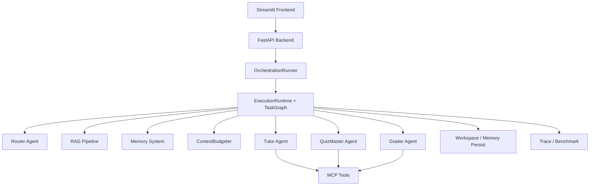
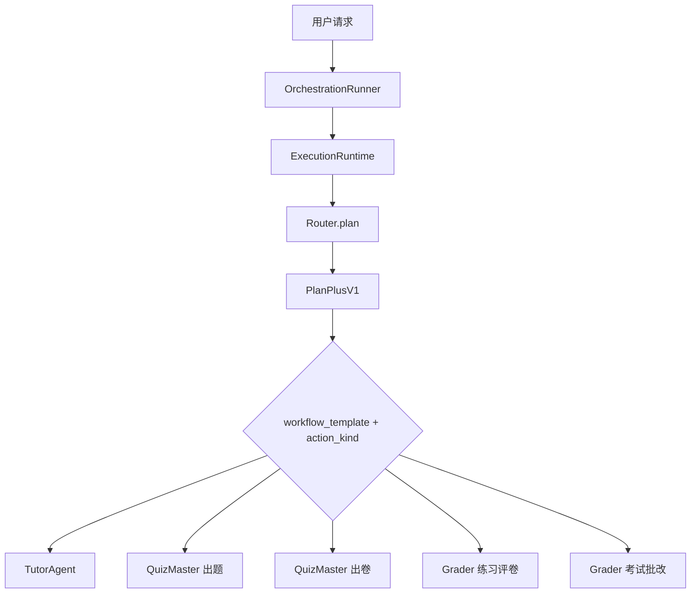
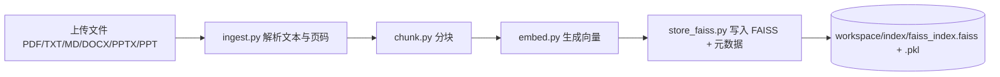
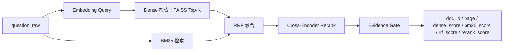
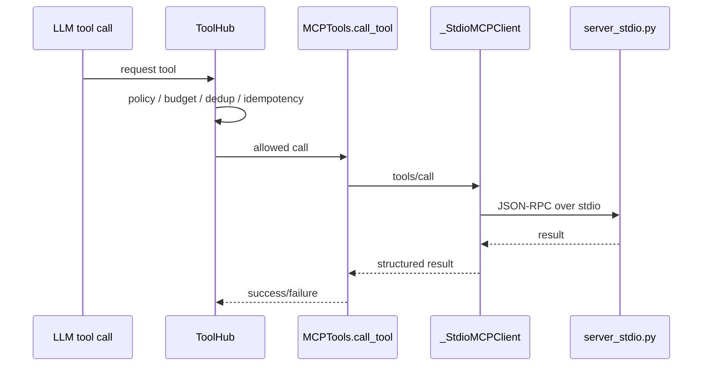
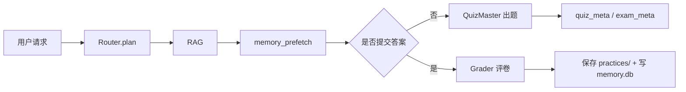
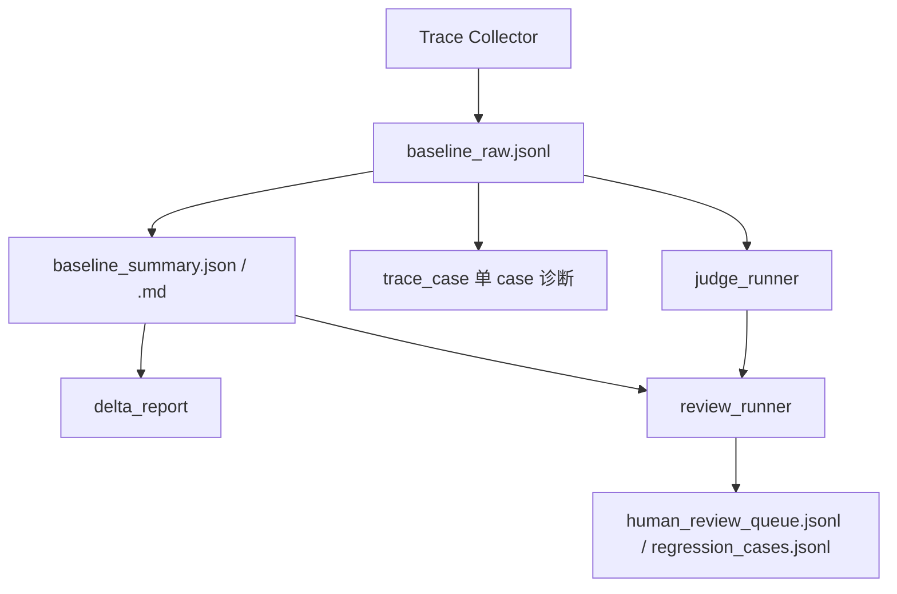

# CoursePilot 架构说明（v3 详细版）

更新时间：2026-04-17

本文档面向开发者，描述当前代码真实实现的架构与执行链路，不描述废弃路径。若文档与代码冲突，以代码为准。

本文和其他文档的分工如下：

- `README.md`：项目首页与最短启动入口
- `docs/guides/usage.md`：面向使用者的完整操作手册
- `docs/guides/config-overview.md`：环境变量与运行参数字典
- `docs/guides/evaluation.md`：bench / judge / review 评测手册

---

## 目录

- [1 项目概述](#1-项目概述)
- [2 整体架构总览](#2-整体架构总览)
  - [2.1 模块地图](#21-模块地图)
  - [2.2 请求生命周期](#22-请求生命周期)
  - [2.3 启动阶段生命周期](#23-启动阶段生命周期)
- [3 多 Agent 编排](#3-多-agent-编排)
  - [3.1 设计目标](#31-设计目标)
  - [3.2 Agent 职责矩阵](#32-agent-职责矩阵)
  - [3.3 Router 与 Runtime 的分工](#33-router-与-runtime-的分工)
  - [3.4 执行关系与状态传递](#34-执行关系与状态传递)
  - [3.5 关键参数与取舍](#35-关键参数与取舍)
- [4 核心数据结构](#4-核心数据结构)
  - [4.1 PlanPlusV1](#41-planplusv1)
  - [4.2 SessionStateV1](#42-sessionstatev1)
  - [4.3 PrefetchBundleV1 与 AgentContextV1](#43-prefetchbundlev1-与-agentcontextv1)
  - [4.4 RequestContext](#44-requestcontext)
  - [4.5 TaskGraphV1](#45-taskgraphv1)
  - [4.6 ToolDecision / ToolAuditRecord](#46-tooldecision--toolauditrecord)
- [5 Router 与规划链路](#5-router-与规划链路)
  - [5.1 Router 输出目标](#51-router-输出目标)
  - [5.2 Structured Output 与本地校验](#52-structured-output-与本地校验)
  - [5.3 Retry 与默认兜底](#53-retry-与默认兜底)
  - [5.4 workflow_template 与 action_kind](#54-workflow_template-与-action_kind)
- [6 Runtime 与 TaskGraph](#6-runtime-与-taskgraph)
  - [6.1 Runtime 的职责](#61-runtime-的职责)
  - [6.2 TaskGraph 步骤集](#62-taskgraph-步骤集)
  - [6.3 Replan 与 fail-closed](#63-replan-与-fail-closed)
- [7 RAG 系统](#7-rag-系统)
  - [7.1 设计目标](#71-设计目标)
  - [7.2 组件组成](#72-组件组成)
  - [7.3 离线建库链路](#73-离线建库链路)
    - [7.3.1 文档解析能力表](#731-文档解析能力表)
    - [7.3.2 文本切块](#732-文本切块)
  - [7.4 在线检索链路](#74-在线检索链路)
    - [7.4.1 检索阶段对照表](#741-检索阶段对照表)
    - [7.4.2 嵌入模型与预热](#742-嵌入模型与预热)
    - [7.4.3 检索模式与 RRF](#743-检索模式与-rrf)
    - [7.4.4 课程级 retriever cache](#744-课程级-retriever-cache)
    - [7.4.5 question_raw 优先与 rewrite fallback](#745-question_raw-优先与-rewrite-fallback)
    - [7.4.6 证据准入与 retrieval_empty](#746-证据准入与-retrieval_empty)
  - [7.5 关键参数与取舍](#75-关键参数与取舍)
- [8 上下文工程](#8-上下文工程)
  - [8.1 设计目标](#81-设计目标)
  - [8.2 上下文来源分层](#82-上下文来源分层)
  - [8.3 ContextBudgeter](#83-contextbudgeter)
  - [8.4 工具轮上下文瘦身](#84-工具轮上下文瘦身)
  - [8.5 retrieval_empty 对 Agent 的约束](#85-retrieval_empty-对-agent-的约束)
- [9 记忆系统](#9-记忆系统)
  - [9.1 设计目标](#91-设计目标)
  - [9.2 存储模型](#92-存储模型)
  - [9.3 用户画像与情景记忆](#93-用户画像与情景记忆)
  - [9.4 写入策略](#94-写入策略)
  - [9.5 检索策略与 memory_prefetch](#95-检索策略与-memory_prefetch)
  - [9.6 空结果与真实失败的语义](#96-空结果与真实失败的语义)
- [10 MCP 与工具调用](#10-mcp-与工具调用)
  - [10.1 设计目标](#101-设计目标)
  - [10.2 调用链路](#102-调用链路)
  - [10.3 MCP 协议实现](#103-mcp-协议实现)
  - [10.4 ToolHub 治理](#104-toolhub-治理)
  - [10.5 工具能力矩阵](#105-工具能力矩阵)
- [11 Agent 专项章节](#11-agent-专项章节)
  - [11.1 Tutor](#111-tutor)
  - [11.2 QuizMaster](#112-quizmaster)
  - [11.3 Grader](#113-grader)
- [12 核心数据流](#12-核心数据流)
  - [12.1 学习模式](#121-学习模式)
  - [12.2 练习模式](#122-练习模式)
  - [12.3 考试模式](#123-考试模式)
- [13 数据存储结构](#13-数据存储结构)
- [14 评测系统](#14-评测系统)
  - [14.1 设计目标](#141-设计目标)
  - [14.2 数据集体系](#142-数据集体系)
  - [14.3 离线评测链路](#143-离线评测链路)
  - [14.4 在线评测链路](#144-在线评测链路)
  - [14.5 指标体系](#145-指标体系)
  - [14.6 当前最新结果](#146-当前最新结果)
  - [14.7 当前问题与解读边界](#147-当前问题与解读边界)
- [15 工程化补充](#15-工程化补充)
  - [15.1 当前仓库结构](#151-当前仓库结构)
  - [15.2 关键配置速查表](#152-关键配置速查表)
  - [15.3 安全与可靠性清单](#153-安全与可靠性清单)
  - [15.4 扩展点索引表](#154-扩展点索引表)
  - [15.5 调试入口表](#155-调试入口表)
  - [15.6 术语速查](#156-术语速查)

---

## 1 项目概述

CoursePilot 是一个面向大学课程学习场景的多 Agent 学习系统。它围绕“教材接入 -> 讲解学习 -> 练习 / 考试 -> 记忆沉淀 -> 评测闭环”的全过程设计，目标不是做一个通用聊天机器人，而是做一个可引用、可追踪、可评测、可持续优化的课程学习平台。

与通用 Chat 工具相比，当前系统的关键特征是：

1. **RAG 是主链路而不是可选增强**：回答优先建立在教材证据之上，并保留引用来源。
2. **中心编排而不是自由自治**：系统由 `OrchestrationRunner` 与 `ExecutionRuntime` 显式控制，不依赖多个 Agent 自由协商。
3. **MCP 统一承载工具调用**：全部工具统一走 `mcp_stdio`，并通过 ToolHub 做权限、预算、去重与审计治理。
4. **上下文工程与长期记忆协同工作**：短期上下文负责 prompt 质量，长期记忆负责跨会话画像与历史事件。
5. **评测系统内建到主链路**：trace、benchmark、judge、review 共用统一事件源，便于持续优化。

---

## 2 整体架构总览

当前系统主链路由 `Streamlit -> FastAPI -> OrchestrationRunner -> ExecutionRuntime / TaskGraph -> Agents / RAG / Memory / MCP Tools -> SSE / Persist / Metrics` 组成。



### 2.1 模块地图

| 模块 | 主要目录 | 解决的问题 | 核心输入 | 核心输出 | 关键协作对象 |
|---|---|---|---|---|---|
| 前端 | `frontend/` | 课程管理、模式切换、对话 UI、SSE 渲染 | 用户输入、课程状态 | HTTP 请求、SSE 消费结果 | API |
| API | `backend/` | `/chat`、`/chat/stream`、课程与文件接口 | HTTP / JSON | `ChatResponse` / SSE 事件流 | Runner |
| 编排入口 | `core/orchestration/` | SessionState 恢复、兼容旧入口、调用 Runtime | request、history | Runtime 执行结果 | Runtime |
| 运行时 | `core/runtime/` | 编译 TaskGraph、执行模板、统一持久化 | plan / state | graph / patches / side effects | Agents / Services |
| Agents | `core/agents/` | Router、Tutor、QuizMaster、Grader | plan、上下文、tool result | 回答、题目、评分 | Runtime / MCP |
| Services | `core/services/` | RAG / Memory / ToolHub / Workspace / shadow eval | 业务请求 | context、审计、落盘 | Runtime |
| RAG | `rag/` | 文档解析、切块、嵌入、索引、检索 | 文档 / query | chunks、citations | Runtime |
| Memory | `memory/` | 长期记忆写入、检索、画像 | episodes、profiles、query | snippets / profile context | Runtime |
| MCP | `mcp_tools/` | stdio MCP client/server 与工具实现 | tool call / args | structured result | ToolHub |
| 评测 | `scripts/perf/` + `scripts/eval/` | bench / judge / review | trace / data | raw / summary / report | Metrics |

### 2.2 请求生命周期

#### 流式 `/chat/stream`

```mermaid
flowchart LR
    U[User] --> API[/chat/stream]
    API --> SS[load SessionState]
    SS --> RUN[OrchestrationRunner]
    RUN --> RT[ExecutionRuntime]
    RT --> PLAN[Router -> PlanPlusV1]
    RT --> PREFETCH[RAG + Memory Prefetch]
    PREFETCH --> ACTX[Agent.build_context]
    ACTX --> EXEC[Tutor / QuizMaster / Grader]
    EXEC --> TOOL[ToolHub -> MCP]
    EXEC --> SSE[SSE events]
    SSE --> UI[Frontend]
    EXEC --> SAVE[session / records / memory]
    SAVE --> SHADOW[optional shadow eval enqueue]
```

#### 非流式 `/chat`

非流式路径与流式路径共享绝大多数执行逻辑，区别在于最终返回 `ChatResponse` 而不是 SSE 事件流。

### 2.3 启动阶段生命周期

服务启动时会先恢复工作区并启动后台维护任务：

1. `load_workspaces_from_disk()`：恢复课程工作区元信息
2. session cleanup worker：定期清理过期 `sessions/*.json`
3. online shadow eval worker：后台处理评测队列
4. embedding preload：若 `EMBEDDING_PRELOAD_ON_STARTUP=1`，在启动时预热嵌入模型
5. rerank preload：若 `RERANK_ENABLED=1` 且 `RERANK_PRELOAD_ON_STARTUP=1`，在启动时预热 reranker

当前 API 层的启动日志会区分：

- `embedding_preload_start`
- `embedding_preload_success`
- `embedding_preload_failed`
- `rerank_preload_start`
- `rerank_preload_success`
- `rerank_preload_failed`

---

## 3 多 Agent 编排

### 3.1 设计目标

多 Agent 编排解决的问题，不是“让多个模型同时对话”，而是把复杂学习请求拆成更稳定的职责链。当前设计选择的是“中心编排 + 专职 Agent”，原因是：

- 课程链路有显著的流程阶段：规划、检索、记忆预取、上下文组织、讲解、出题、评卷、落盘
- 这些阶段中有大量硬逻辑和状态切换，不适合全部交给 LLM 自由决定
- Python 编排器可以把模式切换、元数据传递、工具约束、落盘与事件观测写成稳定代码

### 3.2 Agent 职责矩阵

| Agent / 组件 | 主要任务 | 主要输入 | 主要输出 | 工具权限 | 是否流式 |
|---|---|---|---|---|---|
| `OrchestrationRunner` | 兼容入口、状态恢复、调用 Runtime | request、history | Runtime 调用结果 | 不直接发起工具调用 | learn / practice / exam 支持 |
| `ExecutionRuntime` | 编译 TaskGraph、执行步骤、统一持久化 | `PlanPlusV1`、`SessionStateV1` | graph / context / patches | 不直接发起工具调用 | 支持 |
| `RouterAgent` | 把自然语言请求映射成结构化 plan | 用户消息、画像摘要 | `PlanPlusV1` | 无直接工具调用 | 非流式 |
| `TutorAgent` | 学习模式主执行，负责 ReAct 教学回答 | context、citations、memory | 教学回答、引用、工具日志 | 6 类工具受治理放开 | 流式 |
| `QuizMasterAgent` | 练习 / 考试出题出卷 | context、plan、citations、memory | quiz / exam artifact、meta | 以最小外部调用为主 | 主要流式 |
| `GraderAgent` | 练习 / 考试评分讲解 | 学生答案、标准答案、评分规则、memory | grading report、讲评、记录落盘 | 严格收敛到 `calculator` | 流式 |

### 3.3 Router 与 Runtime 的分工

这是当前 v3 里最重要的分层之一：

- **Router**：负责“规划”
  - 识别 `resolved_mode`
  - 生成 `workflow_template + action_kind`
  - 提供 `question_raw / user_intent / retrieval_query / memory_query`
  - 给出 `allowed_tool_groups / permission_mode / tool_budget`
- **Runtime**：负责“执行”
  - 编译 TaskGraph
  - 做模板前置条件校验
  - 并行预取 RAG / memory
  - 调用具体 Agent
  - 统一持久化与图状态刷新

也就是说，旧版“中心 Runner 一把抓”的描述已经不准确。当前更准确的说法是：

`Runner（兼容入口） -> Runtime（治理与执行） -> Services（RAG / Memory / ToolHub） -> Agent（业务表达）`

### 3.4 执行关系与状态传递



状态在链路中的传递方式：

| 元数据 / 状态 | 生产方 | 消费方 | 用途 |
|---|---|---|---|
| `PlanPlusV1` | Router | Runtime / Agents | 决定模板、模式、检索与工具约束 |
| `SessionStateV1` | Runner / Runtime | Runtime / Agents / WorkspaceStore | 短期状态真源 |
| `PrefetchBundleV1` | Runtime | Agent | 候选上下文材料 |
| `AgentContextV1` | Agent.build_context | Agent.execute | 最终执行上下文 |
| `StatePatchV1` | Agent | Runtime / SessionState | 增量回写 |
| `quiz_meta / exam_meta` | QuizMaster | Runner / Grader | 评分链路元数据 |

### 3.5 关键参数与取舍

| 决策点 | 当前方案 | 替代方案 | 当前为什么这样做 |
|---|---|---|---|
| 总体架构 | 中心编排 + 专职 Agent | 自治 Agent 群 | 模式切换、状态传递、工具权限与落盘更可控 |
| Router 角色 | 路由 + query rewrite + 安全默认值 | 只做 `need_rag` 判定 | 需要把同一问题拆成回答侧与检索侧视角 |
| 工具权限 | `ToolPolicy + ToolHub + Agent 实现` 三层控制 | 仅 prompt 白名单 | 降低误调工具和循环调用风险 |
| 评分工具 | `calculator` 单工具收敛 | 多工具放开 | practice / exam 评分稳定性优先 |

---

## 4 核心数据结构

### 4.1 PlanPlusV1

`PlanPlusV1` 是 Router 的结构化规划结果，在兼容旧 `Plan` 的基础上增加了运行时需要的字段。

关键字段：

| 字段 | 作用 |
|---|---|
| `resolved_mode` | 当前实际执行模式 |
| `workflow_template` | 允许的模板集合之一 |
| `action_kind` | 模板内的执行语义 |
| `question_raw` | 用户原问题，必须保真 |
| `retrieval_query` | 面向教材检索的 query |
| `memory_query` | 面向记忆检索的 query |
| `allowed_tool_groups` | 允许的工具组 |
| `tool_budget` | 当前请求的工具预算 |
| `permission_mode` | `safe / standard / elevated` |
| `replan_policy` | 是否允许单次重规划 |

### 4.2 SessionStateV1

`SessionStateV1` 是服务端短期状态真源，持久化到：

`data/workspaces/<course>/sessions/<session_id>.json`

它负责跨 Agent 共享短期状态，而不是把状态隐式塞进 prompt。

核心字段：

| 字段 | 作用 |
|---|---|
| `requested_mode_hint` / `resolved_mode` | 区分用户偏好与最终模式 |
| `task_full_text` / `task_summary` | 当前任务文本 |
| `question_raw / user_intent / retrieval_query / memory_query` | 规划结果缓存 |
| `current_stage / current_step_index` | 当前执行阶段 |
| `history_summary_state` | 历史滚动摘要状态 |
| `active_practice / active_exam` | 当前可评分 artifact |
| `latest_submission / latest_grading` | 最近提交与评分结果 |
| `permission_mode` | 当前请求的权限模式 |
| `fallback_flags` | 本轮降级 / 回退信息 |
| `metadata` | 扩展区，如 taskgraph route、更新时刻等 |

### 4.3 PrefetchBundleV1 与 AgentContextV1

`PrefetchBundleV1` 表示 Runtime 的候选上下文材料，字段前缀是 `candidate_*`，表示“可选，不等于最终注入”。

`AgentContextV1` 是 Agent 的只读上下文快照，包含：

- `history_context`
- `rag_context`
- `memory_context`
- `merged_context`
- `citations`
- `constraints`
- `tool_scope`
- `metadata`

换句话说：**Runtime 负责备料，Agent 负责选料。**

### 4.4 RequestContext

`RequestContext` 位于 `core/runtime/request_context.py`，是请求级共享上下文，使用 `contextvars` 绑定到当前请求。

固定字段包括：

- `request_id`
- `course_name`
- `mode`
- `user_id`
- `trace_id`
- `budget_state`
- `tool_audit`
- `idempotency_namespace`

它解决的问题是：不要把请求级可变状态挂在模块级变量上，避免并发串线。

### 4.5 TaskGraphV1

`TaskGraphV1` 是 Runtime 编译后的可执行图。它不是通用 DAG 引擎，而是当前白名单步骤集合的结构化描述。

关键字段：

- `workflow_template`
- `action_kind`
- `route`
- `steps[]`
- `metadata`

每个 `TaskGraphStepV1` 都包含：

- `step_name`
- `phase`
- `status`
- `side_effect`
- `stream`
- `metadata`

### 4.6 ToolDecision / ToolAuditRecord

ToolHub 中最关键的两个结构：

| 类型 | 作用 |
|---|---|
| `ToolDecision` | 某次工具调用是否允许、为什么允许/拒绝 |
| `ToolAuditRecord` | 某次工具调用最终的审计记录 |

`ToolAuditRecord` 会记录：

- `tool_name`
- `signature`
- `permission_mode`
- `allowed`
- `reason`
- `success`
- `dedup_hit`
- `idempotency_key`
- `failure_class`
- `via`
- `elapsed_ms`

---

## 5 Router 与规划链路

### 5.1 Router 输出目标

Router 需要把自然语言请求映射成一份可执行 plan。它不仅仅判断“要不要检索”，还必须回答：

1. 当前应该走哪个模式
2. 应该执行哪个模板
3. 回答问题本身是什么
4. 检索问题应该是什么
5. 记忆查询应该是什么
6. 工具权限和预算是什么

### 5.2 Structured Output 与本地校验

Router 当前优先使用 strict `json_schema` 输出，而不是仅靠 prompt 要求“请输出 JSON”。

链路大致是：

1. 先尝试 structured output
2. 本地校验必填字段与枚举合法性
3. 进入 `_normalize_plan()` 补安全默认值

本地重点校验：

- `question_raw / retrieval_query / memory_query` 不为空
- `workflow_template / action_kind / required_artifact_kind` 在允许集合中
- `route_confidence` 可归一到 `0~1`

### 5.3 Retry 与默认兜底

如果 strict 输出失败或本地校验失败，Router 会自动重试一次；仍失败再进入默认 plan。

结构化 telemetry 包括：

- `router_plan_parse_failed`
- `router_plan_retry`
- `router_plan_fallback_default`
- `router_plan_output_mode`

这比旧版“一次 parse fail 就 defaults”更稳。

### 5.4 workflow_template 与 action_kind

当前固定模板集合：

- `learn_only`
- `practice_only`
- `exam_only`
- `learn_then_practice`
- `practice_then_review`
- `exam_then_review`

对应动作语义：

| workflow_template | action_kind | 说明 |
|---|---|---|
| `learn_only` | `learn_explain` | 仅讲解 |
| `practice_only` | `practice_generate` | 仅出题，不评分 |
| `exam_only` | `exam_generate` | 仅出卷，不评分 |
| `learn_then_practice` | `learn_then_practice` | 先讲解后练习 |
| `practice_then_review` | `practice_grade` | 对现有练习评分 |
| `exam_then_review` | `exam_grade` | 对现有试卷评分 |

---

## 6 Runtime 与 TaskGraph

### 6.1 Runtime 的职责

`ExecutionRuntime` 是 v3 当前的主执行路径。它负责：

- 编译白名单 TaskGraph
- 验证模板前置条件
- 构建 RequestContext
- 并行预取 RAG / memory
- 调用对应 Agent
- 统一执行 `persist_*` 步骤
- 把执行状态刷新回 SessionState

它不负责：

- 自行决定最终上下文文本细节
- 替 Agent 做业务知识判断

### 6.2 TaskGraph 步骤集

当前支持的 step name 包括：

- `plan_intent`
- `prefetch_rag`
- `prefetch_memory`
- `build_agent_context`
- `detect_submission`
- `run_tutor`
- `run_quiz`
- `run_exam`
- `run_grade`
- `persist_session_state`
- `persist_records`
- `persist_memory`
- `synthesize_final`

这些步骤不是每个请求都全部执行，Runtime 会根据模板与当前状态标记 `completed / skipped`。

### 6.3 Replan 与 fail-closed

前置条件失败时：

- `practice_then_review` 需要可评分的 `active_practice`
- `exam_then_review` 需要可评分的 `active_exam`

当前策略是：

1. 尝试一次 replan
2. 再失败则 fail-closed，不勉强执行错误链路

---

## 7 RAG 系统

### 7.1 设计目标

RAG 在当前系统里不是可选增强，而是回答可信度的基础设施。它承担两个职责：

1. 把课程资料转成可检索知识索引
2. 在问答时返回带出处的教材证据，供模型做有依据的生成和引用

### 7.2 组件组成

| 组件 | 所在目录 / 文件 | 主要职责 |
|---|---|---|
| Ingest | `rag/ingest.py` | 多格式文档解析 |
| Chunker | `rag/chunk.py` | `fixed` / `chapter_hybrid` 切块 |
| Embedder | `rag/embed.py` | 生成查询向量和文档向量 |
| Vector Store | `rag/store_faiss.py` | FAISS 索引与元数据持久化 |
| Lexical | `rag/lexical.py` | BM25 词法检索 |
| Retriever | `rag/retrieve.py` | dense / bm25 / hybrid 检索、RRF、格式化 citations |
| RAGService | `core/services/rag_service.py` | 课程级缓存、evidence gate、rewrite fallback |

### 7.3 离线建库链路



#### 7.3.1 文档解析能力表

| 文件类型 | 当前解析方式 | 页码/来源保留方式 | 备注 / 限制 |
|---|---|---|---|
| `PDF` | `PyMuPDF` | `page = page_num + 1` | 当前不做 OCR |
| `TXT` | 文本读取 + 编码回退 | 文档级来源 | `utf-8-sig -> utf-8 -> gbk -> latin-1` |
| `MD` | 文本读取 | 文档级来源 | 标题可辅助切块 |
| `DOCX` | `python-docx` | 文档级来源 | 复杂表格支持有限 |
| `PPTX` | 逐 slide 抽取 | 每张 slide 视为一页 | 适合课件 |
| `PPT` | COM 转 `.pptx` 后解析 | 转换后按 slide 解析 | 依赖 Windows / Office |

#### 7.3.2 文本切块

当前提供两种切块策略：

| 策略 | 当前作用 | 规则 | 失败回退 |
|---|---|---|---|
| `fixed` | 最基础的稳定切块方式 | 固定窗口 + overlap | 参数异常时自动收敛 |
| `chapter_hybrid` | 当前默认策略 | 先识别章节，再在章内做固定字符切块 | 标题识别失败回退 `fixed` |

每个 chunk 会保留：

- `doc_id`
- `page`
- `chunk_id`
- `chapter`
- `section`

### 7.4 在线检索链路



#### 7.4.1 检索阶段对照表

| 阶段 | 组件 | 输入 | 输出 | 说明 |
|---|---|---|---|---|
| Query Encoding | `embed.py` | query | query embedding | BGE 中文模型会自动补 query instruction |
| Dense Retrieval | `store_faiss.py` | embedding | FAISS Top-K | 当前为精确检索 |
| Lexical Retrieval | `lexical.py` | query | BM25 排序结果 | 作为 dense 补充通道 |
| Hybrid Fusion | `retrieve.py` | dense + bm25 排名 | fused candidate pool | 当前采用 RRF |
| Rerank | `rerank.py` + `retrieve.py` | fused candidates | reranked chunks | 当前默认覆盖 `learn/practice` |
| Citation Binding | `retrieve.py` | metadata | `RetrievedChunk` | 保留多分数字段 |
| Evidence Gate | `rag_service.py` | ranked chunks | gated chunks | 过滤弱证据 |

#### 7.4.2 嵌入模型与预热

| 项目 | 当前实现 |
|---|---|
| 默认模型 | `BAAI/bge-base-zh-v1.5` |
| 设备选择 | `EMBEDDING_DEVICE=auto|cuda|cpu` |
| 默认 batch | GPU `256` / CPU `32` |
| 归一化 | `normalize_embeddings=True` |
| 预热 | `EMBEDDING_PRELOAD_ON_STARTUP=1` 时，服务启动即预热 |

Rerank 当前实现：

| 项目 | 当前实现 |
|---|---|
| 默认模型 | `BAAI/bge-reranker-base` |
| 覆盖范围 | `learn/practice` |
| 候选规模 | `RERANK_CANDIDATES_LEARN_PRACTICE=12` |
| 设备选择 | `RERANK_DEVICE=auto|cuda|cpu` |
| 预热 | `RERANK_PRELOAD_ON_STARTUP=1` 时，服务启动即预热 |

#### 7.4.3 检索模式与 RRF

当前支持三种模式：

- `dense`
- `bm25`
- `hybrid`

`hybrid` 默认使用 RRF 融合。这里要特别注意：

- `rrf_score` 是融合排序分，不是语义相似度
- `rerank_score` 是 Cross-Encoder 精排分，只有 `learn/practice` 默认会产出
- `dense_score` 与 `bm25_score` 量纲不同，不能直接横向比较
- 前端当前显示多列分数，是为了帮助调试与解释，不是让用户拿它们当统一置信度
- 当前默认链路是 `dense + bm25 -> RRF -> rerank(top12) -> final top_k -> evidence gate`

#### 7.4.4 课程级 retriever cache

`RAGService` 会为每门课程缓存 retriever，缓存键由：

- `course_name`
- `index_abs_path`
- `faiss_mtime`
- `pkl_mtime`

共同决定。任一索引文件时间戳变化，就会自动失效并重建。

#### 7.4.5 question_raw 优先与 rewrite fallback

当前检索顺序是：

1. 先用 `question_raw`
2. 如果证据门槛未通过，再尝试 `retrieval_query`

因此 rewrite 现在是**回退路径**，而不是第一轮主查询。

观测字段包括：

- `effective_query`
- `query_source = question_raw | retrieval_query_fallback`
- `rewrite_fallback_triggered`

#### 7.4.6 证据准入与 retrieval_empty

当前 evidence gate 规则：

- `dense_score >= 0.40` 或 `bm25_score >= 1.0`
- 且融合排名前 `4`

若全部候选都未通过：

- `citations=[]`
- `retrieval_empty=True`
- `rag_context` 注入显式未命中文案

这意味着现在“有 chunk”不等于“有可引用证据”。

### 7.5 关键参数与取舍

| 决策点 | 当前方案 | 替代方案 | 当前为什么这样做 |
|---|---|---|---|
| 检索模式 | `hybrid` | 单路 dense | 兼顾语义与术语命中 |
| 第一查询源 | `question_raw` | 直接 rewrite | 减少 query 漂移 |
| 证据门槛 | dense/bm25/rank 三重门槛 | “有 chunk 就算命中” | 防止弱证据进入 citations |
| 缓存策略 | 课程级 retriever cache | 每轮重建 | 降低尾延迟 |

---

## 8 上下文工程

### 8.1 设计目标

上下文工程的目标不是尽可能塞更多文本，而是在预算内保留“对当前任务最有帮助的结构化信息”。

### 8.2 上下文来源分层

当前上下文至少来自四类来源：

1. 最近 history
2. RAG citations / snippets
3. memory snippets
4. tool budget / constraints / mode hints

这些来源不会直接粗暴拼接，而是先进入 `PrefetchBundleV1`，再由 Agent 做最终选择。

### 8.3 ContextBudgeter

`ContextBudgeter` 负责统一裁剪与压缩，控制：

- 总预算
- history 占比
- RAG / memory 的注入量
- LLM 压缩是否触发

当前策略是预算器统一管理，而不是由不同 Agent 各写一套 token 控制逻辑。

### 8.4 工具轮上下文瘦身

工具链路采用“Act -> Tool -> Synthesize”结构，最终用户可见回答来自 synthesize 阶段，而不是直接把工具轮原始内容暴露出去。

这带来两个好处：

- 工具日志不会直接污染最终回答
- 可以在 synthesize 时统一加入“工具失败摘要”“retrieval_empty 说明”等硬约束

### 8.5 retrieval_empty 对 Agent 的约束

`retrieval_empty=True` 时，Tutor / QuizMaster / Grader 都会收到明确约束：

- 必须说明未找到可靠教材片段
- 不能伪造教材引用
- 如继续回答，应明确是基于已有上下文或通用知识

---

## 9 记忆系统

### 9.1 设计目标

记忆系统解决两个问题：

1. 保存跨会话学习轨迹
2. 为后续讲解 / 出题 / 评分提供个性化上下文

### 9.2 存储模型

长期记忆统一落到 `data/memory/memory.db`，当前后端使用 SQLite + FTS5。

主要资源：

| 表 / 资源 | 作用 |
|---|---|
| `episodes` | 保存 `qa / qa_summary / practice / mistake / exam` 事件 |
| `user_profiles` | 保存薄弱点、掌握度、练习统计等聚合画像 |
| `episodes_fts` | 提供全文检索能力 |

### 9.3 用户画像与情景记忆

这部分一定要分开理解：

- **用户画像**：稳定状态，如弱项、掌握度、偏好。默认轻量注入 Router / Tutor / QuizMaster / Grader。
- **情景记忆**：具体历史事件，如某次练习、某次错题、某次考试。按需检索，不是每轮都必须命中。

### 9.4 写入策略

当前写入策略：

| 模式 | 什么时候写 | 写什么 |
|---|---|---|
| learn | 显式“请记住”时 | `qa` |
| practice | 评分完成后 | `practice` / `mistake` |
| exam | 批改完成后 | `exam` / `mistake` |

### 9.5 检索策略与 memory_prefetch

`MemoryService.prefetch_history_ctx()` 负责 Runtime 侧记忆预取。它当前特征：

- 按意图触发，而不是每轮强制触发
- 使用 request 级缓存，避免同一请求重复查询
- 允许在“成功但空结果”场景下放宽 metadata 过滤

### 9.6 空结果与真实失败的语义

这是当前记忆链路里最容易误解的点：

- `success=True, results=[]`：代表工具调用成功，但没找到对应记忆
- `success=False`：代表真实工具失败

当前收敛后的行为是：

- 空结果可以继续 fallback
- 真实失败只记一次逻辑失败，不再刷三连失败日志

---

## 10 MCP 与工具调用

### 10.1 设计目标

MCP 层的目标不是“把工具包装成协议”这么简单，而是给工具调用提供统一边界、统一观测和统一治理。

### 10.2 调用链路



### 10.3 MCP 协议实现

当前主链路是 `mcp_stdio`：

- client：`mcp_tools/client.py::_StdioMCPClient`
- server：`mcp_tools/server_stdio.py`

特征：

- 子进程懒启动
- `initialize -> notifications/initialized`
- `Content-Length` framing
- 超时控制与有限重连
- 默认不做本地 fallback

只有当 `MCP_INPROCESS_FASTPATH=1` 时，对少量低风险本地工具开放进程内快路径；默认值是关闭。

### 10.4 ToolHub 治理

ToolHub 是工具调用的统一入口，当前治理能力包括：

- 权限模式：`safe / standard / elevated`
- 工具组门控：`allowed_tool_groups`
- 工具预算：总量、每轮、每工具上限
- 去重与幂等：`signature / idempotency_key`
- request 级审计：`tool_audit`
- 工具失败分类：`retryable_error / fatal_error`

### 10.5 工具能力矩阵

| 工具 | 主要用途 | 常见触发场景 | 返回语义 |
|---|---|---|---|
| `calculator` | 数学运算 | 评分链路、数值题 | 结构化数值结果 |
| `websearch` | 教材外信息补充 | 时效 / 外部背景 | `results` 列表 |
| `memory_search` | 历史记忆检索 | 后台个性化、用户主动回顾 | `results / count` |
| `mindmap_generator` | Mermaid 思维导图 | 总结、知识梳理 | Mermaid 文本 |
| `get_datetime` | 当前时间 | 时间相关问答 | 结构化时间结果 |
| `filewriter` | 写课程 `notes/` | 保存笔记、导出内容 | success + path |

---

## 11 Agent 专项章节

### 11.1 Tutor

Tutor 是学习模式主执行 Agent，负责：

- 组织最终教学回答
- 协调工具调用
- 结合 citations 做基于教材的讲解
- 在 `retrieval_empty=True` 时显式说明未命中教材

Tutor 的关键特征：

- 上下文由 `build_context()` 显式构造
- 可调工具较多，但受 ToolHub 与 prompt 双重约束
- 最终对用户可见的文本来自 synthesize 阶段

### 11.2 QuizMaster

QuizMaster 负责 practice / exam 的出题与出卷。

关键特征：

- 输出结构化 `PracticeArtifactV1` / `ExamArtifactV1`
- 会产出 `quiz_meta / exam_meta`
- 多题练习和考试共用试卷型 artifact 思路
- `retrieval_empty=True` 时要显式说明题目未严格建立在可靠教材片段上

### 11.3 Grader

Grader 负责 practice / exam 的评分讲解。

关键特征：

- 评分输入优先来自 artifact，而不是从 history 猜题
- 工具严格收敛到 `calculator`
- 评分完成后会触发记录落盘与记忆写入
- `retrieval_empty=True` 时不得伪造教材引用

---

## 12 核心数据流

### 12.1 学习模式


阶段表：

| 阶段 | 关键组件 | 输入 | 输出 | 是否写记忆 / 落盘 |
|---|---|---|---|---|
| 规划 | Router | 用户消息、画像 | `PlanPlusV1` | 否 |
| 检索 | RAGService | `question_raw / retrieval_query` | chunks、citations | 否 |
| 记忆预取 | MemoryService | `memory_query` | memory snippets | 否 |
| 上下文构建 | Budgeter + Tutor | history、rag、memory | agent context | 否 |
| 执行 | Tutor | context、tools | 教学回答 | 否 |
| 持久化 | Runner / Memory | 显式长期记忆请求 | `qa` | 条件写 |

### 12.2 练习模式



关键点：

- 多题练习会走试卷型 artifact
- 提交答案后根据 `quiz_meta / exam_meta` 决定评分链路

### 12.3 考试模式


考试模式的关键差异：

- 检索 top-k 更大
- 出卷与批改是显式分离的两阶段
- 评分后同时保存用户可读记录和长期记忆

---

## 13 数据存储结构

课程工作区以 `data/workspaces/<course_name>/` 为根。当前真实目录结构是：

```text
data/
├─ memory/
│  └─ memory.db
└─ workspaces/
   └─ <course_name>/
      ├─ uploads/
      ├─ index/
      │  ├─ faiss_index.faiss
      │  └─ faiss_index.pkl
      ├─ notes/
      ├─ mistakes/
      │  └─ mistakes.jsonl
      ├─ practices/
      ├─ exams/
      ├─ sessions/
      │  └─ <session_id>.json
      └─ metadata.json
```

这里要特别修正一个旧文档遗留问题：当前真实目录是 `index/`，不是 `indexes/`。

各资源的读写职责：

| 路径 / 资源 | 存储格式 | 写入时机 | 读取时机 |
|---|---|---|---|
| `uploads/` | 原始教材文件 | 上传资料时 | 建索引时 |
| `index/` | `.faiss + .pkl` | build-index 时 | RAG 检索时 |
| `notes/` | Markdown / 文本 | `filewriter` 时 | 用户查看时 |
| `practices/` | Markdown | practice 评分完成后 | 用户回看时 |
| `exams/` | Markdown | exam 批改完成后 | 用户回看时 |
| `mistakes/mistakes.jsonl` | JSONL | 保存错题时 | 后续分析时 |
| `sessions/*.json` | JSON | 每轮请求结束时 | 下轮恢复时 |
| `data/memory/memory.db` | SQLite | 记忆写入 / 画像更新 | 画像注入 / memory_search 时 |

---

## 14 评测系统

### 14.1 设计目标

评测系统的目标不是只输出一个平均耗时，而是对多 Agent + RAG + MCP 系统做结构化拆解，统一观察：

- 客观性能是否退化
- 教材命中与引用质量是否稳定
- 多 Agent / ToolHub / SessionState 行为是否符合预期
- 主观回答质量是否仍然可接受
- 是否需要进入人工复核队列

当前设计不是“单一打分器”，而是四层闭环：

1. **Trace / Benchmark**：从真实执行链路抽客观指标
2. **Judge**：用 LLM-as-judge 打主观分
3. **Review**：把 benchmark 与 judge 合并成 regression / human review 队列
4. **Online Shadow Eval**：从真实流量异步沉淀样本，不阻塞主回答

这样做的原因是：

- 单靠 benchmark 只能看“快不快、错没错”，看不到“答得好不好”
- 单靠 judge 容易忽略 trace contract、RAG 缺失、fallback 等工程问题
- 单靠在线样本不具备可复现性，不能替代离线回归

### 14.2 数据集体系

当前评测数据主目录是 `benchmarks/`。v3 当前采用“active canonical + candidate pool + archive”三层结构，而不再把多套历史 JSONL 混在同一层当默认入口。2026-04-15 之后，广覆盖历史套件已经迁入 `benchmarks/archive/20260415_legacy_reset/`，根目录只保留当前 active canonical 集与 gold 流水线文件。

#### 数据集分层

| 数据层 | 代表文件 | 主要用途 |
|---|---|---|
| active canonical | `cases_v1.jsonl` + `rag_gold_v1.jsonl` | 正式 benchmark 入口，只包含人工复查通过的样本 |
| candidate pool | `gold_candidates.jsonl`、`gold_manual_fix.jsonl`、`gold_rejected.jsonl`、`gold_label_sessions.jsonl` | gold 首筛、人工复查与审计留痕 |
| archive | `benchmarks/archive/20260415_legacy_reset/*` | 历史 benchmark / gold 归档与广覆盖参考套件，不参与默认离线评测 |

#### Case JSONL 结构

benchmark case 以 JSONL 存储，每行一个 case。最小必要字段是：

- `case_id`
- `mode`
- `course_name`
- `message`
- `history`

常见可选字段包括：

- `reference_answer`
- `requires_citations`
- `gold_doc_ids`
- `expected_session_events`
- `should_use_tools`
- `tags`
- `judge_profile`

这些字段共同决定一个 case 是偏 RAG 命中、会话恢复、工具治理，还是更偏主观质量评估。

#### Gold JSONL 结构

RAG gold 数据单独保存在 `rag_gold_*.jsonl`，用于把 benchmark 结果映射到“是否命中正确教材证据”。当前匹配层级按宽松顺序支持：

- `chunk_id`
- `doc_page`
- `doc_id`
- `page`
- `keyword`

这也是为什么 `gold_case_coverage` 很重要：只有被 gold 覆盖到的 case，`hit_at_k / top1_acc / precision_at_k` 才具备可解释性。

#### Gold 生产链路

当前 canonical gold 不是由 LLM 直接写入正式 `rag_gold_v1.jsonl`，而是走：

`真实主链路采样 -> gold-screen judge 首筛 -> gold_candidates.jsonl -> 人工复查 -> cases_v1/rag_gold_v1`

其中：

- `scripts/eval/build_gold_candidates.py`
  - 直接调用 `OrchestrationRunner.run()`
  - 只从已有索引课程生成 `learn + requires_citations` 样本
  - 保存回答、plan、citations、session_state、trace 摘要
- `scripts/eval/gold_screen_judge.py`
  - 使用 DeepSeek 兼容 OpenAI API 做“证据质量首筛”
  - 只判断样本是否值得进入人工复查，不替代最终人工确认
- `scripts/eval/review_gold_candidates.py`
  - 人工确认后再正式写入 `cases_v1.jsonl + rag_gold_v1.jsonl`

这样做的目的，是把“回答看起来像对的”与“证据真的足够做 canonical gold”这两件事拆开，避免错误 gold 污染后续 RAG headline。

### 14.3 离线评测链路

离线评测是发布前和回归分析的主链路，目标是“同一套 case 可重复执行、可对比 candidate 与 baseline、可人工复核”。

#### 当前实现组件

| 组件 | 所在位置 | 主要职责 |
|---|---|---|
| Trace Collector | `core/metrics/collector.py` | 请求级 `trace_scope`、`add_event`、事件汇总 |
| Benchmark Runner | `scripts/perf/bench_runner.py` | 跑真实主链路 benchmark，输出客观 summary |
| Delta Report | `scripts/perf/delta_report.py` | before / after 指标对比 |
| Trace Case | `scripts/perf/trace_case.py` | 单 case 下钻分析 |
| Judge Runner | `scripts/eval/judge_runner.py` | 对 benchmark raw 结果做回答质量 judge |
| Gold-Screen Judge | `scripts/eval/gold_screen_judge.py` | 对 sampled case 做证据质量首筛 |
| Review Runner | `scripts/eval/review_runner.py` | 合并 benchmark + judge + baseline，生成人工复核队列 |

#### 分层图



#### 结果目录与落盘结构

一个标准离线 run 典型会落到 `data/perf_runs/<run_name>/` 及其派生目录中：

- `data/perf_runs/<run_name>/baseline_raw.jsonl`
- `data/perf_runs/<run_name>/baseline_summary.json`
- `data/perf_runs/<run_name>/baseline_summary.md`
- `data/perf_runs/<run_name>_judge/judge_raw.jsonl`
- `data/perf_runs/<run_name>_judge/judge_summary.json`
- `data/perf_runs/<run_name>_review/review_summary.json`
- `data/perf_runs/<run_name>_review/regression_cases.jsonl`
- `data/perf_runs/<run_name>_review/human_review_queue.jsonl`

#### Review 阶段关注什么

`review_runner.py` 不只是“重新汇总一下分数”，它会把 candidate、judge 和可选 baseline 合并成可操作的回归清单。典型进入人工复核或被标成 regression 的原因包括：

- `low_judge_score`
- `fallback`
- `trace_contract_error`
- `rag_hit_regressed`
- `latency_budget_exceeded`
- `pairwise_baseline_wins`

因此，review 的目标不是生成一个总分，而是把“哪里退化了、需不需要人工判断”转换成具体 case 队列。

### 14.4 在线评测链路

online shadow eval 不是主回答链路的一部分，而是可选异步评测能力，主要由 `core/services/shadow_eval_service.py` 实现。

#### 设计原则

- 不阻塞主回答
- 不修改主响应内容
- 用真实流量沉淀样本
- 能在后台自动跑 benchmark / judge / review

#### 队列与产物目录

online eval 的队列主目录是 `data/perf_runs/online_eval/`。按天分目录后，典型文件包括：

- `data/perf_runs/online_eval/<YYYY-MM-DD>/eval_queue.jsonl`
- `data/perf_runs/online_eval/<YYYY-MM-DD>/cases_online.jsonl`
- `data/perf_runs/online_eval/<YYYY-MM-DD>/benchmark_raw_online.jsonl`
- `data/perf_runs/online_eval/<YYYY-MM-DD>/benchmark_summary_online.json`
- `data/perf_runs/online_eval/<YYYY-MM-DD>/judge/judge_raw.jsonl`
- `data/perf_runs/online_eval/<YYYY-MM-DD>/judge/judge_summary.json`
- `data/perf_runs/online_eval/<YYYY-MM-DD>/review/review_summary.json`

worker 自身的偏移状态记录在：

- `data/perf_runs/online_eval/_worker_state.json`

#### 触发条件与隔离方式

在线评测是否真正运行，取决于：

- `ONLINE_EVAL_WORKER_ENABLED`
- `ONLINE_EVAL_RUN_JUDGE_REVIEW`

主请求在结束后只负责 enqueue，真正的 benchmark / judge / review 由后台 worker 拉队列执行，因此不会把评测开销加到用户首包或主链路 E2E 上。

#### 与离线评测的关系

- **在线评测**：更贴近真实流量，用来发现真实输入分布下的风险与异常样本
- **离线评测**：更适合发布前回归、版本对比、RAG 命中对齐和可重复实验

### 14.5 指标体系

评测指标分成 **客观指标** 和 **主观指标** 两层。

#### 客观指标

客观指标主要来自 `bench_runner.py` 对 trace / raw outputs 的解析，当前可按类别理解：

| 类别 | 代表指标 | 用途 |
|---|---|---|
| RAG 命中 | `hit_at_k`、`top1_acc`、`precision_at_k`、`gold_case_coverage` | 判断教材检索是否命中正确证据 |
| 延迟 | `p50/p95_first_token_latency_ms`、`p50/p95_e2e_latency_ms`、`avg/p95_retrieval_ms` | 判断首包、整体响应和检索热点 |
| 可靠性 | `error_rate`、`fallback_rate`、`trace_contract_error_rate`、`taskgraph_step_status_coverage` | 判断系统是否稳定、graph/trace 是否完整 |
| 工具与治理 | `tool_call_rate`、`duplicate_tool_call_rate`、`replan_trigger_rate`、`resolved_mode_override_count` | 判断工具调用是否重复、是否频繁重规划或模式覆盖 |
| 上下文 | `avg_prompt_tokens`、`avg_rag_tokens`、`avg_memory_tokens`、`avg_context_pressure_ratio` | 判断上下文是否膨胀、RAG / memory 注入量是否合理 |

当前常见 trace 事件包括：

- `llm_call`
- `retrieval_evidence_gate`
- `retriever_cache`
- `memory_prefetch`
- `tool_call`
- `tool_budget_snapshot`
- `context_budget`
- `router_plan_output_mode`

#### 主观指标

主观指标来自 `scripts/eval/judge_runner.py`。当前 judge 维度固定为：

- `correctness`
- `groundedness`
- `completeness`
- `pedagogy_clarity`
- `instruction_following`

此外还会输出：

- `overall_score`
- `label = pass | warn | fail`
- `confidence`

这几项里：

- `correctness` 更偏事实和任务结果是否正确
- `groundedness` 更偏是否基于引用证据、是否“像是从教材而来”
- `pedagogy_clarity` 更偏学习场景下是否讲得清楚
- `instruction_following` 更偏模式和用户要求是否被遵循

#### 关于 `tool_success_rate`

`tool_success_rate` 当前不能直接当作顶层健康指标使用。现有 run 中它和“整体系统是否健康”并不总是一致，例如 `round2_full30` 的 RAG 命中、error/fallback/trace 都很好，但 `tool_success_rate` 仍为 `0.0`。这更像一个仍需后续澄清语义或重构统计口径的指标，因此在读 benchmark 时应保守解读。

### 14.6 当前最新结果

当前文档采用双口径并列，而不是把所有结果混成一个 headline。

#### A. Canonical benchmark：`round2_full30`

`round2_full30` 是当前最适合作为 canonical benchmark 的结果集，因为：

- `num_rows = 30`
- `gold_case_coverage = 1.0`
- `gold_source = benchmarks\\rag_gold_v1.jsonl`
- 所有 RAG objective metrics 都有完整 gold 支撑

benchmark 结果：

- `hit_at_k = 1.0`
- `top1_acc = 1.0`
- `precision_at_k = 1.0`
- `error_rate = 0.0`
- `fallback_rate = 0.0`
- `trace_contract_error_rate = 0.0`
- `taskgraph_step_status_coverage = 1.0`
- `p50_e2e_latency_ms = 57318.8`
- `p95_e2e_latency_ms = 96671.3`
- `p50_first_token_latency_ms = 54137.1`
- `p95_first_token_latency_ms = 96662.5`

judge 结果：

- `avg_overall_score = 0.7013`
- `correctness = 0.7567`
- `groundedness = 0.6233`
- `completeness = 0.6733`
- `pedagogy_clarity = 0.7517`
- `instruction_following = 0.7100`

按模式拆分：

- `learn = 0.849`
- `practice = 0.556`
- `exam = 0.699`

review headline：

- `regression_case_count = 11`
- `human_review_queue_count = 20`
- `candidate_p50_e2e_latency_ms = 57318.8`
- `baseline_p50_e2e_latency_ms = 46714.3`

解读：

- 当前 canonical RAG 基准的教材命中非常稳定，主要短板不在 retrieval
- 主要问题集中在整体尾延迟，以及 `practice` 模式的主观质量偏弱

#### B. Broad regression suite：`final_quality_all`

`final_quality_all` 更适合作为“当前最新广覆盖综合回归参考 run”来看，而不是纯 RAG headline。它更接近真实复杂链路，但 gold 覆盖不足；对应的历史数据集当前已归档在 `benchmarks/archive/20260415_legacy_reset/` 下。

benchmark 结果：

- `num_rows = 31`
- `gold_case_coverage = 0.2581`
- `gold_source = benchmarks\\rag_gold_v2.jsonl`
- `hit_at_k = 0.2857`
- `top1_acc = 0.0`
- `precision_at_k = 0.0714`
- `retrieval_missing_index_rate = 0.5806`
- `p50_e2e_latency_ms = 40599.0`
- `p95_e2e_latency_ms = 126804.2`

judge 结果：

- `avg_overall_score = 0.5432`
- `correctness = 0.6387`
- `groundedness = 0.3871`
- `completeness = 0.5839`
- `pedagogy_clarity = 0.7032`
- `instruction_following = 0.5032`

按模式拆分：

- `learn = 0.695`
- `practice = 0.4911`
- `exam = 0.3363`

review headline：

- `regression_case_count = 12`
- `human_review_queue_count = 25`

解读：

- 这组结果更适合反映“广覆盖真实回归压力”
- 不能把它当成纯 RAG 质量 headline，因为 gold 覆盖不足，且混入了 session / tool / resume / composite 等非标准 RAG case

### 14.7 当前问题与解读边界

当前评测系统已经足够支撑日常开发与回归，但在解读时有三个边界必须明确：

1. **当前根目录 active canonical 集是“精而小”，不是广覆盖回归全集**  
   现在根目录 `benchmarks/` 下的 `cases_v1.jsonl + rag_gold_v1.jsonl` 主要服务于 canonical benchmark 和 gold 维护，不再承担历史上那种“多课程、多模式、大覆盖”的默认回归职责。需要做覆盖率审视时，应结合 `benchmarks/archive/20260415_legacy_reset/` 中的历史广覆盖套件或重新生成的新 case 集一起看。

2. **新扩展集的 gold coverage 不足，不能直接拿来宣称 RAG 能力 headline**  
   `final_quality_all` 很有价值，但更适合做综合回归套件，不适合单独代表“RAG 命中已达到某个稳定水平”。

3. **`tool_success_rate` 口径仍需后续澄清**  
   当前它更像一个“待重整的辅助指标”，不能替代 `error_rate / fallback_rate / trace_contract_error_rate / taskgraph_step_status_coverage` 这些更稳定的健康指标。

因此，第 14 节推荐的阅读顺序是：

- 先看 `round2_full30` 判断 canonical RAG benchmark 是否稳定
- 再看 `final_quality_all` 判断广覆盖链路是否仍有明显短板
- 最后结合 review 队列决定是否需要人工 case 级排查

如果需要更细的命令说明、文件格式和运行方式，继续看 `docs/guides/evaluation.md`。

---

## 15 工程化补充

### 15.1 当前仓库结构

当前与运行主链路密切相关的顶层目录：

```text
backend/
core/
frontend/
rag/
memory/
mcp_tools/
scripts/
docs/
benchmarks/
data/
```

文档与低频资料的当前约定：

- `docs/guides/`：正式指南
- `docs/examples/`：演示示例
- `docs/internal/`：内部笔记与 QA
- `docs/archive/`：历史调试与归档资料

批量重建索引入口已经迁到：

- `scripts/rebuild_indexes.py`

### 15.2 关键配置速查表

完整配置字典请见 `docs/guides/config-overview.md`。这里仅列当前架构最重要的参数：

| 类别 | 关键参数 | 当前口径 |
|---|---|---|
| Embedding | `EMBEDDING_PRELOAD_ON_STARTUP` | 启动时预热嵌入模型 |
| Retrieval | `RAG_TOPK_LEARN_PRACTICE` | learn / practice top-k |
| Retrieval | `RAG_TOPK_EXAM` | exam top-k |
| Retrieval | `RAG_EVIDENCE_DENSE_MIN=0.40` | dense 证据门槛 |
| Retrieval | `RAG_EVIDENCE_BM25_MIN=1.0` | bm25 证据门槛 |
| Retrieval | `RAG_EVIDENCE_MAX_FUSED_RANK=4` | 融合排名门槛 |
| Router | `ENABLE_STRUCTURED_OUTPUTS_ROUTER` | Router 优先 strict schema |
| Router | `ROUTER_PLAN_RETRY_ON_PARSE_FAIL` | parse fail 时单次重试 |
| MCP | `MCP_INPROCESS_FASTPATH` | 是否允许低风险快路径 |
| Context | `CONTEXT_LLM_COMPRESSION_THRESHOLD` | 高压力才触发昂贵压缩 |

### 15.3 安全与可靠性清单

- 外部 API 保持 `/chat` / `/chat/stream` 兼容，不把内部元数据暴露为新协议字段
- 工具调用默认统一走 MCP，不做本地 fallback
- ToolHub preflight 会做 mode / phase / required_args / dedup / budget 检查
- `RequestContext` 避免请求级全局状态串线
- `retrieval_empty` 与 tool failure 都会显式暴露给最终回答
- SessionState 使用 TTL 自动清理与手动清理双保险

### 15.4 扩展点索引表

| 扩展点 | 当前位置 | 可扩展方向 |
|---|---|---|
| Router | `core/agents/router.py` | 更强的 intent 分类与模板选择 |
| Runtime | `core/runtime/executor.py` | 新模板、新 graph step |
| RAG | `rag/retrieve.py` | rerank、OCR、多模态 |
| Memory | `memory/manager.py` | 更强的画像更新规则 |
| MCP | `mcp_tools/` | 新工具或远端 MCP server |
| Metrics | `scripts/perf/` | 更细粒度指标与 gate |

### 15.5 调试入口表

| 调试目标 | 当前入口 |
|---|---|
| 看主链路编排 | `core/orchestration/runner.py` + `core/runtime/executor.py` |
| 看 Router 输出 | `core/agents/router.py` |
| 看检索结果与门槛 | `core/services/rag_service.py` + `rag/retrieve.py` |
| 看记忆检索与写入 | `core/services/memory_service.py` + `memory/manager.py` |
| 看工具治理 | `core/services/tool_hub.py` |
| 看单 case 诊断 | `scripts/perf/trace_case.py` |
| 看阶段性修复记录 | `docs/internal/notes/` + `docs/archive/` + `docs/changelog/` |

### 15.6 术语速查

- `SessionStateV1`：服务端短期状态真源
- `PlanPlusV1`：Router 的结构化规划结果
- `workflow_template`：模板化流程选择
- `action_kind`：模板内动作语义
- `TaskGraphV1`：当前请求的白名单执行图
- `PrefetchBundleV1`：Runtime 预取候选上下文
- `AgentContextV1`：Agent 的最终只读上下文
- `RequestContext`：请求级运行时上下文
- `retrieval_empty`：RAG 未命中可靠教材证据的显式状态

---

如果你要从代码开始读当前架构，推荐顺序是：

1. `backend/api.py`
2. `core/orchestration/runner.py`
3. `core/runtime/executor.py`
4. `core/agents/router.py`
5. `core/services/rag_service.py`
6. `core/services/memory_service.py`
7. `core/services/tool_hub.py`
