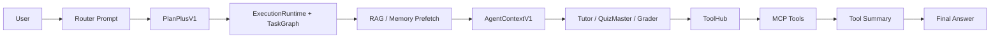

# Prompt Design - CoursePilot

更新时间：2026-04-19

本文面向开发者和面试讲解场景，说明 CoursePilot 中 Router、Tutor、QuizMaster、Grader、工具轮与上下文压缩的 prompt 设计。本文只解释当前实现，不替代源码；若有冲突，以代码为准。

核心源码入口：

- `core/orchestration/prompts.py`：集中维护 prompt 模板
- `core/agents/router.py`：Router structured output 与 `PlanPlusV1` 归一化
- `core/agents/tutor.py`：Tutor messages 组装与工具 schema 接入
- `core/agents/quizmaster.py`：练习 / 考试的计划与 artifact 生成
- `core/agents/grader.py`：评卷计划与评分 prompt
- `core/llm/openai_compat.py`：OpenAI-compatible API、工具轮、上下文压缩和工具结果摘要

---

## 1. Prompt 总体架构

CoursePilot 不是用一段大 prompt 完成所有任务，而是把 prompt 分成五层：

| 层级 | 目标 | 典型模板 / 函数 |
|---|---|---|
| Router 规划 prompt | 把用户请求转成结构化 `PlanPlusV1` | `ROUTER_PROMPT`、`ROUTER_SYSTEM_PROMPT` |
| Agent 执行 prompt | 让 Tutor / QuizMaster / Grader 完成讲解、出题、评分 | `TUTOR_PROMPT`、`QUIZZER_PROMPT`、`GRADER_PRACTICE_PROMPT` |
| Tool Act / Synthesize prompt | 先判断是否需要工具，再基于工具结果输出最终答案 | `chat_with_tools()`、`chat_stream_with_tools()` |
| Context compression prompt | 压缩历史、RAG 和 memory，控制 prompt 体积 | `CONTEXT_COMPRESSOR_*`、`HISTORY_BLOCK_COMPRESSOR_*` |
| JSON repair / internal planning prompt | 修复 JSON、生成出题计划、生成评卷计划 | `QUIZMASTER_JSON_REPAIR_*`、`GRADER_*_PLAN_PROMPT` |

### 1.1 OpenAI-compatible API 请求形状

项目中的 LLM 调用统一走 OpenAI-compatible messages 结构：

```json
{
  "model": "DEFAULT_MODEL",
  "messages": [
    {"role": "system", "content": "系统约束和角色设定"},
    {"role": "user", "content": "本轮任务 prompt"},
    {"role": "assistant", "content": "模型中间回复或 tool_calls"},
    {"role": "tool", "tool_call_id": "call_xxx", "content": "工具结果摘要"}
  ],
  "temperature": 0.7,
  "max_tokens": 2000
}
```

带工具时会额外传入：

```json
{
  "tools": [
    {
      "type": "function",
      "function": {
        "name": "memory_search",
        "description": "在用户历史问答和错题记录中检索相关内容",
        "parameters": {
          "type": "object",
          "properties": {
            "query": {"type": "string"},
            "course_name": {"type": "string"}
          },
          "required": ["query", "course_name"]
        }
      }
    }
  ],
  "tool_choice": "auto"
}
```

Router 使用 strict structured output 时会额外传入：

```json
{
  "response_format": {
    "type": "json_schema",
    "json_schema": {
      "name": "router_plan_v1",
      "strict": true,
      "schema": {"type": "object"}
    }
  }
}
```

### 1.2 数据流



三条边界很重要：

- Router 只规划，不回答用户。
- Agent 只消费分栏上下文；历史和记忆不能作为教材引用来源。
- ToolHub 是代码级硬治理，prompt 中的工具规则只是额外约束。

---

## 2. 各 Agent Prompt 示例

本章统一使用示例问题：

```text
介绍一下 Transformer 模型的架构。
```

示例上下文：

```text
course_name = LLM基础
mode = learn
history_context = 空
memory_context = 空
retrieval_empty = false
rag_context = 3 条教材片段
```

示例 RAG 片段：

```text
[来源1] 大模型基础.pdf 第 20 页
Transformer 是一类基于注意力机制的模块化神经网络结构……

[来源2] 大模型基础.pdf 第 21 页
Transformer 的注意力层将输入编码为 query、key、value 三部分……

[来源3] 大模型基础.pdf 第 52 页
不同 Transformer 架构在注意力矩阵上存在差异，包括 Encoder-only、Decoder-only 和 Encoder-Decoder……
```

### 2.1 Router

Router 的 messages 结构：

```python
[
    {"role": "system", "content": ROUTER_SYSTEM_PROMPT},
    {"role": "user", "content": ROUTER_PROMPT.format(...)}
]
```

system prompt：

```text
你是一个任务规划助手。输出必须是单个 JSON 对象，不要 markdown，不要解释。
```

填充后的 user prompt 结构如下。中间枚举说明省略，但真实模板完整保存在 `core/orchestration/prompts.py`。

```text
你是一个课程学习助手的任务规划器。根据用户请求和当前模式，制定执行计划。

当前模式: learn
课程名称: LLM基础
用户请求: 介绍一下 Transformer 模型的架构。

请分析并输出执行计划（JSON格式）：
1. need_rag: 是否需要检索教材知识（true/false）
2. allowed_tools: 允许使用的工具列表
3. task_type: 任务类型（learn/practice/exam）
4. style: 回答风格（step_by_step/hint_first/direct）
5. output_format: 输出格式（answer/quiz/exam/report）
6. question_raw: 用户问题原文，保持原意
7. user_intent: 归纳后的用户真实需求
8. retrieval_keywords: 检索关键词列表
9. retrieval_query: 面向教材检索的改写查询
10. memory_query: 面向历史记忆检索的改写查询
11. workflow_template: learn_only / practice_only / exam_only / ...
12. action_kind: learn_explain / practice_generate / ...
13. route_confidence: 0~1 之间的小数
14. route_reason: 解释为什么选择这个模板
15. required_artifact_kind: none/practice/exam
16. tool_budget: 工具预算对象
17. allowed_tool_groups: 工具组数组

rewrite 约束：
- question_raw 必须忠实保留用户原始问题
- retrieval_query / memory_query 只服务检索，不要改写用户真实诉求
- retrieval_keywords 尽量输出术语、章节名、概念名、缩写等高检索价值词

请以JSON格式输出计划。
```

Router 的理想输出示例：

```json
{
  "need_rag": true,
  "style": "step_by_step",
  "output_format": "answer",
  "question_raw": "介绍一下 Transformer 模型的架构。",
  "user_intent": "用户希望了解 Transformer 模型的整体架构组成和各模块作用。",
  "retrieval_keywords": ["Transformer", "模型架构", "Encoder", "Decoder", "自注意力", "前馈网络", "位置编码"],
  "retrieval_query": "Transformer 模型架构 Encoder Decoder 自注意力 前馈网络 位置编码",
  "memory_query": "Transformer 模型架构 自注意力 编码器 解码器",
  "workflow_template": "learn_only",
  "action_kind": "learn_explain",
  "route_confidence": 0.93,
  "route_reason": "用户请求是概念讲解，不涉及出题或评分，应走学习讲解模板，并检索教材证据。",
  "required_artifact_kind": "none",
  "tool_policy_profile": "learn_readonly",
  "context_budget_profile": "learn_standard",
  "tool_budget": {"per_request_total": 6, "per_round": 3, "websearch": 1, "memory_search": 2},
  "allowed_tool_groups": ["teaching", "rag", "memory"]
}
```

随后 `_normalize_plan()` 会补齐旧字段和安全默认值，例如 `allowed_tools`、`permission_mode`、`replan_policy`、`capabilities`，最终得到 `PlanPlusV1`。这也是为什么 Router 输出不是直接执行命令，而是进入 Runtime 的受控计划。

源码位置：

- `core/orchestration/prompts.py`
- `core/agents/router.py`

### 2.2 Tutor

Tutor 的职责是把教材证据、历史摘要和长期记忆转成教学回答。

带工具时 system prompt 来自 `TUTOR_TOOL_SYSTEM_PROMPT`：

```text
你是一位专业的大学课程导师。
你可以使用以下工具：calculator、websearch、filewriter、memory_search、mindmap_generator、get_datetime。
规则：
1. 工具调用采用 Plan/Act/Synthesize 三阶段：Act 仅做工具决策和短状态，Synthesize 再输出完整答案。
2. 工具选择必须最小充分：只有当不用工具无法可靠回答时才调用，避免重复调用同一工具。
3. 遇到需要外部时效信息时必须调用对应工具，禁止臆造。
4. 数值计算优先使用 calculator；若是纯概念性解释且无数值推导，可不调用计算器。
...
8. memory_search 只在确实需要历史错题或学习轨迹时调用，且避免重复查询。
9. 禁止编造工具结果；工具失败时应说明降级路径，再进入最终回答。
```

填充后的 user prompt 示例：

```text
你是一位大学课程学习导师，负责讲解概念和解答问题。

课程名称: LLM基础

【教材证据（仅此部分可作为 [来源N] 引用依据）】
[来源1] 大模型基础.pdf 第 20 页
Transformer 是一类基于注意力机制的模块化神经网络结构……

[来源2] 大模型基础.pdf 第 21 页
Transformer 的注意力层将输入编码为 query、key、value 三部分……

[来源3] 大模型基础.pdf 第 52 页
不同 Transformer 架构在注意力矩阵上存在差异……

【对话历史摘要（用于保持连续性，不可作为教材引用）】

【长期记忆片段（用于个性化辅导，不可作为教材引用）】

用户问题: 介绍一下 Transformer 模型的架构。

请按以下结构回答：

1. **核心答案**
   直接回答问题的关键结论（在结论后用 [来源N] 标注依据）

2. **详细解释**
   - 相关概念定义（附 [来源N]）
   - 推导过程或原理说明
   - 实例说明

3. **关键要点与易错点**
   - 本知识点的核心要素
   - 常见误解或易错点

4. **知识点总结**
   用1-2句话总结本次讲解的核心内容

注意：
- 引用来源只能来自“教材证据”分区，禁止引用历史摘要/长期记忆作为教材来源
- 引用教材时直接在运用处内联标注 [来源N]，不要单独列出引用列表
- 如果教材中没有相关内容，明确指出并建议上传相关章节
- 使用清晰的学术语言，符合课程教材的术语体系
```

如果 `retrieval_empty=true`，system prompt 会追加：

```text
【教材证据状态】本轮未找到可靠教材片段。你必须明确告知用户这次没有命中可靠教材证据，本次回答只能基于通用知识、题面或已有上下文，禁止伪造教材引用。
```

如果 memory 中存在用户画像，也会追加到 system prompt：

```text
【用户学习档案】
- 薄弱点：自注意力、位置编码
- 建议：先讲整体结构，再解释模块输入输出
```

源码位置：

- `core/agents/tutor.py`
- `core/orchestration/prompts.py`

### 2.3 QuizMaster

QuizMaster 面向 artifact-first：先规划题目，再生成结构化练习或试卷。

派生问题：

```text
请基于 Transformer 架构出 3 道练习题。
```

第一阶段是出题计划 prompt：

```python
[
    {"role": "system", "content": "你是一个严谨的出题规划器，只输出 JSON。"},
    {"role": "user", "content": QUIZMASTER_PLAN_PROMPT.format(...)}
]
```

示例：

```text
你是练习命题规划器。请根据用户请求先生成“出题计划”。

用户请求：请基于 Transformer 架构出 3 道练习题
默认难度：medium
期望题量：3
期望题型：综合题

请只输出 JSON，字段如下：
{
  "topic": "本次出题的核心知识点",
  "num_questions": 题目数量（1-20）,
  "difficulty": "easy|medium|hard",
  "question_type": "选择题/判断题/填空题/简答题/论述题/计算题/综合题",
  "focus_points": ["知识点1", "知识点2"]
}
```

计划输出示例：

```json
{
  "topic": "Transformer 模型架构",
  "num_questions": 3,
  "difficulty": "medium",
  "question_type": "综合题",
  "focus_points": ["自注意力", "编码器-解码器结构", "前馈网络与残差归一化"]
}
```

第二阶段是题目生成 prompt：

```text
你是一位出题专家，负责生成课程练习题。

课程名称: LLM基础
章节/概念: Transformer 模型架构
难度: medium
题量: 3
题型: 综合题

【教材证据（仅本分区可作为题目依据）】
[来源1] ...

【对话历史摘要（用于题目连贯性，不可作为教材来源）】

【长期记忆片段（用于弱点强化，不可作为教材来源）】

请生成3道综合题练习题，整体难度为medium，包含：
1. 题目
2. 标准答案
3. 评分标准（Rubric）

请以JSON格式输出：
{
  "question": "题目内容",
  "standard_answer": "标准答案",
  "rubric": "评分标准",
  "difficulty": "medium",
  "chapter": "相关章节",
  "concept": "相关概念"
}
```

输出 artifact 示例：

```json
{
  "question": "1. 简述 Transformer 的整体架构组成。\\n2. 说明自注意力在 Transformer 中的作用。\\n3. 比较 Encoder-only、Decoder-only 与 Encoder-Decoder 架构的差异。",
  "standard_answer": "1. Transformer 通常包含输入表示、位置编码、自注意力、前馈网络、残差连接与归一化等模块……",
  "rubric": "第1题 30 分：说出主要模块并解释作用……",
  "difficulty": "medium",
  "chapter": "Transformer",
  "concept": "Transformer 模型架构"
}
```

这样做的原因是：internal plan 限制出题范围和题型，artifact 输出保证后续 Grader 可以稳定评分。

源码位置：

- `core/agents/quizmaster.py`
- `core/orchestration/prompts.py`

### 2.4 Grader

Grader 也采用两阶段：先生成内部评卷计划，再执行正式评分。

派生场景：

```text
学生提交答案：
1. Transformer 由 Encoder 和 Decoder 组成，主要依赖注意力机制处理序列。
2. 自注意力用于计算序列中不同 token 的相关性。
3. Encoder-only 适合理解任务，Decoder-only 适合生成任务。
```

第一阶段是内部评卷计划：

```python
[
    {"role": "system", "content": "你是一个严谨的评卷计划器，只输出 JSON。"},
    {"role": "user", "content": GRADER_PRACTICE_PLAN_PROMPT.format(...)}
]
```

示例：

```text
请为本次练习评卷生成一个“内部执行计划”，用于后续评分阶段。

【题目（来自本次练习）】
1. 简述 Transformer 的整体架构组成。
2. 说明自注意力在 Transformer 中的作用。
3. 比较 Encoder-only、Decoder-only 与 Encoder-Decoder 架构的差异。

【学生提交的答案】
1. Transformer 由 Encoder 和 Decoder 组成，主要依赖注意力机制处理序列。
2. 自注意力用于计算序列中不同 token 的相关性。
3. Encoder-only 适合理解任务，Decoder-only 适合生成任务。

要求：
1. 只输出 JSON，不要输出解释文字。
2. JSON 字段包含 question_steps / final_step / score_formula / key_mistakes。
3. 计算总分只能在最后一步执行。
```

第二阶段是正式评分 prompt。system prompt 强制要求使用 calculator：

```text
你是一位公正严格的评卷官，只负责对学生答案进行逐题核对和打分。
核心规则：
1. 在「逐题核对」表格中，必须将标准答案和学生答案的原文完整逐字引用。
2. 仅当两者语义完全等价时才判为正确；有任何实质差异均判错误。
3. 评判完所有题目后，必须调用 calculator 工具计算总分，禁止心算。
4. 只有 calculator 返回数值后，才可写出最终得分。
```

user prompt 结构：

```text
请根据以下信息评判学生答案：

【题目（来自本次练习）】
...

【学生提交的答案】
...

━━━━ 评卷步骤（必须依序执行）━━━━

第一步：逐题核对
第二步：调用 calculator 计算总分
第三步：输出最终评分结果
```

为什么 grading 里必须强调 active artifact：  
评分时题目/试卷本身是评分真源，history 只用于连续性。当前实现会尽量避免把上一轮 assistant 输出的整份题面又通过 `history_context` 重复注入。

源码位置：

- `core/agents/grader.py`
- `core/orchestration/prompts.py`

### 2.5 Tool Act / Synthesize

Tutor 启用工具时，底层调用类似：

```json
{
  "messages": [
    {"role": "system", "content": "Tutor 工具 system prompt"},
    {"role": "user", "content": "Tutor user prompt，包含教材证据和用户问题"}
  ],
  "tools": [
    {"type": "function", "function": {"name": "calculator", "parameters": {"type": "object"}}},
    {"type": "function", "function": {"name": "websearch", "parameters": {"type": "object"}}},
    {"type": "function", "function": {"name": "mindmap_generator", "parameters": {"type": "object"}}}
  ],
  "tool_choice": "auto",
  "max_tokens": "ACT_MAX_TOKENS"
}
```

#### 情况 A：不调用工具

Act 阶段模型返回：

```json
{
  "role": "assistant",
  "content": "我将基于教材证据解释 Transformer 的整体架构。",
  "tool_calls": null
}
```

系统进入 Synthesize 阶段，追加：

```json
{
  "role": "user",
  "content": "请基于以上工具结果，直接给出对用户可见的最终完整回答。"
}
```

然后生成最终答案。

#### 情况 B：调用 `mindmap_generator`

Act 阶段模型返回：

```json
{
  "role": "assistant",
  "content": null,
  "tool_calls": [
    {
      "id": "call_001",
      "type": "function",
      "function": {
        "name": "mindmap_generator",
        "arguments": "{\"topic\":\"Transformer 模型架构\",\"course_name\":\"LLM基础\"}"
      }
    }
  ]
}
```

ToolHub 允许后，MCP 工具返回：

```json
{
  "tool": "mindmap_generator",
  "topic": "Transformer 模型架构",
  "mermaid_code": "mindmap\\n  root((Transformer 架构))\\n    输入表示\\n    自注意力\\n    前馈网络",
  "message": "已生成 Transformer 模型架构思维导图。",
  "success": true,
  "via": "mcp_stdio"
}
```

喂回 LLM 前会被 `_summarize_tool_result()` 压成 tool message：

```json
{
  "role": "tool",
  "tool_call_id": "call_001",
  "content": "{\"tool\":\"mindmap_generator\",\"success\":true,\"via\":\"mcp_stdio\",\"message\":\"已生成 Transformer 模型架构思维导图。\"}"
}
```

之后进入最终 Synthesize：

```json
{
  "role": "user",
  "content": "请基于以上工具结果，直接给出对用户可见的最终完整回答。"
}
```

如果工具失败，最终轮前会追加失败摘要：

```text
如果工具失败、被门控或未能拿到结果，你必须在最终回答中向用户明确说明，不要假装工具成功。
本轮工具异常摘要：
- websearch: tool gated: network_denied
```

源码位置：

- `core/llm/openai_compat.py`
- `mcp_tools/client.py`

---

## 3. 上下文压缩与 Prompt 预算

### 3.1 上下文来源

CoursePilot 的 prompt 上下文来自多处：

| 来源 | 进入位置 | 作用 |
|---|---|---|
| `history_context` | Agent user prompt | 保持多轮连续性 |
| `rag_context` | Agent user prompt | 教材证据与引用来源 |
| `memory_context` | Agent user prompt | 个性化辅导、错题和历史事件 |
| `profile_context` | Agent system prompt | 用户画像、弱点、偏好 |
| active artifact | Quiz / Grader prompt | 当前练习题、试卷、答案 |
| tool result summary | `role=tool` message | 工具调用后的可控摘要 |

当前主 prompt 使用分栏注入：

```text
【教材证据】
...

【对话历史摘要】
...

【长期记忆片段】
...
```

legacy `context / merged_context` 仍作为兼容字段保留，但不应和三栏上下文重复注入。

### 3.2 ContextBudgeter 输出

`ContextBudgeter` 会把输入材料整理成：

- `history_text`
- `rag_text`
- `memory_text`
- `final_text`

其中 `final_text` 是合并视图，主要用于兼容、调试和预算观测。Agent 主 prompt 优先使用分栏字段。

### 3.3 历史压缩

历史压缩分两层：

- rolling summary：把较早历史压缩成摘要块
- recent raw turns：保留最近若干轮原文，保证连续对话不丢关键上下文

相关策略：

- `CB_HISTORY_RECENT_TURNS` 控制最近轮数
- `CB_HISTORY_SUMMARY_MAX_TOKENS` 控制摘要预算
- `CONTEXT_LLM_COMPRESSION_THRESHOLD` 控制昂贵 LLM 压缩触发压力
- `practice / exam` 默认更保守，避免压缩破坏题面或评分语义

历史块压缩 prompt 形态：

```text
你是对话历史块压缩器。
你的任务不是复述全文，而是提取后续继续对话所需的最小状态。
禁止新增事实、禁止扩写、禁止猜测。
只能输出合法 JSON。
```

### 3.4 RAG 压缩与 evidence gate

RAG 上下文先经过检索和证据准入，再进入 prompt：

```text
question_raw 优先检索
  -> 未命中时 retrieval_query fallback
  -> dense + BM25 + RRF
  -> evidence gate
  -> citations / retrieval_empty
```

`retrieval_empty=true` 时，Agent system prompt 会强制要求说明“没有找到可靠教材片段”，并禁止伪造教材引用。

RAG 压缩责任有两种：

- retriever 侧压缩：尽量在检索结果阶段减少冗余文本
- budgeter 侧压缩：上下文压力过高时再做句级或 adaptive 压缩

### 3.5 工具轮压缩

工具轮最容易膨胀，因为它会不断追加 `assistant(tool_calls)` 和 `tool` 消息。当前压缩策略在 `openai_compat.py`：

- `_compact_messages_for_tool_round()`：第二轮以后压缩 user content
- `[TOOL_BUDGET]`：作为 system hint 注入当前工具预算
- `TOOL_ROUND_KEEP_LAST_TOOL_MSGS`：只保留最近工具消息片段
- `_summarize_tool_result()`：把完整工具结果压成短 JSON
- `_rehydrate_messages_for_final()`：最终 Synthesize 前按 `summary/full` 回灌上下文

压缩前的工具轮 messages 可能是：

```json
[
  {"role": "system", "content": "Tutor 工具规则..."},
  {"role": "user", "content": "完整 Tutor prompt，含 RAG、history、memory"},
  {"role": "assistant", "tool_calls": [{"id": "call_001", "function": {"name": "memory_search"}}]},
  {"role": "tool", "tool_call_id": "call_001", "content": "完整 memory_search 返回结果"},
  {"role": "assistant", "tool_calls": [{"id": "call_002", "function": {"name": "mindmap_generator"}}]},
  {"role": "tool", "tool_call_id": "call_002", "content": "完整 mindmap_generator 返回结果"}
]
```

压缩后会变成：

```json
[
  {"role": "system", "content": "Tutor 工具规则..."},
  {"role": "user", "content": "压缩后的用户目标 + 精简 RAG + 精简 memory + [TOOL_BUDGET]"},
  {"role": "assistant", "tool_calls": [{"id": "call_002", "function": {"name": "mindmap_generator"}}]},
  {"role": "tool", "tool_call_id": "call_002", "content": "{\"tool\":\"mindmap_generator\",\"success\":true,\"message\":\"已生成思维导图。\"}"}
]
```

这样做可以避免工具结果把 prompt 撑爆，同时保留最后一轮工具调用对最终回答的必要证据。

### 3.6 Prompt 预算观测

Tutor 构造 messages 时会记录 `prompt_budget` 事件，包括：

- `system_tokens_est`
- `rag_context_tokens_est`
- `history_context_tokens_est`
- `memory_context_tokens_est`
- `history_msg_count`
- `include_raw_history_in_messages`

这些指标用于判断 prompt 是否因为历史、RAG、memory 或工具结果膨胀。

---

## 4. 维护提示

修改 prompt 时建议遵守：

- 优先保持模板字段名稳定，避免 `.format(...)` 调用断裂。
- Router prompt 变更后，检查 strict schema 与 `_normalize_plan()` 是否一致。
- Tutor prompt 变更后，确认引用约束仍然只允许引用 `rag_context`。
- QuizMaster / Grader prompt 变更后，确认 JSON 输出结构仍能被解析和落盘。
- 工具 prompt 变更后，同时检查 ToolHub 治理和 `_summarize_tool_result()`。
- 上下文压缩 prompt 变更后，检查 `prompt_budget` 指标和长会话回归。

