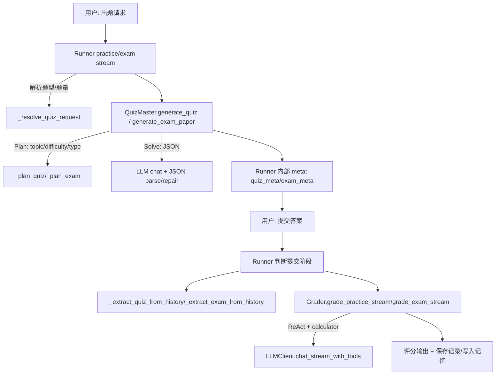

# CoursePilot Agent 项目全方面审阅与修复报告

## 执行摘要

本次审阅以 **修复关键 Bug** 为首要目标，同时在此基础上给出**全方面审阅结论**与**架构/代码重构建议**。研究严格优先使用已启用连接器 **github**，仅检索仓库 **Eric-he-cn/course-pilot** 并以仓库内源码为主要证据；在覆盖仓库后，补充引用少量官方资料用于支撑 Structured Outputs / tool calling 的可行修复路线。fileciteturn58file0L1-L1 fileciteturn52file0L1-L1 citeturn6search1

核心结论（对应你的 4 个重点任务：Bug 修复 / 全方面审阅 / 架构重构建议 / 代码重构建议）：

- **Bug#1（前端上下文窗口 0%）根因明确**：前端仅在收到 SSE 事件 `__context_budget__` 时才更新 badge，但 Runner 在 **非流式**函数里 `yield __context_budget__`（导致同步链路反而变成生成器，潜在破坏 `/chat`），而在真实使用的 **流式**链路（`run_*_mode_stream`）中却没有 emit `__context_budget__` 事件，导致前端一直停留在默认值 0%。fileciteturn53file0L1-L1 fileciteturn52file0L1-L1 fileciteturn58file0L1-L1

- **Bug#2（练习/考试题型错配与评分错误）可复现路径明确**：题型错配主要来自“出题 Plan 阶段”对用户明确题型的**覆盖/漂移**（例如用户要“选择题”，Plan 输出改成“简答题”），以及“选择题缺少 options 结构化约束”导致出题内容形态不稳定；评分错误的关键诱因之一是**评分提示词对标准答案来源的描述与 Runner 组装的 quiz_content 结构不一致**（提示词要求从“题目”复制标准答案，但 Runner 把标准答案放在“【标准答案】”段落）。fileciteturn54file0L1-L1 fileciteturn56file0L1-L1 fileciteturn52file0L1-L1

- **全方面审阅**：项目已形成“Streamlit + FastAPI + Runner 编排 + 多 Agent（Router/Tutor/QuizMaster/Grader）+ RAG + MCP 工具 + SQLite 记忆”的清晰闭环，但当前在 **SSE 元事件契约、同步/流式函数边界、题型/评分的数据契约、测试与依赖管理**上仍存在结构性不一致，导致体验层 Bug 溢出。fileciteturn53file0L1-L1 fileciteturn58file0L1-L1 fileciteturn52file0L1-L1

- **架构与代码重构建议**：建议将“事件协议（SSE meta）”“出题/评卷数据契约”“同步/流式接口”三者统一为显式接口层；将 Runner 拆为 ModeStrategy（learn/practice/exam）并固化回归测试；引入（或至少可选）Structured Outputs 以降低 JSON 修复器与正则解析带来的不确定性。fileciteturn56file0L1-L1 fileciteturn60file0L1-L1 citeturn6search1

---

## 关键信息点与资料来源

**研究开始需要学习的 6 个关键信息点（本报告逐一覆盖）**：

1) SSE 流式事件链路：前端 `stream_chat` 订阅 → 后端 `chat_stream` 生成 → Runner `run_stream` 与各 mode stream 是否 emit 关键 meta（尤其 `__context_budget__`）。fileciteturn53file0L1-L1 fileciteturn58file0L1-L1 fileciteturn52file0L1-L1  
2) ContextBudgeter 的输出字段与压力指标：`final_tokens_est/budget_tokens_est/context_pressure_ratio` 如何计算、如何被 Runner 转换为前端期望的 payload。fileciteturn51file0L1-L1 fileciteturn52file0L1-L1  
3) 练习/考试模式的“出题→隐藏元数据→提交→评分→保存”闭环：QuizMaster 的 Plan/Solve 与 JSON 修复器、Runner 内部 meta 注入、Grader 的 ReAct + calculator。fileciteturn54file0L1-L1 fileciteturn55file0L1-L1 fileciteturn52file0L1-L1  
4) 题型契约：用户指定题型如何解析（Runner `_resolve_quiz_request`）→ QuizMaster 如何“锁定/漂移”题型 → Grader 如何识别/评分。fileciteturn52file0L1-L1 fileciteturn54file0L1-L1 fileciteturn56file0L1-L1  
5) 评分与算分正确性：calculator 工具是否被强制调用、总分是否与题面满分一致（当前多处默认 100），以及保存记忆时的结构化抽取是否健壮。fileciteturn55file0L1-L1 fileciteturn59file0L1-L1 fileciteturn57file0L1-L1  
6) 外部性能测评 docx 的结论对照：是否能访问上传文件并核对与仓库实现差异。**本次未能在可检索来源中找到该 docx**（见末尾“未指定项与缺失资料”）。  

**已启用连接器（按要求列出）**：github。证据：本报告所有仓库引用均来自 github 连接器读取的指定仓库文件。fileciteturn58file0L1-L1

---

## 架构与数据流总览

### 系统主链路与关键事件（含“上下文窗口 0%”相关路径）

```mermaid
flowchart TD
  UI[Streamlit 前端 stream_chat] -->|POST /chat/stream (SSE)| API[FastAPI /chat/stream]
  API -->|for chunk in runner.run_stream| RUN[OrchestrationRunner.run_stream]
  RUN -->|learn| L1[run_learn_mode_stream]
  RUN -->|practice| P1[run_practice_mode_stream]
  RUN -->|exam| E1[run_exam_mode_stream]

  L1 --> B1[ContextBudgeter.build_context]
  P1 --> B2[ContextBudgeter.build_context]
  E1 --> B3[ContextBudgeter.build_context]

  B1 -->|packed dict| PB1[Runner 生成 __context_budget__ payload]
  PB1 -->|yield {"__context_budget__": payload}| SSE1[SSE event]

  UI <-->|订阅 __context_budget__ 事件并更新 latest_context_budget| SSE1
```

前端只在收到 `__context_budget__` 事件时更新 badge；当前仓库的 stream functions 并未 emit 该事件，导致 badge 长期显示 0%。fileciteturn53file0L1-L1 fileciteturn52file0L1-L1

### 练习/考试闭环（题型与评分错误相关路径）



题型错配通常发生在 PLAN 阶段“模型把 question_type 从选择题漂移成简答题”，以及 SOLVE 阶段未强制 options/答案格式导致题干形态不稳定；评分错误多来自“题面/标准答案/评分 rubric”的结构化拼装与评分 prompt 约束不一致。fileciteturn54file0L1-L1 fileciteturn55file0L1-L1 fileciteturn56file0L1-L1 fileciteturn52file0L1-L1

---

## Bug 修复：前端上下文窗口显示 0%

### 现象与链路证据

- 前端的流式消费逻辑在 `stream_chat()` 中 **专门拦截** `{"__context_budget__": payload}` 事件，并将其写入 `st.session_state.latest_context_budget`，再调用 `render_context_badge()` 更新顶部 badge。fileciteturn53file0L1-L1  
- badge 的百分比是基于 `payload["context_pressure_ratio"]`（或 `final_tokens_est/budget_tokens_est`）计算得到；若没有 payload，就停留在默认 `ratio=0 → pct=0`。fileciteturn53file0L1-L1  
- 后端 SSE `/chat/stream` 不会过滤事件，它会把 runner yield 的任何 chunk（dict/str）封装为 `data: <json>` 原样下发。fileciteturn58file0L1-L1  
- Runner 当前代码存在**关键错位**：  
  - 非流式 `run_learn_mode/run_practice_mode/run_exam_mode` 中出现 `yield {"__context_budget__": ...}`（使函数变为生成器，破坏同步 `/chat`）；fileciteturn52file0L1-L1  
  - 但流式 `run_*_mode_stream` 在 build_context 后**没有** yield `__context_budget__`，导致 `/chat/stream` 永远收不到该事件。fileciteturn52file0L1-L1  

因此，“上下文窗口 0%”的最可能根因是：**事件在错误的函数中 emit 了（非流式），而真实使用的流式链路没有 emit。**fileciteturn52file0L1-L1 fileciteturn53file0L1-L1

### 验证步骤（建议按顺序执行）

1) **前端侧验证**：在 Streamlit 中随便提问一次（learn/practice/exam 任一模式），观察 `_collecting_stream()` 是否进入 `if "__context_budget__" in chunk:` 分支；若始终未进入，即证实后端没发。fileciteturn53file0L1-L1  
2) **后端侧验证**：用 curl 直连 SSE（示例：`curl -N -X POST .../chat/stream`），grep 输出里是否出现 `"__context_budget__"`；若没有，即定位到 Runner emit 缺失。fileciteturn58file0L1-L1  
3) **Runner 日志验证**：Runner 内部 `_log_context_budget()` 会打印 `[context_budget] mode=... history=... rag=... memory=... final=... budget=...`，若日志存在但前端无 badge 更新，说明 payload 未 emit 或未透传。fileciteturn52file0L1-L1

### 修复建议（代码级）与补丁示例

#### 根治修复策略

- **把 `__context_budget__` 事件 emit 挪到所有 `*_stream` 函数中**（learn/practice/exam），并确保在 build_context 后尽早 yield。  
- **从所有非流式函数中移除 `yield`**，保证 `run_*_mode()` 返回 `ChatMessage` 而不是生成器，从而恢复 `/chat` 同步接口正确性。  

这两点一起做，才能同时解决：  
1) 前端 badge 0%（流式缺事件）  
2) 同步接口潜在崩坏（非流式误用 yield）fileciteturn52file0L1-L1 fileciteturn58file0L1-L1

#### Patch 示例（diff/伪代码）

```diff
diff --git a/core/orchestration/runner.py b/core/orchestration/runner.py
--- a/core/orchestration/runner.py
+++ b/core/orchestration/runner.py
@@
 def run_learn_mode(...)-> ChatMessage:
@@
-        self._log_context_budget("learn", packed)
-        yield {"__context_budget__": self._context_budget_payload("learn", len(history), packed)}
+        self._log_context_budget("learn", packed)
         context_sections = self._context_sections_from_packed(packed)
@@
         return ChatMessage(...)

 def run_practice_mode(...)-> ChatMessage:
@@
-        self._log_context_budget("practice", packed)
-        yield {"__context_budget__": self._context_budget_payload("practice", len(history), packed)}
+        self._log_context_budget("practice", packed)
         context_sections = self._context_sections_from_packed(packed)
@@
         return ChatMessage(...)

 def run_exam_mode(...)-> ChatMessage:
@@
-        self._log_context_budget("exam", packed)
-        yield {"__context_budget__": self._context_budget_payload("exam", len(history), packed)}
+        self._log_context_budget("exam", packed)
         context_sections = self._context_sections_from_packed(packed)
@@
         return ChatMessage(...)

 def run_learn_mode_stream(...):
@@
         packed = self.context_budgeter.build_context(...)
         self._log_context_budget("learn", packed)
+        yield {"__context_budget__": self._context_budget_payload("learn", len(history), packed)}
         context_sections = self._context_sections_from_packed(packed)

 def run_practice_mode_stream(...):
@@
         packed = self.context_budgeter.build_context(...)
         self._log_context_budget("practice", packed)
+        yield {"__context_budget__": self._context_budget_payload("practice", len(history), packed)}
         context_sections = self._context_sections_from_packed(packed)

 def run_exam_mode_stream(...):
@@
         packed = self.context_budgeter.build_context(...)
         self._log_context_budget("exam", packed)
+        yield {"__context_budget__": self._context_budget_payload("exam", len(history), packed)}
         context_sections = self._context_sections_from_packed(packed)
```

**优先级/估时/风险**：P0；工作量低（<0.5 天）；风险低（仅事件位置调整与同步函数语义修复）。需回归测试覆盖 `/chat` 与 `/chat/stream` 三模式。fileciteturn52file0L1-L1 fileciteturn58file0L1-L1

### 回归测试用例清单（针对 Bug#1）

- **UT-CTX-001**：`runner.run_stream(mode="learn")` 输出 stream 中必须出现一次 `{"__context_budget__": {...}}`，且 payload 含 `final_tokens_est/budget_tokens_est/context_pressure_ratio`。fileciteturn52file0L1-L1  
- **UT-CTX-002**：`runner.run(course_name, mode="learn")` 返回对象必须是 `ChatMessage`，不得是生成器（即 `inspect.isgenerator(response_message)==False`）。fileciteturn58file0L1-L1  
- **IT-SSE-001**：调用 `/chat/stream`，SSE 流中必须包含 `__context_budget__` 事件，并且前端 badge 应从 0% 变为非零（可通过前端日志或状态变量验证）。fileciteturn53file0L1-L1

---

## Bug 修复：练习/考试模式题型错配与评分错误

本节按你要求“逐步追踪 Router→QuizMaster→Grader 的 prompt、输出解析、JSON 修复器与评分逻辑”，给出可定位的 root cause、验证步骤与 patch 示范。

### 可复现路径（建议步骤）

**复现目标 A：题型错配（选择题被当作简答题）**

1) 前端切到 practice 模式，输入：“请出一道选择题/单选题（知识点随意）”。  
2) 观察生成题面：是否包含选项（A/B/C/D）；以及内部 meta `quiz_meta` 中是否记录标准答案（你前端会把 `__tool_calls__` 存进历史 but 不展示 internal_meta）。fileciteturn53file0L1-L1 fileciteturn52file0L1-L1  
3) 若题面没有选项、但你明确要选择题，即判定“题型错配”。

**复现目标 B：评分/算分错误**

1) 在上述题目下提交答案（如 “A”）。Runner 会进入评分路由并调用 `grader.grade_practice_stream`。fileciteturn52file0L1-L1  
2) 检查评分输出是否出现：逐题核对表、calculator 总分、总得分 /100。若出现 “XX” 占位或总分明显不一致，即可认为评分链路不可靠。fileciteturn56file0L1-L1 fileciteturn57file0L1-L1  

### 题型错配的根因定位与证据

**根因 1：QuizMaster 的 Plan 阶段允许“覆盖用户显式题型”**

- Runner `_resolve_quiz_request` 会解析用户的题型，并把 `question_type` 作为参数传给 `quizmaster.generate_quiz(...)`。fileciteturn52file0L1-L1  
- QuizMaster 在 `generate_quiz` 内部先做 `_plan_quiz(...)`，由模型输出 `question_type`，再把该 `question_type` 作为最终 solve 的题型（`planned_question_type`）。如果模型在 plan 阶段输出“简答题”，就会覆盖用户的“选择题”。fileciteturn54file0L1-L1  
- 当前 `_plan_quiz` 的 schema 并不强制 “必须等于 requested_question_type”，prompt 也未明确“用户指定题型必须锁定不变”。fileciteturn56file0L1-L1

**修复要点**：当 Runner/用户明确指定题型（非“综合题”）时，QuizMaster 必须“锁定题型”，Plan 阶段只能调 topic/focus_points，不能改题型。

**Patch 示例（QuizMaster 锁题型）**：

```diff
diff --git a/core/agents/quizmaster.py b/core/agents/quizmaster.py
--- a/core/agents/quizmaster.py
+++ b/core/agents/quizmaster.py
@@
     quiz_plan = self._plan_quiz(...)
@@
-    planned_question_type = self._normalize_question_type(
-        str(quiz_plan.get("question_type", question_type)),
-        question_type,
-    )
+    requested_type = self._normalize_question_type(question_type, "综合题")
+    planned_type_from_plan = self._normalize_question_type(
+        str(quiz_plan.get("question_type", requested_type)),
+        requested_type,
+    )
+    # 关键修复：若用户/上游显式指定题型（非综合题），强制锁定题型，禁止 Plan 漂移。
+    planned_question_type = requested_type if requested_type != "综合题" else planned_type_from_plan
```

**优先级/估时/风险**：P0；工作量低（<0.5 天）；风险低（只影响题型稳定性，属于“更符合用户意图”的修复）。fileciteturn54file0L1-L1

---

**根因 2：选择题的“选项结构”未被 schema 强约束，导致题干形态漂移**

QuizMaster 的 Solve 输出 schema 仅包含 `question/standard_answer/rubric/difficulty/chapter/concept`，并不含 `options` 字段，也没有强校验“若 question_type=选择题，question 必须含 A/B/C/D 选项”。fileciteturn54file0L1-L1 fileciteturn59file0L1-L1  

这会导致：即使 `planned_question_type` 是“选择题”，模型仍可能输出一段“问答式简答题”，从而出现你描述的“选择题被当作简答题”的体验。

**修复建议（两档）**：

- **P0 快速止血**：出题后做轻量校验，不满足选择题形态则 retry 一次（仅一次），并在 retry prompt 中明确“必须含选项”；若仍失败，则降级为简答题并显式告知（避免误导）。  
- **P1 结构化升级**：扩展 `Quiz` schema（增加 `question_type`、`options`）并启用 Structured Outputs（json_schema strict），从协议层保证一致性。citeturn6search1

**P0 Patch 示例（选择题形态校验 + 单次重试）**：

```diff
diff --git a/core/agents/quizmaster.py b/core/agents/quizmaster.py
--- a/core/agents/quizmaster.py
+++ b/core/agents/quizmaster.py
@@
+    def _looks_like_mcq(self, question_text: str) -> bool:
+        import re
+        q = question_text or ""
+        # 至少包含 A. 与 B. 两个选项行（宽松）
+        return len(re.findall(r"(?m)^\\s*[A-D][\\.．、】【、]\\s*", q)) >= 2
@@
-    response = self.llm.chat(messages, temperature=0.4, max_tokens=1400)
+    response = self.llm.chat(messages, temperature=0.4, max_tokens=1400)
@@
     quiz_dict = ...
+    if planned_question_type == "选择题" and not self._looks_like_mcq(quiz_dict.get("question", "")):
+        # 单次重试：强制要求输出 A-D 选项
+        retry_prompt = prompt + "\\n\\n【强约束】你必须生成选择题：题干必须包含至少A/B/C/D四个选项（每行一个选项），标准答案必须是字母（如A或B）。"
+        retry_messages = [{"role":"system","content":QUIZMASTER_SOLVE_SYSTEM_PROMPT},{"role":"user","content":retry_prompt}]
+        retry_resp = self.llm.chat(retry_messages, temperature=0.2, max_tokens=1400)
+        quiz_dict = self._extract_json_payload(retry_resp)
```

---

### 评分/算分错误的根因定位与证据

**根因 1：练习评分 Prompt 对“标准答案来源”的指令与 Runner 组装文本不一致**

- Runner 在评分阶段会从历史内部 meta `quiz_meta` 组装 `quiz_content`，结构包含 `【题目】...`、`【标准答案】...`、`【评分标准】...`。fileciteturn52file0L1-L1  
- 但 `GRADER_PRACTICE_PROMPT` 明确要求“标准答案（原文）从上方【题目】中逐字复制”，这与 Runner 的结构不一致（标准答案在【标准答案】段落）。当模型严格遵守 prompt 时，会出现“找不到标准答案/复制错位置/误判题型”的风险。fileciteturn56file0L1-L1

**修复建议（P0）**：把 GRADER_PRACTICE_PROMPT 的规则改为：标准答案从 `【标准答案】` 段落逐字复制；若题面为多题，要求按题号匹配。

**Patch 示例（prompts.py 修订关键句）**：

```diff
diff --git a/core/orchestration/prompts.py b/core/orchestration/prompts.py
--- a/core/orchestration/prompts.py
+++ b/core/orchestration/prompts.py
@@
- - 「标准答案（原文）」从上方【题目】中逐字复制，不得重新表述。
+ - 「标准答案（原文）」必须从上方【标准答案】段落逐字复制，不得重新表述；多题时必须按题号一一对应。
```

**优先级/估时/风险**：P0；工作量低（<0.5 天）；风险低（提示词修正与实际数据结构对齐）。fileciteturn56file0L1-L1 fileciteturn52file0L1-L1

---

**根因 2：总分分母固定为 100，但考试题目分值总和不一定为 100（潜在）**

- 多处 schema/prompt/抽取默认 “/100”：`GradeReport.score` 注释与多个 prompt 都以 100 为满分。fileciteturn59file0L1-L1 fileciteturn56file0L1-L1  
- Exam 生成时，`_render_exam_paper` 的 `total_score` 是按题目 score 求和，并未强制归一为 100。若生成题目总分不是 100，则会造成“总分显示/算分/记忆解析（/100 正则）”的一致性问题。fileciteturn54file0L1-L1 fileciteturn52file0L1-L1

**修复建议（推荐 P1）**：在考试渲染阶段将题目分值归一化到总分 100，或升级所有提示词/解析逻辑支持动态分母。鉴于当前系统多处默认 100，**更低风险的修复是“统一强制总分=100”**。

**Patch 示例（考试总分归一到 100）**：

```diff
diff --git a/core/agents/quizmaster.py b/core/agents/quizmaster.py
--- a/core/agents/quizmaster.py
+++ b/core/agents/quizmaster.py
@@
 def _render_exam_paper(...):
@@
-        return {
-            "content": "\n".join(lines),
-            "answer_sheet": answer_sheet,
-            "total_score": sum(int(x.get("score", 0) or 0) for x in answer_sheet),
-        }
+        total = sum(int(x.get("score", 0) or 0) for x in answer_sheet)
+        if total > 0 and total != 100:
+            # 按比例缩放到 100，最后一题吸收舍入误差
+            factor = 100.0 / float(total)
+            new_total = 0
+            for i, row in enumerate(answer_sheet):
+                if i < len(answer_sheet) - 1:
+                    s = int(round(int(row["score"]) * factor))
+                    row["score"] = max(0, s)
+                    new_total += row["score"]
+                else:
+                    row["score"] = max(0, 100 - new_total)
+        return {"content": "\n".join(lines), "answer_sheet": answer_sheet, "total_score": 100}
```

**优先级/估时/风险**：P1；工作量中（1 天以内）；风险中等（会改变考试题目分值显示与 meta，总体更一致）。需增加回归测试：题目总分恒为 100。fileciteturn54file0L1-L1

---

### 回归测试用例清单（针对 Bug#2）

- **UT-QTYPE-001**：用户指定 `question_type="选择题"`，即使 `_plan_quiz` 返回 `"简答题"`，最终用于 solve 的 `planned_question_type` 仍必须是“选择题”。fileciteturn54file0L1-L1  
- **UT-MCQ-001**：当 `planned_question_type="选择题"` 时，若输出 question 中不含 A/B 选项行，则 QuizMaster 必须触发一次重试或降级（但不能静默输出“简答题形态”）。fileciteturn54file0L1-L1  
- **IT-PRACTICE-001**：practice 出题后提交答案 “A”，Grader 输出必须包含“总得分：<数字> / 100”。fileciteturn56file0L1-L1  
- **UT-EXAM-100**：exam 生成的 `exam_meta.total_score` 必须恒等于 100；`answer_sheet` 各题 score 非负且总和=100。fileciteturn52file0L1-L1  

---

## 合并 Quizzer 与 Grader 可行性分析

在当前实现中，Quizzer（QuizMaster）与 Grader 的分离是合理的：前者“生成题目/答案/评分标准”，后者“按标准核对并评分”。但你提出的“是否应合并”确实能解决一些接口噪音（internal_meta、题型契约漂移等）。下面给出可行性表（含迁移与回退）。

### 可行性分析表

| 方案 | 描述 | 优点 | 缺点/风险 | 接口变更 | 迁移步骤 | 回退策略 | 估时 |
|---|---|---|---|---|---|---|---|
| 保持分离（推荐基线） | 维持 QuizMaster 出题、Grader 评分，强化契约与测试 | 职责清晰；安全边界更好；便于单独优化 | internal_meta/文本拼装仍存在；需要修 prompt/契约 | 小（修补即可） | 先做 P0/P1 Bug fix + 增加契约校验 | 无需回退 | 低 |
| 合并为 “AssessmentAgent” | 一个 agent 负责出题+评分（同一 schema），Runner 仅驱动状态机 | 契约一体化（题型/分值/标准答案结构更一致）；降低 meta 拼装复杂度 | Prompt 更长、上下文更重；出题与评分目标冲突（模型可能“照顾自己出题”评分偏宽/偏严）；需要更强评测与防作弊 | 中-高（schema 变化） | 1) 先仅合并 schema（统一 Quiz+Rubric+AnswerSheet）；2) 再合并执行类；3) 加回归评测 | 保留旧 QuizMaster+Grader，feature flag 切回 | 中-高（3-7 天） |
| 半合并：QuizMaster 输出强结构，Grader 只消费结构 | 强化 Quiz 输出 schema（含 type/options/scores），Grader 不再依赖文本抽取 | 大幅减少错配；评分更可控；仍保持职责分离 | 需要改 `Quiz`/`exam_meta` schema 与前端展示 | 中 | 1) 扩展 backend/schemas；2) QuizMaster 用 Structured Outputs；3) Runner 渲染适配；4) Grader 用结构输入 | 通过 fallback：结构失败则走旧文本链路 | 中（2-4 天） |

**建议**：先不合并类，而采用“半合并”路线：**做强数据契约**（结构化输出 + 校验 + 回退），这是对 Bug#2 的最直接长期解法，也最利于回归测试与后续演进。fileciteturn54file0L1-L1 fileciteturn59file0L1-L1 citeturn6search1

---

## 架构重构与代码重构建议

### 模块清单表（聚焦本次问题相关模块）

| 文件/模块 | 类/函数 | 职责 | 发现的问题 | 建议 |
|---|---|---|---|---|
| `frontend/streamlit_app.py` fileciteturn53file0L1-L1 | `stream_chat`、`render_context_badge` | SSE 消费、meta 事件处理、上下文窗口展示 | 强依赖 `__context_budget__` 事件；缺事件时默认 0% 容易误导 | 后端修复为主；前端可加“若 3s 未收到 payload，显示‘未收到上下文预算事件’”作为辅助诊断 |
| `backend/api.py` fileciteturn58file0L1-L1 | `/chat/stream` | SSE 透传 runner chunks | 透传正确；但若 runner 产出类型不一致（生成器/对象）会间接崩 | 加 SSE 集成测试；对 payload 类型做健壮处理（dict/str 之外警告） |
| `core/orchestration/runner.py` fileciteturn52file0L1-L1 | `run_stream`、`run_*_mode_stream` | 模式编排、meta 事件生成、状态机 | `__context_budget__` emit 错位；非流式函数含 yield（同步链路风险）；题型/评分数据契约靠文本拼装 | P0 修复事件 emit；P1 Runner 拆 ModeStrategy；P1 引入统一“meta 协议定义” |
| `core/orchestration/context_budgeter.py` fileciteturn51file0L1-L1 | `build_context` | 预算裁剪并产出 tokens 指标 | 输出字段齐全，但没有事件机制（由 Runner 管理 payload） | 保持；建议仅由 Runner 负责组织为 SSE payload |
| `core/agents/quizmaster.py` fileciteturn54file0L1-L1 | `_plan_quiz/generate_quiz` | 出题 Plan/Solve、JSON 修复、（可选）Structured Outputs | Plan 允许覆盖用户题型；选择题 options 不在 schema 中；依赖修复器 | P0 锁题型；P0 选择题形态校验；P1 扩展 schema + Structured Outputs（flag 控制）citeturn6search1 |
| `core/agents/grader.py` fileciteturn55file0L1-L1 | `grade_practice_stream` | ReAct 评分 + calculator | 依赖 prompt “从题目复制标准答案”但 quiz_content 把答案放在【标准答案】；工具调用不强制 | P0 修 prompt；P1 将评分输入改为结构化（answer_sheet）减少文本歧义 |
| `core/orchestration/prompts.py` fileciteturn56file0L1-L1 | GRADER/QUIZZER/PLAN prompts | 约束模型输出 | 多处与实际数据结构不完全对齐；题型锁定要求不足 | 统一 Prompt 契约：题型锁定、标准答案来源、总分分母一致性 |
| `tests/test_basic.py` fileciteturn60file0L1-L1 | `test_tool_policy/test_mcp_tools` | 基础测试脚本 | 依赖外部 websearch 成功，易失败；未覆盖 SSE meta 契约与题型锁定 | 迁移到 pytest；增加 new tests：SSE/meta、题型校验、考试总分归一 |

### Prompt 优化清单（原始/问题/优化后示例）

| Prompt | 原始片段要点 | 问题 | 优化示例（关键句） |
|---|---|---|---|
| `QUIZMASTER_PLAN_PROMPT` fileciteturn56file0L1-L1 | 让模型输出 `question_type` | 容许覆盖用户指定题型 | 增加硬约束：**“若期望题型为选择题/判断题/…（非综合题），你必须输出相同题型，不得改写。”** |
| `QUIZZER_PROMPT` fileciteturn56file0L1-L1 | 选择题仅文本描述，schema 不含 options | 选择题形态漂移 | 增加：**“若题型=选择题，question 必须包含 A-D 选项；standard_answer 必须为字母（多选用逗号分隔）。”** |
| `GRADER_PRACTICE_PROMPT` fileciteturn56file0L1-L1 | “标准答案从【题目】复制” | 与 Runner quiz_content 结构不符 | 改为：**“标准答案必须从【标准答案】段落复制；多题按题号对应。”** |
| `GRADER_EXAM_PROMPT` fileciteturn56file0L1-L1 | 固定 “/100” | 若未来允许非 100，总分解析易出错 | 建议保持 100（当前系统一致）；或升级为 `/total_score`（从 meta 读取） |

### 上下文优化建议表（与本次问题相关）

| 场景 | 当前做法 | 问题 | 建议 |
|---|---|---|---|
| 前端上下文窗口 | 仅靠 `__context_budget__` 更新 | 事件缺失时显示 0%（误导） | 后端 P0 修复；前端加“未收到事件提示”辅助诊断（非必需）fileciteturn53file0L1-L1 |
| practice/exam 评分输入 | text 拼装 quiz_content/exam_paper + internal meta | 结构歧义导致评分错误 | P1：评分输入改为结构化（Quiz/AnswerSheet），减少“从文本复制”歧义fileciteturn52file0L1-L1 |
| 工具调用强制性（calculator） | tool_choice=auto | 模型可能不调用工具导致算分不可靠 | P1：在 LLMClient 增加可选 `tool_choice="required"` 开关；或评分改为结构化后由代码算总分fileciteturn57file0L1-L1 citeturn6search0 |

### 可执行重构任务清单（含优先级/估时/风险/回归点）

| 优先级 | 任务 | 估时 | 风险 | 回归测试点 |
|---|---:|---:|---:|---|
| P0 | 修复 `__context_budget__` 事件在 stream 中缺失 + 移除非流式 yield | 0.5 天 | 低 | UT-CTX-001/002，IT-SSE-001 |
| P0 | QuizMaster 锁题型（用户指定非综合题不得漂移） | 0.5 天 | 低 | UT-QTYPE-001 |
| P0 | 修复 GRADER_PRACTICE_PROMPT 标准答案来源与 quiz_content 对齐 | 0.5 天 | 低 | IT-PRACTICE-001 |
| P1 | 选择题形态校验（options/答案格式）+ 单次重试 | 1 天 | 中 | UT-MCQ-001 |
| P1 | Exam 总分归一到 100（或引入动态分母并更新全链路） | 1 天 | 中 | UT-EXAM-100；记忆解析 |
| P1 | 测试体系迁移 pytest（替代脚本式）+ 去除外部依赖硬断言 | 1-2 天 | 中 | CI 可稳定运行（无 SerpAPI 也 pass）fileciteturn60file0L1-L1 |
| P2 | 半合并：Quiz/Exam 输出结构化（options/answer_sheet）+ Structured Outputs（flag） | 3-5 天 | 中-高 | 结构化回退测试；解析失败兜底citeturn6search1turn6search2 |
| P2 | Runner 拆 ModeStrategy + 明确 SSE meta 协议层 | 3-6 天 | 高 | 三模式回归；SSE meta 契约稳定 |

---

## 未指定项、外部 docx 缺失与风险说明

### docx 报告审阅结果（按要求说明）

你要求“审阅并吸收用户已上传 docx 报告并核对性能测评结论与代码差异”。我尝试通过当前会话可用的文件检索能力读取 docx，但系统提示**当前对话没有可检索的已上传文件来源**（不存在 `files_uploaded_in_conversation` 可查源，且仅启用了 github 连接器）。因此本次无法核对 docx 内的性能测评结论与仓库实现差异。  
在不影响你当前目标（先修复 Bug + 给出可执行 patch）的前提下，本报告已基于仓库代码完成定位与修复建议；若你希望我把 docx 的结论纳入并逐条对照，请在对话中重新上传 docx（或启用可检索的 uploaded_files 连接器）。  

### 未指定的运行/部署/CI 假设及影响

- **运行环境/部署平台未指定**：当前 SSE 与多线程 worker（后端在 `/chat/stream` 使用 Thread + Queue）在不同部署形态（uvicorn workers、多进程）下可能出现状态不同步；建议在确定部署方式后再做性能与并发压力测试。fileciteturn58file0L1-L1  
- **CI 状态未指定且测试非标准框架**：目前 tests 是脚本式，且包含 websearch 成功断言，容易在无外部 key 的环境下失败，不利于你“修复后可验证”。建议尽快迁移 pytest 并加入 GitHub Actions。fileciteturn60file0L1-L1  
- **依赖管理与 SDK 行为差异**：Structured Outputs / tool calling 的可靠性与 SDK/provider 有关；仓库已通过 feature flag 方式做 Structured Outputs（ENABLE_STRUCTURED_OUTPUTS_*），这是正确方向，但需要在你的实际模型提供方上验证兼容性。fileciteturn54file0L1-L1 fileciteturn55file0L1-L1 citeturn6search1