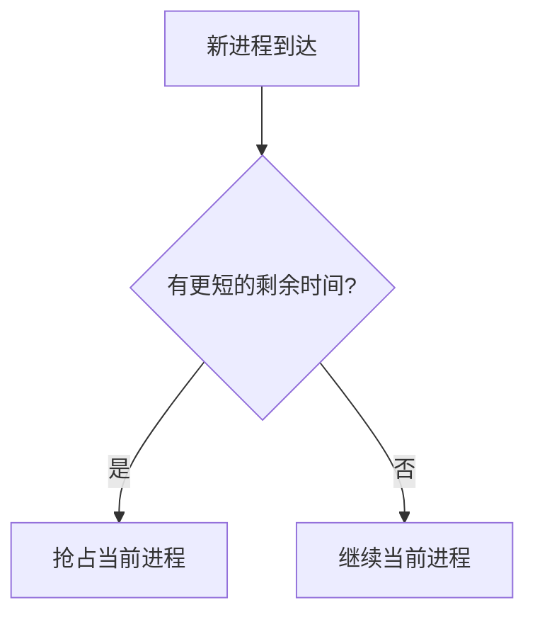

## 目标

把教材里的结构或流程画成一张图。图要能替代一段文字说明，而不是把文字又抄一遍。

## 步骤

1. 判断该画哪种图——这一步决定了图有没有用：
   - **流程有先后、有分支** → `flowchart TD`
   - **概念有层级归属** → `mindmap`
   - **多方按时间交互** → `sequenceDiagram`
   - **状态之间转换** → `stateDiagram-v2`
   说不清该画哪种，就先问用户想看的是"步骤顺序"还是"概念层次"。
2. `search_materials` 取教材证据，图里的节点与连线都要有教材依据，不要自己编出环节。
3. 输出 mermaid 代码块。界面会把它渲染成图。
4. 图下面用 2～4 句说明图里最容易被忽略的那条边或那个分支。
5. 用户说要留着看，才 `note_write` 存成笔记（正文里保留 mermaid 代码块）。

## 输出格式

````

````

## 边界

- 节点文字不超过 12 字；超了就说明该拆成两个节点或加一层。
- 一张图不超过 15 个节点。再多就分成两张，或者只画主干。
- 节点文字里不要用 `()`、`[]`、`{}`、`"`，它们会破坏 mermaid 语法；需要时用中文括号。
- mermaid 只画结构，公式仍用 $ 写在图外的说明里。
- 一次只画一张图。用户要多张就逐张确认，别一口气糊上来。
